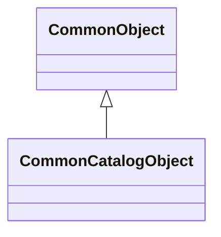

# Доменная модель - 00 Common

## 1. Назначение модели

Доменная модель Common задает базовые типы для прикладных управляемых объектов DMP и системные enum общего смысла.

В Common v1 есть два целевых базовых типа:



`CommonObject` описывает общую техническую модель прикладного объекта.

`CommonCatalogObject` расширяет `CommonObject` и добавляет каталоговую бизнес-идентификацию через `Code` и `Name`.

Common не является универсальной базой для всех сущностей DMP. Платформенные, системные и технические сущности не обязаны наследоваться от `CommonObject`.

## 2. Базовые типы

### CommonObject

`CommonObject` - базовый тип для прикладных объектов, которым не нужны обязательные `Code` и `Name`.

Примеры таких объектов:

- строки документов;
- значения;
- присвоения;
- контакты;
- вспомогательные прикладные сущности;
- другие не-каталоговые объекты.

Поля типа описаны в разделе 3.

### CommonCatalogObject

`CommonCatalogObject` - базовый тип для справочников и каталоговых бизнес-объектов.

Он используется только там, где `Code` и `Name` действительно являются обязательной частью бизнес-идентификации объекта.

Поля типа описаны в разделе 4.

Примеры таких объектов:

- справочник;
- классификатор;
- каталоговый объект;
- объект, который в бизнесе узнается по коду и названию.

## 3. Поля CommonObject

| Поле | Тип | Обязательность | Назначение |
|---|---|---:|---|
| `Id` | `Guid` | да | Внутренний идентификатор объекта в DMP. |
| `ExternalId` | `string?` | нет | Внешний или унаследованный идентификатор объекта. |
| `CreatedAtUtc` | `DateTime` | да | Дата и время создания объекта в UTC. |
| `CreatedBy` | `Guid` | да | Идентификатор инициатора, создавшего объект. |
| `ModifiedAtUtc` | `DateTime?` | нет | Дата и время последнего изменения объекта в UTC. |
| `ModifiedBy` | `Guid?` | нет | Идентификатор инициатора, последним изменившего объект. |
| `IsArchived` | `bool` | да | Признак архивного состояния. |
| `ArchivedAtUtc` | `DateTime?` | нет | Дата и время архивирования в UTC. |
| `ArchivedBy` | `Guid?` | нет | Идентификатор инициатора, выполнившего архивирование. |
| `ArchiveReason` | `string?` | нет | Причина архивирования, если она передана. |
| `IsDeleted` | `bool` | да | Технический признак мягкого удаления. |
| `DeletedAtUtc` | `DateTime?` | нет | Дата и время мягкого удаления в UTC. |
| `DeletedBy` | `Guid?` | нет | Идентификатор инициатора, выполнившего мягкое удаление. |
| `DeleteReason` | `string?` | нет | Причина удаления, если она передана. |

## 4. Поля CommonCatalogObject

| Поле | Тип | Обязательность | Назначение |
|---|---|---:|---|
| `Code` | `string` | да | Бизнес-код справочника или каталогового объекта. |
| `Name` | `string` | да | Бизнес-наименование справочника или каталогового объекта. |

`Code` и `Name` не входят в `CommonObject`, потому что не у всех прикладных объектов есть код и название.

## 5. Внешний идентификатор

`ExternalId` хранит внешний или унаследованный идентификатор объекта.

Правила Common v1:

- поле допускает `null`;
- тип поля: `string?`;
- максимальная длина: 100 символов;
- значение нормализуется через `Trim`;
- пустая строка после нормализации считается `null`;
- поле не является глобально уникальным;
- Common не задает единое правило case-sensitive или case-insensitive сравнения;
- `SourceSystemCode` не входит в `CommonObject`.

Если конкретному типу объекта нужна уникальность `ExternalId`, она задается отдельным правилом этого типа объекта.

`ExternalId` не является полной моделью интеграционного сопоставления. Если один объект может иметь несколько внешних идентификаторов в разных системах, это должна решать отдельная интеграционная модель, например `ExternalObjectMapping`.

## 6. Поля аудита

Поля аудита описывают текущее техническое состояние объекта:

```text
CreatedAtUtc
CreatedBy
ModifiedAtUtc
ModifiedBy
```

Они не являются полным журналом изменений и не заменяют Audit History. Они также
не являются временем бизнес-факта, замера или события внешнего источника. Для
временных рядов и telemetry потребуется отдельная capability с `OccurredAtUtc`
и `IngestedAtUtc`. Она пока не входит в реализованный каталог платформенных
областей; план её проработки ведётся в [backlog Time Series / Telemetry Storage](../../10_backlog/platform_capabilities/time_series_storage_backlog.md).
Правила заполнения audit-полей описаны в `05_rules.md`.

Семантика:

```text
CreatedAtUtc
  дата и время создания объекта в DMP, UTC
  заполняется при создании
  после создания не меняется

CreatedBy
  идентификатор инициатора, создавшего объект
  заполняется при создании
  после создания не меняется

ModifiedAtUtc
  дата и время последнего изменения объекта в DMP, UTC
  null, если объект после создания не изменялся

ModifiedBy
  идентификатор инициатора последнего изменения
  null, если ModifiedAtUtc = null
```

В `CommonObject` хранится только идентификатор инициатора:

```text
Guid
```

Имена пользователя, login, email или display name не хранятся в доменных таблицах Common.

Отображение инициатора должно выполняться через IAM / ActorDisplayResolver.

## 7. Архивные поля

Архивирование выводит объект из активного использования, но сохраняет его как бизнес-факт.

Поля:

```text
IsArchived
ArchivedAtUtc
ArchivedBy
ArchiveReason
```

Семантика:

```text
если объект не архивирован:
  IsArchived = false
  ArchivedAtUtc = null
  ArchivedBy = null
  ArchiveReason = null

если объект архивирован:
  IsArchived = true
  ArchivedAtUtc заполнено
  ArchivedBy заполнено
  ArchiveReason может быть null
```

Для объектов с workflow `IsArchived` является материализованным техническим признаком, производным от состояния workflow с признаком `IsArchiveState`. Правила архивирования описаны в `05_rules.md`.

## 8. Поля мягкого удаления

Мягкое удаление исключает объект из обычной рабочей модели.

Поля:

```text
IsDeleted
DeletedAtUtc
DeletedBy
DeleteReason
```

Семантика:

```text
если объект не удален:
  IsDeleted = false
  DeletedAtUtc = null
  DeletedBy = null
  DeleteReason = null

если объект мягко удален:
  IsDeleted = true
  DeletedAtUtc заполнено
  DeletedBy заполнено
  DeleteReason может быть null
```

`IsDeleted` не является бизнес-статусом и не заменяет архивирование. Правила удаления описаны в `05_rules.md`.

## 9. Представление объекта

`Presentation` не входит в `CommonObject` как физически хранимое поле.

Представление объекта задается через правило отображения:

```text
DisplayName / правило представления
```

Примеры:

```text
{Code} - {Name}
{Name}
{ExternalId} - {Name}
```

Правило представления не является частью доменной таблицы Common. Его runtime-использование описано в `03_object_runtime_model.md`.

## 10. Системные перечисления Common

В этом разделе перечислены системные enum, владельцем смысла которых является `00 Common`.

### TimeAmountFormatType

Формат пользовательского ввода и отображения количественного времени: нормативного, планового, фактического, машинного, трудового и других значений времени, которые являются количеством времени, а не моментом времени суток.

`TimeAmountFormatType` не является единицей хранения и не заменяет единицы длительности прикладных модулей. Если прикладное поле хранит время в секундах, `TimeAmountFormatType` определяет только способ преобразования секунд в пользовательское представление и обратно.

Имя `TimeAmount` используется, чтобы не смешивать эту настройку с форматом времени суток (`Time`) или даты-времени (`DateTime`).

| Значение | Название | Представление | Назначение |
|---|---|---|---|
| `Standard` | Стандартное время | `hh:mm:ss` | Количество времени показывается и вводится как часы, минуты и секунды. Структура формата фиксирована; разделитель `:` не зависит от культуры. |
| `Industrial` | Промышленное время | `0.000` как инвариантная маска точности | Количество времени показывается и вводится как нормо-часы с тремя десятичными знаками. Десятичный разделитель зависит от культуры пользователя. |

## 11. Статус и жизненный цикл

`Status` не входит в `CommonObject` и `CommonCatalogObject`.

Старая модель:

```text
DmpStatusBase
```

не переносится в Common v1.

Если объекту нужен жизненный цикл, он должен описываться отдельной возможностью типа объекта. Вероятное целевое решение - workflow, а не обязательное поле `Status` в базовом типе.

Следствие:

```text
DmpCatalogBase из требований не переносится как CatalogObject : StatusObject
CommonCatalogObject не содержит Status
```

## 12. Tenant и Site

`TenantId` и `SiteId` не входят в универсальный `CommonObject`.

Фрагмент модели:

```text
CommonObject
  не содержит TenantId
  не содержит SiteId

Объект, принадлежащий tenant-у
  TenantId
  явно описывается в конкретном модуле

Объект, привязанный к site
  SiteId?
  явно объявляется только если site входит в смысл объекта
```

Tenant - это основная граница владения и изоляции данных.

Site - более узкий контекст площадки, завода, производственного места или уровня переопределения конфигурации.

Если конкретному типу объекта нужен `SiteId`, модуль описывает его как обычное предметное поле или ссылку.

## 13. Слои базовых типов

Common v1 использует такую слоистую модель:

```text
BuildingBlocks.Entity
  минимальная доменная сущность

Платформенные и системные сущности
  могут использовать BuildingBlocks.Entity или свои платформенные базовые типы
  не обязаны наследоваться от CommonObject

CommonObject
  базовый тип прикладного управляемого бизнес-объекта

CommonCatalogObject : CommonObject
  базовый тип прикладного каталогового бизнес-объекта

Объект прикладного модуля
  наследуется от CommonObject или CommonCatalogObject,
  если является стандартным управляемым бизнес-объектом DMP
```

`CommonObject` не заменяет `BuildingBlocks.Entity`.

Публикация объекта через Object Runtime не требует обязательного наследования от `CommonObject`. Это правило описано в `03_object_runtime_model.md`.

## 14. Сводная таблица общих возможностей объекта

| Возможность | Поля в `CommonObject` | Входит в доменную модель Common | Примечание |
|---|---|---|---|
| История создания и изменения | `CreatedAtUtc`, `CreatedBy`, `ModifiedAtUtc`, `ModifiedBy` | Да | Заполняется Object Runtime. |
| Внешний идентификатор | `ExternalId` | Да | Правила уникальности задаются отдельно. |
| Архивирование | `IsArchived`, `ArchivedAtUtc`, `ArchivedBy`, `ArchiveReason` | Да | Поля есть у всех `CommonObject`, действие не включается автоматически. |
| Мягкое удаление | `IsDeleted`, `DeletedAtUtc`, `DeletedBy`, `DeleteReason` | Да | Поля есть у всех `CommonObject`, операция удаления разрешается отдельно. |
| Физическое удаление | Нет | Нет | Управляется контрактом объекта и правилами Object Runtime. |
| Принадлежность tenant-у | Нет | Нет | Добавляется в конкретном объекте, если нужна по смыслу. |
| Привязка к site | Нет | Нет | Добавляется в конкретном объекте, если нужна по смыслу. |
| Workflow | Нет поля `Status` | Нет | Подключается отдельно для конкретного типа объекта. |
| Секция "Администрирование" | Использует поля Common | Нет отдельных доменных полей | Описана в runtime-контрактах. |

## 15. Что не является частью доменной модели Common

В доменную модель Common v1 не входят:

- `Status`;
- `DmpStatusBase`;
- физически хранимое поле `Presentation`;
- `SourceSystemCode`;
- `TenantId`;
- `SiteId`;
- имена пользователей для полей аудита;
- тип инициатора в каждой доменной таблице;
- полная модель интеграционных соответствий;
- полный workflow-шаблон жизненного цикла;
- обязательная политика удаления для всех типов объектов.

## 16. Переход на целевую каталоговую базу

Переход завершен: `Nomenclature` наследует `CommonCatalogObject`, использует `ExternalId`
и системные поля Common. Legacy-тип, его runtime contract и baseline object type удалены без alias.

## История изменений

| Версия | Дата и время | Автор | Раздел | Изменение | Коммит/PR |
|---|---|---|---|---|---|
| 1.2 | 2026-09-02 11:50 +03:00 | Олег Юрьев (@axelprosoft) | Назначение модели; Базовые классы; Базовые типы; CommonObject; CommonCatalogObject; Статус и жизненный цикл; Слои базовых классов; Слои базовых типов; Переход на целевую каталоговую базу | мелкие структурные правки в основном доменной модели и связей модулей без изменения содержания | [4cbd3069](https://github.com/axelprosoft/DMP.PlatformFoundation/commit/4cbd3069ec4a3421adbad1f0c9801b00f28405d7) |
| 1.1 | 2026-08-27 15:04 +03:00 | Олег Юрьев (@axelprosoft) | Поля аудита | подготовлен драфт новой проектной документации на ядро, прикладные модули, а так же термины и общие концептуальные документы | [5ecb26b1](https://github.com/axelprosoft/DMP.PlatformFoundation/commit/5ecb26b1c3ff3cfcdc13018e59526ae684ca6007) |
| 1.0 | 2026-08-19 17:22 +03:00 | Воронкова Вероника (@VeronikaV2121) | YAML-шапка: review_status, status | feat(docs): automate PR lifecycle approval | [3a2710e5](https://github.com/axelprosoft/DMP.PlatformFoundation/commit/3a2710e5d46a57a3074b89360c0f0b2a4e84cf52) |
| 0.1 | 2026-08-07 10:40 +03:00 | axelprosoft (@axelprosoft) | Содержание документа | Создание документа | [dee4ebb0](https://github.com/axelprosoft/DMP.PlatformFoundation/commit/dee4ebb02ed702461463c16315f3b252ae418edd) |
