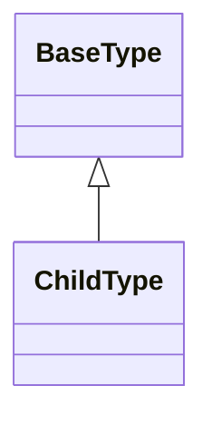
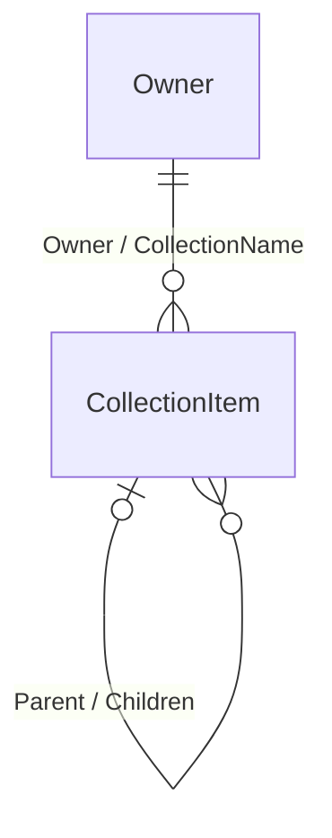

# Шаблон документации прикладного модуля

## 1. Назначение

Документ задает единые правила подготовки проектной документации прикладного модуля DMP.

Документы конкретного модуля должны содержать проектные решения этого модуля, а не инструкции по написанию документации. Все правила структуры, состава разделов, паспортов форм, фильтров, ссылок и операций описываются здесь.

## 2. Главный принцип

Проектная документация прикладного модуля должна отвечать на вопрос: что реализовать и почему это является целевым решением.

В документах модуля не должно быть:

- рассуждений, не ведущих к реализации;
- повторения общих правил платформы;
- пересказа исходных требований без проектного решения;
- описания того, как писать документ;
- спорных предположений внутри утвержденных разделов;
- решений по другим модулям, если модуль только ссылается на их объекты.

Если вопрос не решен, он фиксируется в `90_traceability_prXX.md` или `backlog.md`, а не прячется в основном тексте.

## 3. Источники и приоритет

При подготовке документации используются источники в таком порядке:

| Источник | Как использовать |
|---|---|
| Утвержденные функциональные требования | Задают границу модуля и базовые требования. |
| Проектное решение модуля, например ПР01 | Главный источник предметных объектов, полей, форм и бизнес-правил. |
| Структура данных, например DMP_DATA | Используется как уточнение к ПР, но не как автоматическое целевое решение. |
| `03_platform/00_foundation/` | Используется как источник общих BuildingBlocks, application-контрактов, контекстов и общих transport-типов. Модуль описывает собственную семантику, а не дублирует Foundation. |
| `00_common` | Используется как принятые решения по Common, Object Runtime, архивированию, удалению, Presentation, ExternalId, TenantId, базовым типам. |
| Исходный код DMP | Используется для проверки текущих паттернов контрактов, коллекций, baseline-конфигурации и Object Runtime. |
| Тестовые модули | Используются только как технический пример паттернов кода. Их предметные объекты не переносятся в проектируемый модуль. |

Если ПР и структура данных расходятся, документация должна явно фиксировать принятое решение и причину.

### 3.1 Межмодульное взаимодействие

Для всех прикладных модулей действуют следующие границы:

- взаимодействие между модулями выполняется через API или события;
- модуль не обращается напрямую к таблицам другого модуля или сервиса;
- модуль не создаёт собственную очередь, dispatcher или repair hosted service
  для исполнения Workflow; оркестрация жизненного цикла принадлежит Workflow
  Engine;
- межмодульные сценарии должны сохранять tenant-aware и correlation-инварианты
  и не требовать отдельной инфраструктуры для каждого модуля.

Общая карта конкретных связей и публичных контрактов находится в
`02_architecture/07_integration_architecture.md`. Документы модуля описывают
только собственные сценарии, ограничения и использование этих контрактов.

Для каждой межмодульной ссылки документ модуля указывает целевой тип в формате
`ModuleCode:ObjectTypeCode`, модуль-владелец, источник выбора, ограничения
выбора, проверку существования и доступности, возможность изменения целевого
объекта и наличие обратной навигации. Обратная коллекция в режиме
`Навигация` не означает владение данными и не создает физическую таблицу или
поле в модуле-потребителе.

## 4. Язык и термины

- Документы пишутся на понятном русском языке.
- Английские имена классов, полей, кодов и runtime-типов сохраняются как технические имена.
- Терминология должна основываться на документах с терминами и определениями, действующих для проекта.
- Если термин есть в исходных требованиях, глоссарии или тематическом словаре, в проектной документации используется это значение.
- Если термин еще не внесен в общий глоссарий, но встречается в исходных требованиях или проектном решении, он используется согласованно внутри пакета документов модуля.
- Новые термины не вводятся без необходимости. Если термин нужен многим модулям, он выносится в общий глоссарий или список кандидатов.
- Не использовать расплывчатые слова без решения: `возможно`, `предварительно`, `описать отдельно`, `нужно уточнить`, если это не раздел открытых вопросов.

## 5. Состав документов

| Документ | Назначение |
|---|---|
| `00_module_overview.md` | Краткая карта модуля: назначение, основные объекты, место в DMP, ключевые проектные решения. |
| `01_scope.md` | Граница ответственности: что входит, что не входит, базовые требования и соседние модули. |
| `02_domain_model.md` | Целевая доменная модель: объекты, поля, русские названия, типы, обязательность, связи, коллекции и владение данными. |
| `03_object_runtime_model.md` | Как объекты модуля доступны через Object Runtime: типы объектов, представление, коллекции, ограничения выбора ссылок, подключенные возможности платформы. |
| `04_workflows.md` | Жизненные циклы объектов модуля: состояния, переходы и прикладные проверки переходов. |
| `05_rules.md` | Инварианты, правила проверки, ограничения изменения, удаления и архивирования. |
| `06_ui_views.md` | Списки, списки выбора, карточки, вкладки, формы строк, фильтры, сортировки, группировки и специальные действия интерфейса. |
| `07_reports_outputs.md` | Отчеты, печатные формы, выходные документы и выгрузки. |
| `08_api_contracts.md` | API-контракты, если модуль публикует API сверх Object Runtime; каждый значимый контракт описывается отдельным подразделом по [Стандарту описания контрактов](../00_governance/03_contract_documentation_standard.md). |
| `09_events.md` | События модуля; каждое событие описывается отдельным подразделом по [Стандарту описания контрактов](../00_governance/03_contract_documentation_standard.md). |
| `10_value_set_data_usage.md` | Использование общих и модульных наборов значений. |
| `11_permissions.md` | Права доступа и роли модуля. |
| `12_audit_history.md` | Аудит и история изменений, если есть прикладные требования сверх Common. |
| `13_operations.md` | Прикладные операции, функции и алгоритмы модуля. Не описывает стандартные действия Object Runtime без предметной политики модуля. |
| `14_test_strategy.md` | Стратегия проверки модуля. |
| `15_navigation_menu.md` | Пункты главного меню модуля и связь пунктов меню с UI-представлениями. |
| `16_settings.md` | Настройки, владельцем смысла которых является модуль. Создается только если у модуля есть такие настройки. |
| `90_traceability_prXX.md` | Трассировка исходного ПР, спорных мест и принятых проектных решений. |
| `backlog.md` | Отложенные вопросы, которые не являются утвержденным проектным решением. |

Документ создается только при наличии проектного содержания. Пустые файлы не создаются.

## 6. Структура документов и обязательные таблицы

Этот раздел задает минимальную структуру документов. Документ модуля может добавлять предметные подразделы, но не должен менять смысл базовых разделов.

### `00_module_overview.md`

```markdown
# Обзор модуля - <Русское название> / <English name>

## 1. Назначение модуля
## 2. Место модуля в DMP
## 3. Основные объекты
## 4. Ключевые проектные решения
## 5. Зависимости от Foundation, Common и платформы
## 6. Связь с требованиями
## 7. Состав документов модуля
```

Таблица основных объектов:

| Объект | Русское название | Назначение |
|---|---|---|

Таблица ключевых решений:

| Решение | Суть | Документ |
|---|---|---|

### `01_scope.md`

```markdown
# Граница модуля - <Название модуля>

## 1. Назначение документа
## 2. Что входит в модуль
## 3. Что не входит в модуль
## 4. Граница с соседними модулями
## 5. Соответствие функциональным требованиям
## 6. Ограничения версии
```

Таблица состава модуля:

| Область | Входит | Комментарий |
|---|---|---|

Таблица исключений:

| Область | Не входит | Где должно быть описано |
|---|---|---|

Таблица требований:

| Требование | Статус покрытия | Решение / документ |
|---|---|---|

Допустимые статусы покрытия: `входит`, `частично`, `платформа`, `другой модуль`, `не входит в v1`.

### `02_domain_model.md`

```markdown
# Доменная модель - <Название модуля>

## 1. Назначение документа
## 2. Общие решения модели
## 3. Системные перечисления модуля
## 4. <Группа объектов>
### <Номер подраздела> <ClassName>
## N. Граница с внешними объектами
## N+1. Отличия от исходного ПР и структуры данных
```

Раздел `Системные перечисления модуля` обязателен, если исходное ПР, структура данных или принятый контракт модуля задают фиксированные enum. Для каждого системного enum указывается назначение и полный список значений:

```markdown
### <Номер подраздела> <EnumName>

<Назначение перечисления.>

| Код | Значение | Русское название |
|---|---:|---|
```

Если enum является флаговым, это указывается перед таблицей.

Поля объектов должны ссылаться на конкретный тип enum:

```markdown
| <FieldName> | <Русское название> | `<EnumName>` | да | <Назначение> |
```

`ValueSetCode` используется только для настраиваемых наборов значений. Нельзя заменять системный enum из исходного ПР на `ValueSetCode` без отдельного проектного решения и фиксации причины в трассировке.

Если enum из исходного ПР не переносится в модель, это фиксируется в разделе отличий:

| Источник | Было | Решение | Причина |
|---|---|---|---|

Для каждого объектного типа:

````markdown
### <Номер подраздела> <ClassName>

Русское название: <...>

Базовый тип: `<BaseClass>`.
Характер типа: `абстрактный` или `самостоятельный`.
Физическое хранение: `<таблица или отсутствие отдельной таблицы>`.

В содержательном тексте доменной модели используется термин «тип»: «базовый
тип», «абстрактный тип», «самостоятельный тип» и «тип-наследник». Термин
«класс» используется только для обозначения синтаксиса Mermaid (`classDiagram`)
или как точное имя программного класса при ссылке на исходный код.

Если тип является наследником, перечисляются только поля, ссылки и коллекции,
добавленные на этом уровне. Унаследованные поля не повторяются.

Если тип ссылочного поля зависит от конкретного наследника, нельзя оставлять
только формулировку `тот же тип`. Нужно явно раскрыть соответствие для каждого
самостоятельного наследника, например: `WorkPlaceGroup.Parent` ->
`WorkPlaceGroup`, `PersonnelGroup.Parent` -> `PersonnelGroup`. В доменной модели
описывается предметная ссылка и ее ограничение; `ParentId`, внешний ключ и
другие детали SQL не указываются.

| Поле | Русское название | Тип | Обяз. | Назначение |
|---|---|---|---:|---|
````

Если у объекта есть коллекции, после таблицы полей добавляется таблица коллекций:

| Коллекция | Тип элемента | Кратность | Владение | Связующее поле или условие | Назначение |
|---|---|---|---|---|---|

Если элементы коллекции принадлежат другому модулю, в поле `Владелец` указывается
этот модуль, а для обратного чтения используется режим `Навигация`. В таком
случае коллекция является контрактом чтения связанных объектов и не дает
текущему модулю права создавать, изменять или удалять элементы коллекции.

В разделе общих решений модели обязательно размещаются Mermaid-схемы:





Первая схема является схемой типов и наследования. Вторая схема является схемой
внутренних связей и коллекций. Для второй схемы допускается `classDiagram`, если
это требуется инструментом отображения. Схемы не содержат поля и должны
соответствовать таблицам объектов и коллекций.
В схеме наследования внешние типы показываются только как контекст для типов
текущего модуля; наследование между внешними типами не воспроизводится.
Схемы внутренних связей и коллекций в совокупности должны покрывать все
сохраненные ссылки и коллекции из таблиц объектов. Обычные ссылки, самоссылки и
коллекции показываются с кардинальностями и именами полей или обратной
навигации. Каждая такая связь показывается один раз. Композиция `o--` уже
показывает ссылку владельца на элемент коллекции и не дублируется второй
стрелкой. Внешние ссылки не смешиваются с внутренней схемой и фиксируются в
границе внешних связей и runtime-контракте модуля-владельца. Вычисляемые
свойства и enum в схемы не включаются.
Текстовые псевдосхемы с обозначениями наследования, ссылок или коллекций не
используются. Блоки `text` допускаются только для алгоритмов, примеров значений
и пояснения правил, но не заменяют таблицы или Mermaid-схемы.

Если у типа нет собственных полей, вместо пустой таблицы указывается, что
собственных предметных полей нет и какие поля получены от базового типа. Блок
общих полей базового типа размещается внутри его раздела, до разделов
наследников.

Если есть отличия от ПР или DMP_DATA:

| Источник | Было | Решение | Причина |
|---|---|---|---|

### `03_object_runtime_model.md`

```markdown
# Runtime-модель объектов - <Название модуля>

## 1. Назначение документа
## 2. Базовое решение
## 3. Объявляемые типы объектов
## 4. Правила представления объектов
## 5. Объекты
### <ClassName>
## N. Подключенные возможности платформы
## N+1. Граница с интерфейсом
```

Таблица типов объектов:

| Тип объекта | Русское название | Доступность через Object Runtime | Примечание |
|---|---|---|---|

Таблица представления:

| Тип объекта | Правило представления | Источник |
|---|---|---|

Подраздел объекта:

```markdown
### <ClassName>

| Элемент | Решение |
|---|---|
| Тип объекта | `<ClassName>` |
| Представление | <правило> |
| Коллекции | <если есть> |
| Особые обработчики | <если есть> |

Ссылочные поля:

| Поле | Источник значений | Ограничение выбора |
|---|---|---|
```

Если ограничений выбора нет, писать `Нет ограничений сверх общих правил Object Runtime`.

Таблица коллекций Object Runtime:

| Владелец | Коллекция | Тип строки | Режим | Комментарий |
|---|---|---|---|---|

Допустимые режимы коллекций:

| Режим | Смысл |
|---|---|
| `Состав владельца` | Строки сохраняются вместе с владельцем как часть его карточки. |
| `Отдельные операции` | Строки показываются в карточке владельца, но создаются, изменяются и удаляются отдельными операциями своего типа объекта. |
| `Навигация` | Коллекция только показывает связанные объекты. |

Режим коллекции обязателен, потому что от него зависят права в `11_permissions.md`.

### `04_workflows.md`

```markdown
# Жизненный цикл - <Название модуля>

## 1. Назначение документа
## 2. Объекты с жизненным циклом
## 3. Состояния
## 4. Переходы
## 5. Правила переходов
### <Переход или объект>
## 6. Возврат на доработку
## 7. Архивирование
## 8. Отображение в интерфейсе
```

Таблица объектов:

| Тип объекта | Русское название | Почему нужен жизненный цикл |
|---|---|---|

Таблица состояний:

| Состояние | Русское название | Смысл | Выбор в новых ссылках |
|---|---|---|---|

Таблица переходов:

| Команда | Из состояния | В состояние | Назначение |
|---|---|---|---|

Таблица проверок:

| Проверка | Правило |
|---|---|

### `05_rules.md`

```markdown
# Правила - <Название модуля>

## 1. Назначение документа
## 2. Общие правила модуля
## 3. <Объект или группа объектов>
## N. Правила удаления и архивирования
## N+1. Граница с другими модулями
```

Для объекта или группы объектов:

```markdown
## <Объект или группа объектов>

Инварианты:

| Правило | Проверка | Ошибка при нарушении |
|---|---|---|

Ограничения изменения:

| Поле / данные | Когда запрещено менять | Причина |
|---|---|---|
```

Если правило относится к жизненному циклу, оно должно ссылаться на `04_workflows.md`, а не дублировать переходы.

### `06_ui_views.md`

```markdown
# Пользовательские представления - <Название модуля>

## 1. Назначение документа
## 2. Общие правила интерфейса модуля
## 3. <Группа объектов>
### <Русское название>. Список
### <Русское название>. Список выбора
### <Русское название>. Карточка
### <Русское название>. Вкладка `<Название вкладки>`
### <Русское название>. Форма строки
```

Паспорт списка:

| Параметр | Значение |
|---|---|
| Титул | <русский заголовок> |
| Вид представления | Список |
| Код представления | `<Object>_ListView` |
| Тип представления | `ObjectList` |
| Объект данных | <русское название> / `<ClassName>` |

Колонки списка:

| Колонка | Источник | Видимость |
|---|---|---|

Поиск:

| Параметр | Поля поиска | Оператор | Минимальная длина |
|---|---|---|---:|

Сортировка и группировка:

| Вид | Значение |
|---|---|

Фильтры:

| Фильтр | Поле / параметр | Размещение | Оператор | Источник значений | Значение по умолчанию | Примечание |
|---|---|---|---|---|---|---|

Предустановленные режимы:

| Режим | Условия | По умолчанию | Назначение |
|---|---|---|---|

Если фильтров или предустановленных режимов нет, писать `Нет`.

Паспорт карточки:

| Параметр | Значение |
|---|---|
| Титул | <русский заголовок> |
| Вид представления | Карточка |
| Код представления | `<Object>_DetailView` |
| Тип представления | `ObjectForm` |
| Объект данных | <русское название> / `<ClassName>` |
| Режимы карточки | Создание, изменение, просмотр |

Вкладки и группы полей:

| Вкладка | Содержимое |
|---|---|

Паспорт вкладки коллекции:

| Параметр | Значение |
|---|---|
| Титул | <название вкладки> |
| Вид представления | Вкладка коллекции |
| Тип представления | Элемент `ObjectForm` |
| Владелец | <русское название> / `<OwnerClass>` |
| Коллекция | <русское название коллекции> / `<CollectionName>` |
| Представление строк | `<Owner>_<Collection>_ListView` |
| Строка коллекции | <русское название> / `<RowClass>` |
| Режимы карточки | <создание / изменение / просмотр> |

Паспорт вкладки связанного списка:

| Параметр | Значение |
|---|---|
| Титул | <название вкладки> |
| Вид представления | Вкладка связанного списка |
| Тип представления | Элемент `ObjectForm` |
| Владелец | <русское название> / `<OwnerClass>` |
| Список | <что показывает список> |
| Условие списка | <проверяемое условие> |
| Представление строк | `<Owner>_<Meaning>_ListView` |
| Строка списка | <русское название> / `<RowClass>` |
| Режимы карточки | <создание / изменение / просмотр> |

### `11_permissions.md`

```markdown
# Права доступа - <Название модуля>

## 1. Назначение документа
## 2. Принципы доступа
## 3. Самостоятельно защищаемые объекты
## 4. Строки, защищаемые через владельца
## 5. Роли
## 6. Матрица доступа ролей
## 7. Особые правила доступа
## 8. Техническое отображение
```

Таблица самостоятельно защищаемых объектов:

| Объект | Русское название | Стандартные права | Жизненный цикл | Основание |
|---|---|---|---|---|

Таблица строк, защищаемых через владельца:

| Строка / объект | Владелец | Как проверяется доступ |
|---|---|---|

Таблица ролей:

| Роль | Назначение | Область действия | Базовый доступ |
|---|---|---|---|

Матрица доступа:

| Объект | <Роль 1> | <Роль 2> | <Роль N> |
|---|---|---|---|

Техническое отображение:

| Предметное действие | Технический шаблон |
|---|---|

### `13_operations.md`

```markdown
# Прикладные операции и алгоритмы - <Название модуля>

## 1. Назначение документа
## 2. Общие принципы
## 3. Данные, используемые функциями
## 4. <Функция>
## N. Использование другими модулями
## N+1. Вопросы для отдельного решения
```

Для функции:

```markdown
## <Номер>. <Название функции>

Назначение функции: <что делает функция>.

Входные данные:

| Параметр | Назначение |
|---|---|

Алгоритм:

1. ...

Результат: <что возвращает функция>.

Ошибки:

| Ошибка | Условие |
|---|---|
```

Если функция описывает предметную политику для платформенного механизма, сначала указать ссылку на платформенный документ, затем описать только политику модуля.

### `90_traceability_prXX.md`

```markdown
# Трассировка ПРXX - <Название модуля>

## 1. Назначение документа
## 2. Источники
## 3. Требования и решения ПР
## 4. Сущности ПР и целевая модель
## 5. Спорные решения и принятые решения
## 6. Бизнес-правила
## 7. UI-решения
## 8. Открытые вопросы
## 9. Куда перенесены решения
```

Таблица сущностей:

| Сущность ПР | Целевое решение | Статус | Документ |
|---|---|---|---|

Таблица решений:

| Вопрос / требование | Решение | Почему | Документ |
|---|---|---|---|

Таблица открытых вопросов:

| ID | Вопрос | Кому адресован | Где влияет |
|---|---|---|---|

Таблица переноса решений:

| Документ | Что содержит |
|---|---|

## 7. Что писать в каждом документе

### `00_module_overview.md`

Писать:

- назначение модуля;
- основные группы объектов;
- ключевые принятые решения;
- главные зависимости от Foundation, Common и платформы;
- ссылку на исходные требования.

Для зависимостей от Foundation использовать одну краткую таблицу:

| Компонент Foundation | Как используется модулем | Владелец определения | Семантика модуля |
|---|---|---|---|

В таблицу включаются только реально используемые компоненты. Полное описание
`BuildingBlocks` и `DMP.Platform.Contracts.Common` остаются в Foundation; в
документах модуля указываются только фактическое применение, базовый тип,
ограничения и отличия.

Если зависимость модуля или его граница неясна из таблицы, добавляется одна
обзорная схема связей с Foundation, Object Runtime и соседними владельцами.
Схема не заменяет таблицу зависимостей и не должна показывать все классы
платформы.

Не писать:

- полный состав полей;
- детальные правила валидации;
- UI-структуру;
- открытые дискуссии.

### `01_scope.md`

Писать:

- что входит в модуль;
- что не входит в модуль;
- границу с соседними модулями;
- таблицу соответствия функциональным требованиям;
- ограничения версии, если они влияют на реализацию.

Не писать:

- детальные поля объектов;
- алгоритмы;
- UI-формы;
- будущие идеи без связи с требованиями.

Для строк требований с ограничениями нужно явно указывать смысл: входит, не входит, покрывается частично, отложено до другого модуля, покрывается платформой.

### `02_domain_model.md`

Писать:

- каждый проектируемый доменный объект;
- русское название объекта;
- базовый тип;
- поля с русскими названиями, типами, обязательностью и назначением;
- ссылки;
- коллекции;
- правила владения данными;
- отличия от ПР или структуры данных.

Для каждого объекта указывается фактический базовый тип и, если он относится
к Foundation, ссылка на его описание. Если для модели важна цепочка
наследования, её показывают Mermaid-схемой. Внешние базовые типы можно показать
только как контекст для типов текущего модуля; наследование между внешними
типами не воспроизводится. Общие свойства и правила базового типа повторно не
перечисляются.

Не писать:

- UI-группы полей;
- фильтры и списки выбора;
- алгоритмы операций;
- общие правила Object Runtime;
- правила написания документа.

Коллекции указываются только там, где это реально коллекция владельца в доменной модели или Object Runtime. Если форма показывает список по условию, это не превращается автоматически в коллекцию владельца.

Ссылочные поля описываются как поля доменной модели. Ограничения выбора значений для ссылок описываются в `03_object_runtime_model.md`.

### `03_object_runtime_model.md`

Писать:

- какие типы объектов модуль объявляет в Object Runtime;
- правило представления объекта;
- коллекции и типы строк коллекций;
- ограничения выбора значений ссылочных полей;
- специальные обработчики сохранения или проверки, если они подключаются к Object Runtime;
- какие платформенные возможности подключаются, но не являются объектами модуля.

Если runtime-сценарий использует Foundation-контракт, например контекст
выполнения или общий результат use-case, указывается ссылка на Foundation и
описывается только предметная политика модуля. Определение общего контракта и
его полный состав в этот документ не копируются.

Для сложного подключения к Object Runtime допускается схема потока:
`конфигурация модуля → runtime-описание → операция → прикладной обработчик`.
Она не должна повторять общую архитектурную схему Object Runtime; в ней
показываются только типы объектов и особые обработчики данного модуля.

Не писать:

- полный состав полей из доменной модели;
- визуальные группы карточек;
- колонки UI-списков;
- общий учебник по Object Runtime;
- инструкцию, что должен содержать `06_ui_views.md`.

Ограничения выбора ссылочного поля лучше писать внутри подраздела объекта, которому принадлежит поле. Формулировка должна быть прикладной и проверяемой, например:

```text
Выбираются только наборы упаковок, у которых BaseUnitId равен Nomenclature.UnitId.
```

Не писать непонятные формулировки вроде:

```text
BaseUnit должен быть совместим с Unit.
```

Если правило требует внешнего модуля, указать это явно: GMD фиксирует тип ссылки и предметное ограничение, а проверка существования и доступности внешнего объекта принадлежит модулю-владельцу.

### `04_workflows.md`

Писать:

- только объекты, для которых модуль задает жизненный цикл;
- состояния;
- переходы;
- прикладные проверки переходов;
- ограничения изменения в состояниях;
- связь архивного состояния с Common-архивированием.

Не писать:

- объекты, для которых жизненный цикл не нужен;
- общую проверку прав;
- общий аудит workflow;
- стандартное выполнение workflow-команды;
- абстрактные проверки ссылок из всех будущих модулей.

Если ПР не задает конкретных правил возврата или архивирования, не придумывать сложные межмодульные проверки. Зафиксировать только проверки внутри модуля и границу для будущего межмодульного решения.

### `05_rules.md`

Писать:

- предметные инварианты;
- уникальности;
- правила ссылочной целостности;
- ограничения изменения полей;
- правила удаления и архивирования, если они предметно отличаются от Common;
- правила проверки строк коллекций и значений;
- правила, которые должны выполняться при сохранении.

Не писать:

- стандартные операции создания, изменения, удаления;
- полный состав полей;
- UI-поведение;
- алгоритмы прикладных функций, если они уже описаны в `13_operations.md`.

Правило должно быть проверяемым. Если правило описывает изменение опубликованного объекта, проверить, не должно ли оно быть в `04_workflows.md`.

### `06_ui_views.md`

Писать:

- представления по объектам;
- списки;
- списки выбора;
- карточки;
- вкладки;
- формы строк;
- конкретные колонки;
- поиск;
- сортировки и группировки;
- фильтры;
- предустановленные режимы;
- специальные действия конкретной формы.

Не писать:

- общие правила формата UI-документа;
- общий список типов фильтров;
- общий учебник по `Create/Edit/View/All`;
- стандартные действия Object Runtime в каждом разделе;
- поля, которых нет в доменной модели или принятом проектном решении;
- названия вроде `Список Unit`, если есть русское название формы.

Заголовок представления пишется на русском:

```text
Единицы измерения. Список
Номенклатурная позиция. Карточка
Номенклатурная позиция. Вкладка `Тара`
```

Не писать:

```text
Список Unit
```

Для каждого представления используется паспорт:

| Параметр | Смысл |
|---|---|
| Титул | Пользовательский заголовок формы или вкладки. |
| Вид представления | Список, список выбора, карточка, вкладка карточки, вкладка коллекции, вкладка связанного списка или форма строки. |
| Код представления | Стабильный код исходной конфигурации в стиле `<Object>_ListView`, `<Object>_DetailView`, `<Object>_LookupView`, `<Owner>_<Collection>_ListView`. |
| Тип представления | Тип Object Runtime: `ObjectList`, `ObjectForm`, `LookupListView` или элемент карточки. |
| Объект данных | Доменный объект, данные которого показывает представление. |

Для вкладки коллекции указываются владелец, коллекция, представление строк и строка коллекции.

Для вкладки коллекции обязательно указываются режимы карточки. Режимы должны учитывать режим коллекции из `03_object_runtime_model.md` и предметный смысл создания владельца:

- `Состав владельца` технически может сохраняться вместе с владельцем, но в интерфейсе по умолчанию вкладка коллекции показывается после первого сохранения владельца;
- `Отдельные операции` обычно доступен только после первого сохранения владельца;
- `Навигация` обычно доступна только в изменении и просмотре.

В режиме создания по умолчанию показываются поля самого владельца. Вкладка коллекции показывается в создании только при явном предметном требовании вводить строки одновременно с владельцем.

Если вкладка показывает связанный список по условию, а не коллекцию владельца, это нужно написать прямо:

```text
Вид представления: Вкладка связанного списка
Условие списка: UnitOfOperation.ToNomenclature = текущая Nomenclature
```

Не называть это коллекцией владельца.

Карточка `ObjectForm` использует режимы `Create`, `Edit`, `View`.

`All` используется только как обозначение применимости элемента к `Create`, `Edit` и `View`. Это не отдельный runtime-режим. В исходной конфигурации `All` соответствует отсутствию ограничения по `Mode`.

Для списка фиксируются:

- назначение;
- колонки и видимость;
- поиск;
- сортировка и группировка;
- фильтры;
- предустановленные режимы.

Типы фильтров:

| Тип фильтра | Смысл |
|---|---|
| Строка поиска | Один ввод для поиска по нескольким полям. |
| Быстрый фильтр | Часто используемый фильтр рядом со строкой поиска или над списком. |
| Панельный фильтр | Расширенный фильтр в панели фильтрации. |
| Скрытый контекстный фильтр | Условие из текущей карточки, вкладки или формы строки. |
| Предустановленный режим | Готовый набор условий списка. |
| Системный фильтр | Общий фильтр Common/Object Runtime. |

Источники значений фильтров:

| Источник значений | Когда используется |
|---|---|
| Ручной ввод | Строка, число, дата, логическое значение. |
| `ValueSet` | Поля типа `ValueSetCode`. |
| `<EnumName>` | Поля с конкретным системным enum из `02_domain_model.md`, например `NomenclatureType`. |
| Список выбора | Ссылочные поля на объект модуля. |
| Внешний список выбора | Ссылки на объекты других модулей. |
| Контекст карточки | Вкладки, формы строк и зависимые списки. |
| `LocalEnum` | Локальные значения перечисления, если они есть в модуле. |
| Состояния жизненного цикла | Состояния объекта, если тип объекта имеет жизненный цикл. |
| Common/Object Runtime | Системные фильтры и служебные признаки объекта. |

В `06_ui_views.md` нельзя повторять таблицы значений системных enum. Представление или фильтр указывает источник значений как конкретный enum-тип, а полный состав enum остается в `02_domain_model.md`.

Список выбора описывается в разделе объекта, который выбирается. Если конкретное ссылочное поле требует контекстного ограничения, это ограничение фиксируется рядом с карточкой, вкладкой или формой строки, где ссылка используется.

### `11_permissions.md`

Писать:

- самостоятельно защищаемые объекты модуля;
- строки, которые защищаются через владельца;
- роли модуля;
- матрицу доступа ролей;
- особые правила доступа, если они отличаются от обычной проверки прав;
- коды модуля и ролей, область действия и область назначения, если они нужны для реализации.

Не писать:

- кнопки интерфейса;
- стандартные действия Object Runtime как сценарии интерфейса;
- полный security catalog манифест;
- внутреннюю реализацию Tenant Security;
- права на вкладки и строки коллекций, если строки сохраняются как состав владельца.

Документ должен опираться на режимы коллекций из `03_object_runtime_model.md`:

- `Состав владельца` - отдельные права на строку не вводятся;
- `Отдельные операции` - тип строки получает собственные стандартные права;
- `Навигация` - права проверяются по показываемому объекту.

Создание на основании существующего объекта не вводится как отдельное право, если это только способ создания. Обычно требуется право просмотра исходного объекта и право создания нового объекта.

### `13_operations.md`

Писать:

- прикладные операции модуля;
- внутренние прикладные функции, которые вызываются операциями или другими модулями;
- входные данные;
- алгоритмы;
- результаты;
- предметные ошибки;
- политику модуля для платформенного механизма, если механизм общий;
- использование функций другими модулями.

Не писать:

- обычное создание, изменение, удаление и архивирование объекта;
- проверку прав;
- стандартное сохранение карточки;
- стандартное выполнение workflow-перехода;
- API-контракты;
- UI-действия без предметного алгоритма.

Если функция использует платформенный механизм, документ модуля фиксирует только предметную политику или алгоритм модуля.

Пример:

```text
Общий механизм создания объекта на основании существующего описан в Object Runtime.
GMD задает только политику предзаполнения для своих объектов.
```

Классификация:

| Вид | Что описывает | Где дополнительно отражается |
|---|---|---|
| Прикладная операция | Внешний прикладной сценарий: пользовательская команда, пакетный запуск, системный или интеграционный вызов. | `06_ui_views.md`, `03_object_runtime_model.md`, `11_permissions.md`, если операция публикуется пользователю или через Object Runtime. |
| Прикладная функция | Переиспользуемый внутренний алгоритм, который вызывается операциями, обработчиками или другими модулями. | В `13_operations.md`; в других документах только ссылка на функцию или ее результат. |
| Алгоритм | Пошаговая логика выполнения операции или функции. | Внутри раздела соответствующей операции или функции. |
| Runtime-handler с предметной политикой | Обработчик создания, сохранения, предзаполнения или пересчета, если в нем есть бизнес-логика модуля. | Точка вызова в `03_object_runtime_model.md`, предметная политика в `13_operations.md`. |
| UI-действие без предметного алгоритма | Только кнопка или стандартное действие интерфейса. | `06_ui_views.md`; в `13_operations.md` не переносится. |
| Workflow-переход | Действие жизненного цикла. | `04_workflows.md`; в `13_operations.md` попадает только вызываемый переходом предметный алгоритм, если он есть. |

### `15_navigation_menu.md`

```markdown
# Меню навигации - <Название модуля>

## 1. Назначение документа
## 2. Источник меню
## 3. Правила публикации меню
## 4. Структура меню
## 5. Публикация и права
```

В разделе `Источник меню` указывается ссылка или полный путь к исходному
источнику. Структура исходного меню в документ не копируется.

Таблица целевой структуры меню:

| Уровень | Код пункта | Русское название | Тип | Родитель | Целевое представление | Режим открытия | Порядок |
|---:|---|---|---|---|---|---|---:|

Писать:

- краткую ссылку на источник структуры меню;
- группы и пункты главного меню, которыми владеет модуль;
- связь конечного пункта меню с `ViewCode` из `06_ui_views.md`;
- режим открытия, если он отличается от обычного открытия списка;
- порядок пунктов внутри группы;
- правила публикации меню;
- связь видимости пункта меню с правами из `11_permissions.md`.

Не писать:

- копию структуры меню из исходного ПР;
- пересказ доменной модели, Object Runtime или проектных решений;
- состав колонок, фильтров, вкладок и полей формы;
- правила проверки данных;
- матрицу прав;
- списки выбора как пункты главного меню;
- карточки и формы строк как отдельные пункты главного меню, если для этого нет явного проектного решения;
- пункты меню другого модуля, даже если объект используется текущим модулем.

Представления, которые не являются пунктами главного меню, отдельно не
перечисляются. Их способ открытия фиксируется в `06_ui_views.md`. Если один
пункт меню открывает несколько переключаемых представлений, это указывается в
колонке `Режим открытия`.

### `90_traceability_prXX.md`

Писать:

- все требования и проектные решения из исходного ПР, которые влияют на модуль;
- как они перенесены в проектную документацию;
- расхождения ПР, структуры данных и целевой архитектуры;
- закрытые решения и причины;
- открытые вопросы с понятной формулировкой для аналитика или архитектора.

Не писать:

- воду;
- повтор полного текста ПР без проектного решения;
- решения, которые уже подробно описаны в другом документе, без ссылки;
- вопросы, которые уже закрыты.

Трассировка является рабочим мостом от ПР к проектным документам. После закрытия решения в ней должно быть видно, в какой документ оно легло.

## 8. Типовые ошибки и как их избегать

### Ошибка: копировать ПР без проектного решения

Нельзя просто перенести формулировку ПР, если она противоречит Common, Object Runtime или структуре данных.

Нужно:

1. Выписать требование.
2. Найти расхождение.
3. Принять решение.
4. Зафиксировать, в какой документ оно переносится.

### Ошибка: проектировать по тестовому модулю

Тестовый модуль можно использовать только как пример технического паттерна: контрактов, коллекций, baseline-конфигурации, Object Runtime.

Нельзя переносить его предметные классы, поля и смысл в другой модуль.

### Ошибка: смешивать доменную модель и UI

`02_domain_model.md` отвечает за объекты, поля, связи и коллекции.

`06_ui_views.md` отвечает за представления, вкладки, колонки, фильтры и формы.

UI-вкладка не является коллекцией доменной модели сама по себе. Коллекция появляется только если это реально отношение владельца и строк коллекции.

### Ошибка: описывать стандартные операции платформы

Создание, изменение, удаление, архивирование, проверка прав, сохранение карточки и выполнение workflow-перехода являются общими механизмами.

В модуле описывается только предметное отличие:

- специальная проверка;
- специальное предзаполнение;
- прикладной алгоритм;
- запрет или ограничение;
- обработчик, который нужен именно этому модулю.

### Ошибка: писать абстрактные зависимости от будущих модулей

Если зависимость принадлежит другому модулю, документ прикладного модуля фиксирует только свою сторону:

- тип ссылки;
- смысл ограничения;
- что проверяет текущий модуль;
- что должен проверить модуль-владелец.

Не нужно описывать гипотетические правила всех будущих модулей.

### Ошибка: использовать непроверяемые формулировки

Нельзя писать:

```text
Поле должно быть совместимо.
```

Нужно писать:

```text
Выбираются только записи, у которых BaseUnitId равен Nomenclature.UnitId.
```

Правило должно быть понятно аналитику и разработчику.

### Ошибка: хранить Presentation как поле без причины

`Presentation` из старых требований не переносится как обязательное физическое поле.

В модуле описывается правило представления объекта в Object Runtime. Если для поиска требуется материализация отображаемого значения, это отдельное платформенное решение, а не поле каждого объекта по умолчанию.

### Ошибка: путать локальные списки и ValueSet

Если список значений принадлежит конкретному реквизиту и ведется бизнес-пользователем вместе с ним, используется локальное перечисление модуля.

Если список общий, переиспользуемый и управляется как классификатор платформы, используется `ValueSet`.

### Ошибка: помещать значения реквизитов в универсальную таблицу без учета Object Runtime

Если текущая модель Object Runtime требует отдельный тип строки коллекции и отдельное хранение владельца, значения реквизитов проектируются как отдельные типы строк значений для каждого владельца с общим базовым типом.

Нельзя описывать единый бизнес-объект значений, если он не соответствует runtime-модели хранения и коллекций.

## 9. Чек-лист перед завершением пакета модуля

- Все объекты из ПР и структуры данных разобраны: входят, не входят, переосмыслены или отложены с причиной.
- Для каждого проектируемого объекта есть русское название.
- Поля, русские названия, типы и обязательность описаны в `02_domain_model.md`.
- Коллекции не перепутаны со списками UI по условию.
- Ссылочные поля имеют ограничения выбора в `03_object_runtime_model.md`, если они нужны сверх общих правил.
- Жизненный цикл описан только для объектов, которым он нужен.
- Правила не дублируют полный состав полей.
- UI-документ содержит только конкретные формы модуля, без общего регламента.
- `13_operations.md` содержит только прикладные операции, функции и алгоритмы с предметным смыслом модуля.
- Если модуль владеет смыслом настроек, они описаны в `16_settings.md`, а не как поля доменной модели.
- Трассировка показывает, какое решение куда перенесено.
- Нет слов-маркеров без решения: `предварительно`, `описать отдельно`, `TODO`, `TBD`, `может быть`, если это не раздел открытых вопросов.
- Терминология сверена с документами терминов и определений, исходными требованиями и проектным решением.
- Нет лишнего повторения одного и того же решения в нескольких документах.

## История изменений

| Версия | Дата и время | Автор | Раздел | Изменение | Коммит/PR |
|---|---|---|---|---|---|
| 1.3 | 2026-09-03 10:01 +03:00 | Олег Юрьев (@axelprosoft) | Состав документов; `02_domain_model.md`; `15_navigation_menu.md` | первые версии модулей 04, 06. правки связанной документации - шаблон и предложения по изменениям ФТ (определения терминов) | [766441e6](https://github.com/axelprosoft/DMP.PlatformFoundation/commit/766441e68e531dadabe887393fc989e5b6e268e0) |
| 1.2 | 2026-09-02 11:50 +03:00 | Олег Юрьев (@axelprosoft) | Источники и приоритет; 1 Межмодульное взаимодействие; `02_domain_model.md`; `00_module_overview.md`; Ошибка: помещать значения реквизитов в универсальную таблицу без учета Object Runtime | мелкие структурные правки в основном доменной модели и связей модулей без изменения содержания | [4cbd3069](https://github.com/axelprosoft/DMP.PlatformFoundation/commit/4cbd3069ec4a3421adbad1f0c9801b00f28405d7) |
| 1.1 | 2026-08-27 16:40 +03:00 | Олег Юрьев (@axelprosoft) | Источники и приоритет; 1 Межмодульное взаимодействие; Состав документов; `00_module_overview.md`; `02_domain_model.md`; `03_object_runtime_model.md` | docs-new: нормализовать модульные шаблоны и проверки ID | [e9d751cf](https://github.com/axelprosoft/DMP.PlatformFoundation/commit/e9d751cf8728cd963b9d160870b884481b162219) |
| 1.0 | 2026-08-19 17:22 +03:00 | Воронкова Вероника (@VeronikaV2121) | YAML-шапка: review_status, status | feat(docs): automate PR lifecycle approval | [3a2710e5](https://github.com/axelprosoft/DMP.PlatformFoundation/commit/3a2710e5d46a57a3074b89360c0f0b2a4e84cf52) |
| 0.1 | 2026-08-07 17:43 +03:00 | axelprosoft (@axelprosoft) | Содержание документа | Создание документа | [0d0f5c86](https://github.com/axelprosoft/DMP.PlatformFoundation/commit/0d0f5c86ec2b8debd60db0a0eb65382c816c0e5a) |
