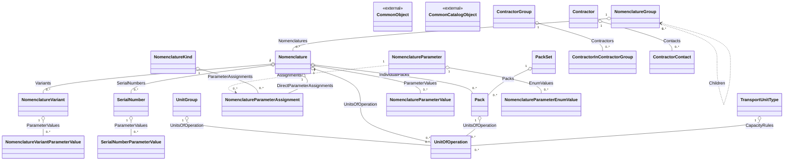

# Доменная модель - 01 General Master Data

## 1. Назначение модели

Документ фиксирует целевую доменную модель модуля `01 General Master Data`.

Модель основана на:

- требованиях `REQ-01-B-001..011`;
- терминах `TERM-008`, `TERM-011`, `TERM-012`, `TERM-034`, `TERM-035`;
- проектном решении ПР01;
- структуре `DMP_DATA`;
- решениях `00 Common`;
- решениях, зафиксированных в `90_traceability_pr01.md`.

Документ описывает объекты, поля, связи и владение данными.

`02_domain_model.md` является основным местом, где объект описан целиком: поля, ссылочные поля, коллекции, русские названия, типы и обязательность. `03_object_runtime_model.md` не дублирует объектную модель, а описывает только публикацию этих объектов и их выполнение через Object Runtime.

Правила проверки описываются в `05_rules.md`, пользовательские представления - в `06_ui_views.md`, жизненный цикл объектов - в `04_workflows.md`.

## 2. Общие решения модели

Объекты GMD строятся на базовых типах Common.

`CommonCatalogObject` используется для объектов, у которых `Code` и `Name` являются частью бизнес-идентификации.

`CommonObject` используется для связей, дочерних объектов, значений и объектов без обязательной пары `Code` / `Name`.

Поля `Id`, `ExternalId`, поля аудита, архивирования и мягкого удаления наследуются из Common и в таблицах ниже не повторяются.

`Presentation` не является физическим полем модели GMD. Представление объекта задается правилом отображения Object Runtime.

`Status` из ПР01 и `DMP_DATA` не переносится как универсальное поле объектов GMD. Жизненный цикл для нужных объектов описывается в `04_workflows.md`.

Все объекты, которыми владеет GMD, имеют `TenantId`. Для дочерних и связующих объектов `TenantId` совпадает с `TenantId` владельца и не редактируется отдельно.

### 2.1 Схема типов и наследования

Схема показывает только наследование типов. Поля описываются в блоках
соответствующих типов и в схему не включаются.

```mermaid
classDiagram
    class CommonObject {
        <<external>>
    }
    class CommonCatalogObject {
        <<external>>
    }
    CommonObject <|-- UnitOfOperation
    CommonObject <|-- SerialNumber
    CommonObject <|-- NomenclatureParameter
    CommonObject <|-- NomenclatureParameterAssignment
    CommonObject <|-- NomenclatureParameterEnumValue
    CommonObject <|-- NomenclatureParameterValueBase
    NomenclatureParameterValueBase <|-- NomenclatureParameterValue
    NomenclatureParameterValueBase <|-- NomenclatureVariantParameterValue
    NomenclatureParameterValueBase <|-- SerialNumberParameterValue
    CommonObject <|-- ContractorInContractorGroup
    CommonObject <|-- ContractorContact
    CommonCatalogObject <|-- Unit
    CommonCatalogObject <|-- UnitGroup
    CommonCatalogObject <|-- NomenclatureGroup
    CommonCatalogObject <|-- NomenclatureKind
    CommonCatalogObject <|-- Nomenclature
    CommonCatalogObject <|-- NomenclatureVariant
    CommonCatalogObject <|-- PackSet
    CommonCatalogObject <|-- Pack
    CommonCatalogObject <|-- TransportUnitType
    CommonCatalogObject <|-- Contractor
    CommonCatalogObject <|-- ContractorGroup
```

### 2.2 Схема связей и коллекций

Таблицы типов и коллекций являются нормативными. Схема в совокупности
показывает сохраненные ссылки и коллекции модели и не означает размещение
элементов в таблице владельца.

Поля с именем `ApplicationArea` в ПР01 не являются одним общим перечислением для всех объектов GMD. Для `Nomenclature.ApplicationArea` используется enum `ApplicationArea`. Для `UnitOfOperation.ApplicationArea` используется отдельное флаговое перечисление `UnitApplicationAreaFlags`.

## 3. Системные перечисления GMD

В этом разделе перечислены системные enum из ПР01, которые используются в доменной модели GMD. Если поле использует системный enum, в таблице полей указывается конкретный тип enum, а не `ValueSetCode`.

### 3.1 NomenclatureType

Тип номенклатурной позиции.

| Код | Значение | Русское название |
|---|---:|---|
| `NotDefined` | 0 | Не определен |
| `Complex` | 1 | Комплекс |
| `Assembly` | 2 | Комплект |
| `ComponentPart` | 3 | Деталь |
| `AssemblyUnit` | 4 | Сборочная единица |
| `Material` | 5 | Материал |
| `RoughPart` | 6 | Заготовка |
| `StandardArticle` | 7 | Стандартное изделие |
| `OtherArticle` | 8 | Прочее изделие |
| `Service` | 9 | Услуга |
| `Tooling` | 10 | Технологическая оснастка и инструмент |
| `Phantom` | 11 | Фантом |
| `BillOfMaterial` | 12 | Материальная спецификация |
| `ControlProgram` | 13 | Управляющая программа |
| `Document` | 14 | Документ |
| `Package` | 15 | Тара |

### 3.2 UnitApplicationAreaFlags

Область применения единицы операции. Enum является флаговым.

| Код | Значение | Русское название |
|---|---:|---|
| `Production` | 1 | Производство |
| `Purchase` | 2 | Закупки |
| `Sale` | 4 | Сбыт |

### 3.3 ApplicationArea

Область применения номенклатуры. Enum является флаговым.

| Код | Значение | Русское название |
|---|---:|---|
| `Production` | 1 | Производство |
| `Maintenance` | 2 | ТОиР |

### 3.4 ContractorType

Вид контрагента.

| Код | Значение | Русское название |
|---|---:|---|
| `LegalEntity` | 0 | Юридическое лицо |
| `IndividualPerson` | 1 | Физическое лицо |
| `SeparateDepartment` | 2 | Обособленное подразделение |

### 3.5 ContractorCategoryFlags

Категория контрагента. Enum является флаговым.

| Код | Значение | Русское название |
|---|---:|---|
| `Supplier` | 1 | Поставщик |
| `Manufacturer` | 2 | Изготовитель |
| `Builder` | 4 | Подрядчик |
| `Customer` | 8 | Заказчик |

### 3.6 ExpirationDatePeriodType

Тип периода срока годности.

| Код | Значение | Русское название |
|---|---:|---|
| `Day` | 0 | День |
| `Month` | 1 | Месяц |
| `Year` | 2 | Год |

### 3.7 ExpirationDateControlType

Контроль сроков годности.

| Код | Значение | Русское название |
|---|---:|---|
| `No` | 0 | Нет |
| `InventoryStorageTime` | 1 | Срок хранения |
| `EnteredUponInventoryReceipt` | 2 | Вводится при поступлении |

### 3.8 IssueComponentType

Правило списания компонента.

| Код | Значение | Русское название |
|---|---:|---|
| `OnRequest` | 0 | По требованию |
| `OnProcessSegmentOutput` | 1 | При выпуске на переделе |
| `OnProductOutput` | 2 | При выпуске ГП |
| `NoIssue` | 3 | Нет |

### 3.9 SerialNumbersControlType

Контроль серийных номеров.

| Код | Значение | Русское название |
|---|---:|---|
| `No` | 0 | Нет |
| `WhenReceiptInventory` | 1 | При поступлении |
| `WhenDeductInventory` | 2 | При списании |
| `EnteredInAdvance` | 3 | При производстве |

### 3.10 InventoryLocationControlType

Тип контроля учетного разреза при движении запасов.

| Код | Значение | Русское название |
|---|---:|---|
| `None` | 0 | Нет |
| `Enable` | 1 | Разрешено |
| `Mandatory` | 2 | Обязательно |

### 3.11 NomenclatureObtainMethod

Способ обеспечения потребности в номенклатурной позиции.

| Код | Значение | Русское название |
|---|---:|---|
| `NotObtained` | 1 | Не обеспечивать |
| `Purchase` | 2 | Закупка |
| `Production` | 3 | Производство |
| `Stock` | 4 | Запас |

### 3.12 ProcessType

Тип обработки, для которого подбираются спецификации и технологические описания.

| Код | Значение | Русское название |
|---|---:|---|
| `Production` | 0 | Изготовление |
| `Rework` | 1 | Доработка |
| `Repair` | 2 | Ремонт |
| `Transform` | 3 | Переделка |
| `Disassembly` | 4 | Разборка |
| `Activity` | 5 | Работа |

### 3.13 NomenclatureParameterAssignmentArea

Область назначения реквизита номенклатуры. Enum не является флаговым: для реквизита выбирается одно значение.

| Код | Значение | Русское название |
|---|---:|---|
| `AllNomenclatures` | 0 | Все НП |
| `NomenclatureKinds` | 1 | Виды номенклатуры |
| `Nomenclature` | 2 | Номенклатура |

### 3.14 NomenclatureParameterDataType

Тип данных реквизита номенклатуры.

| Код | Значение | Русское название |
|---|---:|---|
| `Number` | 0 | Число |
| `String` | 1 | Строка |
| `Enum` | 2 | Перечисление |
| `Boolean` | 3 | Признак |
| `Date` | 4 | Дата |

### 3.15 NomenclatureParameterAllowedValuesSource

Источник допустимых значений реквизита номенклатуры.

| Код | Русское название |
|---|---|
| `None` | Нет списка допустимых значений |
| `LocalEnum` | Локальное перечисление реквизита |
| `ValueSet` | Общий набор значений Platform ValueSetData |

### 3.16 Перечисления ПР01, не используемые в GMD

| Enum ПР01 | Решение |
|---|---|
| `PackType` | Физическое поле `Pack.Type` не вводится. Тип упаковки выводится из владельца: `PackSet` или `Nomenclature`. |
| `BarcodeKind` | Не относится к GMD. Должен описываться в платформенном механизме машиночитаемой идентификации. |

## 4. Единицы измерения

### 4.1 Unit

| Поле | Русское название | Тип | Обяз. | Назначение |
|---|---|---|---:|---|
| `Acronym` | Аббревиатура | `string` | да | Аббревиатура единицы измерения. |
| `Description` | Описание | `string?` | нет | Дополнительное описание единицы измерения. |
| `OKEI` | ОКЕИ | `string?` | нет | Код единицы измерения по ОКЕИ. |
| `InternationalAcronym` | Международное сокращение | `string?` | нет | Международное сокращение единицы измерения по ОКЕИ. |
| `Precision` | Точность | `int` | да | Количество знаков после запятой для количеств в этой ЕИ. |

### 4.2 UnitGroup

| Поле | Русское название | Тип | Обяз. | Назначение |
|---|---|---|---:|---|
| `BaseUnit` | Базовая ЕИ | `Unit` | да | Единица измерения, от которой задаются пересчеты группы. |

| Коллекция | Тип элемента | Кратность | Владение | Связующее поле или условие | Назначение |
|---|---|---|---|---|---|
| `UnitGroup.UnitsOfOperation` | `UnitOfOperation` | `0..*` | `UnitGroup` | `UnitOfOperation.UnitGroup` | Единицы операции, заданные для общей группы ЕИ. |

### 4.3 UnitOfOperation

| Поле | Русское название | Тип | Обяз. | Назначение |
|---|---|---|---:|---|
| `UnitGroup` | Группа ЕИ | `UnitGroup?` | нет | Владелец пересчета для общей группы ЕИ. |
| `Nomenclature` | Номенклатура | `Nomenclature?` | нет | Владелец пересчета для конкретной НП. |
| `Lot` | Партия | `Lot?` | нет | Внешний владелец партионного пересчета. |
| `Pack` | Упаковка | `Pack?` | нет | Владелец пересчета для упаковки. |
| `TransportUnitType` | Тип единицы транспортировки | `TransportUnitType?` | нет | Владелец правила вместимости для типа единицы транспортировки. |
| `ToUnit` | В ЕИ | `Unit?` | нет | Целевая единица измерения. |
| `ToPack` | В упаковку | `Pack?` | нет | Целевая упаковка для упаковочного пересчета. |
| `ToNomenclature` | В номенклатуру | `Nomenclature?` | нет | НП, количество которой задается для типа единицы транспортировки. |
| `ConversionFactor` | Коэффициент пересчета | `decimal` | да | Количество целевой сущности относительно базового количества владельца. |
| `ApplicationArea` | Область применения | `UnitApplicationAreaFlags?` | нет | Области использования единицы операции. Если значение не задано, единица операции применяется во всех областях. |
| `IsDivisible` | Делимость | `bool` | да | Признак, допускает ли единица операции дробное количество. |
| `Precision` | Точность | `int` | да | Количество знаков после запятой для количества в единице операции. |
| `IsDefault` | По умолчанию | `bool` | да | Признак единицы операции по умолчанию для владельца и области применения. |

`UnitOfOperation` разделяет владельца пересчета и цель пересчета. Допустимые пары владельца и цели описываются в `05_rules.md`.

## 5. Номенклатура

### 5.1 NomenclatureGroup

| Поле | Русское название | Тип | Обяз. | Назначение |
|---|---|---|---:|---|
| `Parent` | Вышестоящая | `NomenclatureGroup?` | нет | Вышестоящая группа в иерархии. |
| `Description` | Описание | `string?` | нет | Дополнительное описание группы. |

| Коллекция | Тип элемента | Кратность | Владение | Связующее поле или условие | Назначение |
|---|---|---|---|---|---|
| `NomenclatureGroup.Children` | `NomenclatureGroup` | `0..*` | обратная навигация | `NomenclatureGroup.Parent` | Дочерние группы номенклатуры. |
| `NomenclatureGroup.Nomenclatures` | `Nomenclature` | `0..*` | `NomenclatureGroup` | `Nomenclature.NomenclatureGroup` | Номенклатура группы. |

### 5.2 NomenclatureKind

| Поле | Русское название | Тип | Обяз. | Назначение |
|---|---|---|---:|---|

| Коллекция | Тип элемента | Кратность | Владение | Связующее поле или условие | Назначение |
|---|---|---|---|---|---|
| `NomenclatureKind.ParameterAssignments` | `NomenclatureParameterAssignment` | `0..*` | `NomenclatureKind` | `NomenclatureParameterAssignment.NomenclatureKind` | Назначения реквизитов для вида НП. |

### 5.3 Nomenclature

| Поле | Русское название | Тип | Обяз. | Назначение |
|---|---|---|---:|---|
| `DrawingNumber` | Обозначение НП | `string?` | нет | Обозначение НП по конструкторской или иной документации. |
| `Unit` | ЕИ | `Unit` | да | Базовая основная единица измерения НП. |
| `ApplicationArea` | Область применения | `ApplicationArea` | да | Области применения НП. |
| `NomenclatureType` | Тип | `NomenclatureType` | да | Тип НП. |
| `NomenclatureKind` | Вид номенклатуры | `NomenclatureKind?` | нет | Вид НП для классификации и схемы реквизитов. |
| `NomenclatureGroup` | Группа номенклатуры | `NomenclatureGroup?` | нет | Группа, к которой относится НП. |
| `Description` | Описание | `string?` | нет | Дополнительное описание НП. |
| `BaseManufacturer` | Основной изготовитель | `Contractor?` | нет | Контрагент-изготовитель по умолчанию. |
| `IsStoredInStock` | Хранимая | `bool` | да | Признак формирования движений и ведения учета запасов по НП. |
| `IsLotsControlRequired` | Контроль партий | `bool` | да | Признак обязательного партионного контроля. |
| `SerialNumbersControlType` | Контроль серийных номеров | `SerialNumbersControlType` | да | Политика контроля серийных номеров. |
| `ExpirationTimeControlType` | Контроль сроков годности | `ExpirationDateControlType?` | нет | Политика контроля срока годности. |
| `ExpirationTimePeriodType` | Единица периода срока годности | `ExpirationDatePeriodType?` | нет | Единица измерения периода срока годности. |
| `ExpirationTime` | Срок годности | `decimal?` | нет | Значение срока годности. |
| `IssueComponentType` | Правило списания | `IssueComponentType?` | нет | Политика списания НП как компонента. |
| `WarehouseBinControlType` | Учет по ячейкам хранения | `InventoryLocationControlType` | да | Политика контроля ячеек хранения. |
| `TransportUnitControlType` | Учет по единицам транспортировки | `InventoryLocationControlType` | да | Политика контроля единицы транспортировки. |
| `PackSet` | Набор упаковок | `PackSet?` | нет | Набор допустимых упаковок для НП. |
| `IsVariantRequired` | Контроль исполнений | `bool` | да | Признак обязательного указания исполнения НП. |
| `IsManufacturingAnalyticRequired` | Контроль аналитики | `bool` | да | Признак обязательной производственной аналитики. |
| `InventoryAnalyticGroup` | Группа складской аналитики | `InventoryAnalyticGroup?` | нет | Внешняя ссылка на группу складской или учетной аналитики. |
| `ObtainMethod` | Способ обеспечения | `NomenclatureObtainMethod?` | нет | Преимущественный способ обеспечения потребности в НП. |
| `IsPickingRequired` | Комплектация обязательна | `bool` | да | Признак обязательной комплектации. |
| `ProcessType` | Тип обработки | `ProcessType?` | нет | Преимущественный тип обработки для НП. |
| `ProductionUnitResponsible` | Ответственное подразделение | `ProductionUnit?` | нет | Внешняя ссылка на ответственную производственную единицу. |
| `ResponsiblePerson` | Ответственное лицо | `Personnel?` | нет | Внешняя ссылка на ответственное лицо. |
| `ReleaseWarehouse` | Место хранения отпуска | `OrganizationalUnit?` | нет | Внешняя ссылка на склад или подразделение отпуска по умолчанию. |
| `ReleaseWarehouseBin` | Ячейка отпуска | `WarehouseBin?` | нет | Внешняя ссылка на ячейку отпуска по умолчанию. |
| `DeliveryWarehouse` | Место хранения отгрузки | `OrganizationalUnit?` | нет | Внешняя ссылка на склад или подразделение отгрузки по умолчанию. |
| `DeliveryWarehouseBin` | Ячейка отгрузки | `WarehouseBin?` | нет | Внешняя ссылка на ячейку отгрузки по умолчанию. |
| `ReceiptWarehouse` | Склад поступления | `OrganizationalUnit?` | нет | Внешняя ссылка на склад или подразделение поступления по умолчанию. |
| `ReceiptWarehouseBin` | Ячейка поступления | `WarehouseBin?` | нет | Внешняя ссылка на ячейку поступления по умолчанию. |
| `GOST` | ГОСТ | `string?` | нет | Нормативное обозначение ГОСТ. |
| `OKVED` | ОКВЭД | `string?` | нет | Код ОКВЭД. |
| `TNVED` | ТНВЭД | `string?` | нет | Код ТНВЭД. |

`IsMain` и `BlankSize` не включены в целевую модель до ответа аналитика по их смыслу.

`LotControlRequired` из `DMP_DATA` в целевой модели именуется `IsLotsControlRequired`, потому что поле имеет логический тип.

`DirectParameterAssignments` содержит только назначения реквизитов, заданные непосредственно для данной НП. Эффективный набор реквизитов НП вычисляется из общих назначений, назначений ее вида номенклатуры и прямых назначений НП.

| Коллекция | Тип элемента | Кратность | Владение | Связующее поле или условие | Назначение |
|---|---|---|---|---|---|
| `Nomenclature.Variants` | `NomenclatureVariant` | `0..*` | `Nomenclature` | `NomenclatureVariant.Nomenclature` | Исполнения НП. |
| `Nomenclature.SerialNumbers` | `SerialNumber` | `0..*` | `Nomenclature` | `SerialNumber.Nomenclature` | Серийные номера НП. |
| `Nomenclature.IndividualPacks` | `Pack` | `0..*` | `Nomenclature` | `Pack.Nomenclature` | Индивидуальные упаковки НП. |
| `Nomenclature.UnitsOfOperation` | `UnitOfOperation` | `0..*` | `Nomenclature` | `UnitOfOperation.Nomenclature` | Единицы операции конкретной НП. |
| `Nomenclature.DirectParameterAssignments` | `NomenclatureParameterAssignment` | `0..*` | `Nomenclature` | `NomenclatureParameterAssignment.Nomenclature` | Прямые назначения реквизитов НП. |
| `Nomenclature.ParameterValues` | `NomenclatureParameterValue` | `0..*` | `Nomenclature` | `NomenclatureParameterValue.Nomenclature` | Значения реквизитов НП. |

### 5.4 NomenclatureVariant

| Поле | Русское название | Тип | Обяз. | Назначение |
|---|---|---|---:|---|
| `Nomenclature` | Номенклатура | `Nomenclature` | да | НП, к которой относится исполнение. |
| `IsBasic` | Основное | `bool` | да | Признак основного исполнения НП. |

| Коллекция | Тип элемента | Кратность | Владение | Связующее поле или условие | Назначение |
|---|---|---|---|---|---|
| `NomenclatureVariant.ParameterValues` | `NomenclatureVariantParameterValue` | `0..*` | `NomenclatureVariant` | `NomenclatureVariantParameterValue.NomenclatureVariant` | Значения реквизитов исполнения. |

## 6. Упаковки и единицы транспортировки

### 6.1 PackSet

| Поле | Русское название | Тип | Обяз. | Назначение |
|---|---|---|---:|---|
| `BaseUnit` | Базовая ЕИ | `Unit` | да | Базовая единица измерения набора упаковок. |

| Коллекция | Тип элемента | Кратность | Владение | Связующее поле или условие | Назначение |
|---|---|---|---|---|---|
| `PackSet.Packs` | `Pack` | `0..*` | `PackSet` | `Pack.PackSet` | Типовые упаковки набора. |

### 6.2 Pack

| Поле | Русское название | Тип | Обяз. | Назначение |
|---|---|---|---:|---|
| `PackSet` | Набор упаковок | `PackSet?` | нет | Владелец типовой упаковки. |
| `Nomenclature` | Номенклатурная позиция | `Nomenclature?` | нет | Владелец индивидуальной упаковки НП. |
| `PackUnit` | Единица упаковки | `Unit?` | нет | ЕИ, в которой выражается упаковка. |

`Pack.Type` не вводится как физическое поле. Тип упаковки определяется владельцем: `PackSet` или `Nomenclature`.

| Коллекция | Тип элемента | Кратность | Владение | Связующее поле или условие | Назначение |
|---|---|---|---|---|---|
| `Pack.UnitsOfOperation` | `UnitOfOperation` | `0..*` | `Pack` | `UnitOfOperation.Pack` | Единицы операции упаковки. |

### 6.3 TransportUnitType

| Поле | Русское название | Тип | Обяз. | Назначение |
|---|---|---|---:|---|
| `Unit` | Единица измерения | `Unit?` | нет | ЕИ типа единицы транспортировки. |
| `PackageNomenclature` | НП упаковки | `Nomenclature?` | нет | НП, которая представляет упаковку или тару данного типа. |

| Коллекция | Тип элемента | Кратность | Владение | Связующее поле или условие | Назначение |
|---|---|---|---|---|---|
| `TransportUnitType.CapacityRules` | `UnitOfOperation` | `0..*` | `TransportUnitType` | `UnitOfOperation.TransportUnitType` | Правила вместимости. |

`TransportUnit` как фактическая единица транспортировки с номером не является объектом GMD.

## 7. Серийные номера

### 7.1 SerialNumber

| Поле | Русское название | Тип | Обяз. | Назначение |
|---|---|---|---:|---|
| `Nomenclature` | Номенклатурная позиция | `Nomenclature` | да | НП, к которой относится серийный номер. |
| `NomenclatureVariant` | Исполнение НП | `NomenclatureVariant?` | нет | Исполнение НП, если серийный номер относится к конкретному исполнению. |
| `Manufacturer` | Изготовитель | `Contractor?` | нет | Контрагент-изготовитель. |
| `AssemblyKitYear` | Год комплекта | `int` | да | Год комплекта или серии. |
| `AssemblyKitNumber` | Номер комплекта | `string?` | нет | Номер комплекта или серии. |
| `OrdinalNumber` | Порядковый номер | `int` | да | Порядковый номер в комплекте или серии. |
| `SerialNumber` | Серийный номер | `string` | да | Код, номер или обозначение экземпляра НП. |

GMD хранит реестр серийных номеров и их связь с НП. Остатки, местонахождение, движения и операционные состояния серийного номера не входят в GMD.

| Коллекция | Тип элемента | Кратность | Владение | Связующее поле или условие | Назначение |
|---|---|---|---|---|---|
| `SerialNumber.ParameterValues` | `SerialNumberParameterValue` | `0..*` | `SerialNumber` | `SerialNumberParameterValue.SerialNumber` | Значения реквизитов серийного номера. |

## 8. Реквизиты номенклатуры

### 8.1 NomenclatureParameter

| Поле | Русское название | Тип | Обяз. | Назначение |
|---|---|---|---:|---|
| `AttributeCode` | Код реквизита | `string` | да | Стабильный код реквизита для связи с элементами значений. |
| `Name` | Наименование | `string` | да | Наименование реквизита. |
| `Description` | Описание | `string?` | нет | Описание реквизита. |
| `DisplayName` | Наименование поля | `string?` | нет | Подпись реквизита в пользовательском интерфейсе, если отличается от `Name`. Если не заполнено, используется `Name`. |
| `Tooltip` | Всплывающая подсказка | `string?` | нет | Краткая подсказка для пользователя. |
| `DataType` | Тип данных | `NomenclatureParameterDataType` | да | Тип значения реквизита. |
| `Length` | Длина | `int` | да | Максимальная длина для строковых значений. |
| `Precision` | Точность | `int` | да | Точность для числовых значений. |
| `Unit` | Единица измерения | `Unit?` | нет | ЕИ значения реквизита, если применимо. |
| `IsMandatory` | Обязателен для заполнения | `bool` | да | Признак обязательности реквизита по умолчанию. |
| `AssignmentArea` | Область присвоения | `NomenclatureParameterAssignmentArea` | да | Уровень или область, на которую может назначаться реквизит. |
| `AllowedValuesSource` | Источник допустимых значений | `NomenclatureParameterAllowedValuesSource` | да | Источник списка значений: `None`, `LocalEnum` или `ValueSet`. |
| `ValueSetCode` | Код ValueSet | `string?` | нет | Код общего списка значений, если используется `ValueSet`. |
| `IsForUseCondition` | Для условий использования | `bool` | да | Признак применимости реквизита к условиям использования. |
| `IsForProductComposition` | Для составов продукта | `bool` | да | Признак применимости реквизита к составу продукта. |

`AttributeCode` является целевым стабильным кодом реквизита для связи со строками значений. В `DMP_DATA` отдельного поля `Code` у `NomenclatureParameter` нет; в целевой модели используется не каталоговый `Code`, а технический код реквизита.

`Assignments` у реквизита является обратной навигацией для просмотра назначений. Владельцем назначения является `NomenclatureKind` или `Nomenclature`, если назначение задано для вида НП или конкретной НП.

`AllowedValuesSource` определяет источник допустимых значений:

`None`, `LocalEnum` или `ValueSet`.

| Коллекция | Тип элемента | Кратность | Владение | Связующее поле или условие | Назначение |
|---|---|---|---|---|---|
| `NomenclatureParameter.Assignments` | `NomenclatureParameterAssignment` | `0..*` | обратная навигация | `NomenclatureParameterAssignment.NomenclatureParameter` | Просмотр назначений реквизита. |
| `NomenclatureParameter.EnumValues` | `NomenclatureParameterEnumValue` | `0..*` | `NomenclatureParameter` | `NomenclatureParameterEnumValue.NomenclatureParameter` | Локальные значения перечислимого реквизита. |

### 8.2 NomenclatureParameterAssignment

| Поле | Русское название | Тип | Обяз. | Назначение |
|---|---|---|---:|---|
| `NomenclatureKind` | Вид номенклатуры | `NomenclatureKind?` | нет | Вид НП, к которому назначается реквизит. |
| `Nomenclature` | Номенклатура | `Nomenclature?` | нет | Конкретная НП, к которой назначается реквизит. |
| `OrdinalNumber` | Порядковый номер | `int` | да | Порядок отображения реквизита. |
| `NomenclatureParameter` | Реквизит | `NomenclatureParameter` | да | Реквизит, который назначается. |
| `IsMandatory` | Обязателен для заполнения | `bool` | да | Обязательность реквизита в рамках назначения. |
| `IsForNomenclature` | Для номенклатуры | `bool` | да | Признак применимости значения к НП. |
| `IsForNomenclatureVariant` | Для исполнения НП | `bool` | да | Признак применимости значения к исполнению НП. |
| `IsForSerialNumber` | Для серийного номера | `bool` | да | Признак применимости значения к серийному номеру. |
| `IsForProductOrderPosition` | Для позиций заказа на ГП | `bool` | да | Признак применимости значения к позиции заказа на готовую продукцию. |
| `IsForLot` | Для партий | `bool` | да | Признак применимости значения к партии. |
| `IsForUseCondition` | Для условий использования | `bool` | да | Признак применимости значения к условию использования. |
| `IsForProductComposition` | Для составов продукта | `bool` | да | Признак применимости значения к составу продукта. |
| `DefaultValue` | Значение по умолчанию | `типизированное значение?` | нет | Значение реквизита по умолчанию для данного назначения. |

`NomenclatureParameterAssignment` описывает применимость реквизита. Назначение может быть общим, назначением на вид номенклатуры или прямым назначением на конкретную НП.

`DefaultValue` хранится как типизированное значение назначения реквизита. Отдельная физическая таблица `NomenclatureParameterDefaultValue` в GMD не вводится.

### 8.3 NomenclatureParameterEnumValue

| Поле | Русское название | Тип | Обяз. | Назначение |
|---|---|---|---:|---|
| `NomenclatureParameter` | Реквизит номенклатуры | `NomenclatureParameter` | да | Реквизит, которому принадлежит локальное значение. |
| `Number` | Номер | `string` | да | Локальный код значения перечислимого реквизита. |
| `Name` | Наименование | `string` | да | Наименование локального значения. |

`NomenclatureParameterEnumValue` используется только для локальных списков значений реквизита. Общие переиспользуемые списки ведутся через Platform ValueSetData.

Для `LocalEnum` в `ReferenceCode` элемента значения хранится `NomenclatureParameterEnumValue.Number`.

### 8.4 NomenclatureParameterValueBase

`NomenclatureParameterValueBase` задает общую структуру элемента значения реквизита. Конкретный владелец значения задается в наследнике.

Для владельцев из других модулей используются соответствующие типы элементов значений в модуле-владельце:

| Поле | Русское название | Тип | Обяз. | Назначение |
|---|---|---|---:|---|
| `NomenclatureParameter` | Реквизит | `NomenclatureParameter` | да | Реквизит, значение которого хранится в элементе. |
| `NomenclatureParameterAssignment` | Присвоение реквизита | `NomenclatureParameterAssignment?` | нет | Назначение, по которому значение доступно владельцу. |
| `AttributeCode` | Код реквизита | `string` | да | Стабильный код реквизита для индексации и сопоставления в Object Runtime. |
| `ValueType` | Тип значения | `NomenclatureParameterDataType` | да | Тип заполненной колонки значения. |
| `StringValue` | Строка | `string?` | нет | Значение строкового типа. |
| `NumberValue` | Число | `decimal?` | нет | Значение числового типа. |
| `BooleanValue` | Признак | `bool?` | нет | Значение логического типа. |
| `DateTimeValue` | Дата | `DateTime?` | нет | Значение даты и времени. |
| `ReferenceCode` | Код ссылочного значения | `string?` | нет | Код выбранного значения `LocalEnum` или `ValueSet`. |
| `JsonValue` | JSON-значение | `json?` | нет | Значение сложного типа. |

Набор типизированных полей значений единый для всех элементов значений реквизитов. Элемент значения является самостоятельным типом объекта коллекции и хранится в собственной таблице владельца. Для `LocalEnum` и `ValueSet` выбранное значение хранится в `ReferenceCode`: для `LocalEnum` это `NomenclatureParameterEnumValue.Number`, для `ValueSet` - код значения из Platform ValueSetData. Источник проверки значения определяется схемой реквизита.

### 8.5 NomenclatureParameterValue

`NomenclatureParameterValue` является элементом коллекции `Nomenclature.ParameterValues`.

Для реквизита с `AssignmentArea = Nomenclature` прямое назначение является частью жизненного цикла строки значения: оно неявно создается при сохранении нового значения и неявно удаляется вместе с последним значением этого реквизита у данной НП. Такая строка после сохранения всегда ссылается на созданное назначение.

### 8.6 NomenclatureVariantParameterValue

`NomenclatureVariantParameterValue` является элементом коллекции `NomenclatureVariant.ParameterValues`.

### 8.7 SerialNumberParameterValue

`SerialNumberParameterValue` является элементом коллекции `SerialNumber.ParameterValues`.

## 9. Контрагенты

### 9.1 Contractor

| Поле | Русское название | Тип | Обяз. | Назначение |
|---|---|---|---:|---|
| `FullName` | Полное наименование | `string?` | нет | Полное наименование контрагента. |
| `Type` | Вид контрагента | `ContractorType` | да | Вид внешнего субъекта: юридическое лицо, физическое лицо или обособленное подразделение. |
| `Category` | Категория | `ContractorCategoryFlags` | да | Системные роли контрагента: поставщик, изготовитель, подрядчик, заказчик. Поддерживает выбор нескольких значений. |
| `INN` | ИНН | `string?` | нет | Идентификационный номер налогоплательщика. |
| `KPP` | КПП | `string?` | нет | Код причины постановки на учет. |
| `OGRN` | ОГРН | `string?` | нет | Основной государственный регистрационный номер. |
| `OKPO` | ОКПО | `string?` | нет | Код ОКПО. |
| `LegalAddress` | Юридический адрес | `string?` | нет | Юридический адрес контрагента. |
| `ActualAddress` | Фактический адрес | `string?` | нет | Фактический адрес контрагента. |
| `Phone` | Телефон | `string?` | нет | Общий телефон контрагента. |
| `WebSite` | Веб-сайт | `string?` | нет | Веб-сайт контрагента. |
| `Email` | E-mail | `string?` | нет | Общий e-mail контрагента. |
| `AdditionalInformation` | Дополнительная информация | `string?` | нет | Дополнительные сведения о контрагенте. |

| Коллекция | Тип элемента | Кратность | Владение | Связующее поле или условие | Назначение |
|---|---|---|---|---|---|
| `Contractor.Contacts` | `ContractorContact` | `0..*` | `Contractor` | `ContractorContact.Contractor` | Контактные лица контрагента. |

### 9.2 ContractorGroup

| Поле | Русское название | Тип | Обяз. | Назначение |
|---|---|---|---:|---|

В `DMP_DATA` поле кода группы записано как `Код`. В целевой модели используется стандартное поле `Code` из `CommonCatalogObject`.

| Коллекция | Тип элемента | Кратность | Владение | Связующее поле или условие | Назначение |
|---|---|---|---|---|---|
| `ContractorGroup.Contractors` | `ContractorInContractorGroup` | `0..*` | `ContractorGroup` | `ContractorInContractorGroup.ContractorGroup` | Участники группы контрагентов. |

### 9.3 ContractorInContractorGroup

| Поле | Русское название | Тип | Обяз. | Назначение |
|---|---|---|---:|---|
| `ContractorGroup` | Группа контрагентов | `ContractorGroup` | да | Группа, в которую включается контрагент. |
| `Contractor` | Контрагент | `Contractor` | да | Контрагент, включенный в группу. |

### 9.4 ContractorContact

| Поле | Русское название | Тип | Обяз. | Назначение |
|---|---|---|---:|---|
| `Contractor` | Контрагент | `Contractor` | да | Контрагент, которому принадлежит контакт. |
| `ContactType` | Тип контакта | `ValueSetCode` | да | Тип контакта из набора значений `GMD.ContractorContactType`. Начальные значения по ПР03: руководитель, контактное лицо. |
| `FullName` | ФИО | `string?` | нет | ФИО контактного лица. |
| `JobPosition` | Должность | `string?` | нет | Должность контактного лица. |
| `Phone` | Телефон | `string?` | нет | Телефон контакта. |
| `MobilePhone` | Мобильный телефон | `string?` | нет | Мобильный телефон контакта. |
| `Email` | E-mail | `string?` | нет | E-mail контакта. |
| `AdditionalInformation` | Дополнительная информация | `string?` | нет | Дополнительные сведения о контакте. |

`ContractorContact` является элементом коллекции `Contractor.Contacts`.

`Lot`, `TransportUnit`, складские документы, производственные документы, остатки и движения не являются объектами владения GMD и не включаются в коллекции модели GMD.

## 10. Граница с внешними объектами

GMD использует внешние ссылки, но не владеет данными других модулей.

| Ссылка | Владелец данных |
|---|---|
| `Lot` | модуль партий / логистики / производства |
| `TransportUnit` | модуль логистики |
| `InventoryAnalyticGroup` | складская или учетная аналитика |
| `ProductionUnit` | производственная структура |
| `Personnel` | персонал / IAM |
| `OrganizationalUnit` | организационная структура |
| `WarehouseBin` | складская структура |
| `ProductOrderPosition` | заказы на готовую продукцию |
| `UseCondition` | условия применения |
| `ProductComposition` | состав изделия |

## 11. Платформенные зависимости

| Механизм | Использование в GMD |
|---|---|
| Common | Базовые типы, аудит, архивирование, мягкое удаление, правило представления. |
| Object Runtime | Публикация объектов, списков, карточек, ссылок и коллекций. |
| Механизм жизненного цикла | Жизненный цикл только для объектов, которым нужна подготовка и публикация. |
| Platform Numbering | Автоматическая нумерация поддерживаемых полей. |
| ValueSetData | Общие списки допустимых значений. |
| Машиночитаемая идентификация | Общий механизм идентификаторов по `REQ-00-B-019..022`. |
| Коллекции Object Runtime | Элементы значений реквизитов как коллекции владельцев. |

## 12. Отличия от исходного ПР и структуры данных

| Элемент DMP_DATA | Целевое решение |
|---|---|
| `Presentation` | Не физическое поле GMD; правило отображения Object Runtime. |
| `Status` | Не универсальное поле GMD; жизненный цикл описывается в `04_workflows.md`. |
| `Pack.Type` | Не вводится; тип выводится из владельца `PackSet` или `Nomenclature`. |
| `NomenclatureParameterValue` | Элемент значения реквизита НП хранится в собственной таблице владельца. |
| `NomenclatureVariantParameterValue` | Элемент значения реквизита исполнения НП хранится в собственной таблице владельца. |
| `SerialNumberParameterValue` | Элемент значения реквизита серийного номера хранится в собственной таблице владельца. |
| `NomenclatureParameterDefaultValue` | Не отдельная физическая таблица GMD; значение по умолчанию хранится на назначении реквизита. |
| `Nomenclature.LotControlRequired` | Нормализуется в `IsLotsControlRequired`, потому что поле имеет логический тип. |
| `BarcodeTemplate` | Не объект GMD; относится к общей платформенной возможности машиночитаемой идентификации. |
| `BarcodeData` / `Barcode` | Не объект GMD; присвоенный идентификатор хранится общим механизмом машиночитаемой идентификации. |
| `NumeratorDescriptor` / `NumeratorDescription` | Не объект GMD; правило нумерации относится к Platform Numbering. |
| `Numerator` / `NumeratorValue` | Не объект GMD; счетчик выполнения относится к Platform Numbering. |
| `ContractorGroup.Код` | Нормализуется в `Code` из `CommonCatalogObject`. |
| `Nomenclature.IsMain` | Ожидается ответ аналитика; поле не включено в целевую модель. |
| `Nomenclature.BlankSize` | Ожидается ответ аналитика; поле не включено в целевую модель. |

## История изменений

| Версия | Дата и время | Автор | Раздел | Изменение | Коммит/PR |
|---|---|---|---|---|---|
| 1.2 | 2026-09-04 00:18 +04:00 | A-Zhigalin (@A-Zhigalin) | NomenclatureParameterValue | Доработка задания значений реквизитов на карточке номенклатуры | [10b26cd2](https://github.com/axelprosoft/DMP.PlatformFoundation/commit/10b26cd2fdfa24a9e69d5cf3b0ec8ed68a802d8f) |
| 1.1 | 2026-09-02 11:50 +03:00 | Олег Юрьев (@axelprosoft) | Общие решения модели; 1 Схема типов и наследования; 2 Схема связей и коллекций; NomenclatureType; 1 NomenclatureType; UnitApplicationAreaFlags; 2 UnitApplicationAreaFlags; ApplicationArea; 3 ApplicationArea; ContractorType; 4 ContractorType; ContractorCategoryFlags; 5 ContractorCategoryFlags; ExpirationDatePeriodType; 6 ExpirationDatePeriodType; ExpirationDateControlType; 7 ExpirationDateControlType; IssueComponentType; 8 IssueComponentType; SerialNumbersControlType; 9 SerialNumbersControlType; InventoryLocationControlType; 10 InventoryLocationControlType; NomenclatureObtainMethod; 11 NomenclatureObtainMethod; ProcessType; 12 ProcessType; NomenclatureParameterAssignmentArea; 13 NomenclatureParameterAssignmentArea; NomenclatureParameterDataType; 14 NomenclatureParameterDataType; NomenclatureParameterAllowedValuesSource; 15 NomenclatureParameterAllowedValuesSource; Перечисления ПР01, не используемые в GMD; 16 Перечисления ПР01, не используемые в GMD; Ключевые сущности; Единицы измерения; Unit; 1 Unit; UnitGroup; 2 UnitGroup; UnitOfOperation; 3 UnitOfOperation; Номенклатура; NomenclatureGroup; 1 NomenclatureGroup; NomenclatureKind; 2 NomenclatureKind; Nomenclature; 3 Nomenclature; NomenclatureVariant; 4 NomenclatureVariant; Упаковки и единицы транспортировки; PackSet; 1 PackSet; Pack; 2 Pack; TransportUnitType; 3 TransportUnitType; Серийные номера; SerialNumber; 1 SerialNumber; Реквизиты номенклатуры; NomenclatureParameter; 1 NomenclatureParameter; 2 NomenclatureParameterAssignment; NomenclatureParameterAssignment; NomenclatureParameterEnumValue; 3 NomenclatureParameterEnumValue; NomenclatureParameterValueBase; 4 NomenclatureParameterValueBase; NomenclatureParameterValue; 5 NomenclatureParameterValue; NomenclatureVariantParameterValue; 6 NomenclatureVariantParameterValue; SerialNumberParameterValue; 7 SerialNumberParameterValue; Контрагенты; Contractor; 1 Contractor; ContractorGroup; 2 ContractorGroup; ContractorInContractorGroup; 3 ContractorInContractorGroup; ContractorContact; 4 ContractorContact; Коллекции модели; Внешние связи; Граница с внешними объектами; Платформенные зависимости; Отклонения от DMP_DATA; Отличия от исходного ПР и структуры данных | мелкие структурные правки в основном доменной модели и связей модулей без изменения содержания | [4cbd3069](https://github.com/axelprosoft/DMP.PlatformFoundation/commit/4cbd3069ec4a3421adbad1f0c9801b00f28405d7) |
| 1.0 | 2026-08-19 17:22 +03:00 | Воронкова Вероника (@VeronikaV2121) | YAML-шапка: review_status, status | feat(docs): automate PR lifecycle approval | [3a2710e5](https://github.com/axelprosoft/DMP.PlatformFoundation/commit/3a2710e5d46a57a3074b89360c0f0b2a4e84cf52) |
| 0.1 | 2026-08-07 10:40 +03:00 | axelprosoft (@axelprosoft) | Содержание документа | Создание документа | [dee4ebb0](https://github.com/axelprosoft/DMP.PlatformFoundation/commit/dee4ebb02ed702461463c16315f3b252ae418edd) |
