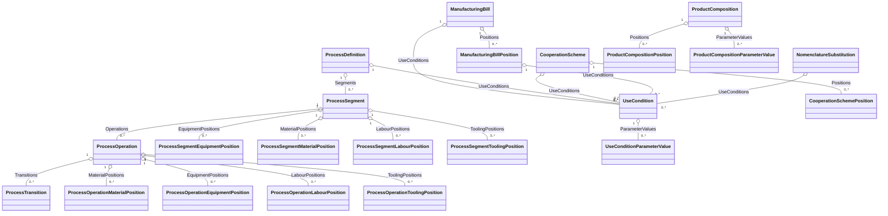

# Доменная модель - 02 Составы и технологии

## 1. Назначение документа

Документ фиксирует доменную модель модуля `02 Product & Process Definition`: объекты, поля, связи, коллекции, системные перечисления и внешние ссылки.

Runtime-представление объектов описано в `03_object_runtime_model.md`. Жизненные циклы описаны в `04_workflows.md`. Проверки и инварианты описаны в `05_rules.md`.

## 2. Общие соглашения модели

Корневые нормативные объекты `ManufacturingBill`, `ProcessDefinition` и `CooperationScheme` являются ревизиями логического документа.

Все управляемые объекты модуля наследуются от Common:

- `CommonCatalogObject`, если объект имеет обязательные `Code` и `Name`;
- `CommonObject`, если `Code` и `Name` не являются частью бизнес-идентификации.

Поля `Id`, `ExternalId`, поля аудита, архивирования и мягкого удаления наследуются из Common и в таблицах ниже не повторяются.

Все объекты, которыми владеет модуль, имеют `TenantId`. Для дочерних, зависимых, расчетных и связующих объектов `TenantId` совпадает с `TenantId` владельца и не редактируется отдельно.

`Presentation` не является доменным бизнес-полем модуля. Представление описывается как правило Object Runtime и не редактируется пользователем как отдельный реквизит.

`Status` не переносится как универсальное поле. Для ревизионных объектов используется workflow `ProcessDocumentLifecycle`, а продуктивная применимость задается хранимыми областями использования.

`UseConditionsPresentation` не хранится как самостоятельный источник данных. Краткое представление условий применимости формируется из коллекции `UseConditions` конкретного владельца.

### 2.1 Схема типов и наследования

Схема показывает логическое наследование. Поля базового типа наследуются
самостоятельными типами и не повторяются в их таблицах полей.

```mermaid
classDiagram
    class CommonObject {
        <<external>>
    }
    class CommonCatalogObject {
        <<external>>
    }
    class NomenclatureParameterValueBase {
        <<external>>
    }
    CommonCatalogObject <|-- ProcessBase
    CommonObject <|-- ProcessSegmentBase
    CommonObject <|-- ProcessOperationBase
    CommonObject <|-- ProcessStepBase
    CommonObject <|-- MaterialPositionBase
    CommonObject <|-- ProcessEquipmentPositionBase
    CommonObject <|-- ProcessLabourPositionBase
    CommonObject <|-- ProcessToolingPositionBase
    CommonObject <|-- CompositionPositionBase
    ProcessBase <|-- ProcessDefinition
    ProcessSegmentBase <|-- ProcessSegment
    ProcessOperationBase <|-- ProcessOperation
    ProcessStepBase <|-- ProcessTransition
    MaterialPositionBase <|-- ManufacturingBillPosition
    MaterialPositionBase <|-- ProcessSegmentMaterialPosition
    MaterialPositionBase <|-- ProcessOperationMaterialPosition
    ProcessEquipmentPositionBase <|-- ProcessSegmentEquipmentPosition
    ProcessEquipmentPositionBase <|-- ProcessOperationEquipmentPosition
    ProcessLabourPositionBase <|-- ProcessSegmentLabourPosition
    ProcessLabourPositionBase <|-- ProcessOperationLabourPosition
    ProcessToolingPositionBase <|-- ProcessSegmentToolingPosition
    ProcessToolingPositionBase <|-- ProcessOperationToolingPosition
    CompositionPositionBase <|-- ProductCompositionPosition
    NomenclatureParameterValueBase <|-- UseConditionParameterValue
    NomenclatureParameterValueBase <|-- ProductCompositionParameterValue
```

### 2.2 Схема связей и коллекций

Схема показывает владельцев коллекций и ссылки между объектами. Режимы
Object Runtime фиксируются отдельно в `03_object_runtime_model.md`.

### 2.3 Количественные нормы и `UnitOfOperation`

Все материальные и количественные нормы модуля хранятся как число и ссылка на `UnitOfOperation` из `01_general_master_data`.

`UnitOfOperation` является единицей операции, а не свободным списком единиц измерения. Для полей модуля с типом `UnitOfOperation` список выбора, значение по умолчанию, проверка применимости и пересчет в базовую ЕИ НП выполняются через функции GMD:

- получение доступных единиц операции для НП и области применения;
- определение единицы операции по умолчанию;
- проверка применимости выбранной единицы операции;
- пересчет количества из `UnitOfOperation` в базовую ЕИ НП и обратно.

Контракт GMD описан в `../01_general_master_data/13_operations.md` и правилах `../01_general_master_data/05_rules.md`.

Область применения единицы операции по умолчанию - производство (`UnitApplicationAreaFlags.Production`), если конкретный сценарий не задает иной контекст.

К этому правилу относятся количество продукта и компонентов, нормы расхода / выхода в позициях спецификаций, количественные нормы на наладку и выполнение, количества в результате анализа состава и результаты применения замен.

Хранение количественной нормы разделяется на две формы:

- пользовательская форма: число в выбранной `UnitOfOperation`;
- базовая форма: хранимое системно рассчитанное значение в базовой ЕИ соответствующей НП.

Базовая форма нужна для расчетов, сравнений, разузлования и передачи данных в последующие процессы. Она хранится в объекте, но не редактируется пользователем независимо от пользовательской формы и должна пересчитываться через функции GMD при изменении количества, `UnitOfOperation` или НП.

Исключение: нормативная карточка `NomenclatureSubstitution` сама не является элементом потребности, нормы расхода или логистического движения. Она хранит `RateUnit`, `RateForSetup`, `RateForProcessing` и `SubstitutionFactor`; базовые количества и нормы фиксируются в расчетном или операционном элементе, где замена применена.

`DurationUnit` не используется для материальных и количественных норм. Временные нормы операции `RateForSetupTime`, `RateForProcessingTime`, `RateForAuxiliaryTime`, `RateForMachineTime`, `RateForWaitingTime`, `RateForIdleTime`, `RateForTransportTime`, `RateForTeardownTime` хранятся в секундах. Пользовательский ввод и отображение выполняются с учетом общей настройки `Common.TimeAmountFormat` типа `TimeAmountFormatType`, но это не меняет единицу хранения. `Standard` отображает время как `hh:mm:ss`, `Industrial` - как нормо-часы с тремя десятичными знаками и культурозависимым десятичным разделителем.

### 2.4 Абстрактные базовые типы модуля

Модуль использует абстрактные базовые типы для повторяемых предметных структур. Эти типы не создаются пользователем напрямую и не имеют собственных списков или карточек.

| Базовый тип | Наследники | Назначение |
|---|---|---|
| `ProcessBase` | `ProcessDefinition` | Общий базовый тип технологического описания. |
| `ProcessSegmentBase` | `ProcessSegment` | Общий базовый тип передела. |
| `ProcessOperationBase` | `ProcessOperation` | Общий базовый тип технологической операции. |
| `ProcessStepBase` | `ProcessTransition` | Общий базовый тип технологического перехода. |
| `MaterialPositionBase` | `ManufacturingBillPosition`, `ProcessSegmentMaterialPosition`, `ProcessOperationMaterialPosition` | Общие поля материальной позиции: компонент, исполнение, тип входа/выхода, единицы и нормы расхода, округление, места отпуска/списания. |
| `ProcessEquipmentPositionBase` | `ProcessSegmentEquipmentPosition`, `ProcessOperationEquipmentPosition` | Общие поля нормативной позиции оборудования / рабочего места. |
| `ProcessLabourPositionBase` | `ProcessSegmentLabourPosition`, `ProcessOperationLabourPosition` | Общие поля нормативной позиции трудового ресурса. |
| `ProcessToolingPositionBase` | `ProcessSegmentToolingPosition`, `ProcessOperationToolingPosition` | Общие поля нормативной позиции технологической оснастки. |
| `CompositionPositionBase` | `ProductCompositionPosition` | Общие поля расчетной позиции анализа состава. |

`ProcessSegmentMaterialPosition` и `ProcessOperationMaterialPosition` не наследуются от `ManufacturingBillPosition`. Они наследуются от `MaterialPositionBase` и имеют обязательную ссылку на `ManufacturingBillPosition`, если элемент технологии связана с элементом спецификации.

Связи последовательности операций в v1 не вводятся. Порядок задается номерами переделов, операций и переходов; сложные технологические связи и сетевые графики остаются вне границы v1.

#### 2.4.1 `ProcessBase`

Базовая технология / технологическое описание.

Базовый тип: `CommonCatalogObject`.

| Поле | Русское название | Тип | Обяз. | Описание |
|---|---|---|---:|---|
| `Code` | Код | String(30) | Да | Код технологического описания внутри цепочки ревизий. |
| `Name` | Наименование | String(250) | Да | Наименование технологии. |
| `Product` | Продукт | `Nomenclature` | Да | Продукт, для которого задана технология. |
| `ProductVariant` | Исполнение продукта | `NomenclatureVariant` | Нет | Исполнение продукта. Должно соответствовать `Product`. |
| `ProcessType` | Тип процесса | `GMD.ProcessType` | Нет | Тип обработки/процесса. |
| `ProcessTemplate` | Шаблон | `ProcessTemplate` | Да | Шаблон, на основании которого создано технологическое описание. |
| `IsBaseProcess` | Основная технология | Boolean | Да | Признак основной технологии среди альтернатив для продукта, исполнения и типа процесса. |
| `ManufacturingBill` | Индивидуальная спецификация ТО | `ManufacturingBill` | Нет | Индивидуальная спецификация технологического описания. Если заполнена, ссылка должна указывать на `ManufacturingBill` с `IsForProcessDefinition = true`; если не заполнена, технология является общей и применимая спецификация подбирается отдельно. |
| `OutputWarehouse` | МХ выпуска | `OrganizationalUnit` | Нет | Основное место хранения выпущенной по технологии продукции. |
| `OutputWarehouseBin` | Ячейка выпуска | `WarehouseBin` | Нет | Основная складская ячейка хранения выпущенной по технологии продукции. |
| `Description` | Описание | String(max) | Нет | Описание технологии. |
| `Initial` | Первоначальная ревизия | `ProcessDefinition` | Да | Общая ревизионность. |
| `Revision` | Ревизия | Int | Да | Общая ревизионность. |
| `ExternalRevision` | Внешняя ревизия | String(50) | Нет | Общая ревизионность. |
| `SubmittedForApprovalAt` | Отправлено на утверждение | DateTime | Нет | Дата/время последней отправки текущей ревизии на утверждение. По умолчанию заполняется workflow-переходом `SubmitForApproval`; может корректироваться пользователем в состояниях и ролях, разрешенных workflow-политикой. |
| `ApprovedAt` | Утверждено | DateTime | Нет | Дата/время последнего утверждения текущей ревизии. По умолчанию заполняется workflow-переходом `Approve`; может корректироваться пользователем в состояниях и ролях, разрешенных workflow-политикой. |
| `ValidFrom` | Действует с | Date | Нет | Общая ревизионность. |
| `ValidTo` | Действует по | Date | Нет | Общая ревизионность. |
| `UseInPlanning` | Использовать в планировании | Boolean | Да | Область использования. |
| `UseInProduction` | Использовать в производстве | Boolean | Да | Область использования. |
| `UseInCosting` | Использовать в калькуляции | Boolean | Да | Область использования. |
| `AllowNewOperationalSelection` | Разрешить выбор в новых рабочих документах | Boolean | Да | Ограничение новых ссылок. |

#### 2.4.2 `ProcessSegmentBase`

Базовый передел / этап / цехозаход технологического описания.

Базовый тип: `CommonObject`.

| Поле | Русское название | Тип | Обяз. | Описание |
|---|---|---|---:|---|
| `Number` | Номер передела | Int | Да | Числовой номер передела внутри технологии. |
| `NumberInProcess` | Номер в ТП | String(10) | Да | Номер передела в технологическом процессе. Если не задан пользователем, заполняется из `Number` с учетом `ProcessTemplate.SegmentNumberInProcessLength`. |
| `Name` | Наименование | String(250) | Да | Наименование передела. Если не задано пользователем, может заполняться из `LabourType.Name`. |
| `LabourType` | Вид работы | `LabourType` | Нет | Классификация вида работ передела. |
| `ResponsibleOrgUnit` | Ответственная орг. единица | `OrganizationalUnit` | Да | Организационная единица, ответственная за выполнение передела. |
| `IsSubcontracted` | Субподрядный | Boolean | Да | Признак субподрядного выполнения передела. |
| `IsAutoComplete` | Автовыполнение | Boolean | Да | Признак автоматического выполнения передела в операционном контуре. |
| `IsAccountingPoint` | Точка учета | Boolean | Да | Признак передела, на котором фиксируется учетное выполнение. |
| `IsCreateManufacturingLot` | Создавать производственную партию | Boolean | Да | Признак создания производственной партии на переделе. |
| `IsAssignSerialNumbers` | Присваивать серийные номера | Boolean | Да | Признак назначения серийных номеров на переделе. |
| `DurationRateType` | Тип нормы длительности | `DurationRateType` | Да | Тип интерпретации нормы длительности. |
| `DurationUnit` | ЕИ длительности | `DurationUnit` | Да | `WorkHour`, `WorkShift`, `WorkDay`, `CalendarDay`. |
| `DurationRate` | Длительность | Decimal(24,8) | Да | Число в `DurationUnit`. |
| `TimeBuffer` | Временной буфер | Decimal(24,8) | Да | Буфер времени передела в `DurationUnit`. |
| `OutputWarehouse` | МХ выпуска | `OrganizationalUnit` | Нет | Основное место хранения продукции, выпущенной с передела. |
| `OutputWarehouseBin` | Ячейка выпуска | `WarehouseBin` | Нет | Основная складская ячейка хранения продукции, выпущенной с передела. |
| `ScrapWarehouse` | МХ брака | `OrganizationalUnit` | Нет | Основное место хранения брака и несоответствующей продукции, выпущенной с передела. |
| `ScrapWarehouseBin` | Ячейка брака | `WarehouseBin` | Нет | Основная складская ячейка хранения брака и несоответствующей продукции, выпущенной с передела. |
| `YieldFactor` | Коэффициент выпуска годных | Decimal(24,8) | Да | Коэффициент выпуска годной продукции передела. |
| `ManufacturingLossFactor` | Коэффициент технологических потерь | Decimal(24,8) | Да | Коэффициент технологических потерь передела. |
| `LossQty` | Потери | Decimal(24,8) | Да | Нормативное количество потерь передела. |
| `FactorRoundingRule` | Правило округления | `RoundingRule` | Да | Правило округления при применении коэффициентов выхода и потерь. |
| `Description` | Описание | String(max) | Нет | Уточнение передела. |

#### 2.4.3 `ProcessOperationBase`

Базовая технологическая операция.

Базовый тип: `CommonObject`.

| Поле | Русское название | Тип | Обяз. | Описание |
|---|---|---|---:|---|
| `Number` | Номер операции | Int | Да | Числовой номер операции внутри передела. |
| `NumberInProcess` | Номер в ТП | String(10) | Да | Номер операции в технологическом процессе. Если не задан пользователем, заполняется из `Number` с учетом `ProcessTemplate.OperationNumberInProcessLength`. |
| `Name` | Наименование | String(250) | Нет | Наименование операции. |
| `LabourType` | Вид работы | `LabourType` | Нет | Классификация вида работ операции. |
| `ProcessingOperation` | ТО по классификатору | `ProcessingOperation` | Нет | Типовая технологическая операция из классификатора. |
| `ManufacturingOperationType` | Вид операции | `ManufacturingOperationType` | Да | Вид технологической операции. |
| `ConfirmationStages` | Схема подтверждения | `Set<ConfirmationStage>` | Да | Набор стадий подтверждения выполнения операции. |
| `PaymentGroup` | Группа оплаты | external `ResourceManagement:PaymentGroup` | Нет | Группа оплаты работы по операции. Справочник принадлежит `ResourceManagement`. |
| `WorkEnvironment` | Условия труда | `WorkEnvironment` | Нет | Условия выполнения работы для тарификации и калькуляции трудовой составляющей. |
| `ResponsibleOrgUnit` | Ответственная орг. единица | `OrganizationalUnit` | Да | Организационная единица, ответственная за выполнение операции. |
| `ExecutionOrgUnit` | Орг. единица выполнения | `OrganizationalUnit` | Нет | Организационная единица / участок, где выполняется операция; для субподрядной операции может не заполняться. |
| `IsSubcontracted` | Субподрядная | Boolean | Да | Признак субподрядного выполнения операции. |
| `NumberOfItemsSimultaneouslyProcessed` | КОИД | Int | Да | Количество номенклатурных единиц, одновременно обрабатываемых операцией. |
| `ProductivityFactor` | Коэффициент производительности | Decimal(24,8) | Да | Коэффициент производительности операции относительно нормативного времени. |
| `RateTypeForSetup` | Тип нормы Тпз | `DurationRateType` | Нет | Тип интерпретации подготовительно-заключительного времени. |
| `RateForSetupTime` | Норма подготовительно-заключительного времени | Decimal(24,8) | Нет | Хранится в секундах; интерпретируется через `RateTypeForSetup`. |
| `RateTypeForProcessing` | Тип нормы Тшт | `DurationRateType` | Нет | Тип интерпретации времени выполнения: на единицу или на партию. |
| `RateForProcessingTime` | Норма времени выполнения | Decimal(24,8) | Нет | Хранится в секундах; интерпретируется через `RateTypeForProcessing`. |
| `RateForAuxiliaryTime` | Норма вспомогательного времени | Decimal(24,8) | Нет | Хранится в секундах; используется для расчета `RateForProcessingTime`, если включен расчет. |
| `RateForMachineTime` | Норма машинного времени | Decimal(24,8) | Нет | Хранится в секундах; используется для расчета `RateForProcessingTime`, если включен расчет. |
| `CalculateRateForProcessingTime` | Рассчитать Тшт | Boolean | Да | Признак расчета `RateForProcessingTime` из составляющих времени операции. |
| `RateForWaitingTime` | Время ожидания | Decimal(24,8) | Нет | Хранится в секундах. |
| `RateForIdleTime` | Время простоя | Decimal(24,8) | Нет | Хранится в секундах. |
| `RateForTransportTime` | Время транспортировки | Decimal(24,8) | Нет | Хранится в секундах. |
| `RateForTeardownTime` | Норма времени снятия/завершения | Decimal(24,8) | Нет | Хранится в секундах. |
| `Description` | Описание | String(max) | Нет | Уточнение операции. |
| `SpecialInstructions` | Особые указания | String(max) | Нет | Особые указания по выполнению операции. |

#### 2.4.4 `ProcessStepBase`

Базовый технологический переход.

Базовый тип: `CommonObject`.

| Поле | Русское название | Тип | Обяз. | Описание |
|---|---|---|---:|---|
| `Number` | Номер перехода | Int | Да | Числовой номер перехода внутри операции. |
| `NumberInProcess` | Номер в ТП | String(10) | Да | Номер перехода в технологическом процессе. Если не задан пользователем, заполняется из `Number` с учетом `ProcessTemplate.StepNumberInProcessLength`. |
| `Description` | Описание | String(max) | Нет | Содержание перехода. |
| `SpecialInstructions` | Особые указания | String(max) | Нет | Особые указания по выполнению перехода. |

#### 2.4.5 `MaterialPositionBase`

Базовая материальная позиция для элемента спецификации, материального элемента передела и материального элемента операции.

Базовый тип: `CommonObject`.

| Поле | Русское название | Тип | Обяз. | Описание |
|---|---|---|---:|---|
| `PositionNumber` | Номер позиции | Int | Да | Номер элемента внутри владельца. |
| `PositionNumberOnDrawing` | Номер на чертеже | String(10) | Нет | Обозначение позиции на чертеже или в технологической документации. |
| `InputOutputType` | Тип входа/выхода | `InputOutputPositionType` | Да | Тип нормы материальной позиции: расход компонента, выход попутного продукта, выход отхода или образец. |
| `Component` | Компонент | `Nomenclature` | Да | Номенклатурная позиция компонента, выхода или отхода. |
| `ComponentVariant` | Исполнение компонента | `NomenclatureVariant` | Нет | Исполнение компонента. Должно относиться к `Component`. |
| `IsMain` | Основной | Boolean | Да | Признак основной позиции в своем контексте. |
| `ComponentManufacturingBill` | Спецификация компонента | `ManufacturingBill` | Нет | Конкретная ревизия спецификации компонента, если задана явно. |
| `ComponentProcessDefinition` | Технология компонента | `ProcessDefinition` | Нет | Конкретная ревизия технологии компонента, если задана явно. |
| `RateBaseUnit` | Базовая ЕИ нормы | `Unit` | Да | Базовая единица компонента для хранения рассчитанной нормы. |
| `RateForSetupBaseUnit` | Норма на наладку в БЕИ | Decimal(24,8) | Да | Количественная норма на наладку в базовой ЕИ компонента. |
| `RateForProcessingBaseUnit` | Норма на обработку в БЕИ | Decimal(24,8) | Да | Количественная норма на обработку в базовой ЕИ компонента. |
| `RateUnit` | ЕИ нормы | `UnitOfOperation` | Да | Единица операции для пользовательского ввода нормы. |
| `RateForSetup` | Норма на наладку | Decimal(24,8) | Да | Количественная норма на наладку в `RateUnit`. Не является временной нормой. |
| `RateForProcessing` | Норма на обработку | Decimal(24,8) | Да | Количественная норма на обработку в `RateUnit`. Не является временной нормой. |
| `ProductLotSize` | Размер партии | Decimal(24,8) | Да | Размер партии, на который задана норма. |
| `MaterialUtilizationFactor` | КИМ | Decimal(24,8) | Да | Коэффициент использования материала. |
| `RoundingRuleRate` | Правило округления нормы | `RoundingRule` | Да | Правило округления рассчитанной нормы. |
| `RoundingPrecision` | Точность округления | Int | Да | Количество знаков для округления рассчитанной нормы. |
| `ReleaseWarehouse` | МХ отпуска | `OrganizationalUnit` | Нет | Место хранения отпуска компонента. |
| `ReleaseWarehouseBin` | Ячейка отпуска | `WarehouseBin` | Нет | Ячейка отпуска компонента. |
| `IssueWarehouse` | МХ списания | `OrganizationalUnit` | Нет | Место хранения списания компонента. |
| `IssueWarehouseBin` | Ячейка списания | `WarehouseBin` | Нет | Ячейка списания компонента. |
| `InventoryStatus` | Статус запаса | external `InventoryStatus` | Нет | Статус запаса для подбора или списания компонента. |
| `IssueComponentType` | Правило списания | `GMD.IssueComponentType` | Да | Правило списания компонента из GMD. |

#### 2.4.6 `ProcessEquipmentPositionBase`

Базовая позиция оборудования или рабочего места для передела и операции.

Базовый тип: `CommonObject`.

| Поле | Русское название | Тип | Обяз. | Описание |
|---|---|---|---:|---|
| `PositionNumber` | Номер позиции | Int | Да | Номер позиции внутри передела или операции. |
| `WorkPlaceGroup` | Группа рабочих мест | external `WorkPlaceGroup` | Нет | Группа рабочих мест или оборудования. |
| `WorkPlace` | Рабочее место | external `WorkPlace` | Нет | Конкретное рабочее место или оборудование. |
| `EquipmentQty` | Количество | Decimal(24,8) | Да | Требуемое количество оборудования или рабочих мест. |
| `IsBasic` | Основной | Boolean | Да | Основное оборудование / рабочее место для выполнения. |
| `NumberOfItemsSimultaneouslyProcessed` | КОИД | Int | Да | Количество номенклатурных единиц, одновременно обрабатываемых на позиции. |
| `ProductivityFactor` | Коэффициент производительности | Decimal(24,8) | Да | Коэффициент производительности относительно нормативного времени. |
| `RateTypeForSetup` | Тип нормы Тпз | `DurationRateType` | Да | Тип нормы подготовительно-заключительного времени. |
| `RateForSetupTime` | Тпз | Decimal(24,8) | Да | Подготовительно-заключительное время. Хранится в секундах. |
| `RateTypeForProcessing` | Тип нормы Тшт | `DurationRateType` | Да | Тип нормы штучного времени. |
| `RateForAuxiliaryTime` | Твсп | Decimal(24,8) | Да | Вспомогательное время. Хранится в секундах. |
| `RateForMachineTime` | Тмаш | Decimal(24,8) | Да | Машинное время. Хранится в секундах. |
| `RateForProcessingTime` | Тшт | Decimal(24,8) | Да | Штучное время. Хранится в секундах. |
| `CalculateRateForProcessingTime` | Рассчитать Тшт | Boolean | Да | Признак расчета `RateForProcessingTime` из составляющих времени. |

#### 2.4.7 `ProcessLabourPositionBase`

Базовая позиция трудового ресурса для передела и операции.

Базовый тип: `CommonObject`.

| Поле | Русское название | Тип | Обяз. | Описание |
|---|---|---|---:|---|
| `PositionNumber` | Номер позиции | Int | Да | Номер позиции внутри передела или операции. |
| `PersonnelGroup` | Группа сотрудников | external `PersonnelGroup` | Нет | Группа сотрудников, допустимая для выполнения работы. |
| `Personnel` | Сотрудник | external `Personnel` | Нет | Конкретный сотрудник, если норма задана персонально. |
| `Profession` | Профессия | external `Profession` | Да | Требуемая профессия или квалификация. |
| `Grade` | Разряд | Tinyint | Да | Требуемый разряд квалификации. |
| `LabourQty` | Количество рабочих | Decimal(24,8) | Да | Требуемое количество трудового ресурса. |
| `IsBasic` | Основной | Boolean | Да | Основной трудовой ресурс для выполнения. |
| `PaymentGroup` | Группа оплаты | external `PaymentGroup` | Нет | Группа оплаты работ. |
| `RateTypeForSetup` | Тип нормы Тпз | `DurationRateType` | Да | Тип нормы подготовительно-заключительного времени. |
| `RateForSetupTime` | Тпз | Decimal(24,8) | Да | Подготовительно-заключительное время. Хранится в секундах. |
| `RateTypeForProcessing` | Тип нормы Тшт | `DurationRateType` | Да | Тип нормы штучного времени. |
| `RateForProcessingTime` | Тшт | Decimal(24,8) | Да | Штучное время. Хранится в секундах. |

#### 2.4.8 `ProcessToolingPositionBase`

Базовая позиция технологической оснастки для передела и операции.

Базовый тип: `CommonObject`.

| Поле | Русское название | Тип | Обяз. | Описание |
|---|---|---|---:|---|
| `PositionNumber` | Номер позиции | Int | Да | Номер позиции внутри передела или операции. |
| `Tooling` | Технологическая оснастка | external `ResourceManagement:ToolBase` | Да | Внешний объект инструмента, оснастки или контрольно-измерительного средства, принадлежащий `ResourceManagement`. |
| `ToolingQty` | Количество | Decimal(24,8) | Да | Требуемое количество оснастки. |

#### 2.4.9 `CompositionPositionBase`

Базовая расчетная позиция анализа состава.

Базовый тип: `CommonObject`.

| Поле | Русское название | Тип | Обяз. | Описание |
|---|---|---|---:|---|
| `PositionNumber` | Номер | Int | Да | Номер элемента результата. |
| `Level` | Уровень | Int | Да | Уровень входимости в иерархии разузлования. |
| `Nomenclature` | Номенклатура | `Nomenclature` | Да | Номенклатура элемента результата. |
| `NomenclatureVariant` | Исполнение | `NomenclatureVariant` | Нет | Исполнение номенклатуры элемента. |
| `RateDate` | Дата норм | Date | Да | Дата, на которую подобраны нормативные данные. |
| `ObtainMethod` | Способ обеспечения | `GMD.NomenclatureObtainMethod` | Да | Способ обеспечения рассчитанной позиции. |
| `ProcessType` | Тип процесса | `GMD.ProcessType` | Нет | Тип процесса изготовления или обработки. |
| `SourceManufacturingBill` | Исходная спецификация | `ManufacturingBill` | Нет | Спецификация, по которой сформирован элемент. |
| `SourceProcessDefinition` | Исходная технология | `ProcessDefinition` | Нет | Технология, по которой сформирован элемент. |
| `SourceSegment` | Исходный передел | `ProcessSegment` | Нет | Передел, связанный с элементом результата. |
| `SourceBillPosition` | Исходная позиция спецификации | `ManufacturingBillPosition` | Нет | Позиция спецификации, по которой сформирован элемент. |
| `SourceSegmentMaterialPosition` | Исходная материальная позиция передела | `ProcessSegmentMaterialPosition` | Нет | Материальная позиция передела, по которой сформирован элемент. |
| `SourceCooperationScheme` | Исходная схема кооперации | `CooperationScheme` | Нет | Схема кооперации, примененная при расчете. |
| `SourceCooperationSchemePosition` | Исходная позиция схемы кооперации | `CooperationSchemePosition` | Нет | Позиция схемы кооперации, примененная при расчете. |
| `Supplier` | Поставщик | `Contractor` | Нет | Поставщик или субподрядчик, выбранный расчетом. |
| `BaseUnit` | Базовая ЕИ | `Unit` | Нет | Базовая ЕИ рассчитанной номенклатуры. |
| `TotalQtyBaseUnit` | Количество всего в БЕИ | Decimal(24,8) | Нет | Полное рассчитанное количество в базовой ЕИ. |
| `PerUnitOfProductQtyBaseUnit` | Количество на единицу продукта в БЕИ | Decimal(24,8) | Нет | Количество на единицу конечного продукта в базовой ЕИ. |
| `PerUnitOfParentQtyBaseUnit` | Количество на единицу вышестоящего в БЕИ | Decimal(24,8) | Нет | Количество на единицу родительской позиции в базовой ЕИ. |
| `Unit` | ЕИ | `UnitOfOperation` | Нет | Единица операции для отображения рассчитанного количества. |
| `TotalQty` | Количество всего | Decimal(24,8) | Нет | Полное рассчитанное количество в `Unit`. |
| `PerUnitOfProductQty` | Количество на единицу продукта | Decimal(24,8) | Нет | Количество на единицу конечного продукта в `Unit`. |
| `PerUnitOfParentQty` | Количество на единицу вышестоящего | Decimal(24,8) | Нет | Количество на единицу родительской позиции в `Unit`. |
| `SubstitutionSource` | Исходная замена | `NomenclatureSubstitution` | Нет | Правило замены, если элемент сформирован с заменой. |
| `SubstitutedNomenclature` | Замененная номенклатура | `Nomenclature` | Нет | Исходная номенклатура, которую заменили. |
| `SubstitutedNomenclatureVariant` | Замененное исполнение | `NomenclatureVariant` | Нет | Исполнение исходной номенклатуры, если было задано. |
| `SubstitutedQty` | Замененное количество | Decimal(24,8) | Нет | Количество исходной номенклатуры до замены. |
| `SubstitutionFactor` | Коэффициент замены | Decimal(24,8) | Нет | Коэффициент пересчета, примененный при замене. |
| `SubstitutedUnit` | Замененная ЕИ | `UnitOfOperation` | Нет | ЕИ исходного количества до замены. |
| `PositionStatus` | Статус позиции | `ProductCompositionPositionStatus` | Да | Расчетный статус элемента. Не workflow-состояние. |
| `Message` | Сообщение | String(max) | Нет | Сообщение по элементу результата. |

## 3. Шаблоны и классификаторы

Шаблоны являются настроечными объектами модуля. Они задают параметры создания и нумерации спецификаций и технологических описаний, но не являются ревизионными документами и не имеют workflow `ProcessDocumentLifecycle`.

Классификаторы технологических работ и операций являются справочниками модуля. Они не являются ревизионными документами и не имеют workflow `ProcessDocumentLifecycle`.

### 3.1 `ManufacturingBillTemplate`

Шаблон спецификации.

Базовый тип: `CommonCatalogObject`.

| Поле | Русское название | Тип | Обяз. | Описание |
|---|---|---|---:|---|
| `Code` | Код | String(30) | Да | Код шаблона спецификации. |
| `Name` | Наименование | String(250) | Да | Наименование шаблона спецификации. |
| `IsDefault` | По умолчанию | Boolean | Да | Признак шаблона, применяемого по умолчанию при создании спецификации. |
| `PositionNumberingStep` | Шаг нумерации позиций | Int | Да | Шаг нумерации позиций спецификации, созданной по шаблону. |

### 3.2 `ProcessTemplate`

Шаблон технологии.

Базовый тип: `CommonCatalogObject`.

| Поле | Русское название | Тип | Обяз. | Описание |
|---|---|---|---:|---|
| `Code` | Код | String(30) | Да | Код шаблона технологии. |
| `Name` | Наименование | String(250) | Да | Наименование шаблона технологии. |
| `IsDefault` | По умолчанию | Boolean | Да | Признак шаблона, применяемого по умолчанию при создании технологического описания. |
| `SegmentNumberingStep` | Шаг нумерации переделов | Int | Да | Шаг нумерации переделов технологического описания, созданного по шаблону. |
| `OperationNumberingStep` | Шаг нумерации операций | Int | Да | Шаг нумерации операций технологического описания, созданного по шаблону. |
| `StepNumberingStep` | Шаг нумерации переходов | Int | Да | Шаг нумерации переходов технологического описания, созданного по шаблону. |
| `ResourcePositionNumberingStep` | Шаг нумерации ресурсов | Int | Да | Шаг нумерации позиций оборудования, трудовых ресурсов и оснастки. |
| `SegmentNumberInProcessLength` | Длина номера передела в ТП | Int | Да | Длина форматированного номера передела в технологическом процессе. |
| `OperationNumberInProcessLength` | Длина номера операции в ТП | Int | Да | Длина форматированного номера операции в технологическом процессе. |
| `StepNumberInProcessLength` | Длина номера перехода в ТП | Int | Да | Длина форматированного номера перехода в технологическом процессе. |

### 3.3 `LabourType`

Классификатор видов работ.

Базовый тип: `CommonCatalogObject`.

| Поле | Русское название | Тип | Обяз. | Описание |
|---|---|---|---:|---|
| `Code` | Код | String(30) | Да | Код вида работы. |
| `Name` | Наименование | String(250) | Да | Наименование вида работы. |

### 3.4 `ManufacturingOperationType`

Вид технологической операции.

Базовый тип: `CommonCatalogObject`.

| Поле | Русское название | Тип | Обяз. | Описание |
|---|---|---|---:|---|
| `Code` | Код | String(30) | Да | Код вида операции. |
| `Name` | Наименование | String(250) | Да | Наименование вида операции. |
| `Description` | Описание | String(max) | Нет | Описание вида операции. |
| `ConfirmationStages` | Схема подтверждения | `Set<ConfirmationStage>` | Да | Схема подтверждения по умолчанию для операций этого вида. |
| `ActualAccountingMode` | Вид учета факта | `ActualAccountingMode` | Да | Способ учета факта операции: по количеству или по времени. |

### 3.5 `ProcessingOperation`

Технологическая операция по классификатору.

Базовый тип: `CommonCatalogObject`.

| Поле | Русское название | Тип | Обяз. | Описание |
|---|---|---|---:|---|
| `Code` | Код | String(30) | Да | Код классификаторной технологической операции. |
| `Name` | Наименование | String(250) | Да | Наименование классификаторной технологической операции. |
| `Parent` | Вышестоящая операция | `ProcessingOperation` | Нет | Родительская операция для древовидного классификатора. |
| `LabourType` | Вид работы | `LabourType` | Нет | Вид работы по умолчанию для операций, создаваемых по классификатору. |
| `ManufacturingOperationType` | Вид операции | `ManufacturingOperationType` | Нет | Вид операции по умолчанию для операций, создаваемых по классификатору. |

### 3.6 `WorkEnvironment`

Условия труда.

Базовый тип: `CommonCatalogObject`.

| Поле | Русское название | Тип | Обяз. | Описание |
|---|---|---|---:|---|
| `Code` | Код | String(30) | Да | Код условий труда. |
| `Name` | Наименование | String(250) | Да | Наименование условий труда. |
| `Description` | Описание | String(max) | Нет | Описание условий труда для тарификации и калькуляции трудовой составляющей. |

## 4. Спецификация

### 4.1 `ManufacturingBill`

Спецификация / состав изделия. Корневая ревизия с workflow и областями использования.

Базовый тип: `CommonCatalogObject`.

| Поле | Русское название | Тип | Обяз. | Описание |
|---|---|---|---:|---|
| `Code` | Код | String(30) | Да | Код спецификации внутри цепочки ревизий. |
| `Name` | Наименование | String(250) | Да | Наименование спецификации. |
| `Product` | Продукт | `Nomenclature` | Да | Номенклатура, для которой задан состав. |
| `ProductVariant` | Исполнение продукта | `NomenclatureVariant` | Нет | Исполнение продукта. Должно соответствовать `Product`. |
| `ProcessType` | Тип процесса | `GMD.ProcessType` | Нет | Тип обработки/процесса, если состав зависит от процесса. |
| `ManufacturingBillTemplate` | Шаблон | `ManufacturingBillTemplate` | Да | Шаблон, на основании которого создана спецификация. |
| `IsForProcessDefinition` | Спецификация ТО | Boolean | Да | Признак индивидуальной спецификации, созданной для конкретного технологического описания. Обычные спецификации продукта имеют значение `false`. |
| `IsBaseBill` | Основная спецификация | Boolean | Да | Признак основной спецификации среди альтернатив для продукта, исполнения и типа процесса. |
| `Unit` | Единица количества | `UnitOfOperation` | Нет | Единица операции для количества продукта. |
| `BaseUnit` | Базовая ЕИ | `Unit` | Да | Базовая единица продукта. |
| `Quantity` | Количество | Decimal(24,8) | Да | Количество продукта, на которое задан состав. |
| `QuantityBaseUnit` | Количество в БЕИ | Decimal(24,8) | Да | Системно рассчитанное количество продукта в базовой ЕИ. |
| `Description` | Описание | String(max) | Нет | Пользовательское описание спецификации. |
| `Initial` | Первоначальная ревизия | `ManufacturingBill` | Да | Общая ревизионность. |
| `Revision` | Ревизия | Int | Да | Общая ревизионность. |
| `ExternalRevision` | Внешняя ревизия | String(50) | Нет | Общая ревизионность. |
| `SubmittedForApprovalAt` | Отправлено на утверждение | DateTime | Нет | Дата/время последней отправки текущей ревизии на утверждение. По умолчанию заполняется workflow-переходом `SubmitForApproval`; может корректироваться пользователем в состояниях и ролях, разрешенных workflow-политикой. |
| `ApprovedAt` | Утверждено | DateTime | Нет | Дата/время последнего утверждения текущей ревизии. По умолчанию заполняется workflow-переходом `Approve`; может корректироваться пользователем в состояниях и ролях, разрешенных workflow-политикой. |
| `ValidFrom` | Действует с | Date | Нет | Общая ревизионность. |
| `ValidTo` | Действует по | Date | Нет | Общая ревизионность. |
| `UseInPlanning` | Использовать в планировании | Boolean | Да | Область использования. |
| `UseInProduction` | Использовать в производстве | Boolean | Да | Область использования. |
| `UseInCosting` | Использовать в калькуляции | Boolean | Да | Область использования. |
| `AllowNewOperationalSelection` | Разрешить выбор в новых рабочих документах | Boolean | Да | Ограничение новых ссылок. |

Коллекции:

| Коллекция | Тип элемента | Кратность | Владение | Связующее поле или условие | Назначение |
|---|---|---|---|---|---|
| `ManufacturingBill.Positions` | `ManufacturingBillPosition` | `0..*` | `ManufacturingBill` | ссылочное поле элемента на владельца | Позиции состава. |
| `ManufacturingBill.UseConditions` | `UseCondition` | `0..*` | `ManufacturingBill` | ссылочное поле элемента на владельца | Условия применимости спецификации. |

### 4.2 `ManufacturingBillPosition`

Позиция спецификации и элемент состава.

Базовый тип: `MaterialPositionBase` (абстрактный базовый тип; наследует `CommonObject`).

Общие материальные поля описаны в `MaterialPositionBase`.

| Поле | Русское название | Тип | Обяз. | Описание |
|---|---|---|---:|---|
| `ManufacturingBill` | Спецификация | `ManufacturingBill` | Да | Владелец элемента. |
| `ObtainMethod` | Способ обеспечения | `GMD.NomenclatureObtainMethod` | Нет | Способ обеспечения потребности по позиции спецификации. |
| `ProcessType` | Тип процесса | `GMD.ProcessType` | Нет | Преимущественный тип процесса по позиции спецификации. |
| `ValidFrom` | Действует с | Date | Нет | Начало периода действия позиции. |
| `ValidTo` | Действует по | Date | Нет | Окончание периода действия позиции. |

Коллекции:

| Коллекция | Тип элемента | Кратность | Владение | Связующее поле или условие | Назначение |
|---|---|---|---|---|---|
| `ManufacturingBillPosition.UseConditions` | `UseCondition` | `0..*` | `ManufacturingBillPosition` | ссылочное поле элемента на владельца | Условия применимости позиции состава. |

## 5. Технологическое описание

### 5.1 `ProcessDefinition`

Технологическое описание нормативного маршрута: переделы, операции и переходы.

Базовый тип: `ProcessBase` (абстрактный базовый тип; наследует `CommonCatalogObject`).

Собственных полей сверх `ProcessBase` в v1 нет.

Коллекции:

| Коллекция | Тип элемента | Кратность | Владение | Связующее поле или условие | Назначение |
|---|---|---|---|---|---|
| `ProcessDefinition.Segments` | `ProcessSegment` | `0..*` | `ProcessDefinition` | ссылочное поле элемента на владельца | Переделы технологического описания. |
| `ProcessDefinition.UseConditions` | `UseCondition` | `0..*` | `ProcessDefinition` | ссылочное поле элемента на владельца | Условия применимости технологии. |

### 5.2 `ProcessSegment`

Передел / этап / цехозаход технологического описания.

Базовый тип: `ProcessSegmentBase` (абстрактный базовый тип; наследует `CommonObject`).

Поля, общие для передела, описаны в `ProcessSegmentBase`.

| Поле | Русское название | Тип | Обяз. | Описание |
|---|---|---|---:|---|
| `ProcessDefinition` | Технологическое описание | `ProcessDefinition` | Да | Владелец передела. |

Коллекции:

| Коллекция | Тип элемента | Кратность | Владение | Связующее поле или условие | Назначение |
|---|---|---|---|---|---|
| `ProcessSegment.Operations` | `ProcessOperation` | `0..*` | `ProcessSegment` | ссылочное поле элемента на владельца | Операции передела. |
| `ProcessSegment.MaterialPositions` | `ProcessSegmentMaterialPosition` | `0..*` | `ProcessSegment` | ссылочное поле элемента на владельца | Материальные позиции передела. |
| `ProcessSegment.EquipmentPositions` | `ProcessSegmentEquipmentPosition` | `0..*` | `ProcessSegment` | ссылочное поле элемента на владельца | Позиции оборудования / рабочих мест передела. |
| `ProcessSegment.LabourPositions` | `ProcessSegmentLabourPosition` | `0..*` | `ProcessSegment` | ссылочное поле элемента на владельца | Позиции трудовых ресурсов передела. |
| `ProcessSegment.ToolingPositions` | `ProcessSegmentToolingPosition` | `0..*` | `ProcessSegment` | ссылочное поле элемента на владельца | Позиции технологической оснастки передела. |

### 5.3 `ProcessOperation`

Нормативная технологическая операция передела.

Базовый тип: `ProcessOperationBase` (абстрактный базовый тип; наследует `CommonObject`).

Поля, общие для операции, описаны в `ProcessOperationBase`.

| Поле | Русское название | Тип | Обяз. | Описание |
|---|---|---|---:|---|
| `ProcessDefinition` | Технологическое описание | `ProcessDefinition` | Да | Владелец через технологию. |
| `ProcessSegment` | Передел | `ProcessSegment` | Да | Передел операции. |

Коллекции:

| Коллекция | Тип элемента | Кратность | Владение | Связующее поле или условие | Назначение |
|---|---|---|---|---|---|
| `ProcessOperation.MaterialPositions` | `ProcessOperationMaterialPosition` | `0..*` | `ProcessOperation` | ссылочное поле элемента на владельца | Материальные позиции операции. |
| `ProcessOperation.EquipmentPositions` | `ProcessOperationEquipmentPosition` | `0..*` | `ProcessOperation` | ссылочное поле элемента на владельца | Позиции оборудования / рабочих мест операции. |
| `ProcessOperation.LabourPositions` | `ProcessOperationLabourPosition` | `0..*` | `ProcessOperation` | ссылочное поле элемента на владельца | Позиции трудовых ресурсов операции. |
| `ProcessOperation.ToolingPositions` | `ProcessOperationToolingPosition` | `0..*` | `ProcessOperation` | ссылочное поле элемента на владельца | Позиции технологической оснастки операции. |
| `ProcessOperation.Transitions` | `ProcessTransition` | `0..*` | `ProcessOperation` | ссылочное поле элемента на владельца | Технологические переходы операции. |

### 5.4 `ProcessTransition`

Технологический переход внутри операции.

Базовый тип: `ProcessStepBase` (абстрактный базовый тип; наследует `CommonObject`).

Поля, общие для перехода, описаны в `ProcessStepBase`.

| Поле | Русское название | Тип | Обяз. | Описание |
|---|---|---|---:|---|
| `ProcessOperation` | Операция | `ProcessOperation` | Да | Операция-владелец. |

### 5.5 Материальные позиции технологии

`ProcessSegmentMaterialPosition` и `ProcessOperationMaterialPosition` фиксируют материальные нормы на уровне передела и операции.

Базовый тип: `MaterialPositionBase` (абстрактный базовый тип; наследует `CommonObject`).

Общие поля наследуются из `MaterialPositionBase`: `PositionNumber`, `PositionNumberOnDrawing`, `InputOutputType`, `Component`, `ComponentVariant`, `IsMain`, `ComponentManufacturingBill`, `ComponentProcessDefinition`, `RateBaseUnit`, `RateUnit`, `RateForSetup`, `RateForSetupBaseUnit`, `RateForProcessing`, `RateForProcessingBaseUnit`, `ProductLotSize`, `MaterialUtilizationFactor`, `RoundingRuleRate`, `RoundingPrecision`, места отпуска/списания, `InventoryStatus`, `IssueComponentType`.

`ProcessSegmentMaterialPosition` добавляет:

| Поле | Русское название | Тип | Обяз. | Описание |
|---|---|---|---:|---|
| `ProcessSegment` | Передел | `ProcessSegment` | Да | Передел, к которому относится материальная позиция. |
| `ManufacturingBillPosition` | Позиция спецификации | `ManufacturingBillPosition` | Да | Позиция спецификации, с которой связана материальная позиция передела. |
| `PositionForSample` | Норма для образца | `ProcessSegmentMaterialPosition` | Нет | Образцовый элемент нормы, если используется копирование нормы. |

`ProcessOperationMaterialPosition` добавляет:

| Поле | Русское название | Тип | Обяз. | Описание |
|---|---|---|---:|---|
| `ProcessOperation` | Операция | `ProcessOperation` | Да | Операция, к которой относится материальная позиция. |
| `ManufacturingBillPosition` | Позиция спецификации | `ManufacturingBillPosition` | Да | Позиция спецификации, с которой связана материальная позиция операции. |
| `PositionForSample` | Норма для образца | `ProcessOperationMaterialPosition` | Нет | Образцовый элемент нормы, если используется копирование нормы. |

`ManufacturingBillPosition` не является базовым типом для материальных позиций технологии. Связь с ним хранится ссылкой, потому что элементы спецификации, передела и операции имеют разных владельцев и разные правила уникальности. Поля `ObtainMethod`, `ProcessType`, `ValidFrom`, `ValidTo` хранятся на `ManufacturingBillPosition` и не дублируются в материальных позициях технологии.

### 5.6 Позиции оборудования / рабочих мест

`ProcessSegmentEquipmentPosition` и `ProcessOperationEquipmentPosition` фиксируют нормативную потребность технологии в оборудовании или рабочем месте.

Базовый тип: `ProcessEquipmentPositionBase` (абстрактный базовый тип; наследует `CommonObject`).

Общие поля наследуются из `ProcessEquipmentPositionBase`.

`ProcessSegmentEquipmentPosition` добавляет:

| Поле | Русское название | Тип | Обяз. | Описание |
|---|---|---|---:|---|
| `ProcessSegment` | Передел | `ProcessSegment` | Да | Владелец позиции передела. |

`ProcessOperationEquipmentPosition` добавляет:

| Поле | Русское название | Тип | Обяз. | Описание |
|---|---|---|---:|---|
| `ProcessOperation` | Операция | `ProcessOperation` | Да | Владелец позиции операции. |

Модуль хранит нормативную позицию оборудования / рабочего места, но не владеет справочниками рабочих мест, календарями, мощностями и доступностью.

### 5.7 Позиции трудовых ресурсов

`ProcessSegmentLabourPosition` и `ProcessOperationLabourPosition` фиксируют нормативную потребность технологии в персонале.

Базовый тип: `ProcessLabourPositionBase` (абстрактный базовый тип; наследует `CommonObject`).

Общие поля наследуются из `ProcessLabourPositionBase`.

`ProcessSegmentLabourPosition` добавляет:

| Поле | Русское название | Тип | Обяз. | Описание |
|---|---|---|---:|---|
| `ProcessSegment` | Передел | `ProcessSegment` | Да | Владелец позиции передела. |
| `ProcessSegmentEquipmentPosition` | Позиция оборудования передела | `ProcessSegmentEquipmentPosition` | Да | Оборудование или рабочее место передела, для которого задана потребность в персонале. |

`ProcessOperationLabourPosition` добавляет:

| Поле | Русское название | Тип | Обяз. | Описание |
|---|---|---|---:|---|
| `ProcessOperation` | Операция | `ProcessOperation` | Да | Владелец позиции операции. |
| `ProcessOperationEquipmentPosition` | Позиция оборудования операции | `ProcessOperationEquipmentPosition` | Да | Оборудование или рабочее место операции, для которого задана потребность в персонале. |

Модуль хранит нормативную потребность в трудовом ресурсе, но не владеет справочником сотрудников, сменами, календарями и фактической доступностью.

### 5.8 Позиции технологической оснастки

`ProcessSegmentToolingPosition` и `ProcessOperationToolingPosition` фиксируют нормативную потребность технологии в инструменте или оснастке.

Базовый тип: `ProcessToolingPositionBase` (абстрактный базовый тип; наследует `CommonObject`).

Общие поля наследуются из `ProcessToolingPositionBase`.

`ProcessSegmentToolingPosition` добавляет:

| Поле | Русское название | Тип | Обяз. | Описание |
|---|---|---|---:|---|
| `ProcessSegment` | Передел | `ProcessSegment` | Да | Владелец позиции передела. |
| `ProcessSegmentEquipmentPosition` | Позиция оборудования передела | `ProcessSegmentEquipmentPosition` | Да | Оборудование или рабочее место передела, для которого требуется оснастка. |

`ProcessOperationToolingPosition` добавляет:

| Поле | Русское название | Тип | Обяз. | Описание |
|---|---|---|---:|---|
| `ProcessOperation` | Операция | `ProcessOperation` | Да | Владелец позиции операции. |
| `ProcessOperationEquipmentPosition` | Позиция оборудования операции | `ProcessOperationEquipmentPosition` | Да | Оборудование или рабочее место операции, для которого требуется оснастка. |

Модуль хранит нормативную потребность в оснастке, но не владеет складом оснастки, доступностью и жизненным циклом оснастки.

### 5.9 Интеграция с документами технологического описания

Модуль не вводит собственные хранимые объекты `ProcessOperationDocumentReference` и `ProcessTransitionDocumentReference`.

Связь документа с бизнес-объектом хранится в `Document Management` через универсальный механизм документных связей. В доменной модели модуля v1 явно фиксируется только использование связанных документов технологического описания `ProcessDefinition`.

| Объект модуля | Смысл использования документов | Где хранится связь |
|---|---|---|
| `ProcessDefinition` | Комплект документов технологического описания: инструкции, технологические документы, файлы, URL, материалы ЕСТД. | `Document Management`. |

Документ, версия документа, файл, URL, основной файл, жизненный цикл документа, права на документ и хранение файла не являются объектами владения модуля.

Назначение технологического материала задается средствами `Document Management`: типом документа, видом документа или метаданными документной связи. Модуль не вводит отдельный `DocumentMaterialKind`, чтобы не дублировать классификацию документов.

Универсальные документные вкладки для других объектов, включая операцию и переход, могут быть подключены общесистемной конфигурацией `Document Management` без добавления новых доменных объектов модуля.

## 6. Схемы кооперации

### 6.1 `CooperationScheme`

Схема кооперации для продукта. Корневая ревизия с workflow и областями использования.

Базовый тип: `CommonCatalogObject`.

| Поле | Русское название | Тип | Обяз. | Описание |
|---|---|---|---:|---|
| `Code` | Код | String(30) | Да | Код схемы кооперации. |
| `Name` | Наименование | String(250) | Да | Наименование схемы. |
| `MainProduct` | Изделие | `Nomenclature` | Да | Изделие, для которого применяется схема. |
| `MainProductVariant` | Исполнение изделия | `NomenclatureVariant` | Нет | Исполнение изделия. |
| `Description` | Описание | String(max) | Нет | Описание схемы. |
| `Initial` | Первоначальная ревизия | `CooperationScheme` | Да | Общая ревизионность. |
| `Revision` | Ревизия | Int | Да | Общая ревизионность. |
| `ExternalRevision` | Внешняя ревизия | String(50) | Нет | Общая ревизионность. |
| `ValidFrom` | Действует с | Date | Нет | Общая ревизионность. |
| `ValidTo` | Действует по | Date | Нет | Общая ревизионность. |
| `UseInPlanning` | Использовать в планировании | Boolean | Да | Область использования. |
| `UseInProduction` | Использовать в производстве | Boolean | Да | Область использования. |
| `UseInCosting` | Использовать в калькуляции | Boolean | Да | Область использования. |
| `AllowNewOperationalSelection` | Разрешить выбор в новых рабочих документах | Boolean | Да | Ограничение новых ссылок. |

Коллекции:

| Коллекция | Тип элемента | Кратность | Владение | Связующее поле или условие | Назначение |
|---|---|---|---|---|---|
| `CooperationScheme.Positions` | `CooperationSchemePosition` | `0..*` | `CooperationScheme` | ссылочное поле элемента на владельца | Позиции схемы кооперации. |
| `CooperationScheme.UseConditions` | `UseCondition` | `0..*` | `CooperationScheme` | ссылочное поле элемента на владельца | Условия применимости схемы. |

### 6.2 `CooperationSchemePosition`

Позиция схемы кооперации.

Базовый тип: `CommonObject`.

| Поле | Русское название | Тип | Обяз. | Описание |
|---|---|---|---:|---|
| `CooperationScheme` | Схема кооперации | `CooperationScheme` | Да | Владелец позиции. |
| `PositionNumber` | Номер позиции | Int | Да | Номер позиции в схеме. |
| `Nomenclature` | Номенклатура | `Nomenclature` | Да | Номенклатура позиции. |
| `NomenclatureVariant` | Исполнение НП | `NomenclatureVariant` | Нет | Исполнение НП. |
| `ComponentManufacturingBill` | Спецификация компонента | `ManufacturingBill` | Нет | Спецификация компонента. |
| `ChangeType` | Тип изменения | `CooperationSchemeChangeType` | Да | Смысл изменения в схеме кооперации. |
| `NomenclatureObtainMethod` | Способ обеспечения | `GMD.NomenclatureObtainMethod` | Да | Способ обеспечения потребности. |
| `DurationType` | Тип длительности | `DurationRateType` | Нет | Тип интерпретации длительности. |
| `LeadTimeUnit` | ЕИ длительности выполнения | `DurationUnit` | Нет | Единица lead time. |
| `LeadTime` | Длительность выполнения | Decimal(24,8) | Нет | Число в `LeadTimeUnit`. |
| `ProductLotSize` | Размер партии | Decimal(24,8) | Нет | Размер партии, если влияет на схему. |
| `Subcontractor` | Субподрядчик | `Subcontractor` | Нет | Внешний исполнитель из `03_plant_structure`. |
| `Description` | Описание | String(max) | Нет | Уточнение позиции. |

## 7. Условия применимости

### 7.1 `UseCondition`

Единый объект условия применимости. Условия разных владельцев хранятся одним объектом `UseCondition`; коллекции владельцев `UseConditions` являются контекстными представлениями этих элементов, а не отдельными классами условий.

Базовый тип: `CommonObject`.

| Поле | Русское название | Тип | Обяз. | Описание |
|---|---|---|---:|---|
| `ManufacturingBill` | Спецификация | `ManufacturingBill` | Нет | Владелец условия, если условие задано для спецификации. |
| `ManufacturingBillPosition` | Позиция спецификации | `ManufacturingBillPosition` | Нет | Владелец условия, если условие задано для позиции спецификации. |
| `ProcessDefinition` | Технология | `ProcessDefinition` | Нет | Владелец условия, если условие задано для технологического описания. |
| `CooperationScheme` | Схема кооперации | `CooperationScheme` | Нет | Владелец условия, если условие задано для схемы кооперации. |
| `NomenclatureSubstitution` | Замена номенклатуры | `NomenclatureSubstitution` | Нет | Владелец условия, если условие задано для правила замены. |
| `ValidFrom` | Действует с | Date | Нет | Начало периода действия элемента условия. |
| `ValidTo` | Действует по | Date | Нет | Окончание периода действия элемента условия. |
| `ConditionSubject` | Предмет условия | `UseConditionSubject` | Да | Контекстный параметр, который проверяется условием. |
| `ComparisonOperator` | Оператор сравнения | `UseConditionOperator` | Да | Оператор проверки значения. |
| `ProductVariant` | Исполнение продукта | `NomenclatureVariant` | Нет | Значение условия для предмета `ProductVariant`. Если владелец условия уже задает исполнение продукта, значение ограничивается исполнением владельца. |
| `MainProduct` | Изделие | `Nomenclature` | Нет | Значение условия для предмета `MainProduct`. |
| `MainProductNumber` | Номер изделия | Int | Нет | Значение условия для предмета `MainProductNumber`. |
| `ProductOrder` | Заказ на ГП | external `ProductOrder` | Нет | Значение условия для предмета `ProductOrder`. |
| `ProductOrderPosition` | Позиция заказа на ГП | external `ProductOrderPosition` | Нет | Значение условия для предмета `ProductOrderPosition`. |
| `DemandGroup` | Группа спроса | external `DemandGroup` | Нет | Значение условия для предмета `DemandGroup`. |
| `Project` | Проект | external `Project` | Нет | Значение условия для предмета `Project`. |
| `ProjectPhase` | Этап проекта | external `ProjectPhase` | Нет | Значение условия для предмета `ProjectPhase`. |
| `ItemParameter` | Реквизит | `GMD.NomenclatureParameter` | Нет | Реквизит НП для предмета `ItemParameter`; значения задаются коллекцией `ParameterValues`. |

Для одного элемента условия должно быть заполнено значение только того предмета, который выбран в `ConditionSubject`. Для `ItemParameter` заполняется ссылка `ItemParameter` и используется коллекция значений реквизита:

| Коллекция | Тип элемента | Кратность | Владение | Связующее поле или условие | Назначение |
|---|---|---|---|---|---|
| `UseCondition.ParameterValues` | `UseConditionParameterValue` | `0..*` | `UseCondition` | ссылочное поле элемента на владельца | Значения реквизита, с которыми сравнивается контекст подбора при `ConditionSubject = ItemParameter`. |

Для одного элемента условия должна быть заполнена ровно одна ссылка владельца. В пользовательском интерфейсе ссылка на владельца заполняется из контекста вкладки `Условия применения` и не выбирается пользователем вручную.

Коллекция `UseConditions` есть у следующих владельцев:

| Владелец | Условие отбора элементов |
|---|---|
| `ManufacturingBill` | `UseCondition.ManufacturingBill = текущий владелец`. |
| `ManufacturingBillPosition` | `UseCondition.ManufacturingBillPosition = текущий владелец`. |
| `ProcessDefinition` | `UseCondition.ProcessDefinition = текущий владелец`. |
| `CooperationScheme` | `UseCondition.CooperationScheme = текущий владелец`. |
| `NomenclatureSubstitution` | `UseCondition.NomenclatureSubstitution = текущий владелец`. |

### 7.2 `UseConditionParameterValue`

Элемент значения реквизита для условия применимости.

Базовый тип: `GMD.NomenclatureParameterValueBase`.

| Поле | Русское название | Тип | Обяз. | Описание |
|---|---|---|---:|---|
| `UseCondition` | Условие применимости | `UseCondition` | Да | Владелец значения реквизита. |

`UseConditionParameterValue` использует общий контракт GMD для типизированных значений реквизитов: `NomenclatureParameter`, `AttributeCode`, `ValueType`, `StringValue`, `NumberValue`, `BooleanValue`, `DateTimeValue`, `ReferenceCode`, `JsonValue` и правила проверки допустимых значений.

В v1 элементы условий не имеют пользовательской группировки `AND` / `OR`. Пустая коллекция условий означает отсутствие дополнительных ограничений. Если коллекция заполнена, объект применим только при выполнении всех элементов условий, подходящих по периоду действия элемента.

## 8. Замены номенклатуры

### 8.1 `NomenclatureSubstitution`

Правило замены номенклатуры. Не подключается к `ProcessDocumentLifecycle` в v1.

Базовый тип: `CommonObject`.

| Поле | Русское название | Тип | Обяз. | Описание |
|---|---|---|---:|---|
| `SubstitutedNomenclature` | Заменяемая номенклатура | `Nomenclature` | Да | Номенклатура, которую можно заменить. |
| `SubstitutedNomenclatureVariant` | Заменяемое исполнение | `NomenclatureVariant` | Нет | Исполнение заменяемой НП. |
| `ReplacementNomenclature` | Заменяющая номенклатура | `Nomenclature` | Да | Номенклатура-замена. |
| `ReplacementNomenclatureVariant` | Заменяющее исполнение | `NomenclatureVariant` | Нет | Исполнение НП-замены. |
| `SubstitutionType` | Тип замены | `NomenclatureSubstitutionType` | Да | Алгоритм применения замены. |
| `IsMandatorySubstitution` | Обязательная замена | Boolean | Да | Замена должна применяться обязательно при выполнении условий. |
| `IsReverseSubstitution` | Обратная замена | Boolean | Да | Разрешена обратная замена. |
| `SubstitutionFactor` | Коэффициент замены | Decimal(24,8) | Нет | Коэффициент пересчета количества. |
| `RateUnit` | ЕИ нормы | `UnitOfOperation` | Нет | ЕИ нормы замены. |
| `RateForSetup` | Норма на наладку | Decimal(24,8) | Нет | Количественная норма в `RateUnit`, если задана для замены. |
| `RateForProcessing` | Норма на выполнение | Decimal(24,8) | Нет | Количественная норма в `RateUnit`, если задана для замены. |
| `ProcessDefinition` | Технология | `ProcessDefinition` | Нет | Контекст технологии, если замена ограничена технологией. |
| `ManufacturingBill` | Спецификация | `ManufacturingBill` | Нет | Контекст спецификации, если замена ограничена составом. |
| `ValidFrom` | Действует с | Date | Нет | Начало действия правила. |
| `ValidTo` | Действует по | Date | Нет | Окончание действия правила. |
| `Description` | Описание | String(max) | Нет | Обоснование или комментарий. |

Коллекции:

| Коллекция | Тип элемента | Кратность | Владение | Связующее поле или условие | Назначение |
|---|---|---|---|---|---|
| `NomenclatureSubstitution.UseConditions` | `UseCondition` | `0..*` | `NomenclatureSubstitution` | ссылочное поле элемента на владельца | Условия применения замены. |

`NomenclatureSubstitution` является нормативным правилом возможной замены, а не элемента расчетной потребности или логистического движения. Поэтому в самом правиле замены не вводятся поля `RateBaseUnit`, `RateForSetupBaseUnit`, `RateForProcessingBaseUnit`.

При применении замены прикладной сценарий фиксирует результат отдельно: исходную заменяемую НП, примененное правило, коэффициент замены, замененное количество, ЕИ замененного количества и количества в базовой / учетной ЕИ соответствующего элемента результата. Такой результат относится к анализу состава, плановой потребности, заказу или логистике, а не к нормативной карточке `NomenclatureSubstitution`.

## 9. Анализ состава

### 9.1 `ProductComposition`

Расчетный результат анализа состава. Не является нормативным документом и не имеет workflow утверждения.

Базовый тип: `CommonObject`.

| Поле | Русское название | Тип | Обяз. | Описание |
|---|---|---|---:|---|
| `CompositionNumber` | Номер | String(30) | Да | Номер сформированного состава. |
| `CompositionDate` | Дата | Date | Да | Дата формирования результата. |
| `CompositionType` | Тип анализа | `ProductCompositionType` | Да | Источник и детализация анализа. |
| `Product` | Продукт | `Nomenclature` | Да | Продукт, состав которого анализируется. |
| `ProductVariant` | Исполнение продукта | `NomenclatureVariant` | Нет | Исполнение продукта. |
| `Unit` | Единица количества | `UnitOfOperation` | Нет | ЕИ количества продукта. |
| `ProductQty` | Количество | Decimal(24,8) | Да | Количество продукта в `Unit`. |
| `BaseUnit` | Базовая ЕИ | `Unit` | Да | Базовая ЕИ продукта. |
| `ProductQtyBaseUnit` | Количество в БЕИ | Decimal(24,8) | Да | Количество продукта в базовой ЕИ. |
| `NormDate` | Дата норм | Date | Да | Дата, на которую подбираются нормы. |
| `ProcessType` | Тип обработки | `GMD.ProcessType` | Нет | Тип процесса, по которому подбираются спецификации и технологии. |
| `ProductManufacturingBill` | Спецификация продукта | `ManufacturingBill` | Нет | Исходная спецификация продукта, если задана вручную. |
| `ProductProcessDefinition` | Технология продукта | `ProcessDefinition` | Нет | Исходная технология продукта, если задана вручную. |
| `CooperationScheme` | Схема кооперации | `CooperationScheme` | Нет | Схема кооперации, если задана. |
| `IsSetBaseVersion` | Базовая версия при отсутствии | Boolean | Да | Если по условиям не найдена применимая ревизия, разрешает взять действующую базовую ревизию без условий применения. |
| `IsBaseProductBill` | Только базовый состав | Boolean | Да | Ограничивает расчет позициями и ревизиями без условий применения. |
| `IsCalcWithLossScrap` | Учитывать брак и потери | Boolean | Да | При расчете по технологиям учитывает коэффициенты брака и потерь переделов. |
| `IsCalcByCoproducts` | Выводить попутные продукты | Boolean | Да | Включает попутные продукты в результат анализа. |
| `MainProduct` | Изделие | `Nomenclature` | Нет | Конечное изделие для проверки условий применимости. |
| `MainProductSerialNumber` | Номер изделия | `GMD.SerialNumber` | Нет | Серийный номер конечного изделия для проверки условий применимости. |
| `DemandGroup` | Группа спроса | external `DemandGroup` | Нет | Аналитика для проверки условий применимости. |
| `Project` | Проект | external `Project` | Нет | Проект для проверки условий применимости. |
| `ProjectPhase` | Этап проекта | external `ProjectPhase` | Нет | Этап проекта для проверки условий применимости. |
| `ProductOrder` | Заказ на ГП | external `ProductOrder` | Нет | Заказ для проверки условий применимости. |
| `ProductOrderPosition` | Позиция заказа на ГП | external `ProductOrderPosition` | Нет | Позиция заказа для проверки условий применимости. |
| `CompositionStatus` | Статус расчета | `ProductCompositionStatus` | Да | Расчетный статус результата. Не workflow. |
| `CalculationDate` | Дата расчета | DateTime | Нет | Дата и время последнего расчета. |
| `PositionsCount` | Позиций | Int | Нет | Количество элементов результата. |
| `WarningsCount` | Предупреждений | Int | Нет | Количество предупреждений результата. |
| `ErrorsCount` | Ошибок | Int | Нет | Количество ошибок результата. |

Коллекции:

| Коллекция | Тип элемента | Кратность | Владение | Связующее поле или условие | Назначение |
|---|---|---|---|---|---|
| `ProductComposition.ParameterValues` | `ProductCompositionParameterValue` | `0..*` | `ProductComposition` | ссылочное поле элемента на владельца | Значения реквизитов продукта, исполнения, заказа или другого контекста расчета для проверки условий применимости. |
| `ProductComposition.Positions` | `ProductCompositionPosition` | `0..*` | `ProductComposition` | ссылочное поле элемента на владельца | Элементы результата анализа. |

### 9.2 `ProductCompositionParameterValue`

Элемент значения реквизита контекста анализа состава.

Базовый тип: `GMD.NomenclatureParameterValueBase`.

| Поле | Русское название | Тип | Обяз. | Описание |
|---|---|---|---:|---|
| `ProductComposition` | Анализ состава | `ProductComposition` | Да | Владелец значения реквизита. |

`ProductCompositionParameterValue` использует общий контракт GMD для типизированных значений реквизитов.

### 9.3 `ProductCompositionPosition`

Элемент результата анализа состава.

Базовый тип: `CompositionPositionBase` (абстрактный базовый тип; наследует `CommonObject`).

Расчетные поля элемента описаны в `CompositionPositionBase`.

| Поле | Русское название | Тип | Обяз. | Описание |
|---|---|---|---:|---|
| `ProductComposition` | Анализ состава | `ProductComposition` | Да | Владелец элемента. |
| `Parent` | Вышестоящая позиция | `ProductCompositionPosition` | Нет | Родитель в иерархии разузлования. |

## 10. SystemEnum модуля

| SystemEnum | Значения v1 |
|---|---|
| `InputOutputPositionType` | `RateForMaterialConsumption`, `RateForByProductOutput`, `RateForReclaimableWasteOutput`, `RateForUnreclaimableWasteOutput`, `RateForSample` |
| `RoundingRule` | `NoRounding`, `Rounding`, `RoundingUp`, `RoundingDown` |
| `NomenclatureSubstitutionType` | `Substitution`, `RateSubstitution` |
| `DurationRateType` | `PerUnit`, `PerLot` |
| `DurationUnit` | `WorkHour`, `WorkShift`, `WorkDay`, `CalendarDay` |
| `UseConditionSubject` | `ProductVariant`, `MainProduct`, `MainProductNumber`, `ProductOrder`, `ProductOrderPosition`, `DemandGroup`, `Project`, `ProjectPhase`, `ItemParameter` |
| `UseConditionOperator` | `Equal`, `NotEqual`, `More`, `MoreOrEqual`, `Less`, `LessOrEqual` |
| `CooperationSchemeChangeType` | `ChangeNomenclatureObtainMethod`, `TransferSegmentToCooperation`, `SubstituteNomenclature`, `EliminateNomenclature` |
| `ProductCompositionType` | `ByManufacturingBill`, `ByProcessDefinitionBill`, `ByProcessDefinitionSegment` |
| `ProductCompositionStatus` | `New`, `RequiredRecalculation`, `Calculated`, `CalculatedWithWarnings`, `CalculatedWithErrors` |
| `ProductCompositionPositionStatus` | `Calculated`, `Excluded`, `Warning`, `Error` |
| `ConfirmationStage` | `Worker`, `Supervisor`, `Controller`, `CustomerRepresentative` |
| `ActualAccountingMode` | `ByQuantity`, `ByTime` |

`NomenclatureObtainMethod` и `ProcessType` используются как внешние SystemEnum модуля `01_general_master_data`.

`ProcessDocumentStatus` не вводится как SystemEnum модуля.

## 11. Граница с внешними объектами

Модуль использует внешние объекты и перечисления, но не владеет их данными.

| Внешний объект или область | Владелец | Использование в модуле |
|---|---|---|
| `Nomenclature`, `NomenclatureVariant`, `Unit`, `UnitOfOperation`, `NomenclatureParameter` | `01_general_master_data` | Продукты, исполнения, единицы количественных норм и реквизиты условий применимости. |
| `OrganizationalUnit`, `WarehouseBin`, `StorageArea`, `InventoryStatus` | `03_plant_structure` и производственная логистика | Ответственные и исполнительные подразделения, места хранения, ячейки и статусы запасов. |
| `WorkPlaceGroup`, `WorkPlace`, `PersonnelGroup`, `Personnel`, `Profession`, `PaymentGroup`, `ToolBase` | `04_resource_management` | Нормативные позиции рабочих мест, оборудования, персонала и оснастки. |
| `ProductOrder`, `ProductOrderPosition`, `DemandGroup`, `Project`, `ProjectPhase` | Соответствующие модули | Значения условий применимости; модуль 02 не владеет этими объектами. |
| Документы технологического описания | `05_document_management` | Связанные документы, файлы и ссылки; документные объекты не дублируются в модели 02. |

## 12. Отличия от исходного ПР и структуры данных

| Источник | Было | Целевое решение | Причина |
|---|---|---|---|
| ПР02 и `DMP_DATA` | Отдельные статусы документов и технологий | Для ревизионных объектов используется workflow; универсальные `Status` не вводятся | Применимость задается ревизией и областями использования. |
| ПР02 и `DMP_DATA` | Условия применимости могли выглядеть как отдельные типы для разных владельцев | Используется единый тип `UseCondition` с контекстными коллекциями владельцев | Сохраняется единый контракт условий без дублирования модели. |
| ПР02 и `DMP_DATA` | Операционные документы, факты, движения и загрузка ресурсов | Не входят во владение модуля 02 | Модуль хранит нормативные составы и технологии. |
| ПР02 и `DMP_DATA` | Справочники ресурсов, календари и фактическая доступность ресурсов | Используются как внешние ссылки модуля 04 | Владение ресурсами и их доступностью относится к другим модулям. |
| ПР02 и `DMP_DATA` | Документы и файлы могли описываться собственными объектами технологии | Связи документов используются через `05_document_management` | Документный контур не дублируется в модуле 02. |

## История изменений

| Версия | Дата и время | Автор | Раздел | Изменение | Коммит/PR |
|---|---|---|---|---|---|
| 1.1 | 2026-09-02 11:50 +03:00 | Олег Юрьев (@axelprosoft) | 1 Количественные нормы и `UnitOfOperation`; 1 Схема типов и наследования; 2 Схема связей и коллекций; 3 Количественные нормы и `UnitOfOperation`; 2 Абстрактные базовые типы модуля; 4 Абстрактные базовые типы модуля; 1 `ManufacturingBillTemplate`; 2 `ProcessTemplate`; 3 `LabourType`; 4 `ManufacturingOperationType`; 5 `ProcessingOperation`; 6 `WorkEnvironment`; 1 `ManufacturingBill`; 2 `ManufacturingBillPosition`; 1 `ProcessDefinition`; 2 `ProcessSegment`; 3 `ProcessOperation`; 5 Материальные позиции технологии; 1 `CooperationScheme`; 2 `CooperationSchemePosition`; 1 `UseCondition`; 2 `UseConditionParameterValue`; 1 `NomenclatureSubstitution`; 1 `ProductComposition`; 2 `ProductCompositionParameterValue`; 3 `ProductCompositionPosition`; Граница с внешними объектами; Отличия от исходного ПР и структуры данных | мелкие структурные правки в основном доменной модели и связей модулей без изменения содержания | [4cbd3069](https://github.com/axelprosoft/DMP.PlatformFoundation/commit/4cbd3069ec4a3421adbad1f0c9801b00f28405d7) |
| 1.0 | 2026-08-19 17:22 +03:00 | Воронкова Вероника (@VeronikaV2121) | YAML-шапка: review_status, status | feat(docs): automate PR lifecycle approval | [3a2710e5](https://github.com/axelprosoft/DMP.PlatformFoundation/commit/3a2710e5d46a57a3074b89360c0f0b2a4e84cf52) |
| 0.1 | 2026-08-19 12:02 +03:00 | axelprosoft (@axelprosoft) | Содержание документа | Создание документа | [87c0b0a5](https://github.com/axelprosoft/DMP.PlatformFoundation/commit/87c0b0a51fdabf232ce704082d41545ae007bedc) |
