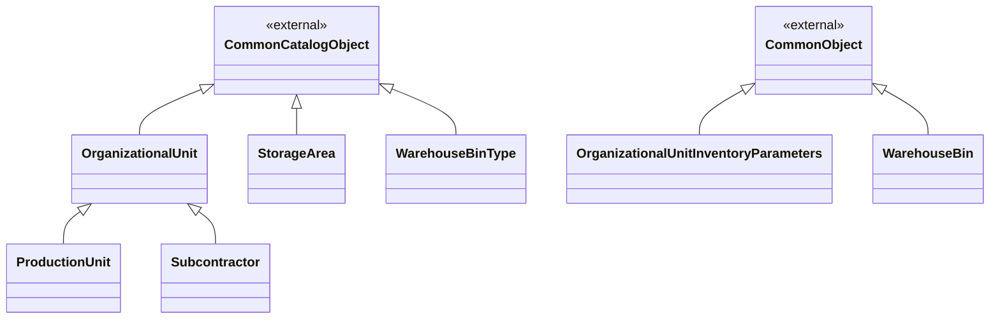
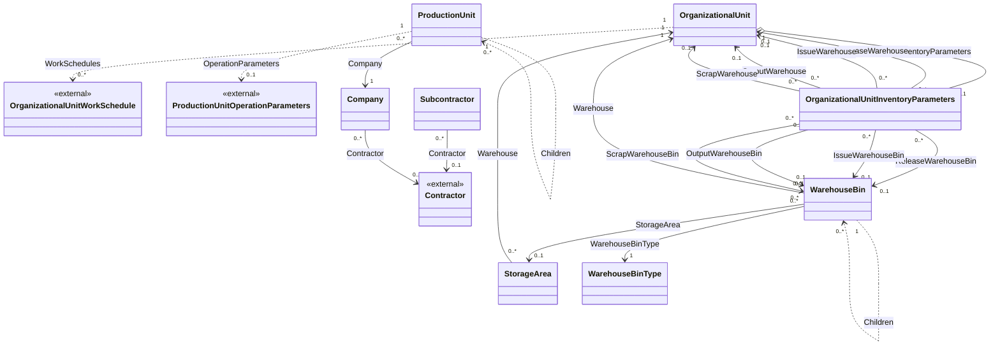

# Доменная модель - 03 Производственная структура

## 1. Назначение модели

Документ фиксирует целевую доменную модель модуля `03 Plant Structure`: объекты, русские названия, базовые типы, поля, типы, обязательность, связи и системные enum.

Модель основана на:

- требованиях `REQ-03-B-001..005`, `REQ-03-C1-001`, `LIM-03-O-001..002`;
- терминах `TERM-002..010`;
- исходном проектном решении по производственной структуре;
- структуре `DMP_DATA`;
- документации `00 Common`, `01 General Master Data` и платформы;
- решениях, зафиксированных в `_working/decision_log.md` и `90_traceability_pr03.md`.

`02_domain_model.md` является основным местом, где объект описан как доменная сущность. Runtime-представление, источники выбора ссылок, вычисление представления, обработчики и коллекции Object Runtime описываются в `03_object_runtime_model.md`. UI-формы описываются в `06_ui_views.md`, правила проверки - в `05_rules.md`, жизненный цикл - в `04_workflows.md`.

## 2. Общие решения модели

Объекты модуля строятся на базовых типах Common.

`CommonCatalogObject` используется для объектов, у которых `Code` и `Name` являются частью бизнес-идентификации.

`CommonObject` используется для зависимых объектов и объектов без обязательной пары `Code` / `Name`.

Поля `Id`, `ExternalId`, поля аудита, архивирования и мягкого удаления наследуются из Common и в таблицах ниже не повторяются.

Все объекты, которыми владеет модуль, имеют `TenantId`. Для зависимых объектов `TenantId` совпадает с `TenantId` владельца и не редактируется отдельно.

`Presentation` не является физическим полем модели модуля. Представление объекта задается правилом Object Runtime.

`Status` из исходного проектного решения и `DMP_DATA` не переносится как универсальное поле объектов модуля. Жизненный цикл для `OrganizationalUnit`, `ProductionUnit` и `Subcontractor` описывается в `04_workflows.md`.

`OrganizationalUnit`, `ProductionUnit` и `Subcontractor` используют одну физическую таблицу `OrganizationalUnit`. Разделение конкретных типов выполняется через дискриминатор `UnitKind`. `OrganizationalUnit` является абстрактным, но полноценным объектным типом для ссылок, Object Runtime и baseline.

### 2.1 Схема типов и наследования

Поля базового типа `OrganizationalUnit` не повторяются у `ProductionUnit` и
`Subcontractor`; наследники добавляют только собственные поля и коллекции.

### 2.2 Схема связей и коллекций

Обратные коллекции графиков являются внешней навигацией: записи принадлежат
модулю управления ресурсами и не хранятся в модуле 03.

## 3. Системные перечисления модуля

### 3.1 ProductionUnitType

Тип производственной единицы.

| Код | Значение | Русское название |
|---|---:|---|
| `Enterprise` | 0 | Предприятие |
| `Site` | 1 | Площадка |
| `Department` | 2 | Подразделение |
| `Shopfloor` | 3 | Цех |
| `ShopfloorArea` | 4 | Производственный участок |
| `Warehouse` | 5 | Склад |
| `RepairService` | 6 | Ремонтная служба |
| `Other` | 9 | Другое |

Этот набор значений является окончательным для v1. Дополнительные типы из терминологии требований не получают отдельных стабильных кодов: выбирается подходящее существующее значение, а при его отсутствии — `Other`.

### 3.2 OrganizationalUnitKind

Дискриминатор конкретного типа организационной единицы.

| Код | Русское название |
|---|---|
| `ProductionUnit` | Производственная единица |
| `Subcontractor` | Субподрядчик |

### 3.3 InventoryLocationControlType

Тип контроля учетного разреза на месте хранения.

| Код | Значение | Русское название |
|---|---:|---|
| `None` | 0 | Нет |
| `Enable` | 1 | Разрешено |
| `Mandatory` | 2 | Обязательно |

### 3.4 WIPSegmentStage

Флаговый SystemEnum стадий незавершенного производства. Значения могут комбинироваться в одной числовой битовой маске.

| Код | Значение | Русское название |
|---|---:|---|
| `InQueue` | 1 | В очереди |
| `InProcessing` | 2 | В обработке |
| `ForTransfer` | 4 | К передаче |
| `Rejected` | 8 | Не принято |
| `Scrap` | 16 | Брак |

### 3.5 WIPActionTransferYieldType

Тип перемещения годной продукции при завершении производства.

| Код | Значение | Русское название |
|---|---:|---|
| `None` | 0 | Нет |
| `ToNextSegment` | 1 | На следующий передел |
| `ToWarehouse` | 2 | На место хранения |

### 3.6 WIPActionTransferRejectType

Тип перемещения отклоненной продукции при завершении производства.

| Код | Значение | Русское название |
|---|---:|---|
| `None` | 0 | Нет |
| `ToWarehouse` | 2 | На место хранения |

### 3.7 WIPActionTransferScrapType

Тип перемещения брака при завершении производства.

| Код | Значение | Русское название |
|---|---:|---|
| `None` | 0 | Нет |
| `ToWarehouse` | 2 | На место хранения |

## 4. Ключевые сущности

| Тип | Русское название | Базовый тип | Характер | Физическое хранение |
|---|---|---|---|---|
| `OrganizationalUnit` | Организационная единица | `CommonCatalogObject` | абстрактный | единая таблица `OrganizationalUnit` для типов организационных единиц |
| `ProductionUnit` | Производственная единица | `OrganizationalUnit` | самостоятельный | таблица `OrganizationalUnit` |
| `Subcontractor` | Субподрядчик | `OrganizationalUnit` | самостоятельный | таблица `OrganizationalUnit` |
| `Company` | Организация | `CommonCatalogObject` | самостоятельный | таблица `Company` |
| `OrganizationalUnitInventoryParameters` | Параметры места хранения | `CommonObject` | самостоятельный | таблица `OrganizationalUnitInventoryParameters` |
| `StorageArea` | Зона хранения | `CommonCatalogObject` | самостоятельный | таблица `StorageArea` |
| `WarehouseBinType` | Тип складской ячейки | `CommonCatalogObject` | самостоятельный | таблица `WarehouseBinType` |
| `WarehouseBin` | Складская ячейка | `CommonObject` | самостоятельный | таблица `WarehouseBin` |

## 5. Организационная структура

### 5.1 OrganizationalUnit

Логический абстрактный базовый тип для собственной производственной единицы и внешнего субподрядчика.

| Свойство | Значение |
|---|---|
| Русское название | Организационная единица |
| Базовый тип | `CommonCatalogObject` |
| Абстрактный | Да |
| Создание экземпляров | Запрещено напрямую |
| Конкретные типы | `ProductionUnit`, `Subcontractor` |
| Физическая таблица | `OrganizationalUnit` |

Поля:

| Поле | Русское название | Тип | Обяз. | Назначение |
|---|---|---|---|---|
| `UnitKind` | Вид организационной единицы | `OrganizationalUnitKind` | да | Дискриминатор конкретного типа записи. Не редактируется пользователем. |
| `Code` | Код | `String(30)` | да | Код организационной единицы. Обязателен по контракту `CommonCatalogObject`. |
| `Name` | Наименование | `String(250)` | да | Наименование организационной единицы. |
| `FullName` | Полное наименование | `String(500)` | нет | Полное наименование организационной единицы. |
| `IsSegmentLevel` | Уровень передела | `Boolean` | да | Признак, что организационная единица может отвечать за выполнение технологического передела. |
| `IsOperationLevel` | Уровень операций | `Boolean` | да | Признак, что организационная единица может отвечать за выполнение технологической операции. |
| `IsInventoryStorageLocation` | Место хранения | `Boolean` | да | Признак, что организационная единица является местом хранения. |
| `Description` | Описание | `String(max)` | нет | Подробное описание организационной единицы. |

Коллекции:

| Коллекция | Тип элемента | Кратность | Владение | Связующее поле или условие | Назначение |
|---|---|---|---|---|---|
| `OrganizationalUnit.InventoryParameters` | `OrganizationalUnitInventoryParameters` | `0..1` | `OrganizationalUnit` | `OrganizationalUnitInventoryParameters.OrganizationalUnit` | Зависимый объект 1:0..1; запись существует только для места хранения. |
| `OrganizationalUnit.WorkSchedules` | `OrganizationalUnitWorkSchedule` | `0..*` | `Модуль управления ресурсами` | `OrganizationalUnitWorkSchedule.OrganizationalUnit` | Обратная межмодульная навигация к назначениям графиков для `ProductionUnit` и `Subcontractor`. Коллекция не создает владение, физическое поле или таблицу в модуле 03. |

### 5.2 ProductionUnit

Собственная организационная единица предприятия.

| Свойство | Значение |
|---|---|
| Русское название | Производственная единица |
| Базовый тип | `OrganizationalUnit` |
| Абстрактный | Нет |
| Физическая таблица | `OrganizationalUnit` |
| Значение `UnitKind` | `ProductionUnit` |

Поля:

| Поле | Русское название | Тип | Обяз. | Назначение |
|---|---|---|---|---|
| `Main` | Главная | `ProductionUnit` | да | Ссылка на корневую производственную единицу типа `Enterprise` в дереве. Рассчитывается системой. |
| `Parent` | Вышестоящая | `ProductionUnit` | нет | Вышестоящая производственная единица. Для корневого `Enterprise` значение отсутствует. |
| `Level` | Уровень иерархии | `Int32` | да | Служебное физическое поле hierarchy capability. Для корня равно `0`, рассчитывается системой. |
| `Path` | Путь иерархии | `String` | да | Служебное физическое поле materialized path. Рассчитывается системой. |
| `Company` | Организация | `Company` | нет | Балансовая организация, к которой относится производственная единица. |
| `Type` | Тип | `ProductionUnitType` | да | Тип производственной единицы. |

Особенности:

- в одном `Tenant` допускается несколько корневых `ProductionUnit` типа `Enterprise`;
- `Type = Enterprise` допускается только для корневой производственной единицы;
- для остальных значений `ProductionUnitType` допускаются произвольные сочетания родительского и дочернего типов; матрица допустимых пар в v1 не вводится;
- `Type = Site` используется для площадки производственной структуры;
- `Main`, `Level` и `Path` являются физическими полями, которые заполняет и пересчитывает hierarchy capability Object Runtime;
- `HasChildren` является виртуальным вычисляемым полем Object Runtime и физически не хранится;
- `Main` не редактируется пользователем и заполняется hierarchy capability Object Runtime.

Коллекции:

| Коллекция | Тип элемента | Кратность | Владение | Связующее поле или условие | Назначение |
|---|---|---|---|---|---|
| `ProductionUnit.OperationParameters` | `ProductionUnitOperationParameters` | `0..1` | `Модуль управления ресурсами` | `ProductionUnitOperationParameters.ProductionUnit` | Обратная межмодульная навигация к параметрам операций. Запись принадлежит модулю управления ресурсами; модуль 03 не создает, не изменяет и не удаляет ее. |
| `ProductionUnit.Children` | `ProductionUnit` | `0..*` | обратная навигация | `ProductionUnit.Parent` | Дочерние производственные единицы. |

### 5.3 Subcontractor

Внешняя организационная единица, участвующая в производственной структуре.

| Свойство | Значение |
|---|---|
| Русское название | Субподрядчик |
| Базовый тип | `OrganizationalUnit` |
| Абстрактный | Нет |
| Физическая таблица | `OrganizationalUnit` |
| Значение `UnitKind` | `Subcontractor` |

Поля:

| Поле | Русское название | Тип | Обяз. | Назначение |
|---|---|---|---|---|
| `Contractor` | Контрагент | `Contractor` | нет | Внешняя ссылка на контрагента из `01_general_master_data`, если субподрядчик представлен контрагентом. |

## 6. Организации

### 6.1 Company

Балансовая организация, используемая производственной структурой и смежными модулями для аналитики, интеграций и учета.

| Свойство | Значение |
|---|---|
| Русское название | Организация |
| Базовый тип | `CommonCatalogObject` |
| Физическая таблица | `Company` |

Поля:

| Поле | Русское название | Тип | Обяз. | Назначение |
|---|---|---|---|---|
| `Code` | Код | `String(30)` | да | Код организации. Обязателен по контракту `CommonCatalogObject`. |
| `Name` | Наименование | `String(250)` | да | Наименование организации. |
| `Contractor` | Контрагент | `Contractor` | нет | Внешняя ссылка на контрагента из `01_general_master_data`, если организация представлена контрагентом. |

`Company` не является `Tenant`, платформенным `Site`, `ProductionUnit` или `Contractor`.

## 7. Места хранения и складские ячейки

### 7.1 OrganizationalUnitInventoryParameters

Зависимый объект параметров места хранения.

| Свойство | Значение |
|---|---|
| Русское название | Параметры места хранения |
| Базовый тип | `CommonObject` |
| Владелец | `OrganizationalUnit` |
| Кардинальность | `OrganizationalUnit` 1:0..1 `OrganizationalUnitInventoryParameters` |
| Условие существования | `OrganizationalUnit.IsInventoryStorageLocation = true` |
| Физическая таблица | `OrganizationalUnitInventoryParameters` |

Поля:

| Поле | Русское название | Тип | Обяз. | Назначение |
|---|---|---|---|---|
| `OrganizationalUnit` | Организационная единица | `OrganizationalUnit` | да | Владелец параметров хранения. Заполняется автоматически при создании записи. |
| `IsCalculateInventoryStock` | Расчет остатков | `Boolean` | да | Признак расчета итогов по запасам в данном месте хранения. Значение по умолчанию: `true`. |
| `MaterialResponsibleControlType` | Учет по МОЛ | `InventoryLocationControlType` | да | Правило контроля учета по материально ответственному лицу при движении запасов. Значение по умолчанию: `None` («Нет»). |
| `WarehouseBinControlType` | Учет по ячейкам хранения | `InventoryLocationControlType` | да | Правило контроля учета по складским ячейкам при движении запасов. Значение по умолчанию: `None` («Нет»). |
| `TransportUnitControlType` | Учет по единицам транспортировки | `InventoryLocationControlType` | да | Правило контроля учета по единицам транспортировки при движении запасов. Значение по умолчанию: `None` («Нет»). |
| `PickingOrder` | Порядок отбора | `Int` | да | Порядок отбора запасов с места хранения относительно других мест хранения. Значение по умолчанию: `0`. |
| `InventoryStatus` | Статус запаса | `Guid?` | нет | Физическая колонка `InventoryStatusId`, зарезервированная для будущей ссылки на `InventoryStatus`. В Object Runtime и UI v1 не публикуется. |
| `WIPSerialNumbersControlStage` | Стадия контроля серийных номеров в производстве | `WIPSegmentStage` | нет | Стадия, на которой должны контролироваться серийные номера в производстве. |
| `SegmentStageUsage` | Стадии НЗП | `WIPSegmentStage` (flags) | да | Скалярная битовая маска стадий незавершенного производства, допустимых для организационной единицы. Значение по умолчанию: `InQueue` (`1`). |
| `ReleaseWarehouse` | МХ отпуска | `OrganizationalUnit` | нет | Основное место хранения отпуска. |
| `ReleaseWarehouseBin` | Ячейка отпуска | `WarehouseBin` | нет | Основная складская ячейка отпуска. |
| `IssueWarehouse` | МХ списания | `OrganizationalUnit` | нет | Основное место хранения списания. |
| `IssueWarehouseBin` | Ячейка списания | `WarehouseBin` | нет | Основная складская ячейка списания. |
| `OutputWarehouse` | МХ выпуска | `OrganizationalUnit` | нет | Основное место хранения продукции, выпущенной организационной единицей. |
| `OutputWarehouseBin` | Ячейка выпуска | `WarehouseBin` | нет | Основная ячейка хранения продукции, выпущенной организационной единицей. |
| `ScrapWarehouse` | МХ брака | `OrganizationalUnit` | нет | Основное место хранения брака и несоответствующей продукции. |
| `ScrapWarehouseBin` | Ячейка брака | `WarehouseBin` | нет | Основная ячейка хранения брака и несоответствующей продукции. |
| `TransferYieldDefaultType` | Переместить годные | `WIPActionTransferYieldType` | да | Тип перемещения по умолчанию для годной продукции при завершении производства. Значение по умолчанию: `None` («Нет»). |
| `TransferRejectDefaultType` | Переместить отклоненные | `WIPActionTransferRejectType` | да | Тип перемещения по умолчанию для отклоненной продукции при завершении производства. Значение по умолчанию: `None` («Нет»). |
| `TransferScrapDefaultType` | Переместить брак | `WIPActionTransferScrapType` | да | Тип перемещения по умолчанию для бракованной продукции при завершении производства. Значение по умолчанию: `None` («Нет»). |
| `TransferYieldDefaultStatus` | Статус годных | `Guid?` | нет | Физическая колонка `TransferYieldDefaultStatusId`, зарезервированная для будущей ссылки на `InventoryStatus`. В Object Runtime и UI v1 не публикуется. |
| `TransferRejectDefaultStatus` | Статус отклоненных | `Guid?` | нет | Физическая колонка `TransferRejectDefaultStatusId`, зарезервированная для будущей ссылки на `InventoryStatus`. В Object Runtime и UI v1 не публикуется. |
| `TransferScrapDefaultStatus` | Статус брака | `Guid?` | нет | Физическая колонка `TransferScrapDefaultStatusId`, зарезервированная для будущей ссылки на `InventoryStatus`. В Object Runtime и UI v1 не публикуется. |

Примечания к типам:

- `InventoryLocationControlType` переиспользуется из `01_general_master_data` и не регистрируется повторно в baseline ПР03. Используются существующие значения `None = 0`, `Enable = 1`, `Mandatory = 2`.
- Остальные enum-типы, используемые полями `OrganizationalUnitInventoryParameters`, фиксируются как системные enum ПР03.
- `InventoryStatus` является будущим внешним объектом модуля производственной логистики. До появления его стабильного контракта пять status-колонок хранятся как nullable GUID без внешнего ключа, Object Runtime reference member, lookup и проверки существования значения.
- В модуле не вводятся собственные `ValueSet` для этих полей.

`OrganizationalUnitInventoryParameters` не архивируется и не удаляется самостоятельной пользовательской операцией. При изменении `OrganizationalUnit.IsInventoryStorageLocation` с `true` на `false` зависимая запись физически удаляется в той же транзакции; при повторном включении места хранения создается новая запись с начальными значениями.

Ограничения:

- `PickingOrder >= 0`.
- `WIPSerialNumbersControlStage`, если заполнено, принимает одно из значений: `InQueue`, `InProcessing`, `ForTransfer`.
- В `SegmentStageUsage` всегда установлен флаг `InQueue`: `(SegmentStageUsage & InQueue) = InQueue`.
- Если `WIPSerialNumbersControlStage` заполнено, соответствующий флаг установлен в `SegmentStageUsage`.
- `ScrapWarehouse`, `ScrapWarehouseBin`, `WIPSerialNumbersControlStage`, `SegmentStageUsage`, `TransferYieldDefaultType`, `TransferRejectDefaultType` и `TransferScrapDefaultType` редактируются только для организационной единицы с `IsSegmentLevel = true`.
- Поля `*Warehouse` выбирают только `OrganizationalUnit` с `IsInventoryStorageLocation = true`.
- Для любой пары `*Warehouse` / `*WarehouseBin` выбор ячейки доступен только после выбора соответствующего места хранения. Если `*WarehouseBin` заполнено, поле `*Warehouse` обязательно, а выбранная ячейка должна относиться к этому месту хранения.

В v1 остальные поля `OrganizationalUnitInventoryParameters` редактируются независимо друг от друга. В частности, значения `TransferYieldDefaultType`, `TransferRejectDefaultType` и `TransferScrapDefaultType` не делают поля мест хранения или другие настройки обязательными и не приводят к их автоматической очистке. Содержательную корректность сочетания настроек контролирует пользователь. Дополнительные условные зависимости будут определены на последующих этапах; явно перечисленные выше ограничения и правила `PS-IP-*` сохраняют силу.

### 7.2 StorageArea

Зона хранения внутри места хранения.

| Свойство | Значение |
|---|---|
| Русское название | Зона хранения |
| Базовый тип | `CommonCatalogObject` |
| Физическая таблица | `StorageArea` |

Поля:

| Поле | Русское название | Тип | Обяз. | Назначение |
|---|---|---|---|---|
| `Warehouse` | Склад | `OrganizationalUnit` | да | Место хранения, к которому относится зона хранения. |
| `Code` | Код | `String(30)` | да | Код зоны хранения. Обязателен по контракту `CommonCatalogObject`. |
| `Name` | Наименование | `String(250)` | да | Наименование зоны хранения. |

### 7.3 WarehouseBinType

Тип складской ячейки.

| Свойство | Значение |
|---|---|
| Русское название | Тип складской ячейки |
| Базовый тип | `CommonCatalogObject` |
| Физическая таблица | `WarehouseBinType` |

Поля:

| Поле | Русское название | Тип | Обяз. | Назначение |
|---|---|---|---|---|
| `Code` | Код | `String(30)` | да | Код типа складской ячейки. Обязателен по контракту `CommonCatalogObject`. |
| `Name` | Наименование | `String(250)` | да | Наименование типа складской ячейки. |

### 7.4 WarehouseBin

Складская ячейка внутри места хранения. Каждая запись является самостоятельным местом размещения запаса независимо от положения в иерархии.

| Свойство | Значение |
|---|---|
| Русское название | Складская ячейка |
| Базовый тип | `CommonObject` |
| Физическая таблица | `WarehouseBin` |

Поля:

| Поле | Русское название | Тип | Обяз. | Назначение |
|---|---|---|---|---|
| `Warehouse` | Склад | `OrganizationalUnit` | да | Место хранения, к которому относится складская ячейка. |
| `WarehouseBinType` | Тип складской ячейки | `WarehouseBinType` | да | Тип складской ячейки. |
| `StorageArea` | Зона хранения | `StorageArea` | нет | Зона хранения, к которой относится складская ячейка. |
| `Parent` | Вышестоящая | `WarehouseBin` | нет | Вышестоящая складская ячейка. |
| `Root` | Корневая ячейка | `WarehouseBin` | да | Служебная ссылка на корень дерева складских ячеек. Рассчитывается системой. |
| `Level` | Уровень иерархии | `Int32` | да | Служебное физическое поле hierarchy capability. Для корня равно `0`, рассчитывается системой. |
| `Path` | Путь иерархии | `String` | да | Служебное физическое поле materialized path. Рассчитывается системой. |
| `Identification` | Обозначение | `String(250)` | да | Обозначение складской ячейки. |
| `InventoryStatus` | Статус запаса | `Guid?` | нет | Физическая колонка `InventoryStatusId`, зарезервированная для будущей ссылки на `InventoryStatus`. В Object Runtime и UI v1 не публикуется. |

Коллекции:

| Коллекция | Тип элемента | Кратность | Владение | Связующее поле или условие | Назначение |
|---|---|---|---|---|---|
| `WarehouseBin.Children` | `WarehouseBin` | `0..*` | обратная навигация | `WarehouseBin.Parent` | Дочерние складские ячейки. |

Ограничения:

- `Warehouse` выбирает только `OrganizationalUnit` с `IsInventoryStorageLocation = true`.
- `StorageArea`, если заполнена, относится к тому же `Warehouse`.
- `Parent`, если заполнен, относится к тому же `Warehouse`.
- Иерархия `Parent` не содержит циклов.
- Наличие дочерних ячеек не запрещает размещение запаса в текущей ячейке: как листовые, так и родительские `WarehouseBin` являются допустимыми местами размещения.
- `Parent` задает иерархическое расположение или группировку самостоятельных ячеек и не означает, что родитель является только техническим узлом без собственного запаса.
- `Root`, `Level` и `Path` являются физическими полями, которые заполняет и пересчитывает hierarchy capability Object Runtime.
- `HasChildren` является виртуальным вычисляемым полем Object Runtime и физически не хранится.

## 8. Граница с внешними объектами

| Ссылка | Владелец целевого объекта | Используется в полях |
|---|---|---|
| `Contractor` | `01_general_master_data` | `Company.Contractor`, `Subcontractor.Contractor` |
| `InventoryStatus` | Будущий модуль производственной логистики | Пять nullable GUID-колонок зарезервированы в физической модели; runtime-ссылки активируются после появления стабильного контракта целевого объекта. |
| Платформенный `Site` | Платформа | Связь с `ProductionUnit` типа `Site` описывается как платформенная интеграция, не как поле модуля. |

## 9. Отличия от исходного ПР и структуры данных

| Источник | Было | Целевое решение | Причина |
|---|---|---|---|
| ПР03 и `DMP_DATA` | Собственные и внешние организационные единицы описывались раздельно | Используется единый тип `OrganizationalUnit` с самостоятельными типами `ProductionUnit` и `Subcontractor` | Нужна единая ссылочная точка для объектов, которым может соответствовать любая организационная единица. |
| `DMP_DATA` | `PlantParameters` присутствует как общий объект настроек | Не входит во владение модуля 03 | Настройки принадлежат модулям, использующим их предметную семантику. |
| ПР03 и межмодульное решение | Параметры операций могли рассматриваться как часть производственной структуры | `ProductionUnitOperationParameters` принадлежат модулю 04; 03 предоставляет только `ProductionUnit` как внешний объект | Владение параметрами ресурсов закреплено за модулем управления ресурсами. |
| ПР04 и межмодульное решение | Графики организационных единиц представлены отдельными исходными типами | `OrganizationalUnitWorkSchedule` принадлежит модулю 04; в 03 допускается только внешняя навигация | Назначения графиков и их изменение принадлежат модулю управления ресурсами. |
| `DMP_DATA` | `InventoryStatus` мог выглядеть полем локального справочника | Зарезервирована будущая внешняя ссылка на статус запасов; в v1 публикуются только nullable GUID-колонки | Статус запасов не является объектом владения производственной структуры, а его стабильный runtime-контракт пока отсутствует. |
| Платформа | `Plant` использовался как старый термин | Используется `Site / Площадка` как платформенный контекст | Термин синхронизируется с платформенной моделью. |

## История изменений

| Версия | Дата и время | Автор | Раздел | Изменение | Коммит/PR |
|---|---|---|---|---|---|
| 1.2 | 2026-09-02 11:50 +03:00 | Олег Юрьев (@axelprosoft) | Назначение модели; Общие решения модели; 1 Схема типов и наследования; 2 Схема связей и коллекций; ProductionUnitType; 1 ProductionUnitType; OrganizationalUnitKind; 2 OrganizationalUnitKind; InventoryLocationControlType; 3 InventoryLocationControlType; WIPSegmentStage; 4 WIPSegmentStage; WIPActionTransferYieldType; 5 WIPActionTransferYieldType; WIPActionTransferRejectType; 6 WIPActionTransferRejectType; WIPActionTransferScrapType; 7 WIPActionTransferScrapType; Ключевые сущности; OrganizationalUnit; 1 OrganizationalUnit; ProductionUnit; 2 ProductionUnit; Subcontractor; 3 Subcontractor; Company; 1 Company; OrganizationalUnitInventoryParameters; 1 OrganizationalUnitInventoryParameters; StorageArea; 2 StorageArea; WarehouseBinType; 3 WarehouseBinType; WarehouseBin; 4 WarehouseBin; Внешние ссылки; Граница с внешними объектами; Отличия от исходного ПР и структуры данных | мелкие структурные правки в основном доменной модели и связей модулей без изменения содержания | [4cbd3069](https://github.com/axelprosoft/DMP.PlatformFoundation/commit/4cbd3069ec4a3421adbad1f0c9801b00f28405d7) |
| 1.1 | 2026-09-01 14:08 +04:00 | A-Zhigalin (@A-Zhigalin) | ProductionUnitType; InventoryLocationControlType; WIPSegmentStage; OrganizationalUnit; ProductionUnit; Company; OrganizationalUnitInventoryParameters; StorageArea; WarehouseBinType; WarehouseBin; Внешние ссылки | Производственная структура. Этапы 1, 2 беклога (Организации и типы складских ячеек) | [c9b5d21b](https://github.com/axelprosoft/DMP.PlatformFoundation/commit/c9b5d21bc7d4d4de229432012e4efb06f02973ff) |
| 1.0 | 2026-08-19 17:22 +03:00 | Воронкова Вероника (@VeronikaV2121) | YAML-шапка: review_status, status | feat(docs): automate PR lifecycle approval | [3a2710e5](https://github.com/axelprosoft/DMP.PlatformFoundation/commit/3a2710e5d46a57a3074b89360c0f0b2a4e84cf52) |
| 0.1 | 2026-08-14 12:39 +03:00 | axelprosoft (@axelprosoft) | Содержание документа | Создание документа | [abbdee0a](https://github.com/axelprosoft/DMP.PlatformFoundation/commit/abbdee0a5a61f2bb2fa49cfafd1858b7100cbd8a) |
