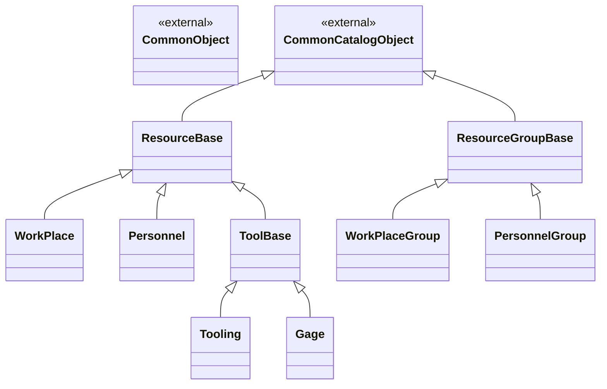
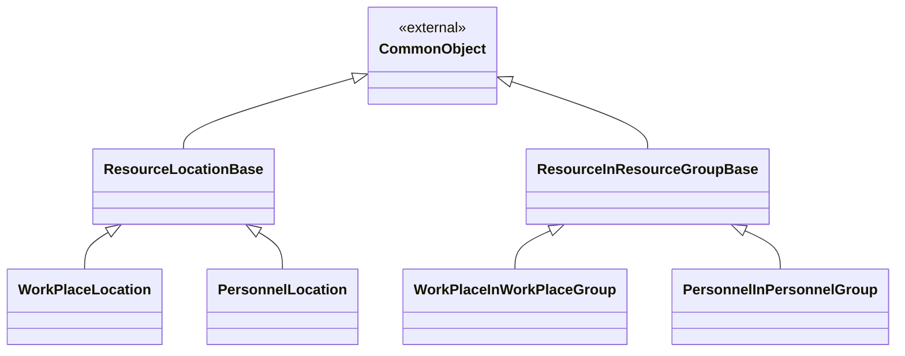
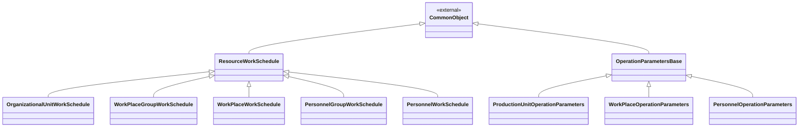
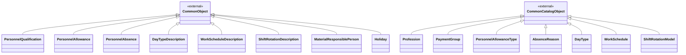
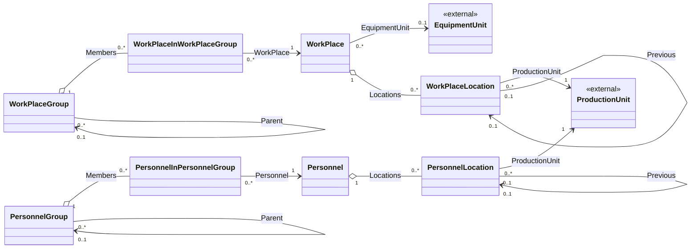
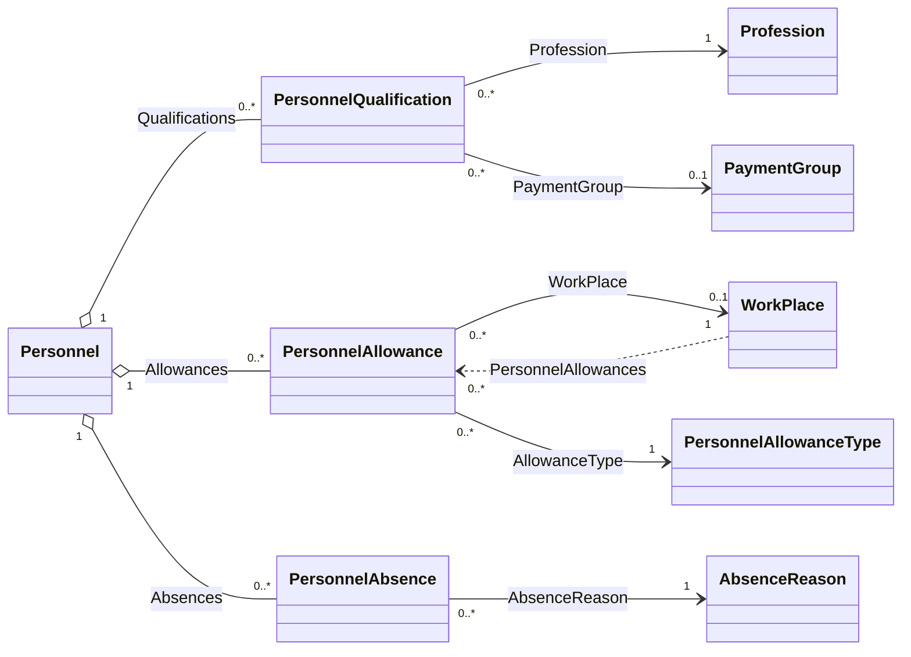
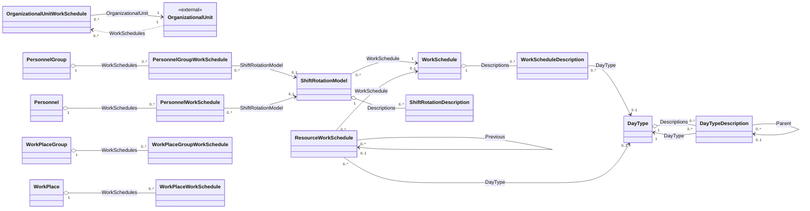
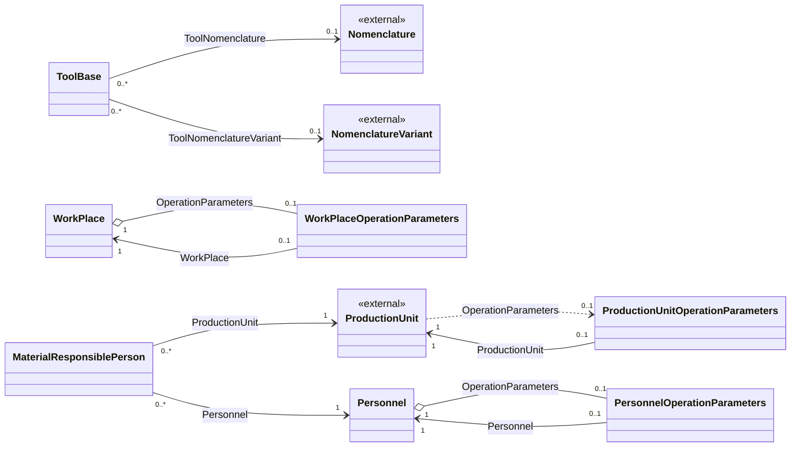

# Доменная модель - 04 Управление ресурсами

## 1. Назначение документа

Документ описывает целевую доменную модель модуля управления ресурсами: принадлежащие модулю самостоятельные объекты, логические базовые типы, поля, ссылки, коллекции и системные перечисления.

Модель основана на исходном проектном решении, структуре `DMP_DATA`, принятых решениях в рабочем журнале модуля и соглашениях [Common](../00_common/02_domain_model.md), [GMD](../01_general_master_data/02_domain_model.md) и платформы.

Фактическое движение ресурсов, их производственная эксплуатация, автоматический подбор и фактическое назначение на операции в модель не входят.

## 2. Общие решения модели

### 2.1 Общие поля и базовые типы

Прикладные типы наследуются от `CommonObject` или `CommonCatalogObject` по правилам Common. Поля идентификатора, аудита, архивирования, мягкого удаления и внешнего идентификатора не повторяются в описании каждого типа.

Все объекты, которыми владеет модуль, имеют обязательный `TenantId`. Для зависимых, связующих и дочерних объектов `TenantId` совпадает с `TenantId` владельца и не редактируется отдельно. Значение tenant определяется контекстом запроса и проверяется при каждой ссылке между объектами.

| Поле | Русское название | Тип | Обяз. | Правило |
|---|---|---|---:|---|
| `TenantId` | Область владения | Guid | да | Для корневого объекта задается контекстом tenant; для зависимого объекта наследуется от владельца и не изменяется отдельно. |

`Presentation` является вычисляемым представлением Object Runtime. Это не самостоятельное прикладное поле, которое пользователь поддерживает вручную.

Статус и workflow применяются только к самостоятельным объектам, для которых действительно требуется жизненный цикл. Логические базовые типы не являются самостоятельными карточками и не получают собственных прав или общего источника выбора (lookup). Исключение - `ToolBase`: на него существует реальная полиморфная ссылка, поэтому для него предусмотрен объединенный lookup.

### 2.2 Поля базовых типов и наследников

Поля, объявленные в базовом типе, перечисляются один раз в его разделе. В описании наследника перечисляются только его собственные поля и ссылки. Полный набор полей самостоятельного объекта складывается из Common, логических базовых типов и самого объекта.

`TenantId` является сквозным обязательным полем области данных и описывается общим правилом выше, а не повторяется в каждой таблице полей. `Id`, `ExternalId`, аудит, архивирование и мягкое удаление наследуются из Common и также не повторяются.

### 2.3 Как читать описание типа

Для каждого типа в документе используется одинаковая схема:

- **Базовый тип** - тип, от которого наследуется данный тип. Если указано `нет`, тип является корневым для описываемой иерархии.
- **Абстрактный: да** - экземпляры этого типа не создаются. Записи создаются только в указанных наследниках.
- **Абстрактный: нет** - это самостоятельный тип, экземпляры которого можно создавать.
- **Физическая таблица** - таблица, в которой хранятся записи самостоятельного типа.
- Таблица **Поля** содержит только поля, объявленные в текущем типе. Унаследованные поля уже описаны в базовом типе или в Common.

Логическое наследование не означает, что для абстрактного базового типа создается
отдельная запись. Поле базового типа входит в логический и runtime-контракт
каждого самостоятельного наследника, а физически хранится в таблице этого
наследника, если для иерархии не принято общее хранилище. Для поля со значением
`тот же тип` тип ссылки раскрывается относительно конкретного наследника.
Например, `Parent` в `ResourceGroupBase` означает `WorkPlaceGroup.Parent ->
WorkPlaceGroup` и `PersonnelGroup.Parent -> PersonnelGroup`, а не ссылку на
`ResourceGroupBase`.

Например, `Personnel` получает `Code` и `Name` из `CommonCatalogObject`, технические поля из `CommonObject`, `Description` из `ResourceBase`, а `Number`, `LastName` и другие поля персонала объявляются в самом `Personnel`. Отдельная запись `ResourceBase` при этом не создается.

### 2.4 Логическое наследование и физическое хранение

Логическое наследование используется для общих полей, правил, контрактов и навигации. Общее физическое хранилище вводится только для подтвержденной полиморфной ссылки; остальные базовые типы остаются логическими.

| Логический тип | Наследники | Физическое решение |
|---|---|---|
| `ResourceBase` | `WorkPlace`, `Personnel`, `ToolBase` | Отдельная родительская таблица не создается; общие поля входят в контракты самостоятельных типов. Общего lookup `Resource` не создается. |
| `ResourceGroupBase` | `WorkPlaceGroup`, `PersonnelGroup` | Отдельная родительская таблица не создается; общие поля входят в контракты конкретных групп. |
| `ResourceInResourceGroupBase` | `WorkPlaceInWorkPlaceGroup`, `PersonnelInPersonnelGroup` | Отдельная родительская таблица не создается; элементы хранятся в собственных таблицах связей. |
| `ResourceLocationBase` | `WorkPlaceLocation`, `PersonnelLocation` | Отдельная родительская таблица не создается; общие поля входят в контракты конкретных местоположений. |
| `ResourceWorkSchedule` | `OrganizationalUnitWorkSchedule` и четыре типа назначений ресурсов | Отдельная родительская таблица и общий lookup не создаются; назначения хранятся в таблицах по типу владельца. Для организационных единиц используется одна таблица `OrganizationalUnitWorkSchedule`. |
| `OperationParametersBase` | `ProductionUnitOperationParameters`, `WorkPlaceOperationParameters`, `PersonnelOperationParameters` | Базовый тип используется логически; конкретные типы хранят владельца и собственные поля. Отдельная таблица базового типа в целевой модели не фиксируется. |
| `ToolBase` | `Tooling`, `Gage` | В целевой модели используется единая таблица `ToolBase` с дискриминатором типа записи; объединенный lookup нужен из-за реальной полиморфной ссылки на `ToolBase`. |

`ToolBase` является исключением: он не имеет собственной пользовательской карточки, но имеет общее физическое хранилище и объединенный lookup для экземпляров `Tooling` и `Gage`. Тип записи и идентификатор сохраняются в результате lookup для открытия нужной карточки и проверки прав.

Логическая цепочка инструментов и оснастки: `ResourceBase` -> `ToolBase` -> `Tooling` или `Gage`. `ToolBase` используется как логический тип ссылки и общий lookup, но не как самостоятельная карточка.

### 2.5 Схема типов и наследования

Схемы показывают логическое наследование типов модуля 04 и необходимые
внешние типы Common. Стрелка `<|--` означает «наследуется от».
Внешний тип показывается только как контекст для типа модуля 04; отношения
между самими внешними типами в этом документе не воспроизводятся.
Физическое хранение, общий идентификатор и внешние ключи в эти схемы не
добавляются. Полный состав иерархии распределен по нескольким схемам для
читаемости; вместе они покрывают все типы модуля.

#### 2.5.1 Ресурсы, группы и инструменты

#### 2.5.2 Местоположения и состав групп

#### 2.5.3 Графики и назначения

#### 2.5.4 Календари, персонал и зависимые записи

### 2.6 Схема связей и коллекций

Схемы в совокупности показывают все сохраненные ссылки и коллекции, описанные
в таблицах объектов. `o--` означает коллекцию с владением данными, `-->` - обычную
ссылку, `..>` - обратную навигацию или внешнюю зависимость без владения.
Вычисляемые свойства (`CurrentLocation`, `BasicQualification` и подобные)
связями не считаются и на схемах не показываются. Режим коллекции Object
Runtime указывается только в `03_object_runtime_model.md`. Входящие ссылки,
которыми владеет другой модуль, фиксируются в разделе внешних связей и в его
собственном контракте Object Runtime; в схему 04 они не добавляются как ссылки,
принадлежащие модулю 04.

Связь владельца с принадлежащей коллекцией показывается одной композицией;
ссылочное поле элемента на этого владельца отдельно не дублируется. Для
внешнего владельца допускаются две стрелки: ссылка элемента на внешний объект
и обратная навигация владельца к записи модуля 04.

Эти схемы являются постоянной частью нормативной доменной модели. Документ
`03_object_runtime_model.md` их не заменяет и не переносит к себе: он ссылается
на те же типы и коллекции и дополнительно описывает их публикацию через Object
Runtime, режимы коллекций, lookup и доступные операции.

#### 2.6.1 Ресурсы, группы и местоположения

#### 2.6.2 Персонал, квалификации, допуски и отсутствие

#### 2.6.3 Графики, календари и назначения

#### 2.6.4 Инструменты, параметры операций и МОЛ

В схемах не перечисляются поля, не являющиеся ссылками, системные enum и
вычисляемые свойства. Обратная стрелка к внешнему владельцу не означает
передачу владения данными: например, `OrganizationalUnit.WorkSchedules` и
`ProductionUnit.OperationParameters` являются навигацией к записям модуля 04.

### 2.7 Общие правила ссылок и периодов

- Ссылка на логический базовый тип допускается только там, где она является реальной полиморфной ссылкой. В модуле составов и технологий такой ссылкой является `ToolBase`.
- Ссылки на `WorkPlace`, `Personnel`, `WorkPlaceGroup` и `PersonnelGroup` остаются ссылками на соответствующие самостоятельные типы.
- Количество в нормативной строке является количеством потребности, а не количеством экземпляров записи ресурса. Правила количества и альтернативных наборов принадлежат модулю составов и технологий.
- `CurrentLocation` и `BasicQualification` являются вычисляемыми свойствами.
- Для периодических объектов `ValidFrom` включается в период, `ValidTo` является включительной границей; `ValidTo = null` означает открытый период в целевой модели, если это допускается конкретным типом.
- Производственное время хранится в локальном времени предприятия или площадки. UTC используется для технических временных меток и аудита.

## 3. Системные перечисления модуля

### 3.1 ResourceAllocationType

Определяет смысл состава группы ресурсов; модуль 02 учитывает этот признак
при формировании и подборе ресурсных норм.

| Код | Значение | Русское название |
|---:|---|---|
| 0 | `ResourceGroup` | Группа ресурсов |
| 1 | `AlternativeResources` | Альтернативные ресурсы |

### 3.2 ValidityPeriodUnit

Определяет единицу периода действия допуска.

| Код | Значение | Русское название |
|---:|---|---|
| 0 | `Day` | День |
| 1 | `Month` | Месяц |
| 2 | `Year` | Год |

### 3.3 WorkPlaceType

Определяет вид рабочего места.

| Код | Значение | Русское название |
|---:|---|---|
| 0 | `Equipment` | Технологическое оборудование |
| 1 | `WorkPlace` | Безстаночное рабочее место |
| 2 | `InspectionWorkPlace` | Рабочее место контроля качества |

### 3.4 HolidayType

Определяет вид праздничной или перенесенной даты в описании графика.

| Код | Значение | Русское название |
|---:|---|---|
| 0 | `Holiday` | Праздничный день |
| 1 | `BeforeHoliday` | Предпраздничный день |
| 2 | `TransferWeekend` | Перенесенный выходной день |

### 3.5 WorkScheduleType

Определяет способ задания графика работы.

| Код | Значение | Русское название |
|---:|---|---|
| 0 | `Year` | Годовой |
| 1 | `Week` | Недельный |
| 2 | `Cycle` | Циклический |

### 3.6 DayOfWeek

Определяет день недели для недельного и циклического описания графика.

| Код | Значение | Русское название |
|---:|---|---|
| 0 | `Monday` | Понедельник |
| 1 | `Tuesday` | Вторник |
| 2 | `Wednesday` | Среда |
| 3 | `Thursday` | Четверг |
| 4 | `Friday` | Пятница |
| 5 | `Saturday` | Суббота |
| 6 | `Sunday` | Воскресенье |

### 3.7 ShiftPeriodType

Определяет вид временного интервала внутри смены.

| Код | Значение | Русское название |
|---:|---|---|
| 0 | `ShiftWorkingTime` | Рабочее время смены |
| 1 | `Break` | Регламентированный перерыв |

### 3.8 WorkScheduleAssignmentType

Определяет вид назначения графика работы.

| Код | Значение | Русское название |
|---:|---|---|
| 0 | `Permanent` | Постоянное назначение графика |
| 1 | `Temporary` | Временное назначение другого графика |
| 2 | `Change` | Временное изменение типа рабочего дня; для сотрудника или группы сотрудников также смены |

`AssignmentType` является сохраняемым признаком записи назначения, а не названием операции.

### 3.9 ShiftNumber

Определяет номер смены.

| Код | Значение | Русское название |
|---:|---|---|
| 1 | `Shift1` | Смена 1 |
| 2 | `Shift2` | Смена 2 |
| 3 | `Shift3` | Смена 3 |
| 4 | `Shift4` | Смена 4 |

## 4. Ресурсы и группы

### 4.1 ResourceBase

`ResourceBase` - это не самостоятельный объект и не отдельный вид ресурса. Это логический абстрактный тип, который объединяет общие свойства `WorkPlace`, `Personnel` и ветви инструментов и оснастки.

Самостоятельно создать объект `ResourceBase` нельзя. Отдельная таблица и общий lookup `ResourceBase` не создаются. Реальные объекты создаются только как `WorkPlace`, `Personnel`, `Tooling` или `Gage`.

| Свойство | Значение |
|---|---|
| Базовый тип | `CommonCatalogObject` |
| Абстрактный | Да |
| Наследники | `WorkPlace`, `Personnel`, `ToolBase` |
| Поля, добавляемые на этом уровне | `Description` |
| Физическое хранение | Отдельная таблица `ResourceBase` не создается; поля этого логического типа входят в контракты наследников и сохраняются по правилам их физического хранения |

`Code` и `Name` наследуются из `CommonCatalogObject` через `ResourceBase` и поэтому обязательны для всех самостоятельных типов этой ветви: `WorkPlace`, `Personnel`, `Tooling` и `Gage`. `Code` и `Name` не являются табельным номером и ФИО: это каталоговая идентификация ресурса. `Id`, `ExternalId`, аудит, архивирование и мягкое удаление наследуются из Common. `TenantId` является общим полем области данных и описан в разделе 2.

Поля, объявленные именно `ResourceBase`:

| Поле | Русское название | Тип | Обяз. | Назначение |
|---|---|---|---:|---|
| `Description` | Описание | String(max) | нет | Дополнительное описание. |

### 4.2 WorkPlace

Самостоятельный объект рабочего места. Связь с `EquipmentUnit` является внешней ссылкой и не создает рабочее место автоматически.

| Свойство | Значение |
|---|---|
| Базовый тип | `ResourceBase` |
| Абстрактный | Нет |
| Физическая таблица | `WorkPlace` |

| Поле | Русское название | Тип | Обяз. | Назначение |
|---|---|---|---:|---|
| `Acronym` | Аббревиатура | String(20) | нет | Краткое обозначение рабочего места. |
| `Type` | Тип рабочего места | `WorkPlaceType` | да | Вид рабочего места. По умолчанию `Equipment`. |
| `EquipmentSerialNumber` | Серийный номер оборудования | String(100) | нет | Идентификатор оборудования в данных рабочего места. |
| `ShopFloorNumber` | Цеховой номер | String(100) | нет | Внутренний номер рабочего места или оборудования. |
| `InventoryNumber` | Инвентарный номер | String(100) | нет | Инвентарный номер. |
| `ManufactureDate` | Дата изготовления | Date | нет | Дата изготовления связанного объекта. |
| `DeliveryDate` | Дата поставки | Date | нет | Дата поставки. |
| `ImplementationDate` | Дата ввода | Date | нет | Дата ввода в эксплуатацию. |
| `RetirementDate` | Дата списания | Date | нет | Дата списания, если применимо. |
| `EquipmentUnit` | Единица оборудования | `EquipmentUnit` | нет | Внешняя ссылка на объект оборудования. |
| `CurrentLocation` | Текущее основное место установки | `ProductionUnit` | нет | Вычисляется по действующему основному постоянному `WorkPlaceLocation`. |

Коллекции:

| Коллекция | Тип элемента | Кратность | Владение | Связующее поле или условие | Назначение |
|---|---|---|---|---|---|
| `WorkPlace.Locations` | `WorkPlaceLocation` | `0..*` | `WorkPlace` | ссылочное поле элемента на владельца | История и текущие места установки рабочего места. |
| `WorkPlace.WorkSchedules` | `WorkPlaceWorkSchedule` | `0..*` | `WorkPlace` | ссылочное поле элемента на владельца | Назначения графиков рабочему месту. |
| `WorkPlace.PersonnelAllowances` | `PersonnelAllowance` | `0..*` | `Personnel` | `PersonnelAllowance.WorkPlace` | Обратная навигация к допускам сотрудников, связанным с этим рабочим местом; рабочее место не является владельцем допуска. |

Одиночный зависимый объект:

| Объект | Тип | Кратность | Владелец | Связующее поле | Назначение |
|---|---|---|---|---|---|
| `WorkPlace.OperationParameters` | `WorkPlaceOperationParameters` | `0..1` | `WorkPlace` | ссылочное поле объекта на владельца | Собственные параметры операций рабочего места; для одного рабочего места допускается не более одной записи. |

### 4.3 Personnel

Самостоятельный объект сотрудника. Собственные поля сотрудника (`Number`, ФИО, даты приема и увольнения и другие) описаны ниже; они дополняют унаследованные поля.

| Свойство | Значение |
|---|---|
| Базовый тип | `ResourceBase` |
| Абстрактный | Нет |
| Физическая таблица | `Personnel` |

| Поле | Русское название | Тип | Обяз. | Назначение |
|---|---|---|---:|---|
| `Number` | Табельный номер | String(50) | да | Табельный номер сотрудника. |
| `LastName` | Фамилия | String(50) | да | Фамилия сотрудника. |
| `FirstName` | Имя | String(50) | да | Имя сотрудника. |
| `Patronymic` | Отчество | String(50) | нет | Отчество сотрудника. |
| `DateOfBirth` | Дата рождения | Date | нет | Дата рождения. |
| `DateOfJoining` | Дата приема | Date | нет | Дата приема на работу. |
| `DateOfLeaving` | Дата увольнения | Date | нет | Дата увольнения. |
| `ConfirmationCode` | Код подтверждения | String(100) | нет | Код идентификации в производственном терминале. |
| `FullName` | ФИО | String(350) | нет | Вычисляется из фамилии, имени и отчества. |
| `BasicQualification` | Основная квалификация | `PersonnelQualification` | нет | Вычисляется по признаку `IsBasic`. |
| `CurrentLocation` | Текущее основное место работы | `ProductionUnit` | нет | Вычисляется по действующему основному постоянному `PersonnelLocation`. |

Коллекции:

| Коллекция | Тип элемента | Кратность | Владение | Связующее поле или условие | Назначение |
|---|---|---|---|---|---|
| `Personnel.Locations` | `PersonnelLocation` | `0..*` | `Personnel` | ссылочное поле элемента на владельца | История и текущие места работы сотрудника. |
| `Personnel.Qualifications` | `PersonnelQualification` | `0..*` | `Personnel` | ссылочное поле элемента на владельца | Квалификации сотрудника. |
| `Personnel.Allowances` | `PersonnelAllowance` | `0..*` | `Personnel` | ссылочное поле элемента на владельца | Допуски сотрудника. |
| `Personnel.Absences` | `PersonnelAbsence` | `0..*` | `Personnel` | ссылочное поле элемента на владельца | Периоды отсутствия сотрудника. |
| `Personnel.WorkSchedules` | `PersonnelWorkSchedule` | `0..*` | `Personnel` | ссылочное поле элемента на владельца | Назначения графиков сотруднику. |

Одиночный зависимый объект:

| Объект | Тип | Кратность | Владелец | Связующее поле | Назначение |
|---|---|---|---|---|---|
| `Personnel.OperationParameters` | `PersonnelOperationParameters` | `0..1` | `Personnel` | ссылочное поле объекта на владельца | Собственные параметры операций сотрудника; для одного сотрудника допускается не более одной записи. |

### 4.4 ResourceGroupBase

Логический абстрактный базовый тип групп ресурсов. Самостоятельная группа всегда создается как `WorkPlaceGroup` или `PersonnelGroup`.

| Свойство | Значение |
|---|---|
| Базовый тип | `CommonCatalogObject` |
| Абстрактный | Да |
| Наследники | `WorkPlaceGroup`, `PersonnelGroup` |
| Физическое хранение | Отдельная таблица `ResourceGroupBase` не создается; поля базового типа входят в таблицы групп |

| Поле | Русское название | Тип | Обяз. | Назначение |
|---|---|---|---:|---|
| `Description` | Описание | String(max) | нет | Описание группы. |
| `Parent` | Родительская группа | `WorkPlaceGroup` для `WorkPlaceGroup`; `PersonnelGroup` для `PersonnelGroup` | нет | Ссылка на родительскую группу того же самостоятельного типа. `ResourceGroupBase` не является целевым типом ссылки, записью или общей таблицей групп. |
| `AllocationType` | Тип распределения | `ResourceAllocationType` | да | Назначение группы при подборе ресурсов. |

### 4.5 WorkPlaceGroup

Самостоятельный объект группы рабочих мест. Группа ограничивает набор рабочих мест, доступных для выбора в нормативной строке. Ее состав задается коллекцией `Members`.

| Свойство | Значение |
|---|---|
| Базовый тип | `ResourceGroupBase` |
| Абстрактный | Нет |
| Физическая таблица | `WorkPlaceGroup` |

Коллекции:

| Коллекция | Тип элемента | Кратность | Владение | Связующее поле или условие | Назначение |
|---|---|---|---|---|---|
| `WorkPlaceGroup.Members` | `WorkPlaceInWorkPlaceGroup` | `0..*` | `WorkPlaceGroup` | ссылочное поле элемента на владельца | Рабочие места, входящие в группу. |
| `WorkPlaceGroup.WorkSchedules` | `WorkPlaceGroupWorkSchedule` | `0..*` | `WorkPlaceGroup` | ссылочное поле элемента на владельца | Назначения графиков группе рабочих мест. |

### 4.6 PersonnelGroup

Самостоятельный объект группы сотрудников. Группа ограничивает набор сотрудников, доступных для выбора в нормативной строке. Ее состав задается коллекцией `Members`.

| Свойство | Значение |
|---|---|
| Базовый тип | `ResourceGroupBase` |
| Абстрактный | Нет |
| Физическая таблица | `PersonnelGroup` |

Коллекции:

| Коллекция | Тип элемента | Кратность | Владение | Связующее поле или условие | Назначение |
|---|---|---|---|---|---|
| `PersonnelGroup.Members` | `PersonnelInPersonnelGroup` | `0..*` | `PersonnelGroup` | ссылочное поле элемента на владельца | Сотрудники, входящие в группу. |
| `PersonnelGroup.WorkSchedules` | `PersonnelGroupWorkSchedule` | `0..*` | `PersonnelGroup` | ссылочное поле элемента на владельца | Назначения графиков группе сотрудников. |

### 4.7 ResourceInResourceGroupBase

Логический абстрактный базовый тип элемента коллекции принадлежности ресурса группе. Отдельная таблица базового типа не создается; отдельные таблицы наследников хранят ссылки на конкретные виды группы и ресурса.

| Свойство | Значение |
|---|---|
| Базовый тип | `CommonObject` |
| Абстрактный | Да |
| Наследники | `WorkPlaceInWorkPlaceGroup`, `PersonnelInPersonnelGroup` |
| Физическое хранение | Отдельная таблица `ResourceInResourceGroupBase` не создается; используются таблицы элементов коллекций |

| Поле | Русское название | Тип | Обяз. | Назначение |
|---|---|---|---:|---|
| `IsBasic` | Основной ресурс группы | Boolean | да | Признак роли ресурса в составе соответствующей группы. |

### 4.8 WorkPlaceInWorkPlaceGroup

Элемент коллекции `WorkPlaceGroup.Members`, задающий принадлежность рабочего места группе.

| Свойство | Значение |
|---|---|
| Базовый тип | `ResourceInResourceGroupBase` |
| Абстрактный | Нет |
| Физическая таблица | `WorkPlaceInWorkPlaceGroup` |

| Поле | Русское название | Тип | Обяз. | Назначение |
|---|---|---|---:|---|
| `WorkPlaceGroup` | Группа рабочих мест | `WorkPlaceGroup` | да | Группа-владелец. |
| `WorkPlace` | Рабочее место | `WorkPlace` | да | Рабочее место в составе группы. |

### 4.9 PersonnelInPersonnelGroup

Элемент коллекции `PersonnelGroup.Members`, задающий принадлежность сотрудника группе.

| Свойство | Значение |
|---|---|
| Базовый тип | `ResourceInResourceGroupBase` |
| Абстрактный | Нет |
| Физическая таблица | `PersonnelInPersonnelGroup` |

| Поле | Русское название | Тип | Обяз. | Назначение |
|---|---|---|---:|---|
| `PersonnelGroup` | Группа сотрудников | `PersonnelGroup` | да | Группа-владелец. |
| `Personnel` | Сотрудник | `Personnel` | да | Сотрудник в составе группы. |

## 5. Местоположения ресурсов

### 5.1 ResourceLocationBase

Логический абстрактный базовый тип периодического местоположения ресурса. Самостоятельные записи хранятся отдельно для рабочих мест и сотрудников.

| Свойство | Значение |
|---|---|
| Базовый тип | `CommonObject` |
| Абстрактный | Да |
| Наследники | `WorkPlaceLocation`, `PersonnelLocation` |
| Физическое хранение | Отдельная таблица `ResourceLocationBase` не создается; общие поля входят в таблицы наследников |

| Поле | Русское название | Тип | Обяз. | Назначение |
|---|---|---|---:|---|
| `ProductionUnit` | Производственная единица | `ProductionUnit` | да | Внешняя ссылка на производственную единицу, с которой связан ресурс. |
| `IsBasic` | Основное | Boolean | да | Признак основной записи местоположения. |
| `IsPermanent` | Постоянное | Boolean | да | Признак постоянного или временного назначения. |
| `ReasonDocNumber` | Номер документа-основания | String(30) | нет | Номер приказа или распоряжения. |
| `ReasonDocDate` | Дата документа-основания | Date | нет | Дата документа-основания. |
| `ReasonDescription` | Описание причины | String(max) | нет | Причина изменения местоположения. |
| `Previous` | Предыдущее | `WorkPlaceLocation` для `WorkPlaceLocation`; `PersonnelLocation` для `PersonnelLocation` | условно | Предыдущее основное местоположение того же ресурса и того же самостоятельного типа. Рабочее место не может ссылаться на местоположение сотрудника. |
| `ValidFrom` | Действует с | Date | да | Начало периода. |
| `ValidTo` | Действует по | Date | нет | Конец периода; `null` означает открытый период. |

Допустимые комбинации признаков:

| `IsBasic` | `IsPermanent` | Смысл |
|---:|---:|---|
| `true` | `true` | Основное постоянное местоположение; ведется цепочка `Previous`. |
| `false` | `true` | Неосновное постоянное местоположение; самостоятельная запись без цепочки. |
| `false` | `false` | Временное неосновное местоположение с ограниченным периодом. |
| `true` | `false` | Запрещено. |

### 5.2 WorkPlaceLocation

Самостоятельная запись местоположения рабочего места.

| Свойство | Значение |
|---|---|
| Базовый тип | `ResourceLocationBase` |
| Абстрактный | Нет |
| Физическая таблица | `WorkPlaceLocation` |

| Поле | Русское название | Тип | Обяз. | Назначение |
|---|---|---|---:|---|
| `WorkPlace` | Рабочее место | `WorkPlace` | да | Ресурс, для которого задано местоположение. |

### 5.3 PersonnelLocation

Самостоятельная запись места работы сотрудника.

| Свойство | Значение |
|---|---|
| Базовый тип | `ResourceLocationBase` |
| Абстрактный | Нет |
| Физическая таблица | `PersonnelLocation` |

| Поле | Русское название | Тип | Обяз. | Назначение |
|---|---|---|---:|---|
| `Personnel` | Сотрудник | `Personnel` | да | Сотрудник, для которого задано место работы. |

## 6. Персонал, квалификации и допуски

### 6.1 Profession

Самостоятельный справочный объект профессии сотрудника.

| Свойство | Значение |
|---|---|
| Базовый тип | `CommonCatalogObject` |
| Абстрактный | Нет |
| Физическая таблица | `Profession` |

Собственных предметных полей нет; используются унаследованные поля
`CommonCatalogObject`.

### 6.2 PaymentGroup

Самостоятельный справочный объект группы оплаты.

| Свойство | Значение |
|---|---|
| Базовый тип | `CommonCatalogObject` |
| Абстрактный | Нет |
| Физическая таблица | `PaymentGroup` |

Собственных предметных полей нет; используются унаследованные поля
`CommonCatalogObject`.

### 6.3 PersonnelQualification

Самостоятельная запись квалификации сотрудника.

| Свойство | Значение |
|---|---|
| Базовый тип | `CommonObject` |
| Абстрактный | Нет |
| Физическая таблица | `PersonnelQualification` |

| Поле | Русское название | Тип | Обяз. | Назначение |
|---|---|---|---:|---|
| `Personnel` | Сотрудник | `Personnel` | да | Владелец квалификации. |
| `Profession` | Профессия | `Profession` | да | Профессия квалификации. |
| `Grade` | Разряд | UInt8 | да | Разряд от 0 до 9; по умолчанию 0. |
| `IsBasic` | Основная | Boolean | да | Признак основной квалификации. |
| `PaymentGroup` | Группа оплаты | `PaymentGroup` | нет | Группа оплаты по квалификации. |
| `Presentation` | Представление | computed String | да | Вычисляемое представление квалификации. |

### 6.4 PersonnelAllowanceType

Самостоятельный справочный объект вида допуска сотрудника.

| Свойство | Значение |
|---|---|
| Базовый тип | `CommonCatalogObject` |
| Абстрактный | Нет |
| Физическая таблица | `PersonnelAllowanceType` |

| Поле | Русское название | Тип | Обяз. | Назначение |
|---|---|---|---:|---|
| `ValidityPeriodUnit` | Единица периода действия | `ValidityPeriodUnit` | да | Единица срока действия допуска. |
| `ValidityPeriod` | Период действия | Int | да | Длительность периода. |

### 6.5 PersonnelAllowance

Самостоятельная запись допуска сотрудника с возможной привязкой к рабочему месту и периодом действия.

| Свойство | Значение |
|---|---|
| Базовый тип | `CommonObject` |
| Абстрактный | Нет |
| Физическая таблица | `PersonnelAllowance` |

| Поле | Русское название | Тип | Обяз. | Назначение |
|---|---|---|---:|---|
| `Personnel` | Сотрудник | `Personnel` | да | Сотрудник, которому выдан допуск. |
| `WorkPlace` | Рабочее место | `WorkPlace` | нет | Рабочее место, для которого действует допуск. |
| `AllowanceType` | Вид допуска | `PersonnelAllowanceType` | да | Вид выданного допуска. |
| `AllowanceDocNumber` | Номер документа допуска | String(30) | нет | Номер аттестата, приказа или другого основания. |
| `AllowanceDocDate` | Дата документа допуска | Date | нет | Дата документа-основания. |
| `ValidFrom` | Действует с | Date | да | Начало действия допуска. |
| `ValidTo` | Действует по | Date | да | Окончание действия допуска. |

### 6.6 AbsenceReason

Самостоятельный справочный объект причины отсутствия сотрудника.

| Свойство | Значение |
|---|---|
| Базовый тип | `CommonCatalogObject` |
| Абстрактный | Нет |
| Физическая таблица | `AbsenceReason` |

| Поле | Русское название | Тип | Обяз. | Назначение |
|---|---|---|---:|---|
| `Colour` | Цвет | String(7) | нет | Цвет отображения причины. |

### 6.7 PersonnelAbsence

Самостоятельная запись периода отсутствия сотрудника.

| Свойство | Значение |
|---|---|
| Базовый тип | `CommonObject` |
| Абстрактный | Нет |
| Физическая таблица | `PersonnelAbsence` |

| Поле | Русское название | Тип | Обяз. | Назначение |
|---|---|---|---:|---|
| `Personnel` | Сотрудник | `Personnel` | да | Отсутствующий сотрудник. |
| `AbsenceReason` | Причина отсутствия | `AbsenceReason` | да | Причина отсутствия. |
| `ReasonDocNumber` | Номер документа-основания | String(30) | нет | Номер документа. |
| `ReasonDocDate` | Дата документа-основания | Date | нет | Дата документа. |
| `ReasonDescription` | Описание причины | String(max) | нет | Дополнительное описание. |
| `ValidFrom` | Действует с | Date | да | Начало отсутствия. |
| `ValidTo` | Действует по | Date | да | Окончание отсутствия. |

## 7. Инструмент и оснастка

### 7.1 ToolBase

Логический абстрактный ссылочный тип для полиморфной ссылки из нормативной позиции инструмента и оснастки модуля составов и технологий. Самостоятельную карточку `ToolBase` создать нельзя.

`ToolBase` не является третьим видом объекта. Каждая запись таблицы `ToolBase` является экземпляром либо `Tooling`, либо `Gage` и содержит системный дискриминатор типа. Дискриминатор нужен Object Runtime и межмодульному lookup, чтобы открыть правильную карточку наследника.

| Свойство | Значение |
|---|---|
| Базовый тип | `ResourceBase` |
| Абстрактный | Да |
| Наследники | `Tooling`, `Gage` |
| Физическое хранение | Единая таблица `ToolBase` с дискриминатором типа записи |

#### 7.1.1 Общие поля ToolBase

Поля ниже объявлены на уровне `ToolBase` и являются общими для `Tooling` и `Gage`. Поэтому они не повторяются в описании каждого наследника.

| Поле | Русское название | Тип | Обяз. | Назначение |
|---|---|---|---:|---|
| `ToolNomenclature` | Номенклатура | `Nomenclature` | нет | Внешняя ссылка на номенклатурную основу инструмента или оснастки. |
| `ToolNomenclatureVariant` | Исполнение номенклатуры | `NomenclatureVariant` | нет | Внешняя ссылка на конкретное исполнение номенклатуры. |
| `ToolSerialNumber` | Серийный номер | String | нет | Серийный номер объекта. |
| `EquipmentSerialNumber` | Серийный номер оборудования | String(100) | нет | Дополнительный идентификатор оборудования, если применимо. |
| `ShopFloorNumber` | Цеховой номер | String(100) | нет | Внутренний номер. |
| `InventoryNumber` | Инвентарный номер | String(100) | нет | Инвентарный номер. |
| `ManufactureDate` | Дата изготовления | Date | нет | Дата изготовления. |
| `DeliveryDate` | Дата поставки | Date | нет | Дата поставки. |
| `ImplementationDate` | Дата ввода | Date | нет | Дата ввода. |
| `RetirementDate` | Дата списания | Date | нет | Дата списания, если применимо. |

### 7.2 Tooling

Самостоятельный объект технологической оснастки.

| Свойство | Значение |
|---|---|
| Базовый тип | `ToolBase` |
| Абстрактный | Нет |
| Физическое хранение | Таблица `ToolBase`, дискриминатор `Tooling` |

### 7.3 Gage

Самостоятельный объект контрольно-измерительного инструмента.

| Свойство | Значение |
|---|---|
| Базовый тип | `ToolBase` |
| Абстрактный | Нет |
| Физическое хранение | Таблица `ToolBase`, дискриминатор `Gage` |

Для `Tooling` и `Gage` используются раздельные пользовательские списки и карточки. Пользовательская карточка `ToolBase` не создается. Объединенный lookup доступен только в контрактах, допускающих оба типа.
Движение, выдача, возврат, остатки, ремонт, списание и фактическая эксплуатация `Tooling` и `Gage` не являются частью этой модели.

## 8. Календари, графики и назначения

### 8.1 Holiday

Самостоятельная запись праздничной или перенесенной даты производственного календаря.

| Свойство | Значение |
|---|---|
| Базовый тип | `CommonObject` |
| Абстрактный | Нет |
| Физическая таблица | `Holiday` |

| Поле | Русское название | Тип | Обяз. | Назначение |
|---|---|---|---:|---|
| `Name` | Наименование даты | String(250) | да | Наименование праздничной или перенесенной даты. |
| `Year` | Год | Int | да | Календарный год. |
| `Date` | Дата | Date | да | Дата календаря. |
| `Type` | Тип даты | `HolidayType` | да | Вид праздничной или перенесенной даты. |
| `FromDate` | Исходная дата | Date | нет | Исходная дата для переноса, если применимо. |

### 8.2 DayType

Самостоятельный справочный объект типа рабочего дня. Это не `SystemEnum`.

| Свойство | Значение |
|---|---|
| Базовый тип | `CommonCatalogObject` |
| Абстрактный | Нет |
| Физическая таблица | `DayType` |

Собственных предметных полей нет; используются унаследованные поля
`CommonCatalogObject`.

| Коллекция | Элемент | Кратность | Смысл |
|---|---|---:|---|
| `Descriptions` | `DayTypeDescription` | `0..*` | Описания смен и регламентированных перерывов, относящиеся к этому типу рабочего дня. |

### 8.3 DayTypeDescription

Самостоятельный элемент описания типа рабочего дня.

| Свойство | Значение |
|---|---|
| Базовый тип | `CommonObject` |
| Абстрактный | Нет |
| Физическая таблица | `DayTypeDescription` |

| Поле | Русское название | Тип | Обяз. | Назначение |
|---|---|---|---:|---|
| `DayType` | Тип рабочего дня | `DayType` | да | Владелец описания. |
| `Shift` | Смена | `ShiftNumber` | да | Смена, для которой задан интервал. |
| `PeriodType` | Тип интервала | `ShiftPeriodType` | да | Рабочее время или перерыв. |
| `BreakNumber` | Номер перерыва | Int | условно | Номер перерыва внутри смены; обязателен для `PeriodType = Break` и не заполняется для `PeriodType = ShiftWorkingTime`. |
| `StartTime` | Время начала | Int | да | Локальное время в секундах от начала суток. |
| `EndTime` | Время окончания | Int | да | Локальное время в секундах от начала суток. |
| `Parent` | Вышестоящий интервал | `DayTypeDescription` | нет | Рабочий интервал смены, к которому относится перерыв. |

### 8.4 WorkSchedule

Самостоятельный справочный объект графика работы.

| Свойство | Значение |
|---|---|
| Базовый тип | `CommonCatalogObject` |
| Абстрактный | Нет |
| Физическая таблица | `WorkSchedule` |

| Поле | Русское название | Тип | Обяз. | Назначение |
|---|---|---|---:|---|
| `Type` | Тип графика | `WorkScheduleType` | да | Годовой, недельный или циклический график. |
| `Year` | Год | Int | да | Год годового графика. |
| `StartDate` | Начальная дата цикла | Date | нет | Начало отсчета циклического графика. |
| `ValidFrom` | Действует с | Date | да | Начало действия графика. |
| `ValidTo` | Действует по | Date | да | Окончание действия графика. |

Коллекции:

| Коллекция | Тип элемента | Кратность | Владение | Связующее поле или условие | Назначение |
|---|---|---|---|---|---|
| `WorkSchedule.Descriptions` | `WorkScheduleDescription` | `0..*` | `WorkSchedule` | ссылочное поле элемента на владельца | Элементы описания графика по дням и периодам. |

### 8.5 WorkScheduleDescription

Самостоятельный элемент коллекции описаний графика работы. Заполнение ключевых полей зависит от `WorkSchedule.Type`:

| Свойство | Значение |
|---|---|
| Базовый тип | `CommonObject` |
| Абстрактный | Нет |
| Физическая таблица | `WorkScheduleDescription` |

- для `Week` задается `DayOfWeek` или `HolidayType`;
- для `Cycle` задаются `PeriodNumber` и `PeriodDuration`, либо специальная праздничная запись;
- для `Year` задается `YearDay`, соответствующий `WorkSchedule.Year`;
- отсутствие `DayType` означает нерабочий день.

| Поле | Русское название | Тип | Обяз. | Назначение |
|---|---|---|---:|---|
| `WorkSchedule` | График работы | `WorkSchedule` | да | Владелец элемента коллекции описаний. |
| `PeriodNumber` | Номер периода | Int | условно | Номер периода циклического графика. |
| `PeriodDuration` | Длительность периода | Int | условно | Длительность периода в днях. |
| `DayOfWeek` | День недели | `DayOfWeek` | условно | День для недельного графика. |
| `HolidayType` | Тип праздничного дня | `HolidayType` | нет | Праздничная или перенесенная дата. |
| `YearDay` | Дата года | Date | условно | Дата для годового графика. |
| `DayType` | Тип рабочего дня | `DayType` | нет | Описание рабочего дня; отсутствие означает нерабочий день. |

### 8.6 ShiftRotationModel

Самостоятельный справочный объект модели чередования смен, связанный с `WorkSchedule`.

| Свойство | Значение |
|---|---|
| Базовый тип | `CommonCatalogObject` |
| Абстрактный | Нет |
| Физическое хранение | `ShiftRotationModel` |

| Поле | Русское название | Тип | Обяз. | Назначение |
|---|---|---|---:|---|
| `Type` | Тип графика | `WorkScheduleType` | да | Тип графика, для которого задана модель. |
| `Year` | Год | Int | да | Год годовой модели. |
| `StartDate` | Начальная дата цикла | Date | нет | Начало циклического отсчета. |
| `WorkSchedule` | График работы | `WorkSchedule` | да | График, к которому относится модель. |
| `ValidFrom` | Действует с | Date | да | Начало действия. |
| `ValidTo` | Действует по | Date | да | Окончание действия. |

Коллекции:

| Коллекция | Тип элемента | Кратность | Владение | Связующее поле или условие | Назначение |
|---|---|---|---|---|---|
| `ShiftRotationModel.Descriptions` | `ShiftRotationDescription` | `0..*` | `ShiftRotationModel` | ссылочное поле элемента на владельца | Элементы модели чередования смен. |

### 8.7 ShiftRotationDescription

Самостоятельный элемент коллекции описаний модели чередования смен. По структуре соответствует `WorkScheduleDescription`, но содержит обязательную смену.

| Свойство | Значение |
|---|---|
| Базовый тип | `CommonObject` |
| Абстрактный | Нет |
| Физическая таблица | `ShiftRotationDescription` |

| Поле | Русское название | Тип | Обяз. | Назначение |
|---|---|---|---:|---|
| `ShiftRotationModel` | Модель чередования смен | `ShiftRotationModel` | да | Владелец элемента коллекции. |
| `PeriodNumber` | Номер периода | Int | условно | Номер периода циклической модели. |
| `PeriodDuration` | Длительность периода | Int | условно | Длительность периода. |
| `DayOfWeek` | День недели | `DayOfWeek` | условно | День недельной модели. |
| `HolidayType` | Тип праздничного дня | `HolidayType` | нет | Праздничная или перенесенная дата. |
| `YearDay` | Дата года | Date | условно | Дата годовой модели. |
| `Shift` | Смена | `ShiftNumber` | да | Рабочая смена ресурса. |

### 8.8 ResourceWorkSchedule

Логический абстрактный базовый тип назначения графика работы владельцу. Самостоятельная запись без владельца не создается; запись всегда создается одним из пяти самостоятельных типов ниже.

| Свойство | Значение |
|---|---|
| Базовый тип | `CommonObject` |
| Абстрактный | Да |
| Наследники | `OrganizationalUnitWorkSchedule`, `WorkPlaceGroupWorkSchedule`, `WorkPlaceWorkSchedule`, `PersonnelGroupWorkSchedule`, `PersonnelWorkSchedule` |
| Физическое хранение | Отдельная таблица `ResourceWorkSchedule` не создается; используются таблицы по типу владельца. Назначения `ProductionUnit` и `Subcontractor` объединяются в `OrganizationalUnitWorkSchedule` |

| Поле | Русское название | Тип | Обяз. | Назначение |
|---|---|---|---:|---|
| `WorkSchedule` | График работы | `WorkSchedule` | условно | График для постоянного или временного назначения. |
| `DayType` | Тип рабочего дня | `DayType` | условно | Тип дня для `Change`. |
| `AssignmentType` | Тип назначения | `WorkScheduleAssignmentType` | да | `Permanent`, `Temporary` или `Change`. |
| `ReasonDocNumber` | Номер документа-основания | String(30) | нет | Номер приказа или распоряжения. |
| `ReasonDocDate` | Дата документа-основания | Date | нет | Дата документа. |
| `ReasonDescription` | Описание причины | String(max) | нет | Причина назначения или изменения. |
| `Previous` | Предыдущее назначение | соответствующий самостоятельный тип назначения графика: `OrganizationalUnitWorkSchedule`, `WorkPlaceGroupWorkSchedule`, `WorkPlaceWorkSchedule`, `PersonnelGroupWorkSchedule` или `PersonnelWorkSchedule` | условно | Предыдущее постоянное назначение для того же владельца и того же самостоятельного типа. Не является журналом операций. |
| `ValidFrom` | Действует с | Date | да | Начало периода назначения. |
| `ValidTo` | Действует по | Date | условно | Конец периода; для открытого постоянного назначения может быть `null`. |

Правила назначения:

- `Permanent` указывает базовый `WorkSchedule` без ограничения периода либо с открытым окончанием;
- `Temporary` указывает другой `WorkSchedule` на ограниченный период;
- `Change` не указывает `WorkSchedule`, а задает `DayType`, а для персонала и группы сотрудников также `Shift`;
- при расчете эффективного графика используется приоритет конкретный владелец, его группа, производственная единица или субподрядчик;
- наследование между рабочим местом и сотрудником напрямую не выполняется;
- для одного владельца и одного уровня пересекающиеся назначения запрещены.

### 8.9 OrganizationalUnitWorkSchedule

Самостоятельная запись назначения графика организационной единице.

| Свойство | Значение |
|---|---|
| Базовый тип | `ResourceWorkSchedule` |
| Абстрактный | Нет |
| Физическая таблица | `OrganizationalUnitWorkSchedule` |

| Поле | Русское название | Тип | Обяз. | Назначение |
|---|---|---|---:|---|
| `OrganizationalUnit` | Организационная единица | `OrganizationalUnit` | да | Внешняя ссылка на владельца назначения. Допустимы конкретные типы `ProductionUnit` и `Subcontractor`. |

### 8.10 WorkPlaceGroupWorkSchedule

Самостоятельная запись назначения графика группе рабочих мест.

| Свойство | Значение |
|---|---|
| Базовый тип | `ResourceWorkSchedule` |
| Абстрактный | Нет |
| Физическая таблица | `WorkPlaceGroupWorkSchedule` |

| Поле | Русское название | Тип | Обяз. | Назначение |
|---|---|---|---:|---|
| `WorkPlaceGroup` | Группа рабочих мест | `WorkPlaceGroup` | да | Владелец назначения. |

### 8.11 WorkPlaceWorkSchedule

Самостоятельная запись назначения графика рабочему месту.

| Свойство | Значение |
|---|---|
| Базовый тип | `ResourceWorkSchedule` |
| Абстрактный | Нет |
| Физическая таблица | `WorkPlaceWorkSchedule` |

| Поле | Русское название | Тип | Обяз. | Назначение |
|---|---|---|---:|---|
| `WorkPlace` | Рабочее место | `WorkPlace` | да | Владелец назначения. |

### 8.12 PersonnelGroupWorkSchedule

Самостоятельная запись назначения графика группе сотрудников.

| Свойство | Значение |
|---|---|
| Базовый тип | `ResourceWorkSchedule` |
| Абстрактный | Нет |
| Физическая таблица | `PersonnelGroupWorkSchedule` |

| Поле | Русское название | Тип | Обяз. | Назначение |
|---|---|---|---:|---|
| `PersonnelGroup` | Группа сотрудников | `PersonnelGroup` | да | Владелец назначения. |
| `ShiftRotationModel` | Модель чередования смен | `ShiftRotationModel` | нет | Модель для группы сотрудников. |
| `Shift` | Смена | `ShiftNumber` | условно | Смена при временном изменении назначения с `AssignmentType = Change`. |

### 8.13 PersonnelWorkSchedule

Самостоятельная запись назначения графика сотруднику.

| Свойство | Значение |
|---|---|
| Базовый тип | `ResourceWorkSchedule` |
| Абстрактный | Нет |
| Физическая таблица | `PersonnelWorkSchedule` |

| Поле | Русское название | Тип | Обяз. | Назначение |
|---|---|---|---:|---|
| `Personnel` | Сотрудник | `Personnel` | да | Владелец назначения. |
| `ShiftRotationModel` | Модель чередования смен | `ShiftRotationModel` | нет | Модель для сотрудника. |
| `Shift` | Смена | `ShiftNumber` | условно | Смена при временном изменении назначения с `AssignmentType = Change`. |

## 9. Параметры операций ресурсов

### 9.1 OperationParametersBase

Логический абстрактный базовый тип настроек, влияющих на управление операционными документами. Он не содержит алгоритмов выполнения операций и не является самостоятельной записью.

| Свойство | Значение |
|---|---|
| Базовый тип | `CommonObject` |
| Абстрактный | Да |
| Наследники | `ProductionUnitOperationParameters`, `WorkPlaceOperationParameters`, `PersonnelOperationParameters` |
| Физическое хранение | Базовый тип не получает отдельной таблицы; используются таблицы самостоятельных типов параметров |

| Поле | Русское название | Тип | Обяз. | Назначение |
|---|---|---|---:|---|
| `WorkCardControlType` | Контроль формирования нарядов | значение контракта параметров операций | да | Настройка контроля формирования нарядов. Полный перечень значений определяется владельцем контракта. |
| `WorkCardPeriodType` | Период наряда | значение контракта параметров операций | нет | Период формирования наряда. Полный перечень значений определяется владельцем контракта. |

Типы `WorkCardControlType` и `WorkCardPeriodType` используются как значения контракта параметров операций. В этом документе они не объявляются системными перечислениями модуля, пока их владелец и полный фиксированный список не определены отдельно.

### 9.2 ProductionUnitOperationParameters

Самостоятельная запись параметров операций производственной единицы.

| Свойство | Значение |
|---|---|
| Базовый тип | `OperationParametersBase` |
| Абстрактный | Нет |
| Физическая таблица | `ProductionUnitOperationParameters` |

| Поле | Русское название | Тип | Обяз. | Назначение |
|---|---|---|---:|---|
| `ProductionUnit` | Производственная единица | `ProductionUnit` | да | Внешняя ссылка на владельца параметров. |
| `IsSequenceOperationsControl` | Контроль последовательности операций | Boolean | да | Признак контроля последовательности операций. |

### 9.3 WorkPlaceOperationParameters

Самостоятельная запись параметров операций рабочего места.

| Свойство | Значение |
|---|---|
| Базовый тип | `OperationParametersBase` |
| Абстрактный | Нет |
| Физическая таблица | `WorkPlaceOperationParameters` |

| Поле | Русское название | Тип | Обяз. | Назначение |
|---|---|---|---:|---|
| `WorkPlace` | Рабочее место | `WorkPlace` | да | Владелец параметров. |

### 9.4 PersonnelOperationParameters

Самостоятельная запись параметров операций сотрудника.

| Свойство | Значение |
|---|---|
| Базовый тип | `OperationParametersBase` |
| Абстрактный | Нет |
| Физическая таблица | `PersonnelOperationParameters` |

| Поле | Русское название | Тип | Обяз. | Назначение |
|---|---|---|---:|---|
| `Personnel` | Сотрудник | `Personnel` | да | Владелец параметров. |

Параметры рабочего места и сотрудника наследуют значения от параметров их `ProductionUnit`, если собственное значение не задано. Эффективное значение и `ProductionUnitOfParentParameters` вычисляются модулем управления ресурсами и предоставляются потребляющим операционным сценариям.

## 10. Материально ответственное лицо

### 10.1 MaterialResponsiblePerson

Самостоятельная запись назначения сотрудника материально ответственным лицом для производственной единицы.

| Свойство | Значение |
|---|---|
| Базовый тип | `CommonObject` |
| Абстрактный | Нет |
| Физическая таблица | `MaterialResponsiblePerson` |

| Поле | Русское название | Тип | Обяз. | Назначение |
|---|---|---|---:|---|
| `ProductionUnit` | Производственная единица | `ProductionUnit` | да | Внешняя ссылка на производственную единицу назначения. |
| `Personnel` | Сотрудник | `Personnel` | да | Назначенный сотрудник. |

Для одной пары `ProductionUnit` и `Personnel` допускается не более одной действующей записи. Прямая ссылка на место хранения не вводится. Складские и логистические операции используют это назначение как внешний справочный факт.

## 11. Граница с внешними объектами

| Внешний объект | Владелец | Использование в модуле |
|---|---|---|
| `ProductionUnit` | [Модуль производственной структуры](../03_plant_structure/02_domain_model.md) | Внешняя ссылка в местоположениях, параметрах операций и назначении МОЛ; в назначениях графика используется через `OrganizationalUnitWorkSchedule`. |
| `OrganizationalUnit` | [Модуль производственной структуры](../03_plant_structure/02_domain_model.md) | Общий внешний владелец `OrganizationalUnitWorkSchedule`; конкретный тип определяется `UnitKind` и ограничениями ПР03. |
| `EquipmentUnit` | Внешний контур оборудования | Внешняя ссылка из `WorkPlace`; состояние и телеметрия не принадлежат модулю. |
| `Nomenclature` | [GMD](../01_general_master_data/02_domain_model.md) | Номенклатурная основа `Tooling` и `Gage`. |
| `NomenclatureVariant` | [GMD](../01_general_master_data/02_domain_model.md) | Исполнение номенклатуры инструмента или оснастки. |
| `ProcessEquipmentPositionBase` | [Модуль составов и технологий](../02_product_process_definition/02_domain_model.md) | Внешняя нормативная позиция, которая может ссылаться на `WorkPlace` или `WorkPlaceGroup`. |
| `ProcessLabourPositionBase` | [Модуль составов и технологий](../02_product_process_definition/02_domain_model.md) | Внешняя нормативная позиция, которая может ссылаться на `Personnel`, `PersonnelGroup`, `Profession` или `PaymentGroup`. |
| `ProcessToolingPositionBase` | [Модуль составов и технологий](../02_product_process_definition/02_domain_model.md) | Внешняя нормативная позиция, ссылающаяся на `ToolBase`. |

Модуль не обращается напрямую к таблицам внешних объектов. Все ссылки реализуются через согласованные межмодульные контракты и lookup.

## 12. Платформенные зависимости

Модель использует без дублирования:

- `CommonObject`, `CommonCatalogObject`, tenant-границу, аудит, архивирование и мягкое удаление из Common;
- Object Runtime для самостоятельных типов объектов, вычисляемых представлений, полиморфного lookup `ToolBase` и внешних ссылок;
- стандартные механизмы IAM и проверки прав;
- типы дат, локального производственного времени и технических временных меток платформы;
- механизм межмодульных ссылок и разрешения источника значений.

Платформенная поддержка абстрактного ссылочного типа для `ToolBase` нужна только в части единого lookup и маршрутизации к типу записи. Остальные логические базовые типы не публикуются как самостоятельные типы Object Runtime.

## 13. Отличия от исходного ПР и структуры данных

| Источник | Было | Решение | Причина |
|---|---|---|---|
| Общие соглашения Common | Физические базовые типы и универсальные поля могли повторяться в исходном описании | Используются `CommonObject` и `CommonCatalogObject`; `Presentation` вычисляется | Единая модель Common и отсутствие дублирования. |
| Логическая модель ресурсов | `ResourceBase`, группы, местоположения и назначения графиков образуют иерархии | Наследование сохраняется логически; таблицы разделены по предметному типу, кроме объединенных назначений организационных единиц | Общий тип владельца `OrganizationalUnit` устраняет дублирование двух одинаковых назначений. |
| `ToolBase` / `Tooling` / `Gage` | В `DMP_DATA` для ветви используется общее реляционное хранилище с техническим именем `Tooling` | В целевой модели используется единая таблица `ToolBase` с системным дискриминатором `Tooling` или `Gage`; различение типов выполняется на уровне логической модели и межмодульного lookup | Имена целевых таблиц определяются целевой объектной моделью, а не именами `DMP_DATA`. На `ToolBase` существует реальная полиморфная внешняя ссылка. |
| `WorkPlace` | Исходное поле серийной идентификации связано с устаревшим термином | В целевой модели используется `EquipmentSerialNumber` | Терминология выровнена с внешним объектом `EquipmentUnit`. |
| `ResourceLocationBase.Previous` | В исходной модели ссылка обобщена | `Previous` ссылается только на предыдущую запись того же типа местоположения | Нельзя смешивать цепочки рабочего места и сотрудника. |
| Период местоположения и назначения | Для постоянных записей использовалась техническая максимальная дата | `ValidTo = null` означает открытый период в целевой модели | Отделение предметной семантики от технического значения даты. |
| `ResourceWorkSchedule` | `Previous` имел ссылочный тип местоположения | Ссылка исправлена на тот же тип назначения графика | Исправление очевидной ошибки исходной структуры. |
| Статусы | В исходном описании встречался общий статус для базовых типов | Статус применяется к самостоятельным объектам по правилам Common | Логический базовый тип не является самостоятельной записью. |
| Типы параметров операций | Объекты есть в `DMP_DATA` и используются UI исходного решения | Включены в модель модуля с общим логическим базовым типом | Параметры настраиваются модулем ресурсов, а применяются операционным контуром. |
| `WorkScheduleAssignmentType` | `Permanent = 0`, `Temporary = 1`, `Change = 2` | Коды и семантика сохранены | Это фиксированный контракт исходного решения. |
| Назначения графиков организационных единиц | В `DMP_DATA` используются отдельные `ProductionUnitWorkSchedule` и `SubcontractorWorkSchedule` | В целевой модели используется один `OrganizationalUnitWorkSchedule` со ссылкой на `OrganizationalUnit` | Разделение исходных таблиц не отражает различия полей и поведения; общий тип `OrganizationalUnit` уже определен ПР03. |
| Характеристики ресурсов | Возможна расширенная модель характеристик рабочих мест и оснастки | В v1 не включена | Отложено отдельным решением после v1. |
| Движение и эксплуатация | Исходные материалы могут упоминать операции с инструментом | Не входят в модель модуля управления ресурсами | Владение относится к логистике, эксплуатации и операционному контуру. |

В целевой модели объект и физическая таблица называются `ShiftRotationModel`. Исходное имя `ShiftRotation` из `DMP_DATA` фиксируется только как источник расхождения в трассировке.

## История изменений

| Версия | Дата и время | Автор | Раздел | Изменение | Коммит/PR |
|---|---|---|---|---|---|
| 1.1 | 2026-09-03 10:01 +03:00 | Олег Юрьев (@axelprosoft) | 6 Схема связей и коллекций; 1 ResourceAllocationType; 2 WorkPlace; 3 Personnel; 2 DayType; 3 DayTypeDescription | первые версии модулей 04, 06. правки связанной документации - шаблон и предложения по изменениям ФТ (определения терминов) | [766441e6](https://github.com/axelprosoft/DMP.PlatformFoundation/commit/766441e68e531dadabe887393fc989e5b6e268e0) |
| 1.0 | 2026-09-02 12:21 +03:00 | Олег Юрьев (@axelprosoft) | YAML-шапка: review_status, status | Утверждение после merge PR #56: мелкие структурные правки в основном доменной модели и связей модулей без изменения содержания | [PR #56](https://github.com/axelprosoft/DMP.PlatformFoundation/pull/56) |
| 0.1 | 2026-09-02 12:19 +03:00 | Олег Юрьев (@axelprosoft) | Создание документа | docs: exclude working files from versioning | [b04af06e](https://github.com/axelprosoft/DMP.PlatformFoundation/commit/b04af06e9d1fa719ffa8d242a9ee7d33d7d0f30e) |
