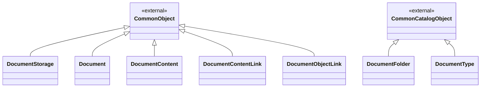
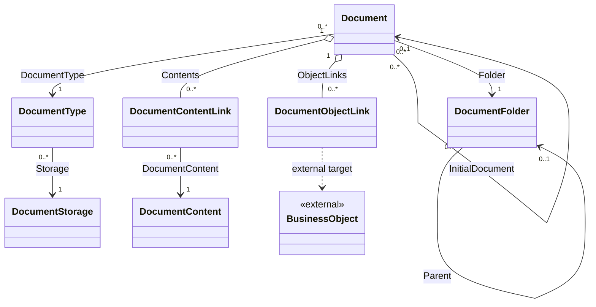

# Доменная модель — Управление документацией

## 1. Назначение документа

Документ определяет объекты, поля, связи и системное перечисление модуля. Общие поля идентификации, предприятия, аудита, архива и мягкого удаления наследуются из `00_common` и в таблицах не повторяются.

## 2. Общие решения модели

- Каждая версия хранится как самостоятельный объект «Документ» (`Document`).
- Настройки предприятия не образуют отдельный доменный объект и описаны в [16_settings.md](16_settings.md).
- Содержимое документа хранится отдельно и может использоваться несколькими документами.
- Ссылки на бизнес-объекты других модулей являются универсальными и не создают физических внешних ключей.
- Все объекты и связи принадлежат одному предприятию (`TenantId`).

### 2.1 Схема типов и наследования

Модуль не вводит собственных логических базовых типов. Объекты наследуются от
типов Common; общие поля в таблицах объектов не повторяются.

### 2.2 Схема связей и коллекций

Схема показывает навигационные коллекции и внешние связи. Таблицы типов и
коллекций являются нормативным описанием.

### 2.3 Реестр типов и хранения

| Тип | Базовый тип | Характер | Физическое хранение |
|---|---|---|---|
| `DocumentFolder` | `CommonCatalogObject` | самостоятельный | отдельная таблица типа |
| `DocumentStorage` | `CommonObject` | самостоятельный | системная таблица настроек хранения |
| `DocumentType` | `CommonCatalogObject` | самостоятельный | отдельная таблица типа |
| `Document` | `CommonObject` | самостоятельный | отдельная таблица типа |
| `DocumentContent` | `CommonObject` | самостоятельный | отдельная таблица типа |
| `DocumentContentLink` | `CommonObject` | самостоятельный | отдельная таблица типа |
| `DocumentObjectLink` | `CommonObject` | самостоятельный | отдельная таблица типа |

## 3. Системные перечисления модуля

### 3.1 Вид содержимого документа (`DocumentContentKind`)

Закрытое системное перечисление определяет единственный вид данных записи содержимого.

| Код | Значение | Русское название |
|---|---:|---|
| `Binary` | 0 | Файл |
| `Url` | 1 | Ссылка |
| `Text` | 2 | Текст |

## 4. Классификаторы и настройки хранения

### 4.1 Каталог документов (`DocumentFolder`)

Русское название: Каталог документов.

| Поле | Русское название | Тип | Обяз. | Назначение |
|---|---|---|---:|---|
| `Parent` | Вышестоящий каталог | `DocumentFolder` | нет | Родитель в иерархии каталогов того же предприятия. |
| `Order` | Порядок | `int` | да | Порядок отображения среди элементов одного уровня; начальное значение - `0`. |

| Коллекция | Тип элемента | Кратность | Владение | Связующее поле или условие | Назначение |
|---|---|---|---|---|---|
| `DocumentFolder.Children` | `DocumentFolder` | `0..*` | обратная навигация | `DocumentFolder.Parent` | Дочерние каталоги документов. |

При подключении модуля создаётся корневой каталог «Документы».

### 4.2 Хранилище документов (`DocumentStorage`)

Русское название: Хранилище документов.

Для MVP используется системная логическая запись хранилища «База данных».
Она не является физическим provider и не владеет бинарными данными. Минимальный
контракт включает код (`Code`), наименование (`Name`), код провайдера
(`ProviderCode`) и признак действия (`IsActive`). Пользовательские хранилища,
их отдельная форма и полный жизненный цикл являются целевым расширением после
MVP (`DM-Q-024`).

Секреты и параметры подключения не являются полями хранилища документов. Их хранит защищённая платформенная конфигурация.

При подключении модуля создаётся системная запись хранилища документов «База
данных». Её идентификатор передаётся в начальные данные модуля и используется
при создании типов документов. Физическое хранилище и его миграции принадлежат
Platform Content Storage; настройка предприятия со ссылочным значением в MVP не
требуется.

| Поле | Русское название | Тип | Обяз. | Назначение |
|---|---|---|---:|---|
| `Code` | Код хранилища | `string` | да | Системный код хранилища. |
| `Name` | Наименование хранилища | `string` | да | Отображаемое наименование хранилища. |
| `ProviderCode` | Код провайдера | `string` | да | Код способа хранения. |
| `IsActive` | Действует | `bool` | да | Признак доступности хранилища для новых связей. |

### 4.3 Тип документа (`DocumentType`)

Русское название: Тип документа.

| Поле | Русское название | Тип | Обяз. | Назначение |
|---|---|---|---:|---|
| `Storage` | Хранилище | `DocumentStorage` | да | При создании заполняется хранилищем документов по умолчанию; пользователь может выбрать другое. |
| `AllowedFileExtensions` | Разрешённые расширения файлов | `string?` | нет | Может только сузить перечень предприятия. |
| `MaximumFileSizeBytes` | Максимальный размер файла | `long?` | нет | Положительное значение, не превышающее ограничение предприятия. |

Дополнительные обязательные поля по типу документа не входят в MVP. В целевой версии они задаются дочерней коллекцией `DocumentTypeRequiredField` объекта `DocumentType` (`DM-Q-008`).

Унаследованные поля `Code` и `Name` обязательны. Для `DocumentType.Code` применяется правило формирования `{Numerator:00}`; код уникален в пределах предприятия.

Код типа документа разрешено изменить вручную только до создания первого документа этого типа.

## 5. Документы и версии

### 5.1 Документ (`Document`)

Русское название: Документ.

| Поле | Русское название | Тип | Обяз. | Назначение |
|---|---|---|---:|---|
| `Number` | Номер документа | `string` | да | Формируется платформой по правилу `{DocumentType.Code}-{Numerator:0000}`; пользователь может изменить значение вручную. |
| `DocumentDate` | Дата документа | `date?` | нет | Для нового документа по умолчанию устанавливается текущая дата. |
| `Name` | Наименование документа | `string` | да | Пользовательское название документа. |
| `Comment` | Комментарий | `string?` | нет | Дополнительное пояснение пользователя. |
| `InitialDocument` | Первоначальный документ | `Document` | нет | У первой версии отсутствует; каждая последующая версия ссылается на первую. |
| `VersionNumber` | Номер версии | `int` | да | У первой версии равен `1`, далее увеличивается на единицу. |
| `Folder` | Каталог | `DocumentFolder` | да | Каталог текущего предприятия. |
| `DocumentType` | Тип документа | `DocumentType` | да | Тип текущего предприятия. |
| `ProductionUnitResponsible` | Ответственное подразделение | `ProductionUnit?` | нет | Внутренняя производственная единица текущего предприятия. |
| `ResponsibleEmployee` | Ответственный | `Personnel` | нет | Сотрудник, ответственный за документ. |

Состояние хранится платформой жизненных циклов. Отдельное предметное поле «Состояние» (`StatusCode`) в объекте «Документ» не создаётся. В списках и карточке текущее состояние жизненного цикла показывается пользователю только для чтения. Сочетание предприятия, типа документа, номера документа и номера версии уникально.

| Коллекция | Тип элемента | Кратность | Владение | Связующее поле или условие | Назначение |
|---|---|---|---|---|---|
| `Document.Contents` | `DocumentContentLink` | `0..*` | `Document` | `DocumentContentLink.Document` | Связанное содержимое, основное содержимое и порядок. |
| `Document.ObjectLinks` | `DocumentObjectLink` | `0..*` | `Document` | `DocumentObjectLink.Document` | Связи документа с бизнес-объектами. |

Цепочка версий является связанным списком по полю «Первоначальный документ» (`InitialDocument`), а не коллекцией, сохраняемой вместе с владельцем.

## 6. Содержимое документа

### 6.1 Содержимое документа (`DocumentContent`)

Русское название: Содержимое документа.

| Поле | Русское название | Тип | Обяз. | Назначение |
|---|---|---|---:|---|
| `Number` | Номер содержимого | `string?` | нет | Необязательный пользовательский номер. |
| `Name` | Наименование содержимого | `string` | да | Для файла по умолчанию совпадает с именем файла. |
| `ContentKind` | Вид содержимого | `DocumentContentKind` | да | «Файл», «Ссылка» или «Текст». |
| `FileName` | Имя файла | `string?` | условно | Заполняется для вида «Файл». |
| `Extension` | Расширение файла | `string?` | условно | Вычисляется для вида «Файл». |
| `MediaType` | Тип содержимого файла | `string?` | условно | Вычисляется для вида «Файл». |
| `SizeBytes` | Размер файла в байтах | `long?` | условно | Заполняется для вида «Файл». |
| `ContentHash` | Контрольная сумма файла | `string?` | условно | Заполняется для вида «Файл». |
| `ContentRef` | Ссылка на файл | `string?` | условно | Непрозрачная ссылка на ресурс Platform Content Storage для вида «Файл». |
| `Url` | Адрес ссылки | `string?` | условно | Для вида «Ссылка» допускается HTTP или HTTPS. |
| `Text` | Текст | `string?` | условно | Для вида «Текст» содержит непосредственно введённый текст. |

Для каждого вида заполняются только соответствующие данные. Для вида «Файл» в MVP сохраняется `ContentRef`, а бинарное содержимое, его descriptor и жизненный цикл принадлежат Platform Content Storage. Внешние providers и расширенная настройка размещения остаются расширением после MVP (`DM-Q-025`).

### 6.2 Связь документа с содержимым (`DocumentContentLink`)

Русское название: Связь документа с содержимым.

| Поле | Русское название | Тип | Обяз. | Назначение |
|---|---|---|---:|---|
| `Document` | Документ | `Document` | да | Документ-владелец связи. |
| `DocumentContent` | Содержимое документа | `DocumentContent` | да | Активное содержимое того же предприятия. |
| `IsPrimary` | Основное содержимое | `bool` | да | У документа может быть не более одной основной связи. |
| `Order` | Порядок | `int` | да | Порядок отображения; начальное значение — `0`. |

Сочетание документа и содержимого уникально.

## 7. Связи с бизнес-объектами

### 7.1 Связь документа с бизнес-объектом (`DocumentObjectLink`)

Русское название: Связь документа с бизнес-объектом.

| Поле | Русское название | Тип | Обяз. | Назначение |
|---|---|---|---:|---|
| `Document` | Документ | `Document` | да | Документ-владелец связи. |
| `TargetObjectTypeCode` | Тип связанного бизнес-объекта | `string` | да | Квалифицированный код зарегистрированного типа, например `ProductDefinition:Nomenclature`. |
| `TargetObjectId` | Идентификатор связанного бизнес-объекта | `string` | да | Строковый идентификатор записи внешнего объекта. |

Поле вида связи в первой версии отсутствует. Сочетание документа, типа и идентификатора связанного объекта уникально.

## 8. Граница с внешними объектами

| Поле | Русское название | Внешний объект | Ограничение |
|---|---|---|---|
| `ProductionUnitResponsible` | Ответственное подразделение | `ProductionUnit` | Только неархивная внутренняя производственная единица текущего предприятия. |
| `ResponsibleEmployee` | Ответственный | Управление ресурсами / «Сотрудник» (`Personnel`) | Только доступный сотрудник текущего предприятия. |
| `TargetObjectTypeCode` и `TargetObjectId` | Связанный бизнес-объект | Зарегистрированный тип среды выполнения объектов | Существование, предприятие и право просмотра проверяются модулем-владельцем через платформенный контракт. |

## 9. Отличия от исходного ПР и структуры данных

| Источник | Было | Решение | Причина |
|---|---|---|---|
| Исходные функциональные требования версии 3.2 (`FT-V3.2`) | Объект «Файл» (`File`) | «Содержимое документа» (`DocumentContent`) | Объект также хранит ссылки и текст. |
| Исходные функциональные требования версии 3.2 (`FT-V3.2`) | «Связь документа с файлом» (`DocumentFileLink`) | «Связь документа с содержимым» (`DocumentContentLink`) | Термин соответствует целевому объекту. |
| Исходные функциональные требования версии 3.2 (`FT-V3.2`) | Поле «Состояние» (`StatusCode`) | Платформенный жизненный цикл | Состояние не дублируется предметным полем. |
| Исходные функциональные требования версии 3.2 (`FT-V3.2`) | Поле «Предприятие» (`EnterpriseId`) | Граница предприятия (`TenantId`) | Используется общий контракт DMP. |
| Исходные функциональные требования версии 3.2 (`FT-V3.2`) | Поле «Ответственное подразделение» (`ResponsibleOrganizationUnitId`) | Поле «Ответственное подразделение» (`ProductionUnitResponsible`) | Соответствует модели «Номенклатуры» и исключает субподрядчиков. |
| Исходные функциональные требования версии 3.2 (`FT-V3.2`) | Отдельный объект настроек | Платформенные настройки предприятия | Настройки не являются предметным бизнес-объектом. |
| Общая модель данных (`DMP_DATA`) | Объекты модуля отсутствуют в доступной версии | Источником полей служат актуальные функциональные требования версии 4.0 и принятые решения | Модель датирована ранее актуальных требований. |

## 10. Файловое содержимое

Для `ContentKind=Binary` доменная модель хранит непрозрачный `ContentRef`,
метаданные descriptor, hash и атрибуты связи. `byte[]`, физический путь и ключ
провайдера в доменную сущность не входят. Неизменяемость содержимого и связи
остаётся правилом модуля. Значение `Binary` в перечислении модуля соответствует
платформенному `ContentValueKind=File`; это имена разных уровней модели.

## История изменений

| Версия | Дата и время | Автор | Раздел | Изменение | Коммит/PR |
|---|---|---|---|---|---|
| 1.3 | 2026-09-03 16:04 +03:00 | Олег Юрьев (@axelprosoft) | 2 Хранилище документов (`DocumentStorage`); 1 Содержимое документа (`DocumentContent`); Отличия от исходного ПР и структуры данных; Файловое содержимое | docs: document content capability and document management module | [3b55ce83](https://github.com/axelprosoft/DMP.PlatformFoundation/commit/3b55ce83518e455f26704720e6dbf40ba8db6170) |
| 1.2 | 2026-09-02 11:50 +03:00 | Олег Юрьев (@axelprosoft) | 1 Схема типов и наследования; 2 Схема связей и коллекций; Общие решения модели; 3 Реестр типов и хранения; Вид содержимого документа (`DocumentContentKind`); 1 Вид содержимого документа (`DocumentContentKind`); Каталог документов (`DocumentFolder`); 1 Каталог документов (`DocumentFolder`); Хранилище документов (`DocumentStorage`); 2 Хранилище документов (`DocumentStorage`); Тип документа (`DocumentType`); 3 Тип документа (`DocumentType`); Документ (`Document`); 1 Документ (`Document`); Содержимое документа (`DocumentContent`); 1 Содержимое документа (`DocumentContent`); Связь документа с содержимым (`DocumentContentLink`); 2 Связь документа с содержимым (`DocumentContentLink`); Связь документа с бизнес-объектом (`DocumentObjectLink`); 1 Связь документа с бизнес-объектом (`DocumentObjectLink`); Граница с внешними объектами; Отличия от исходных требований и структуры данных; Отличия от исходного ПР и структуры данных | мелкие структурные правки в основном доменной модели и связей модулей без изменения содержания | [4cbd3069](https://github.com/axelprosoft/DMP.PlatformFoundation/commit/4cbd3069ec4a3421adbad1f0c9801b00f28405d7) |
| 1.1 | 2026-08-26 15:52 +03:00 | Воронкова Вероника (@VeronikaV2121) | Хранилище документов (`DocumentStorage`); Тип документа (`DocumentType`); Содержимое документа (`DocumentContent`); Отличия от исходных требований и структуры данных | docs: уточнить MVP-решения Document Management | [7db596eb](https://github.com/axelprosoft/DMP.PlatformFoundation/commit/7db596eb0ba8f5a44ea61393ec5afd83ed8fd361) |
| 1.0 | 2026-08-21 12:16 +03:00 | Олег Юрьев (@axelprosoft) | YAML-шапка: review_status, status | Утверждение после merge PR #31: 05 document management docs | [PR #31](https://github.com/axelprosoft/DMP.PlatformFoundation/pull/31) |
| 0.1 | 2026-08-21 11:33 +03:00 | Донских Сергей (@Sergey020726) | Создание документа | docs: add document management module documentation | [ef648f68](https://github.com/axelprosoft/DMP.PlatformFoundation/commit/ef648f6831ca38c686a44d67ae8abfe79815c9eb) |
