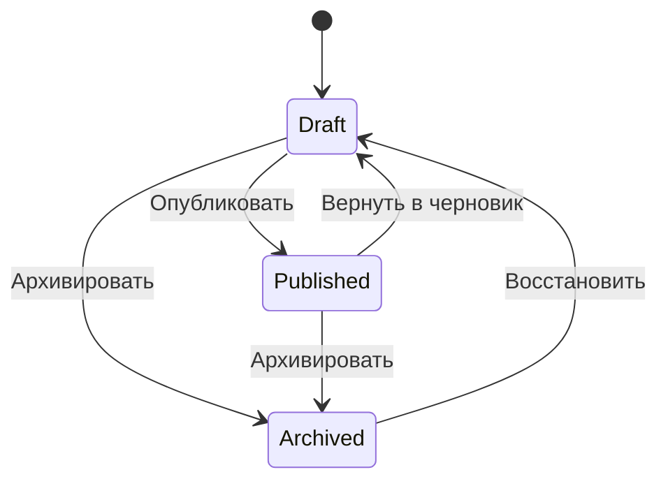

# Жизненный цикл — Управление документацией

## 1. Назначение документа

Документ определяет состояния, переходы и ограничения изменения документа. Жизненный цикл повторяет согласованный жизненный цикл справочника «Номенклатура».

## 2. Объекты с жизненным циклом

| Тип объекта | Русское название | Почему нужен жизненный цикл |
|---|---|---|
| Документ (`Document`) | Документ | Публикация отделяет редактируемый черновик от доступной для использования версии; архивирование прекращает обычное использование. |

Каталоги документов и типы документов используют стандартное архивирование общей модели без состояний «Черновик» и «Опубликован». Системное хранилище «База данных» не имеет пользовательского жизненного цикла в MVP; расширенный жизненный цикл пользовательских хранилищ отложен (`DM-Q-024`). Содержимое документа отдельного жизненного цикла не имеет.

## 3. Состояния

| Состояние | Русское название | Смысл | Выбор в новых ссылках |
|---|---|---|---|
| Черновик (`Draft`) | Черновик | Документ доступен для изменения пользователю с ролью «Работа с документами». | Не используется как ограничение связи с записью бизнес-объекта. |
| Опубликован (`Published`) | Опубликован | Обычное сохранение запрещено до возврата в черновик. | Не используется как ограничение связи с записью бизнес-объекта. |
| Архив (`Archived`) | Архив | Обычное использование и изменение запрещены до восстановления. | Не выбирается в новых связях. |

## 4. Переходы

| Команда | Из состояния | В состояние | Назначение |
|---|---|---|---|
| Опубликовать (`Publish`) | Черновик | Опубликован | Зафиксировать версию для использования. |
| Вернуть в черновик (`ReturnToDraft`) | Опубликован | Черновик | Разрешить изменение той же версии. |
| Архивировать (`Archive`) | Черновик или Опубликован | Архив | Прекратить обычное использование версии. |
| Восстановить (`Restore`) | Архив | Черновик | Вернуть ту же версию к редактированию. |

## 5. Правила переходов

| Проверка | Правило |
|---|---|
| Права | Переход выполняет пользователь с ролью «Работа с документами». |
| Публикация | Документ сохранён; обязательные поля и номер документа заполнены. |
| Обычное сохранение | Разрешено только в состоянии «Черновик» (`Draft`). |
| Целостность | Переход не изменяет номер документа, номер версии, содержимое или связи. |

## 6. Возврат в черновик

Действия «Вернуть в черновик» (`ReturnToDraft`) и «Восстановить» (`Restore`) переводят ту же запись документа в состояние «Черновик» (`Draft`). После перехода пользователь изменяет существующую версию; новая версия автоматически не создаётся.

## 7. Архивирование

Документ архивируется из состояний «Черновик» (`Draft`) и «Опубликован» (`Published`). Физическое удаление документа запрещено. Содержимое документа после удаления последней связи мягко удаляется по правилу [05_rules.md](05_rules.md), а не переводится в состояние документа.

## 8. Создание новой версии

Действие «Создать новую версию» доступно только для опубликованного документа и не является переходом состояния. Создаётся отдельный документ в состоянии «Черновик» (`Draft`):

- номер документа сохраняется, правило нумерации не запускается;
- номер версии увеличивается;
- первая версия не имеет ссылки на первоначальный документ;
- каждая последующая версия ссылается на первую версию;
- одна первая версия может иметь несколько последующих версий;
- переносятся бизнес-поля, связи с записями объектов и связи с неизменяемым содержимым;
- внутренний идентификатор и системные сведения о создании заполняются заново.

Операция выполняется целиком: при ошибке новый документ и его связи не сохраняются.

## 9. Отображение в интерфейсе

Интерфейс показывает текущее состояние как системное поле только для чтения. Доступность действий определяется текущим состоянием и правами. Фильтры состояний и действия представлений определены в [06_ui_views.md](06_ui_views.md).

## 10. Граница с Content Storage

Workflow управляет состоянием документа и разрешённостью бизнес-операций, но не
хранит бинарное содержимое и не заменяет жизненный цикл Content Storage.
Операции attach/replace должны учитывать текущее состояние документа через
стандартную проверку модуля.

## История изменений

| Версия | Дата и время | Автор | Раздел | Изменение | Коммит/PR |
|---|---|---|---|---|---|
| 1.2 | 2026-09-03 16:04 +03:00 | Олег Юрьев (@axelprosoft) | Отображение в интерфейсе; Граница с Content Storage | docs: document content capability and document management module | [3b55ce83](https://github.com/axelprosoft/DMP.PlatformFoundation/commit/3b55ce83518e455f26704720e6dbf40ba8db6170) |
| 1.1 | 2026-08-26 15:52 +03:00 | Воронкова Вероника (@VeronikaV2121) | Объекты с жизненным циклом; Отображение в интерфейсе | docs: уточнить MVP-решения Document Management | [7db596eb](https://github.com/axelprosoft/DMP.PlatformFoundation/commit/7db596eb0ba8f5a44ea61393ec5afd83ed8fd361) |
| 1.0 | 2026-08-21 12:16 +03:00 | Олег Юрьев (@axelprosoft) | YAML-шапка: review_status, status | Утверждение после merge PR #31: 05 document management docs | [PR #31](https://github.com/axelprosoft/DMP.PlatformFoundation/pull/31) |
| 0.1 | 2026-08-21 11:33 +03:00 | Донских Сергей (@Sergey020726) | Создание документа | docs: add document management module documentation | [ef648f68](https://github.com/axelprosoft/DMP.PlatformFoundation/commit/ef648f6831ca38c686a44d67ae8abfe79815c9eb) |
