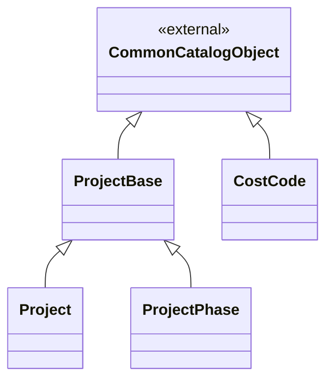
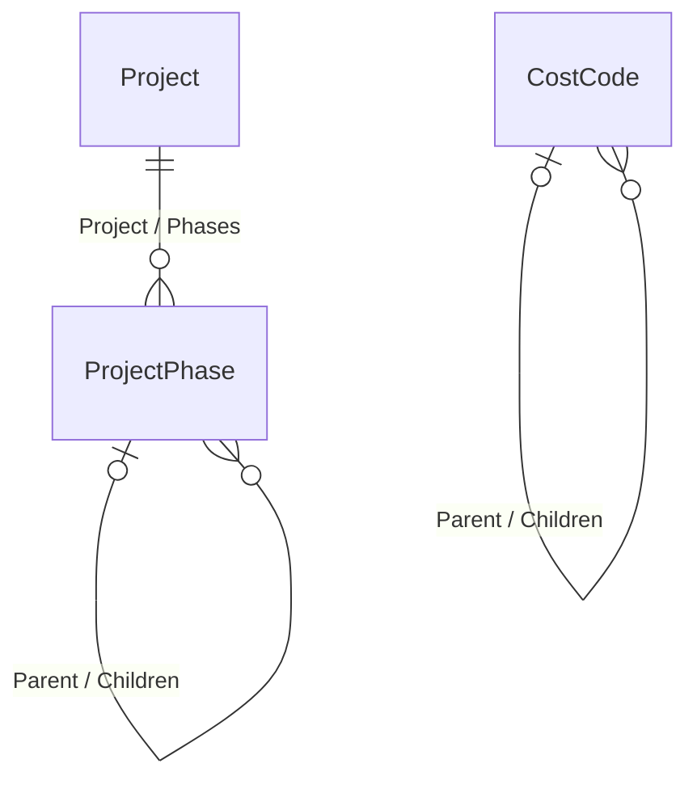

# Доменная модель - 06 Управление проектами

## 1. Назначение документа

Документ описывает целевую доменную модель модуля управления проектами: принадлежащие модулю объекты, логический базовый тип, поля, ссылки, коллекции и системные перечисления.

Модель основана на исходном ПР06, структуре `DMP_DATA`, принятых решениях в рабочем журнале модуля и соглашениях [Common](../00_common/02_domain_model.md), [GMD](../01_general_master_data/02_domain_model.md) и платформы.

Планирование работ, сроки, результаты, зависимости работ, план-факт, baseline и контрольные точки в модель MVP не входят.

Таблицы типов, полей и коллекций являются нормативным описанием модели.
Mermaid-схемы ниже показывают наследование, сохраненные ссылки и коллекции;
поля в схемы не включаются. Унаследованные поля в описании наследников не
повторяются.

## 2. Общие решения модели

### 2.1 Общие поля и базовые типы

Прикладные объекты используют общие типы `CommonObject` и `CommonCatalogObject` в соответствии с Common. Поля идентификатора, аудита, архивирования, мягкого удаления и внешнего идентификатора не дублируются в каждой таблице этого документа.

Все объекты, которыми владеет модуль, имеют обязательный `TenantId`. Для зависимых и дочерних объектов `TenantId` совпадает с `TenantId` владельца и не редактируется отдельно. Значение tenant определяется контекстом запроса и проверяется при каждой ссылке между объектами.

Модуль не добавляет собственных полей на уровне `CommonObject` или `CommonCatalogObject`; общие поля описаны в [Common](../00_common/02_domain_model.md).

`Presentation` является вычисляемым runtime-представлением. Оно не является самостоятельным прикладным полем доменной модели.

### 2.2 Поля базовых типов и наследников

Поля, объявленные в базовом типе, перечисляются один раз в разделе этого базового типа. В описании наследника перечисляются только его собственные поля и ссылки. Полный набор полей самостоятельного объекта складывается из Common, логических базовых типов и самого объекта.

`TenantId` является сквозным обязательным полем области данных и описан общим правилом выше. Для `CostCode`, где tenant-граница является частью собственного контракта объекта, поле `TenantId` дополнительно перечисляется в таблице его полей. `Id`, `ExternalId`, аудит, архивирование и мягкое удаление наследуются из Common и не повторяются.

### 2.3 Как читать описание типа

Для каждого типа используется одинаковая схема:

- **Базовый тип** - тип, от которого наследуется данный тип.
- **Абстрактный: да** - экземпляры этого типа не создаются.
- **Абстрактный: нет** - это самостоятельный тип, экземпляры которого можно создавать.
- **Физическая таблица** - таблица, в которой хранятся записи самостоятельного типа.
- Таблица **Поле** содержит только поля, объявленные в текущем типе. Унаследованные поля уже описаны в базовом типе или в Common.

`ProjectBase` является логическим общим типом. Он не является самостоятельным
типом Object Runtime, пользовательским объектом, источником lookup или объектом,
защищаемым отдельным ресурсом прав.

Логическое наследование не означает, что для абстрактного базового типа создается
отдельная запись. Поле базового типа входит в логический и runtime-контракт
самостоятельного наследника, а физически хранится в таблице этого наследника.
Для ссылочного поля типа `Parent` целевой тип раскрывается относительно
конкретного наследника: `ProjectPhase.Parent` ссылается на `ProjectPhase`, а не
на `ProjectBase`.

### 2.4 Логическое наследование и физическое хранение

Логическое наследование используется для общих полей, правил и навигации. Проект и этап являются самостоятельными типами и хранятся отдельно.

| Логический тип | Наследники | Физическое решение |
|---|---|---|
| `ProjectBase` | `Project`, `ProjectPhase` | Отдельной пользовательской таблицы и типа Object Runtime нет. Общие поля входят в записи конкретных наследников; `Project` и `ProjectPhase` хранятся в отдельных таблицах. |

Общая таблица для проекта и этапа не создается только из-за общего логического предка. Отдельная таблица или тип `ProjectBase` не используется как общий lookup.

### 2.5 Схема типов и наследования

Стрелка **наследуется от** показывает логическое наследование типов. Подписи таблиц показывают физическое хранение самостоятельных объектов.

Схема показывает только типы и наследование. Ссылки и коллекции показаны в отдельной схеме ниже.

### 2.6 Схема связей и коллекций

Схема показывает все внутренние ссылки, самоссылки и коллекции. Имена связей соответствуют полям и обратной навигации, а не физическому размещению данных.

Внешние ссылки на `ProductionUnit`, `OrganizationalUnit`, `Personnel` и `DocumentObjectLink` не смешиваются с внутренней схемой; они перечислены в таблице внешних объектов.

### 2.7 Общие правила ссылок

- `ProjectPhase.Project` обязателен.
- `ProjectPhase.Parent` допускается пустым для корневого этапа.
- `Parent` может ссылаться только на этап того же проекта.
- Самоссылка и циклическая цепочка родителей запрещены.
- Ссылки на `ProductionUnit`, `OrganizationalUnit` и `Personnel` проверяются в tenant-контексте.
- `ExecutorOrganizationalUnit` может указывать на `ProductionUnit` или `Subcontractor` через тип `OrganizationalUnit`.
- Проект и этап могут использоваться внешними объектами как аналитические измерения, но не владеют аналитическими записями.

## 3. Системные перечисления модуля

В целевой модели MVP PR06 нет собственных системных перечислений.

`ValueSetCode` в объектах PR06 не используется.

## 4. Проекты и этапы

### 4.1 ProjectBase

`ProjectBase` - логический абстрактный базовый тип, который объединяет общие свойства `Project` и `ProjectPhase`.

Самостоятельно создать `ProjectBase` нельзя. Он не имеет собственной пользовательской карточки, типа Object Runtime, lookup и отдельного ресурса прав.

| Свойство | Значение |
|---|---|
| Базовый тип | `CommonCatalogObject` |
| Абстрактный | Да |
| Наследники | `Project`, `ProjectPhase` |
| Поля, добавляемые на этом уровне | `Description`, `ResponsibleProductionUnit`, `ResponsiblePerson`, `ExecutorOrganizationalUnit` |
| Физическое хранение | Отдельной таблицы нет; поля хранятся в таблицах самостоятельных наследников |

`Code` и `Name` наследуются из `CommonCatalogObject` и поэтому не повторяются в таблицах `Project` и `ProjectPhase`. `Id`, `ExternalId`, аудит, архивирование и мягкое удаление наследуются из Common. `TenantId` описан в разделе 2.1.

Поля, объявленные именно `ProjectBase`:

| Поле | Русское название | Тип | Обяз. | Назначение |
|---|---|---|---:|---|
| `Description` | Описание | `String(max)` | нет | Дополнительное описание проекта или этапа. |
| `ResponsibleProductionUnit` | Ответственное производственное подразделение | `ProductionUnit` | нет | Внутреннее подразделение предприятия, курирующее проект или этап. |
| `ResponsiblePerson` | Ответственный сотрудник | `Personnel` | нет | Ответственный сотрудник предприятия. |
| `ExecutorOrganizationalUnit` | Организационная единица-исполнитель | `OrganizationalUnit` | нет | Организация, выполняющая проект или этап; допускается `ProductionUnit` или `Subcontractor`. |

### 4.2 Project

Самостоятельный объект проекта.

| Свойство | Значение |
|---|---|
| Базовый тип | `ProjectBase` |
| Абстрактный | Нет |
| Физическая таблица | `Project` |

Собственных предметных полей у `Project` нет.

| Коллекция | Тип элемента | Кратность | Владение | Связующее поле или условие | Назначение |
|---|---|---|---|---|---|
| `Project.Phases` | `ProjectPhase` | `0..*` | `Project` | ссылочное поле элемента на владельца | Этапы проекта и их структурное дерево. |

### 4.3 ProjectPhase

Самостоятельный объект этапа проекта.

| Свойство | Значение |
|---|---|
| Базовый тип | `ProjectBase` |
| Абстрактный | Нет |
| Физическая таблица | `ProjectPhase` |

Поля, объявленные именно `ProjectPhase`:

| Поле | Русское название | Тип | Обяз. | Назначение |
|---|---|---|---:|---|
| `Project` | Проект | `Project` | да | Проект-владелец этапа. |
| `Parent` | Родительский этап | `ProjectPhase` | нет | Непосредственный родитель в структурном дереве этапов. |

| Коллекция | Тип элемента | Кратность | Владение | Связующее поле или условие | Назначение |
|---|---|---|---|---|---|
| `ProjectPhase.Children` | `ProjectPhase` | `0..*` | `ProjectPhase` | ссылочное поле элемента на владельца | Дочерние этапы текущего этапа. |

### 4.4 CostCode

Самостоятельный каталоговый объект PR06 с tenant-границей и иерархией кодов затрат.

| Свойство | Значение |
|---|---|
| Базовый тип | `CommonCatalogObject` |
| Абстрактный | Нет |
| Физическая таблица | `CostCode` |

`Code` и `Name` наследуются из `CommonCatalogObject`. `Id`, `ExternalId`, аудит, архивирование и мягкое удаление наследуются из Common.

Поля, объявленные именно `CostCode`:

| Поле | Русское название | Тип | Обяз. | Назначение |
|---|---|---|---:|---|
| `TenantId` | Tenant | `TenantId` | да | Граница владения кодом затрат; задается tenant-контекстом и не редактируется пользователем. |
| `Parent` | Родительский код затрат | `CostCode` | нет | Непосредственный родитель в иерархии кодов затрат. |
| `Description` | Описание | `String(max)` | нет | Дополнительное описание кода затрат. |

| Коллекция | Тип элемента | Кратность | Владение | Связующее поле или условие | Назначение |
|---|---|---|---|---|---|
| `CostCode.Children` | `CostCode` | `0..*` | `CostCode` | ссылочное поле элемента `Parent` | Дочерние коды затрат текущего кода. |

## 5. Граница с внешними объектами

| Внешний объект | Владелец | Использование в модуле |
|---|---|---|
| `ProductionUnit` | PR03 | Ответственное подразделение и допустимый внутренний исполнитель. |
| `OrganizationalUnit` | PR03 | Исполнитель проекта или этапа; включает `ProductionUnit` и `Subcontractor`. |
| `Personnel` | PR04 | Ответственный сотрудник. |
| `DocumentObjectLink` | PR05 | Прикрепление существующих документов к проекту или этапу. PR06 не владеет документами и файлами. |
| `AnalyticBase` и аналитические записи | Модуль-потребитель | Использование проекта, этапа и при необходимости `CostCode` как внешних аналитических измерений. PR06 не владеет аналитической записью. |

Модуль не хранит собственные коллекции документов, файлов или аналитических записей.

## 6. Платформенные зависимости

- `00_common`: `CommonObject`, `CommonCatalogObject`, `TenantId`, `ExternalId`, `Presentation`, архивирование, мягкое удаление и стандартное поведение Object Runtime.
- `03_platform`: Object Runtime, tenant-контекст, проверка прав и стандартные операции объектов.
- `03_plant_structure`: ссылки на `ProductionUnit`, `OrganizationalUnit` и `Subcontractor`.
- `04_resource_management`: ссылка на `Personnel`.
- `05_document_management`: `DocumentObjectLink` для связи существующего документа с проектом или этапом.
- Межмодульное взаимодействие выполняется через публичные контракты, а не через таблицы владельца внешнего объекта.

Внешние модули могут хранить собственные поля-ссылки на `ProjectManagement:CostCode`; это не передает им владение каталогом и не создает связи `CostCode` с `Project` или `ProjectPhase`.

## 7. Отличия от исходного ПР и структуры данных

| Источник | Было | Решение | Причина |
|---|---|---|---|
| `DMP_DATA`, `ProjectBase` | Общая физическая сущность для проекта и этапа | `ProjectBase` оставлен только логическим общим предком; `Project` и `ProjectPhase` хранятся отдельно | Принятое решение о самостоятельных объектных типах и отсутствии общего runtime-объекта. |
| `DMP_DATA`, общие поля наследников | В таблицах наследников могли повторяться поля базового типа | В доменной модели поле объявляется один раз у владельца; в наследнике перечисляются только собственные поля | Соответствие Common и стандарту описания доменной модели. |
| `DMP_DATA`, `Status` | Прикладной статус проекта или этапа | Не переносится в MVP | Прикладной workflow для PR06 не вводится. |
| `DMP_DATA`, `Presentation` | Хранившееся представление объекта | Вычисляемое runtime-представление | `Presentation` не является самостоятельным предметным полем. |
| Требования к кодам затрат | Ведение кодов затрат проекта | Самостоятельный каталог `CostCode` принадлежит PR06; прямой связи с `Project` и `ProjectPhase` нет | Решения Q17, Q19 и Q20. |

## История изменений

| Версия | Дата и время | Автор | Раздел | Изменение | Коммит/PR |
|---|---|---|---|---|---|
| 1.1 | 2026-09-03 10:01 +03:00 | Олег Юрьев (@axelprosoft) | 1 Общие поля и базовые типы; 2 Поля базовых типов и наследников; 5 Схема типов и наследования; 6 Схема связей и коллекций; 4 CostCode; Граница с внешними объектами; Платформенные зависимости; Отличия от исходного ПР и структуры данных | первые версии модулей 04, 06. правки связанной документации - шаблон и предложения по изменениям ФТ (определения терминов) | [766441e6](https://github.com/axelprosoft/DMP.PlatformFoundation/commit/766441e68e531dadabe887393fc989e5b6e268e0) |
| 1.0 | 2026-09-02 12:21 +03:00 | Олег Юрьев (@axelprosoft) | YAML-шапка: review_status, status | Утверждение после merge PR #56: мелкие структурные правки в основном доменной модели и связей модулей без изменения содержания | [PR #56](https://github.com/axelprosoft/DMP.PlatformFoundation/pull/56) |
| 0.1 | 2026-09-02 12:01 +03:00 | Олег Юрьев (@axelprosoft) | Создание документа | правки структуры + модуль 06 | [3b002e77](https://github.com/axelprosoft/DMP.PlatformFoundation/commit/3b002e77175532d47ecabee6ce85de1f999b9099) |
