# Часть I. Введение и контекст архитектурного описания

---

# 1. Идентификация архитектурного описания

## 1.1. Наименование системы и решения

**Наименование системы интереса:** Цифровая промышленная платформа управления производством.

**Наименование архитектурного решения:** Распределённая MES-платформа с автономными локальными производственными контурами и центральным корпоративным контуром.

**Краткое описание:** Цифровая промышленная платформа представляет собой распределённую информационную систему класса MES (Manufacturing Execution System), предназначенную для оперативного управления производственными процессами на промышленных предприятиях, сбора производственных данных от технологического оборудования, консолидации информации на корпоративном уровне и формирования единого информационного пространства производственной деятельности.

Система состоит из шести локальных производственных контуров, развёрнутых на предприятиях, и одного центрального корпоративного контура, размещённого в центральном ЦОД. Локальные контуры функционируют автономно и не зависят от постоянной доступности центрального контура при выполнении критически важных производственных операций.

## 1.2. Идентификация документа

| Параметр | Значение |
|---|---|
| Идентификатор документа | AD-MES-1.0 |
| Наименование документа | Архитектурное описание цифровой промышленной платформы управления производством |
| Тип документа | Architecture Description (AD) |
| Архитектурный релиз | AD-1.0 |
| Статус документа | Для ознакомления и согласования |
| Дата выпуска | 19.09.2026 |
| Стандарт соответствия | ISO/IEC/IEEE 42010:2022 |
| Предыдущие версии | Отсутствуют (первый архитектурный релиз) |
| Язык документа | Русский |
| Формат документа | Markdown с диаграммами Mermaid |
| Владелец документа | Архитектурный офис проекта |
| Ответственный за документ | Главный архитектор решения |

## 1.3. Статус и архитектурный релиз

Документ является **первым архитектурным релизом** (AD-1.0) целевой архитектуры цифровой промышленной платформы.

**Статус:** «Для ознакомления и согласования».

**Назначение релиза:**
- зафиксировать целевые архитектурные решения, обязательные для всех последующих проектных, технических и эксплуатационных документов;
- обеспечить основу для согласования архитектуры с заказчиком и заинтересованными сторонами;
- сформировать базис для детального проектирования, разработки, развёртывания и сопровождения системы.

**Ожидаемый результат согласования:**
- утверждение целевой архитектуры;
- фиксация технологического baseline;
- утверждение ключевых архитектурных решений (ADR);
- выявление и документирование отклонений и особых требований.

**Правила изменения документа:**
- изменения публичных архитектурных решений оформляются как новый архитектурный релиз (AD-1.1, AD-1.2 и т. д.);
- изменения отдельных ADR оформляются как новая версия соответствующего ADR;
- изменения, затрагивающие несколько viewpoints, требуют пересмотра раздела 33 (Соответствия между views);
- устаревшие решения переносятся в реестр отклонённых решений (раздел 34.17).

## 1.4. Целевые пользователи документа

| Категория пользователей | Что получают из документа |
|---|---|
| Заказчик | Понимание целевой архитектуры, охвата, ограничений, ожидаемых характеристик |
| Руководители проекта | Основу для планирования работ, оценки объёмов, управления рисками |
| Системные архитекторы | Целостную модель системы, viewpoints, соответствия, ADR |
| Программные архитекторы | Логическую структуру, контракты, событийную модель, технологический стек |
| Технические руководители | Развёртывание, инфраструктуру, сетевые зоны, отказоустойчивость |
| Разработчики | Компоненты, контракты, модели данных, события |
| Специалисты по инфраструктуре | Топологию развёртывания, Kubernetes, хранилища, сети |
| Специалисты по интеграции | Контракты, протоколы, потоки данных, синхронизацию |
| Специалисты по ИБ | Модель безопасности, идентификацию, авторизацию, сетевые границы |
| Специалисты по эксплуатации | Мониторинг, журналирование, отказоустойчивость, RTO/RPO |
| Специалисты по качеству | Критерии приёмки архитектуры, трассируемость, соответствия |

## 1.5. Назначение архитектурного описания

Настоящее архитектурное описание определяет целевую архитектуру цифровой промышленной платформы управления производством в соответствии с ISO/IEC/IEEE 42010:2022.

Документ описывает:

- систему интереса, её границы и внешнее окружение;
- заинтересованные стороны и их архитектурно значимые concerns;
- viewpoints, использованные для представления архитектуры;
- views, соответствующие каждому viewpoint;
- соответствия между views;
- обоснования ключевых архитектурных решений (ADR);
- технологический baseline;
- нефункциональные характеристики и целевые метрики.

Документ используется как:

- основа согласования целевой архитектуры;
- базис для проектирования и разработки;
- источник требований для команд разработки, инфраструктуры и ИБ;
- средство трассируемости решений к concerns stakeholders;
- инструмент управления архитектурными изменениями.

## 1.6. Область применения и границы

**Область применения архитектурного описания:**

- распределённая MES-система в составе шести локальных и одного центрального контура;
- прикладные, платформенные, интеграционные и инфраструктурные компоненты;
- взаимодействие с промышленным оборудованием через интеграционный слой;
- механизмы синхронизации между локальными и центральным контурами;
- операционное и аналитическое хранение;
- идентификация, безопасность, мониторинг, журналирование;
- технологический стек и его версии;
- развёртывание, масштабирование, отказоустойчивость.

**За границами документа:**

- детальные алгоритмы конкретных производственных процессов;
- детальные пользовательские сценарии отдельных модулей;
- полный физический дизайн баз данных;
- полные спецификации REST API и схем событий (определяются отдельными документами);
- исходный код и внутренняя реализация сервисов;
- детальные настройки Kubernetes-кластеров;
- эксплуатационные регламенты конкретных предприятий;
- детальные требования к каждому типу промышленного оборудования;
- проектная документация на конкретные инфраструктурные площадки.

Такие вопросы раскрываются в последующих проектных, технических и эксплуатационных документах со ссылками на соответствующие разделы настоящего AD.

## 1.7. Соответствие ISO/IEC/IEEE 42010

Архитектурное описание построено в соответствии с ISO/IEC/IEEE 42010:2022 «Systems and software engineering — Architecture description».

**Структура соответствия:**

| Элемент стандарта | Реализация в документе |
|---|---|
| System-of-interest | Раздел 2 |
| Stakeholders | Раздел 3.2 |
| Concerns | Раздел 3.3 |
| Architecture viewpoints | Раздел 4, разделы 5–15 |
| Architecture views | Раздел 16–32 |
| Correspondences | Раздел 33 |
| Rationale | Раздел 34 (ADR) |
| Architecture description identification | Раздел 1 |
| Glossary | Раздел 36 |

**Ключевые соответствия:**

- каждый concern трассируется минимум к одному viewpoint (раздел 3.4);
- каждый viewpoint имеет определённые concerns, stakeholders, model kinds и conventions (разделы 5–15);
- каждый view соответствует специфицированному viewpoint (разделы 16–32);
- соответствия между views формализованы (раздел 33);
- ключевые решения обоснованы через ADR (раздел 34).

## 1.8. История изменений

| Версия | Дата | Автор | Изменения |
|---|---|---|---|
| AD-1.0 | 19.09.2026 | Главный архитектор | Первый архитектурный релиз. Сформирован в соответствии с ISO/IEC/IEEE 42010 на основе исходных материалов проекта. |

---

# 2. Система интереса и её контекст

## 2.1. Определение системы интереса

**Система интереса (system-of-interest):** Цифровая промышленная платформа управления производством — распределённая информационная система класса MES, обеспечивающая оперативное управление производственными процессами шести промышленных предприятий, сбор и обработку производственных данных, консолидацию информации на корпоративном уровне и формирование единого информационного пространства производственной деятельности.

**Основные характеристики системы:**

| Характеристика | Значение |
|---|---|
| Класс системы | MES (Manufacturing Execution System) |
| Тип архитектуры | Распределённая, двухуровневая, сервисно-ориентированная, событийно-ориентированная |
| Количество локальных контуров | 6 |
| Количество центральных контуров | 1 |
| Основное назначение | Оперативное управление производством, сбор данных, корпоративная аналитика |
| Критичность | Высокая (критический производственный контур) |
| Режим работы | Круглосуточный, 24×7 |
| Среда развёртывания | Kubernetes (локальный и центральный) |

## 2.2. Границы системы

**В границах системы:**

- локальные MES-контуры шести предприятий;
- центральный корпоративный контур;
- интеграционный слой взаимодействия с промышленным оборудованием (MDC);
- сервисы синхронизации между контурами;
- операционные и аналитические хранилища данных;
- подсистемы идентификации, безопасности, мониторинга, журналирования;
- пользовательские интерфейсы (локальные и центральные);
- интеграционные потоки с внешними системами предприятия и корпоративного уровня.

**За границами системы:**

- промышленное оборудование (станки, PLC, SCADA, датчики);
- корпоративные системы заказчика (ERP, PLM, EAM и др.) — взаимодействие через интеграционные контракты;
- корпоративный каталог (AD) — взаимодействие через Keycloak;
- инфраструктура предприятия (сети, СХД, виртуализация) — предоставляется как среда;
- инфраструктура ЦОД — предоставляется как среда.

## 2.3. Внешнее окружение и взаимодействующие системы

| Внешняя система | Тип взаимодействия | Направление | Протокол / механизм |
|---|---|---|---|
| Промышленное оборудование (PLC, CNC, SCADA, телеметрия) | Сбор производственных данных | Входящее | OPC UA, MQTT, специализированные протоколы |
| Корпоративный каталог (AD) | Аутентификация | Исходящее | LDAP / OIDC через Keycloak |
| ERP-система заказчика | Обмен производственными заказами, НСИ | Двунаправленное | REST / файловый обмен через NiFi |
| PLM-система | Передача составов, технологий | Входящее | REST / файловый обмен |
| EAM-система | Обмен данными о ресурсах, ТОиР | Двунаправленное | REST |
| Системы корпоративной отчётности | Передача агрегированных данных | Исходящее | REST / выгрузка из ClickHouse |
| Корпоративная служба мониторинга | Передача метрик | Исходящее | Pull / Push |
| Корпоративная SIEM | Передача событий безопасности | Исходящее | Syslog / REST |

## 2.4. Производственный и корпоративный контекст

**Производственный контекст:**

- шесть промышленных предприятий с различным составом оборудования и производственных процессов;
- оперативное управление производством на каждом предприятии;
- взаимодействие с технологическим оборудованием в реальном времени;
- регистрация производственных операций, событий, результатов контроля качества;
- локальное хранение операционных данных;
- автономная работа при временной потере связи с ЦОД.

**Корпоративный контекст:**

- консолидация производственных данных от всех предприятий;
- корпоративная аналитика и межпредприятийное сравнение;
- централизованное управление НСИ и конфигурацией;
- централизованное администрирование и мониторинг;
- формирование корпоративной отчётности и KPI.

## 2.5. Допущения и ограничения

**Допущения:**

1. На каждом предприятии имеется инфраструктура, позволяющая развернуть локальный Kubernetes-кластер и компоненты MES.
2. Предприятия имеют защищённый канал связи с центральным ЦОД (или возможность его организации).
3. Промышленное оборудование поддерживает хотя бы один из стандартизированных протоколов (OPC UA, MQTT) либо может быть подключено через специализированные адаптеры.
4. Корпоративный каталог (AD) доступен для интеграции через Keycloak.
5. Канал связи между предприятием и ЦОД может временно прерываться; это не приводит к остановке производства.
6. Технологический стек, зафиксированный в разделе 31, доступен и поддерживается вендорами.

**Ограничения:**

1. Локальный контур не зависит от постоянной доступности ЦОД при выполнении критических производственных операций.
2. Операционные производственные данные хранятся локально на предприятии.
3. Межконтурный обмен выполняется преимущественно асинхронно.
4. Все основные MES-компоненты работают в Kubernetes.
5. Прикладной backend реализуется на Java и Spring Boot.
6. Пользовательский интерфейс реализуется на React и TypeScript.
7. PostgreSQL используется как операционное хранилище.
8. Kafka используется как событийный транспорт.
9. ClickHouse используется для аналитических нагрузок.
10. Keycloak используется для идентификации и управления доступом.
11. DataLens используется для визуализации аналитики.
12. Для промышленной интеграции поддерживаются OPC UA и MQTT.
13. Apache NiFi используется для отдельных интеграционных потоков.
14. Архитектура не предполагает обязательного использования low-code/no-code.
15. Аналитическая нагрузка не должна нарушать работу операционных сервисов.
16. Центральный контур не управляет критическими локальными операциями в режиме постоянной связи.

---

# 3. Заинтересованные стороны и их Concerns

## 3.1. Метод идентификации stakeholders

Заинтересованные стороны идентифицированы на основе следующих источников:

- ролей, определённых в исходных документах проекта;
- организационной структуры заказчика;
- типовых ролей в проектах класса MES;
- эксплуатационной модели распределённой системы;
- требований ISO/IEC/IEEE 42010 к идентификации stakeholders.

Для каждой заинтересованной стороны определены:

- наименование роли;
- интересы в системе;
- архитектурно значимые concerns;
- уровень влияния на архитектуру;
- viewpoints, охватывающие соответствующие concerns.

## 3.2. Реестр заинтересованных сторон

| ID | Stakeholder | Роль | Основные интересы | Влияние |
|---|---|---|---|---|
| SH-01 | Заказчик | Владелец системы | Соответствие целям, окупаемость, масштабируемость, долгосрочная поддержка | Высокое |
| SH-02 | Руководитель проекта | Управление проектом | Сроки, бюджет, риски, прозрачность архитектуры | Высокое |
| SH-03 | Главный архитектор решения | Архитектура | Целостность, соответствие стандартам, трассируемость | Высокое |
| SH-04 | Системный архитектор | Архитектура | Логическая структура, контракты, соответствия | Высокое |
| SH-05 | Программный архитектор | Разработка | Компоненты, API, события, модель данных | Высокое |
| SH-06 | Технический руководитель | Техническое руководство | Развёртывание, инфраструктура, отказоустойчивость | Высокое |
| SH-07 | Разработчик backend | Разработка | Сервисы, контракты, фреймворки | Среднее |
| SH-08 | Разработчик frontend | Разработка | UI-компоненты, интеграция с API | Среднее |
| SH-09 | Специалист по инфраструктуре | Инфраструктура | Kubernetes, сети, хранилища | Высокое |
| SH-10 | Специалист по интеграции | Интеграция | Протоколы, потоки данных, синхронизация | Высокое |
| SH-11 | Специалист по ИБ | Информационная безопасность | Аутентификация, авторизация, сетевые границы, аудит | Высокое |
| SH-12 | Специалист по эксплуатации | Эксплуатация | Мониторинг, журналирование, RTO/RPO | Высокое |
| SH-13 | Оператор производственного участка | Пользователь | Доступность UI, скорость работы, автономность | Среднее |
| SH-14 | Технолог | Пользователь | Доступ к технологиям, составам, операциям | Среднее |
| SH-15 | Диспетчер производства | Пользователь | Планирование, расписания, мониторинг | Среднее |
| SH-16 | Специалист по качеству | Пользователь | Контроль качества, несоответствия | Среднее |
| SH-17 | Специалист по планированию | Пользователь | Планы, заказы, ресурсы | Среднее |
| SH-18 | Администратор предприятия | Администрирование | Настройки, роли, справочники | Среднее |
| SH-19 | Корпоративный аналитик | Аналитика | Корпоративные отчёты, KPI, сравнение предприятий | Среднее |
| SH-20 | Специалист по сопровождению | Эксплуатация | Диагностика, обновления, восстановление | Среднее |
| SH-21 | Служба безопасности предприятия | ИБ | Сетевые зоны, доступ к оборудованию, аудит | Высокое |
| SH-22 | Владелец производственного процесса | Бизнес | Непрерывность производства, производительность | Высокое |

## 3.3. Реестр архитектурно значимых concerns

| ID | Concern | Описание | Приоритет | Stakeholders |
|---|---|---|---|---|
| CN-01 | Автономность локального контура | Способность предприятия продолжать критические производственные операции при недоступности ЦОД | Критический | SH-01, SH-03, SH-13, SH-22 |
| CN-02 | Непрерывность производства | Отсутствие остановки производства при отказах компонентов и каналов связи | Критический | SH-01, SH-06, SH-22 |
| CN-03 | Асинхронная синхронизация | Надёжная передача данных между контурами без потерь при разрывах связи | Критический | SH-03, SH-10, SH-12 |
| CN-04 | Согласованность данных между контурами | Корректность данных при асинхронном обмене, идемпотентность, разрешение конфликтов | Высокий | SH-03, SH-05, SH-10 |
| CN-05 | Производительность операционного контура | Целевые метрики отклика операторских операций | Высокий | SH-13, SH-14, SH-15, SH-22 |
| CN-06 | Масштабируемость | Горизонтальное масштабирование компонентов, независимое масштабирование предприятий | Высокий | SH-01, SH-06, SH-09 |
| CN-07 | Отказоустойчивость | Устойчивость к отказам приложений, БД, брокеров, каналов | Критический | SH-06, SH-12, SH-22 |
| CN-08 | Наблюдаемость | Мониторинг, журналирование, диагностика, correlation ID | Высокий | SH-12, SH-20 |
| CN-09 | Безопасность идентификации | Централизованное управление идентификацией, локальная автономия | Критический | SH-11, SH-21 |
| CN-10 | Авторизация и разграничение доступа | Роли, права, tenant-контекст, доступ к объектам | Высокий | SH-11, SH-18, SH-21 |
| CN-11 | Сетевая безопасность | Изоляция производственной сети, MDC, MES-сегмента, канала ЦОД | Критический | SH-11, SH-21 |
| CN-12 | Аудит действий | Журналирование административных и пользовательских действий | Высокий | SH-11, SH-12 |
| CN-13 | Интеграция с оборудованием | Поддержка OPC UA, MQTT, SCADA, телеметрии, устойчивость к сбоям | Высокий | SH-10, SH-14 |
| CN-14 | Разделение операционной и аналитической нагрузки | Изоляция аналитики от транзакционных процессов | Высокий | SH-05, SH-12, SH-19 |
| CN-15 | Владение данными | Определение источника истины, мастер-данных, реплик | Высокий | SH-03, SH-05 |
| CN-16 | Контракты и совместимость | Версионирование API и событий, обратная совместимость | Высокий | SH-05, SH-07, SH-10 |
| CN-17 | Технологическая стандартизация | Единый стек, ограничение разнообразия | Средний | SH-03, SH-06, SH-07, SH-08 |
| CN-18 | Сопровождаемость | Типовое развёртывание, единые подходы, документация | Высокий | SH-06, SH-09, SH-20 |
| CN-19 | Корпоративная аналитика | Консолидация, межпредприятийный анализ, KPI | Высокий | SH-19, SH-01 |
| CN-20 | Локальная аналитика | Аналитика предприятия при недоступности ЦОД | Средний | SH-12, SH-19 |
| CN-21 | Управление конфигурацией | Централизованная конфигурация, feature flags, локальные переопределения | Средний | SH-18, SH-20 |
| CN-22 | Обновление и версионирование ПО | Политика обновлений, совместимость версий, откат | Высокий | SH-06, SH-20 |
| CN-23 | Соответствие стандартам | ISO/IEC/IEEE 42010, внутренние стандарты заказчика | Высокий | SH-01, SH-03 |
| CN-24 | Взаимодействие с корпоративными системами | ERP, PLM, EAM, AD, SIEM | Высокий | SH-10, SH-11 |
| CN-25 | Стоимость владения | Лицензии, инфраструктура, эксплуатация | Средний | SH-01, SH-02 |
| CN-26 | Производственная безопасность | Изоляция оборудования от прикладных сервисов | Критический | SH-11, SH-21, SH-22 |
| CN-27 | Восстановление после отказа | RTO/RPO, резервное копирование, восстановление | Высокий | SH-06, SH-12, SH-22 |
| CN-28 | Сохранность данных | Целостность, защита от потерь, retention | Высокий | SH-01, SH-12 |
| CN-29 | Управление справочными данными | Централизованное и локальное управление НСИ | Средний | SH-18 |
| CN-30 | Поддержка нескольких предприятий | Tenant-контекст, изоляция данных, корпоративный доступ | Высокий | SH-03, SH-18 |

## 3.4. Матрица трассируемости «stakeholder — concern — viewpoint»

| Concern | Viewpoints, охватывающие concern |
|---|---|
| CN-01 | Контекст, Развёртывание, Синхронизация, Автономная работа, Отказоустойчивость |
| CN-02 | Отказоустойчивость, Развёртывание, Автономная работа |
| CN-03 | Синхронизация, Событийное взаимодействие, Данные |
| CN-04 | Данные, Синхронизация, Событийное взаимодействие |
| CN-05 | Функциональная структура, Развёртывание, Нефункциональные характеристики |
| CN-06 | Развёртывание, Логическая структура, Нефункциональные характеристики |
| CN-07 | Отказоустойчивость, Развёртывание, Синхронизация |
| CN-08 | Эксплуатация, Развёртывание, Событийное взаимодействие |
| CN-09 | Безопасность, Развёртывание, Синхронизация |
| CN-10 | Безопасность, Логическая структура, Данные |
| CN-11 | Безопасность, Развёртывание, Контекст |
| CN-12 | Безопасность, Эксплуатация |
| CN-13 | Интеграция, Развёртывание, Событийное взаимодействие |
| CN-14 | Данные, Логическая структура, Нефункциональные характеристики |
| CN-15 | Данные, Синхронизация, Логическая структура |
| CN-16 | Интеграция, Событийное взаимодействие |
| CN-17 | Технологический стек, Логическая структура |
| CN-18 | Развёртывание, Технологический стек, Эксплуатация |
| CN-19 | Данные, Развёртывание, Технологический стек |
| CN-20 | Данные, Развёртывание |
| CN-21 | Логическая структура, Безопасность, Развёртывание |
| CN-22 | Технологический стек, Развёртывание, Эксплуатация |
| CN-23 | Все viewpoints (сквозной concern) |
| CN-24 | Интеграция, Контекст, Безопасность |
| CN-25 | Технологический стек, Развёртывание |
| CN-26 | Безопасность, Развёртывание, Интеграция |
| CN-27 | Отказоустойчивость, Развёртывание, Синхронизация |
| CN-28 | Данные, Отказоустойчивость, Синхронизация |
| CN-29 | Данные, Функциональная структура, Развёртывание |
| CN-30 | Данные, Безопасность, Логическая структура |

## 3.5. Concerns, не охваченные архитектурным описанием

| Concern | Причина исключения | Где рассматривается |
|---|---|---|
| Детальные алгоритмы производственных процессов | Относится к функциональному проектированию | Проектная документация модулей |
| Детальные пользовательские сценарии | Относится к UX-проектированию | UX-документация, спецификации модулей |
| Полный физический дизайн БД | Относится к проектированию данных | Модели данных, DDL-документация |
| Полные спецификации API | Относится к контрактному проектированию | OpenAPI-спецификации, AsyncAPI |
| Настройки конкретных инфраструктурных площадок | Относится к инфраструктурному проектированию | Инфраструктурные проекты площадок |
| Эксплуатационные регламенты предприятий | Относится к эксплуатационной документации | Регламенты эксплуатации |
| Детальные требования к оборудованию | Относится к проектам интеграции | Проекты интеграции с оборудованием |
| Юридические и регуляторные требования | Относится к комплаенс-документации | Комплаенс-документы заказчика |

Все перечисленные concerns явно вынесены за границы настоящего AD и должны рассматриваться в соответствующих специализированных документах. Ссылки на них приведены в разделе 37.

# Часть II. Спецификации Viewpoints

---

# 4. Каталог viewpoints

## 4.1. Принципы определения viewpoints

Viewpoints в настоящем архитектурном описании определены на основе следующих принципов:

1. **Ориентация на concerns.** Каждый viewpoint охватывает один или несколько архитектурно значимых concerns, зафиксированных в разделе 3.3. Viewpoint существует только в том случае, если он отвечает на вопросы конкретных stakeholders.

2. **Разделение по аспектам архитектуры.** Viewpoints разделены по архитектурным аспектам: контекст, функциональность, логическая структура, данные, интеграция, события, развёртывание, синхронизация, безопасность, эксплуатация, отказоустойчивость, технологии, нефункциональные характеристики.

3. **Соответствие ISO/IEC/IEEE 42010.** Каждый viewpoint определён через: concerns, stakeholders, model kinds, conventions. Каждый viewpoint реализуется одним или несколькими views.

4. **Практическая применимость.** Viewpoints ориентированы на практическое использование командами: разработки, инфраструктуры, интеграции, ИБ, эксплуатации.

5. **Минимизация дублирования.** Viewpoints не пересекаются по содержанию; связи между ними выражаются через correspondence rules (раздел 4.4).

6. **Расширяемость.** Набор viewpoints может расширяться при появлении новых concerns без нарушения существующих.

## 4.2. Соглашения об именовании и нотациях

**Соглашения об именовании:**

| Элемент | Префикс | Пример |
|---|---|---|
| Stakeholder | SH- | SH-01 |
| Concern | CN- | CN-01 |
| Viewpoint | VP- | VP-01 |
| View | VW- | VW-01 |
| Correspondence | CR- | CR-01 |
| Architecture Decision Record | ADR- | ADR-001 |
| Компонент системы | CMP- | CMP-001 |
| Сервис | SVC- | SVC-001 |
| Хранилище данных | DS- | DS-001 |
| Событие | EVT- | EVT-001 |
| Топик Kafka | TOP- | TOP-001 |
| API | API- | API-001 |

**Нотации и языки моделирования:**

| Нотация | Применение |
|---|---|
| Mermaid flowchart | Логические и функциональные структуры, потоки данных |
| Mermaid sequenceDiagram | Сценарии взаимодействия, синхронизация |
| Mermaid stateDiagram | Жизненные циклы, состояния |
| Mermaid erDiagram | Модели данных |
| Mermaid C4 (через flowchart) | Контекстные и контейнерные диаграммы |
| Табличные представления | Реестры, матрицы трассируемости, характеристики |
| Текстовые описания | Контекст, обоснования, ограничения |
| OpenAPI | Контракты REST API (внешние документы) |
| AsyncAPI | Контракты событий (внешние документы) |

**Общие правила:**

- идентификаторы элементов уникальны в пределах документа;
- каждый view ссылается на свой viewpoint;
- каждая диаграмма сопровождается текстовым описанием;
- таблицы используются для структурированных данных;
- обоснования фиксируются в ADR, а не в views.

## 4.3. Сводная таблица viewpoints

| ID | Viewpoint | Concerns | Stakeholders | Views |
|---|---|---|---|---|
| VP-01 | Контекст | CN-11, CN-23, CN-24, CN-30 | SH-01, SH-03, SH-11 | VW-16 |
| VP-02 | Функциональная структура | CN-05, CN-19, CN-20, CN-29 | SH-13, SH-14, SH-15, SH-16, SH-17, SH-19 | VW-17 |
| VP-03 | Логическая структура компонентов | CN-06, CN-10, CN-14, CN-15, CN-17, CN-21, CN-30 | SH-03, SH-04, SH-05 | VW-18, VW-19 |
| VP-04 | Данные и владение данными | CN-04, CN-14, CN-15, CN-19, CN-20, CN-28, CN-29, CN-30 | SH-03, SH-05, SH-19 | VW-20 |
| VP-05 | Интеграция и контракты | CN-13, CN-16, CN-24 | SH-05, SH-07, SH-10 | VW-21 |
| VP-06 | Событийное взаимодействие | CN-03, CN-04, CN-08, CN-16 | SH-05, SH-10, SH-12 | VW-22 |
| VP-07 | Развёртывание и инфраструктура | CN-01, CN-02, CN-05, CN-06, CN-07, CN-11, CN-18, CN-22, CN-25, CN-26 | SH-06, SH-09, SH-11 | VW-23, VW-24 |
| VP-08 | Синхронизация контуров | CN-01, CN-03, CN-04, CN-07, CN-27 | SH-03, SH-10, SH-12 | VW-26 |
| VP-09 | Безопасность и идентификация | CN-09, CN-10, CN-11, CN-12, CN-26, CN-30 | SH-11, SH-21 | VW-28 |
| VP-10 | Эксплуатация, наблюдаемость и отказоустойчивость | CN-07, CN-08, CN-12, CN-22, CN-27 | SH-06, SH-12, SH-20 | VW-29, VW-30 |
| VP-11 | Технологический стек | CN-17, CN-18, CN-22, CN-25 | SH-03, SH-06, SH-07, SH-08 | VW-31 |
| VP-12 | Нефункциональные характеристики | CN-05, CN-06, CN-14, CN-27 | SH-01, SH-06, SH-12 | VW-32 |
| VP-13 | Автономная работа | CN-01, CN-02, CN-07 | SH-01, SH-13, SH-22 | VW-27 |

## 4.4. Правила соответствия между viewpoints

Соответствия между viewpoints фиксируют связи между элементами различных views. Правила соответствия используются для проверки целостности архитектуры и трассируемости решений.

| ID | Правило соответствия | Связанные viewpoints |
|---|---|---|
| CR-01 | Каждый функциональный модуль из VP-02 реализуется одним или несколькими сервисами из VP-03 | VP-02 → VP-03 |
| CR-02 | Каждый сервис из VP-03 развёртывается в конкретном компоненте инфраструктуры из VP-07 | VP-03 → VP-07 |
| CR-03 | Каждый сервис из VP-03 является владельцем или потребителем данных из VP-04 | VP-03 ↔ VP-04 |
| CR-04 | Каждый публичный контракт сервиса из VP-03 описывается в VP-05 | VP-03 → VP-05 |
| CR-05 | Каждое событие из VP-06 публикуется или потребляется сервисом из VP-03 | VP-06 ↔ VP-03 |
| CR-06 | Каждый компонент развёртывания из VP-07 защищён механизмами из VP-09 | VP-07 → VP-09 |
| CR-07 | Каждый компонент развёртывания из VP-07 наблюдаем средствами VP-10 | VP-07 → VP-10 |
| CR-08 | Каждый компонент из VP-03 реализуется с использованием технологий из VP-11 | VP-03 → VP-11 |
| CR-09 | Каждый сервис из VP-03 участвует в синхронизации согласно VP-08 (если применимо) | VP-03 ↔ VP-08 |
| CR-10 | Каждая нефункциональная характеристика из VP-12 обеспечивается компонентами из VP-03 и VP-07 | VP-12 ↔ VP-03, VP-07 |
| CR-11 | Автономная работа из VP-13 обеспечивается компонентами из VP-03 и VP-07 | VP-13 ↔ VP-03, VP-07 |
| CR-12 | Каждый concern из раздела 3.3 покрывается минимум одним viewpoint | Concerns → Viewpoints |

---

# 5. Viewpoint «Контекст»

## 5.1. Concerns и stakeholders

| Параметр | Значение |
|---|---|
| ID | VP-01 |
| Наименование | Контекст |
| Concerns | CN-11 (Сетевая безопасность), CN-23 (Соответствие стандартам), CN-24 (Взаимодействие с корпоративными системами), CN-30 (Поддержка нескольких предприятий) |
| Stakeholders | SH-01, SH-03, SH-11 |
| Views | VW-16 |

## 5.2. Model kinds

| Model kind | Назначение |
|---|---|
| Контекстная диаграмма системы | Отображение системы интереса, её границ и внешних взаимодействующих систем |
| Диаграмма взаимодействия контуров | Отображение локальных и центрального контуров, связей между ними |
| Таблица внешних взаимодействий | Фиксация внешних систем, протоколов, направлений обмена |

## 5.3. Conventions и нотации

- контекстная диаграмма строится в нотации Mermaid flowchart;
- система интереса выделяется как единый блок с границей;
- внешние системы располагаются вне границы;
- направления взаимодействия обозначаются стрелками;
- протоколы указываются на стрелках;
- таблицы используются для структурированных перечней.

## 5.4. Руководство по построению view

View, соответствующий данному viewpoint, должен содержать:

1. определение границ системы интереса;
2. перечень внешних систем и их роли;
3. направления и протоколы взаимодействия;
4. описание локальных и центрального контуров на контекстном уровне;
5. схему взаимодействия контуров;
6. ссылки на другие viewpoints для детализации.

## 5.5. Известные ограничения

- viewpoint не описывает внутреннюю структуру системы;
- не детализирует протоколы ниже уровня типа;
- не описывает инфраструктуру внешних систем;
- не фиксирует конкретные сетевые адреса и порты.

---

# 6. Viewpoint «Функциональная структура»

## 6.1. Concerns и stakeholders

| Параметр | Значение |
|---|---|
| ID | VP-02 |
| Наименование | Функциональная структура |
| Concerns | CN-05 (Производительность операционного контура), CN-19 (Корпоративная аналитика), CN-20 (Локальная аналитика), CN-29 (Управление справочными данными) |
| Stakeholders | SH-13, SH-14, SH-15, SH-16, SH-17, SH-19 |
| Views | VW-17 |

## 6.2. Model kinds

| Model kind | Назначение |
|---|---|
| Диаграмма функциональной декомпозиции | Отображение функциональных модулей MES и их связей |
| Таблица функциональных модулей | Фиксация назначения, ответственности и владельца каждого модуля |
| Диаграмма потоков ценности | Отображение движения производственной информации между модулями |
| Матрица «модуль — контур» | Разграничение локальных и центральных функций |

## 6.3. Conventions и нотации

- функциональные модули обозначаются блоками с наименованием;
- связи между модулями обозначаются направленными стрелками;
- типы связей (синхронные, асинхронные) различаются стилем стрелок;
- разграничение локального и центрального контура обозначается через группировку;
- таблицы используются для структурированных описаний.

## 6.4. Руководство по построению view

View должен содержать:

1. перечень функциональных модулей MES;
2. назначение и ответственность каждого модуля;
3. связи между модулями;
4. разграничение локальных и центральных функций;
5. соответствие модулей concerns;
6. ссылки на логическую структуру (VP-03) для детализации реализации.

## 6.5. Известные ограничения

- viewpoint не описывает внутреннюю структуру модулей;
- не фиксирует детальные сценарии использования;
- не описывает алгоритмы производственных процессов;
- не заменяет функциональные спецификации модулей.

---

# 7. Viewpoint «Логическая структура компонентов»

## 7.1. Concerns и stakeholders

| Параметр | Значение |
|---|---|
| ID | VP-03 |
| Наименование | Логическая структура компонентов |
| Concerns | CN-06 (Масштабируемость), CN-10 (Авторизация и разграничение доступа), CN-14 (Разделение операционной и аналитической нагрузки), CN-15 (Владение данными), CN-17 (Технологическая стандартизация), CN-21 (Управление конфигурацией), CN-30 (Поддержка нескольких предприятий) |
| Stakeholders | SH-03, SH-04, SH-05 |
| Views | VW-18, VW-19 |

## 7.2. Model kinds

| Model kind | Назначение |
|---|---|
| Диаграмма логических уровней | Отображение уровней системы (пользовательский, API, прикладной, платформенный, интеграционный, событийный, хранение) |
| Диаграмма компонентов | Отображение компонентов и их зависимостей |
| Таблица компонентов | Фиксация назначения, ответственности, контура размещения |
| Диаграмма зависимостей | Отображение допустимых направлений зависимостей |

## 7.3. Conventions и нотации

- логические уровни обозначаются горизонтальными группами;
- компоненты обозначаются блоками с наименованием;
- зависимости обозначаются направленными стрелками;
- циклические зависимости не допускаются;
- контуры (локальный, центральный) различаются группировкой;
- таблицы используются для структурированных описаний.

## 7.4. Руководство по построению view

View должен содержать:

1. перечень логических уровней;
2. состав компонентов на каждом уровне;
3. зависимости между компонентами;
4. правила взаимодействия между уровнями;
5. разграничение локальных и центральных компонентов;
6. ссылки на интеграционные и событийные viewpoints.

## 7.5. Известные ограничения

- viewpoint не описывает физическое размещение (см. VP-07);
- не фиксирует конкретные технологии (см. VP-11);
- не описывает контракты (см. VP-05);
- не детализирует события (см. VP-06).

---

# 8. Viewpoint «Данные и владение данными»

## 8.1. Concerns и stakeholders

| Параметр | Значение |
|---|---|
| ID | VP-04 |
| Наименование | Данные и владение данными |
| Concerns | CN-04 (Согласованность данных между контурами), CN-14 (Разделение операционной и аналитической нагрузки), CN-15 (Владение данными), CN-19 (Корпоративная аналитика), CN-20 (Локальная аналитика), CN-28 (Сохранность данных), CN-29 (Управление справочными данными), CN-30 (Поддержка нескольких предприятий) |
| Stakeholders | SH-03, SH-05, SH-19 |
| Views | VW-20 |

## 8.2. Model kinds

| Model kind | Назначение |
|---|---|
| ER-диаграмма верхнего уровня | Отображение ключевых сущностей и их связей |
| Таблица классификации данных | Разделение данных по категориям: операционные, аналитические, мастер-данные, реплики |
| Таблица владельцев данных | Фиксация владельца для каждой сущности |
| Диаграмма жизненного цикла данных | Отображение этапов жизни данных |
| Диаграмма потоков данных | Отображение движения данных между хранилищами |

## 8.3. Conventions и нотации

- сущности обозначаются блоками с наименованием;
- связи обозначаются линиями с указанием кратности;
- владельцы данных выделяются специальной нотацией;
- направления потоков данных обозначаются стрелками;
- мастер-данные и реплики различаются стилем;
- таблицы используются для структурированных описаний.

## 8.4. Руководство по построению view

View должен содержать:

1. классификацию данных;
2. перечень ключевых сущностей;
3. владельцев данных;
4. разграничение мастер-данных и реплик;
5. жизненный цикл данных;
6. потоки данных между хранилищами;
7. правила разрешения конфликтов;
8. ссылки на синхронизацию (VP-08).

## 8.5. Известные ограничения

- viewpoint не содержит полного физического дизайна БД;
- не фиксирует DDL и индексы;
- не описывает детальные схемы таблиц;
- не заменяет модели данных отдельных модулей.

---

# 9. Viewpoint «Интеграция и контракты»

## 9.1. Concerns и stakeholders

| Параметр | Значение |
|---|---|
| ID | VP-05 |
| Наименование | Интеграция и контракты |
| Concerns | CN-13 (Интеграция с оборудованием), CN-16 (Контракты и совместимость), CN-24 (Взаимодействие с корпоративными системами) |
| Stakeholders | SH-05, SH-07, SH-10 |
| Views | VW-21 |

## 9.2. Model kinds

| Model kind | Назначение |
|---|---|
| Диаграмма интеграционных потоков | Отображение потоков данных между системами |
| Таблица контрактов | Фиксация REST API и событий |
| Диаграмма последовательности | Отображение сценариев взаимодействия |
| Схема версионирования | Отображение правил версионирования контрактов |

## 9.3. Conventions и нотации

- контракты обозначаются блоками с идентификатором;
- направления вызовов обозначаются стрелками;
- синхронные и асинхронные вызовы различаются стилем;
- версии контрактов указываются явно;
- таблицы используются для реестров контрактов.

## 9.4. Руководство по построению view

View должен содержать:

1. перечень REST API контрактов;
2. перечень событий и их схем;
3. правила версионирования;
4. правила совместимости;
5. сценарии взаимодействия;
6. ссылки на внешние OpenAPI/AsyncAPI спецификации.

## 9.5. Известные ограничения

- viewpoint не содержит полных спецификаций API;
- не фиксирует детальные схемы сообщений;
- не заменяет OpenAPI/AsyncAPI документы;
- не описывает внутренние контракты модулей.

---

# 10. Viewpoint «Событийное взаимодействие»

## 10.1. Concerns и stakeholders

| Параметр | Значение |
|---|---|
| ID | VP-06 |
| Наименование | Событийное взаимодействие |
| Concerns | CN-03 (Асинхронная синхронизация), CN-04 (Согласованность данных между контурами), CN-08 (Наблюдаемость), CN-16 (Контракты и совместимость) |
| Stakeholders | SH-05, SH-10, SH-12 |
| Views | VW-22 |

## 10.2. Model kinds

| Model kind | Назначение |
|---|---|
| Диаграмма событийных потоков | Отображение потоков событий между компонентами |
| Таблица топиков | Фиксация топиков Kafka, их назначения и потребителей |
| Диаграмма жизненного цикла события | Отображение этапов обработки события |
| Таблица гарантий доставки | Фиксация гарантий для каждого типа события |

## 10.3. Conventions и нотации

- топики обозначаются блоками с идентификатором;
- производители и потребители обозначаются по сторонам;
- события обозначаются стрелками с указанием типа;
- гарантии доставки указываются явно;
- таблицы используются для реестров топиков и событий.

## 10.4. Руководство по построению view

View должен содержать:

1. классификацию событий;
2. перечень топиков Kafka;
3. производителей и потребителей;
4. гарантии доставки и порядок;
5. правила идемпотентности;
6. жизненный цикл события;
7. ссылки на схемы событий.

## 10.5. Известные ограничения

- viewpoint не содержит полных схем событий;
- не фиксирует детальные настройки Kafka;
- не заменяет AsyncAPI спецификации;
- не описывает внутреннюю обработку событий в сервисах.

---

# 11. Viewpoint «Развёртывание и инфраструктура»

## 11.1. Concerns и stakeholders

| Параметр | Значение |
|---|---|
| ID | VP-07 |
| Наименование | Развёртывание и инфраструктура |
| Concerns | CN-01 (Автономность локального контура), CN-02 (Непрерывность производства), CN-05 (Производительность операционного контура), CN-06 (Масштабируемость), CN-07 (Отказоустойчивость), CN-11 (Сетевая безопасность), CN-18 (Сопровождаемость), CN-22 (Обновление и версионирование ПО), CN-25 (Стоимость владения), CN-26 (Производственная безопасность) |
| Stakeholders | SH-06, SH-09, SH-11 |
| Views | VW-23, VW-24 |

## 11.2. Model kinds

| Model kind | Назначение |
|---|---|
| Диаграмма развёртывания | Отображение размещения компонентов на инфраструктуре |
| Диаграмма сетевых зон | Отображение сетевых зон и границ |
| Таблица компонентов развёртывания | Фиксация состава компонентов по контурам |
| Диаграмма Kubernetes-кластера | Отображение структуры кластера |
| Таблица ресурсных требований | Фиксация требований к ресурсам |

## 11.3. Conventions и нотации

- сетевые зоны обозначаются группами;
- межсетевые экраны обозначаются специальной нотацией;
- компоненты обозначаются блоками с указанием типа;
- направления сетевых взаимодействий обозначаются стрелками;
- Kubernetes-кластеры обозначаются контейнерами;
- таблицы используются для реестров компонентов.

## 11.4. Руководство по построению view

View должен содержать:

1. топологию развёртывания;
2. сетевые зоны и границы;
3. состав компонентов на каждой площадке;
4. структуру Kubernetes-кластеров;
5. требования к ресурсам;
6. правила масштабирования;
7. типовой шаблон развёртывания предприятий.

## 11.5. Известные ограничения

- viewpoint не содержит конкретных адресов и портов;
- не фиксирует детальные настройки Kubernetes;
- не заменяет инфраструктурные проекты площадок;
- не описывает физическую топологию сетей.

---

# 12. Viewpoint «Синхронизация контуров»

## 12.1. Concerns и stakeholders

| Параметр | Значение |
|---|---|
| ID | VP-08 |
| Наименование | Синхронизация контуров |
| Concerns | CN-01 (Автономность локального контура), CN-03 (Асинхронная синхронизация), CN-04 (Согласованность данных между контурами), CN-07 (Отказоустойчивость), CN-27 (Восстановление после отказа) |
| Stakeholders | SH-03, SH-10, SH-12 |
| Views | VW-26 |

## 12.2. Model kinds

| Model kind | Назначение |
|---|---|
| Диаграмма синхронизации | Отображение взаимодействия Local Sync и Central Sync |
| Диаграмма жизненного цикла сообщения | Отображение этапов обработки сообщения |
| Таблица направлений синхронизации | Фиксация направлений для каждой категории данных |
| Диаграмма обработки разрывов связи | Отображение поведения при потере связи |
| Таблица метрик синхронизации | Фиксация метрик |

## 12.3. Conventions и нотации

- компоненты синхронизации обозначаются блоками;
- направления передачи обозначаются стрелками;
- состояния сообщений обозначаются явно;
- разрывы связи обозначаются специальной нотацией;
- таблицы используются для реестров направлений и метрик.

## 12.4. Руководство по построению view

View должен содержать:

1. архитектуру сервисов синхронизации;
2. направления синхронизации по категориям данных;
3. жизненный цикл сообщения;
4. обработку разрывов связи;
5. правила идемпотентности;
6. разрешение конфликтов;
7. метрики синхронизации.

## 12.5. Известные ограничения

- viewpoint не описывает конкретные форматы сообщений;
- не фиксирует детальные настройки Kafka;
- не заменяет спецификации Sync Service;
- не описывает детальные алгоритмы разрешения конфликтов.

---

# 13. Viewpoint «Безопасность и идентификация»

## 13.1. Concerns и stakeholders

| Параметр | Значение |
|---|---|
| ID | VP-09 |
| Наименование | Безопасность и идентификация |
| Concerns | CN-09 (Безопасность идентификации), CN-10 (Авторизация и разграничение доступа), CN-11 (Сетевая безопасность), CN-12 (Аудит действий), CN-26 (Производственная безопасность), CN-30 (Поддержка нескольких предприятий) |
| Stakeholders | SH-11, SH-21 |
| Views | VW-28 |

## 13.2. Model kinds

| Model kind | Назначение |
|---|---|
| Диаграмма аутентификации | Отображение потоков аутентификации |
| Диаграмма авторизации | Отображение уровней авторизации |
| Диаграмма сетевых границ безопасности | Отображение сетевых зон и правил |
| Таблица ролей и прав | Фиксация ролей и их разрешений |
| Диаграмма tenant-контекста | Отображение разделения данных между предприятиями |

## 13.3. Conventions и нотации

- потоки аутентификации обозначаются стрелками;
- уровни авторизации обозначаются горизонтальными группами;
- сетевые границы обозначаются специальной нотацией;
- роли обозначаются блоками;
- таблицы используются для реестров ролей и прав.

## 13.4. Руководство по построению view

View должен содержать:

1. архитектуру идентификации;
2. потоки аутентификации;
3. уровни авторизации;
4. модель ролей и прав;
5. tenant-контекст;
6. межсервисную безопасность;
7. сетевые границы безопасности;
8. аудит и журналирование безопасности.

## 13.5. Известные ограничения

- viewpoint не содержит полных политик безопасности;
- не фиксирует детальные настройки Keycloak;
- не заменяет документы ИБ;
- не описывает детальные правила firewall.

---

# 14. Viewpoint «Эксплуатация, наблюдаемость и отказоустойчивость»

## 14.1. Concerns и stakeholders

| Параметр | Значение |
|---|---|
| ID | VP-10 |
| Наименование | Эксплуатация, наблюдаемость и отказоустойчивость |
| Concerns | CN-07 (Отказоустойчивость), CN-08 (Наблюдаемость), CN-12 (Аудит действий), CN-22 (Обновление и версионирование ПО), CN-27 (Восстановление после отказа) |
| Stakeholders | SH-06, SH-12, SH-20 |
| Views | VW-29, VW-30 |

## 14.2. Model kinds

| Model kind | Назначение |
|---|---|
| Диаграмма мониторинга | Отображение потоков метрик |
| Диаграмма журналирования | Отображение потоков логов |
| Диаграмма отказоустойчивости | Отображение механизмов устойчивости |
| Таблица метрик | Фиксация метрик и их порогов |
| Таблица RTO/RPO | Фиксация целевых показателей |
| Диаграмма восстановления | Отображение сценариев восстановления |

## 14.3. Conventions и нотации

- метрики обозначаются блоками;
- потоки метрик и логов обозначаются стрелками;
- механизмы отказоустойчивости обозначаются специальной нотацией;
- RTO/RPO указываются в таблицах;
- сценарии восстановления обозначаются последовательностями.

## 14.4. Руководство по построению view

View должен содержать:

1. архитектуру мониторинга;
2. архитектуру журналирования;
3. correlation и trace ID;
4. health-checks и readiness/liveness;
5. механизмы отказоустойчивости;
6. RTO/RPO;
7. сценарии восстановления;
8. политику обновлений.

## 14.5. Известные ограничения

- viewpoint не содержит конкретных дашбордов;
- не фиксирует детальные настройки monitoring stack;
- не заменяет эксплуатационные регламенты;
- не описывает детальные процедуры восстановления.

---

# 15. Viewpoint «Технологический стек»

## 15.1. Concerns и stakeholders

| Параметр | Значение |
|---|---|
| ID | VP-11 |
| Наименование | Технологический стек |
| Concerns | CN-17 (Технологическая стандартизация), CN-18 (Сопровождаемость), CN-22 (Обновление и версионирование ПО), CN-25 (Стоимость владения) |
| Stakeholders | SH-03, SH-06, SH-07, SH-08 |
| Views | VW-31 |

## 15.2. Model kinds

| Model kind | Назначение |
|---|---|
| Таблица технологического стека | Фиксация технологий по областям |
| Таблица Technology Baseline | Фиксация конкретных версий |
| Диаграмма распределения технологий | Отображение технологий по контурам |
| Таблица политики обновлений | Фиксация правил обновления |

## 15.3. Conventions и нотации

- технологии обозначаются в таблицах;
- версии указываются явно;
- контуры разграничиваются столбцами;
- политики обновлений описываются текстово.

## 15.4. Руководство по построению view

View должен содержать:

1. перечень технологий по областям;
2. конкретные версии (Technology Baseline);
3. распределение технологий по контурам;
4. политику обновления версий;
5. ограничения по использованию технологий;
6. обоснование выбора (ссылки на ADR).

## 15.5. Известные ограничения

- viewpoint не содержит инструкций по установке;
- не фиксирует детальные настройки технологий;
- не заменяет технологические регламенты;
- не описывает альтернативные технологии.

---

# 16. Viewpoint «Нефункциональные характеристики»

## 16.1. Concerns и stakeholders

| Параметр | Значение |
|---|---|
| ID | VP-12 |
| Наименование | Нефункциональные характеристики |
| Concerns | CN-05 (Производительность операционного контура), CN-06 (Масштабируемость), CN-14 (Разделение операционной и аналитической нагрузки), CN-27 (Восстановление после отказа) |
| Stakeholders | SH-01, SH-06, SH-12 |
| Views | VW-32 |

## 16.2. Model kinds

| Model kind | Назначение |
|---|---|
| Таблица целевых метрик | Фиксация метрик по категориям |
| Таблица RTO/RPO | Фиксация целевых показателей восстановления |
| Таблица масштабируемости | Фиксация правил масштабирования |
| Диаграмма целевых характеристик | Отображение характеристик по контурам |

## 16.3. Conventions и нотации

- метрики указываются в таблицах;
- целевые значения указываются явно;
- категории метрик разграничиваются;
- условия измерения описываются текстово.

## 16.4. Руководство по построению view

View должен содержать:

1. целевые метрики производительности;
2. целевые метрики масштабируемости;
3. целевые метрики доступности;
4. целевые метрики автономности;
5. RTO/RPO;
6. условия измерения;
7. ссылки на механизмы обеспечения.

## 16.5. Известные ограничения

- viewpoint не содержит методик нагрузочного тестирования;
- не фиксирует результаты измерений;
- не заменяет SLO/SLA документы;
- не описывает детальные сценарии деградации.

---

# 17. Viewpoint «Автономная работа»

## 17.1. Concerns и stakeholders

| Параметр | Значение |
|---|---|
| ID | VP-13 |
| Наименование | Автономная работа |
| Concerns | CN-01 (Автономность локального контура), CN-02 (Непрерывность производства), CN-07 (Отказоустойчивость) |
| Stakeholders | SH-01, SH-13, SH-22 |
| Views | VW-27 |

## 17.2. Model kinds

| Model kind | Назначение |
|---|---|
| Диаграмма режима автономной работы | Отображение поведения системы при потере ЦОД |
| Таблица доступных функций | Фиксация функций в автономном режиме |
| Таблица ограниченных функций | Фиксация функций, ограниченных в автономном режиме |
| Диаграмма восстановления связи | Отображение процесса восстановления |
| Таблица длительности автономной работы | Фиксация целевой длительности |

## 17.3. Conventions и нотации

- режимы работы обозначаются блоками;
- переходы между режимами обозначаются стрелками;
- доступные и ограниченные функции разграничиваются;
- длительность указывается явно;
- таблицы используются для реестров функций.

## 17.4. Руководство по построению view

View должен содержать:

1. определение режима автономной работы;
2. условия перехода в режим;
3. доступные функции;
4. ограниченные функции;
5. целевую длительность автономной работы;
6. процесс восстановления связи;
7. ограничения автономности.

## 17.5. Известные ограничения

- viewpoint не описывает детальные сценарии работы операторов;
- не фиксирует конкретные временные окна;
- не заменяет эксплуатационные регламенты;
- не описывает детальные алгоритмы восстановления.

# Часть III. Views (Архитектурные представления)

---

# 16. View «Контекст системы»

**Соответствующий viewpoint:** VP-01 «Контекст»
**ID view:** VW-16
**Concerns:** CN-11, CN-23, CN-24, CN-30
**Stakeholders:** SH-01, SH-03, SH-11

## 16.1. Внешнее окружение

Цифровая промышленная платформа управления производством функционирует в окружении, включающем промышленное оборудование, корпоративные системы заказчика, инфраструктуру идентификации, а также системы корпоративного уровня. Система интереса состоит из шести локальных производственных контуров и одного центрального корпоративного контура.

Контекстная диаграмма системы представлена ниже.

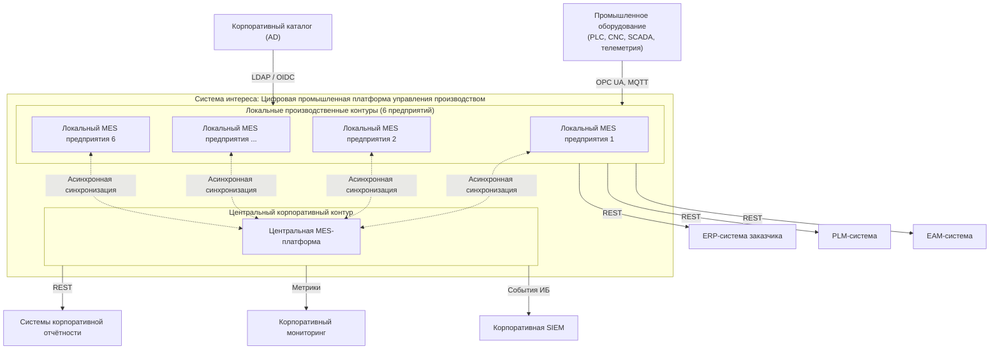

## 16.2. Локальные и центральный контуры

**Локальные производственные контуры** обеспечивают оперативное управление производством на каждом из шести предприятий. Каждый локальный контур является самостоятельной операционной единицей, включающей полный набор прикладных, платформенных, интеграционных и инфраструктурных компонентов, необходимых для выполнения производственных операций.

**Центральный корпоративный контур** обеспечивает консолидацию данных, корпоративные функции, межпредприятийную аналитику, централизованное администрирование и управление общесистемными настройками.

Взаимодействие между локальными и центральным контурами организовано по асинхронной модели с инициацией со стороны локального контура. Локальные контуры не образуют прямых связей между собой; обмен корпоративными данными проходит через центральный контур.

## 16.3. Взаимодействие с внешними системами

Таблица внешних взаимодействий.

| Внешняя система | Направление | Протокол / механизм | Назначение |
|---|---|---|---|
| Промышленное оборудование | Входящее | OPC UA, MQTT | Сбор производственных данных |
| SCADA / телеметрия | Входящее | OPC UA, MQTT, специализированные протоколы | Получение технологических данных |
| Корпоративный каталог (AD) | Исходящее | LDAP / OIDC | Аутентификация пользователей |
| ERP-система | Двунаправленное | REST / файловый обмен | Обмен заказами и НСИ |
| PLM-система | Входящее | REST / файловый обмен | Получение составов и технологий |
| EAM-система | Двунаправленное | REST | Обмен данными о ресурсах |
| Системы корпоративной отчётности | Исходящее | REST / выгрузка ClickHouse | Передача агрегированных данных |
| Корпоративный мониторинг | Исходящее | Pull / Push | Передача метрик |
| Корпоративная SIEM | Исходящее | Syslog / REST | Передача событий безопасности |

Каждое взаимодействие с внешней системой реализуется через интеграционный слой. Прямое взаимодействие внешних систем с прикладными сервисами MES не допускается.

## 16.4. Границы системы

В границах системы интереса находятся:

- локальные MES-контуры шести предприятий;
- центральный корпоративный контур;
- интеграционный слой MDC;
- сервисы синхронизации;
- операционные и аналитические хранилища;
- подсистемы идентификации, безопасности, мониторинга, журналирования;
- пользовательские интерфейсы.

За границами системы находятся:

- промышленное оборудование;
- корпоративные системы заказчика;
- корпоративный каталог;
- инфраструктура предприятия и ЦОД.

---

# 17. View «Функциональная декомпозиция MES»

**Соответствующий viewpoint:** VP-02 «Функциональная структура»
**ID view:** VW-17
**Concerns:** CN-05, CN-19, CN-20, CN-29
**Stakeholders:** SH-13, SH-14, SH-15, SH-16, SH-17, SH-19

## 17.1. Функциональные модули MES

Цифровая промышленная платформа включает тринадцать функциональных модулей MES, реализующих производственную предметную область.

| ID | Модуль | Назначение | Контур |
|---|---|---|---|
| CMP-001 | Общая НСИ и основные данные | Управление НСИ, справочниками, классификаторами | Локальный / Центральный |
| CMP-002 | Составы и технологии | Управление составами, спецификациями, маршрутами | Локальный / Центральный |
| CMP-003 | Производственная структура | Описание организационной и производственной структуры | Локальный / Центральный |
| CMP-004 | Управление ресурсами | Управление оборудованием, персоналом, инструментами | Локальный |
| CMP-005 | Управление заказами | Регистрация и сопровождение производственных заказов | Локальный / Центральный |
| CMP-006 | Планирование и расписания | Формирование планов и расписаний | Локальный |
| CMP-007 | Производственная логистика | Управление перемещением материалов и продукции | Локальный |
| CMP-008 | Управление операциями | Оперативное управление операциями и регистрация хода производства | Локальный |
| CMP-009 | Управление качеством | Контроль качества, несоответствия, корректирующие мероприятия | Локальный |
| CMP-010 | Управление документацией | Управление производственными и технологическими документами | Локальный / Центральный |
| CMP-011 | Управление проектами | Управление производственными и инженерными проектами | Локальный / Центральный |
| CMP-012 | Мониторинг оборудования | Получение и отображение состояния оборудования | Локальный |
| CMP-013 | Производственная аналитика | Оперативная и историческая аналитика | Локальный / Центральный |

## 17.2. Функциональные связи между модулями

Основной поток производственной информации между модулями.

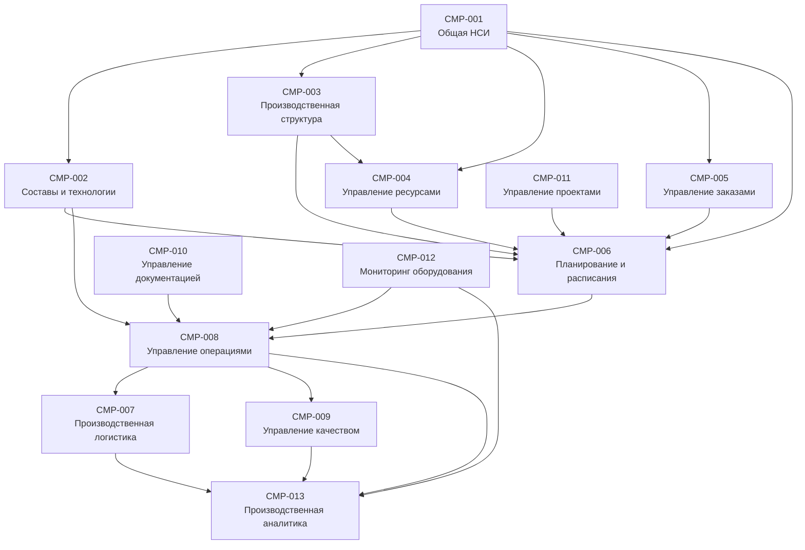

Связи между модулями реализуются через REST API и события Kafka. Прямой доступ одного модуля к внутренним данным другого модуля не допускается.

## 17.3. Разграничение локальных и центральных функций

| Модуль | Локальные функции | Центральные функции |
|---|---|---|
| Общая НСИ | Локальные справочники, оперативные данные | Корпоративные справочники, мастер-данные |
| Составы и технологии | Применение на предприятии | Централизованное управление, версионирование |
| Производственная структура | Структура предприятия | Корпоративная структура |
| Управление ресурсами | Полный цикл | Агрегированный просмотр |
| Управление заказами | Операционное управление | Консолидация, межзаводские заказы |
| Планирование и расписания | Полный цикл | Корпоративное планирование |
| Производственная логистика | Полный цикл | — |
| Управление операциями | Полный цикл | — |
| Управление качеством | Полный цикл | Агрегация, корпоративные метрики |
| Управление документацией | Локальные документы | Корпоративные документы |
| Управление проектами | Локальные проекты | Корпоративные проекты |
| Мониторинг оборудования | Полный цикл | Агрегированный мониторинг |
| Производственная аналитика | Локальная аналитика | Корпоративная аналитика |

Функции, отнесённые к локальному контуру, выполняются на предприятии независимо от доступности центрального ЦОД. Центральные функции доступны при наличии связи и не являются частью критического производственного цикла.

## 17.4. Соответствие concerns

| Concern | Обеспечивается |
|---|---|
| CN-05 Производительность операционного контура | CMP-005, CMP-006, CMP-007, CMP-008, CMP-012 |
| CN-19 Корпоративная аналитика | CMP-013 (центральная часть) |
| CN-20 Локальная аналитика | CMP-013 (локальная часть) |
| CN-29 Управление справочными данными | CMP-001, CMP-002, CMP-003 |

---

# 18. View «Логическая структура локального контура»

**Соответствующий viewpoint:** VP-03 «Логическая структура компонентов»
**ID view:** VW-18
**Concerns:** CN-06, CN-10, CN-14, CN-15, CN-17, CN-21, CN-30
**Stakeholders:** SH-03, SH-04, SH-05

## 18.1. Логические уровни

Локальный контур предприятия организован в девять логических уровней.

| Уровень | Назначение |
|---|---|
| Пользовательский | Интерфейсы операторов, технологов, диспетчеров, администраторов |
| API-уровень | Приём запросов, маршрутизация, аутентификация, авторизация |
| Прикладной MES-уровень | Реализация производственных функций |
| Платформенный | Общие механизмы конфигурации, доступа, аудита |
| Интеграционный | Взаимодействие с оборудованием и внешними системами |
| Событийный | Передача событий через Kafka |
| Операционное хранение | PostgreSQL, Redis |
| Аналитическое хранение | ClickHouse, DataLens |
| Эксплуатационный | Мониторинг, журналирование, диагностика |

## 18.2. Состав компонентов

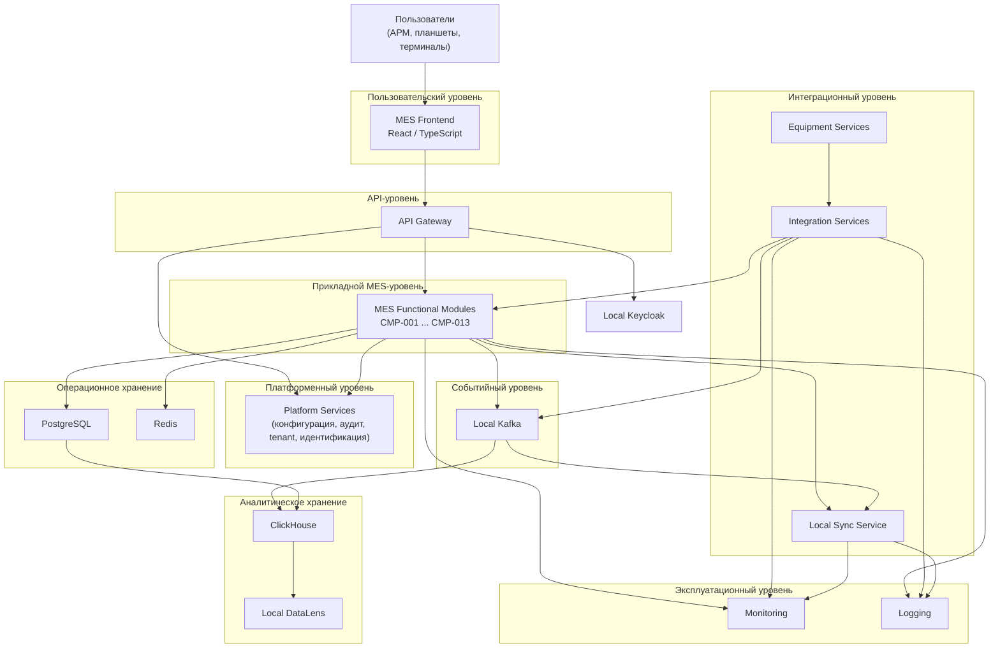

## 18.3. Таблица компонентов

| ID | Компонент | Уровень | Ответственность |
|---|---|---|---|
| SVC-001 | MES Frontend | Пользовательский | Интерфейсы пользователей |
| SVC-002 | API Gateway | API | Маршрутизация, аутентификация, авторизация |
| SVC-003 | MES Application | Прикладной | Реализация модулей CMP-001 — CMP-013 |
| SVC-004 | Platform Services | Платформенный | Конфигурация, аудит, tenant, идентификация |
| SVC-005 | Integration Services | Интеграционный | Преобразование данных, маршрутизация |
| SVC-006 | Equipment Services | Интеграционный | Взаимодействие с оборудованием |
| SVC-007 | Local Sync Service | Интеграционный | Синхронизация с центральным контуром |
| DS-001 | Local PostgreSQL | Операционное хранение | Операционные данные MES |
| DS-002 | Local Redis | Операционное хранение | Кэш, временные состояния |
| DS-003 | Local Kafka | Событийный | Событийный транспорт |
| DS-004 | Local ClickHouse | Аналитическое хранение | Локальная аналитика |
| DS-005 | Local File Storage | Операционное хранение | Файлы и документы |
| SVC-008 | Local Keycloak | Безопасность | Аутентификация, управление доступом |
| SVC-009 | Local Monitoring | Эксплуатационный | Сбор и обработка метрик |
| SVC-010 | Local Logging | Эксплуатационный | Сбор и обработка логов |
| SVC-011 | Local DataLens | Аналитический | Визуализация локальной аналитики |

## 18.4. Логические зависимости

В локальном контуре действуют следующие правила зависимостей:

1. Пользовательский уровень зависит от API-уровня.
2. API-уровень зависит от прикладного и платформенного уровней.
3. Прикладной уровень зависит от платформенного, событийного и операционного хранения.
4. Платформенный уровень не зависит от прикладного.
5. Интеграционный уровень зависит от событийного и прикладного.
6. Прикладной уровень не зависит от интеграционного напрямую (только через события).
7. Аналитическое хранение зависит от операционного и событийного.
8. Операционное хранение не зависит от аналитического.
9. Эксплуатационный уровень наблюдает все компоненты, но не влияет на их логику.
10. Циклические зависимости между уровнями не допускаются.

## 18.5. Соответствие concerns

| Concern | Обеспечивается |
|---|---|
| CN-06 Масштабируемость | Kubernetes-совместимые stateless-сервисы |
| CN-10 Авторизация | API Gateway, Platform Services, Local Keycloak |
| CN-14 Разделение нагрузок | Разделение PostgreSQL и ClickHouse |
| CN-15 Владение данными | Local PostgreSQL как источник истины |
| CN-17 Технологическая стандартизация | Единый стек Java/Spring Boot |
| CN-21 Управление конфигурацией | Platform Services |
| CN-30 Поддержка нескольких предприятий | Tenant-контекст в Platform Services |

---

# 19. View «Логическая структура центрального контура»

**Соответствующий viewpoint:** VP-03 «Логическая структура компонентов»
**ID view:** VW-19
**Concerns:** CN-06, CN-10, CN-14, CN-15, CN-17, CN-21, CN-30
**Stakeholders:** SH-03, SH-04, SH-05

## 19.1. Логические уровни

Центральный контур организован в те же девять логических уровней, что и локальный, но с иным назначением и составом компонентов.

| Уровень | Назначение |
|---|---|
| Пользовательский | Корпоративные интерфейсы, административные интерфейсы |
| API-уровень | Маршрутизация корпоративных запросов |
| Прикладной MES-уровень | Центральные сервисы, агрегация, административные функции |
| Платформенный | Общие механизмы корпоративного уровня |
| Интеграционный | Приём данных от предприятий, интеграция с корпоративными системами |
| Событийный | Центральный событийный транспорт |
| Операционное хранение | Центральный PostgreSQL |
| Аналитическое хранение | Центральный ClickHouse, DWH, DataLens |
| Эксплуатационный | Централизованный мониторинг и журналирование |

## 19.2. Состав компонентов

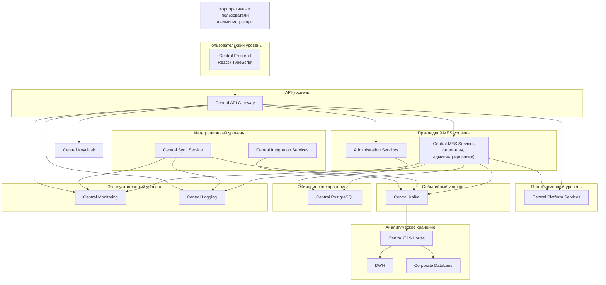

## 19.3. Таблица компонентов

| ID | Компонент | Уровень | Ответственность |
|---|---|---|---|
| SVC-101 | Central Frontend | Пользовательский | Корпоративные интерфейсы |
| SVC-102 | Central API Gateway | API | Маршрутизация корпоративных запросов |
| SVC-103 | Central MES Services | Прикладной | Агрегация, корпоративные функции |
| SVC-104 | Administration Services | Прикладной | Централизованное администрирование |
| SVC-105 | Central Platform Services | Платформенный | Корпоративные платформенные механизмы |
| SVC-106 | Central Sync Service | Интеграционный | Приём данных от предприятий |
| SVC-107 | Central Integration Services | Интеграционный | Интеграция с корпоративными системами |
| DS-101 | Central PostgreSQL | Операционное хранение | Центральные операционные данные |
| DS-102 | Central Kafka | Событийный | Корпоративный событийный транспорт |
| DS-103 | Central ClickHouse | Аналитическое хранение | Корпоративная аналитика |
| DS-104 | DWH | Аналитическое хранение | Корпоративное хранилище данных |
| DS-105 | Central File Storage | Операционное хранение | Корпоративные файлы |
| SVC-108 | Central Keycloak | Безопасность | Корпоративная идентификация |
| SVC-109 | Central Monitoring | Эксплуатационный | Централизованный мониторинг |
| SVC-110 | Central Logging | Эксплуатационный | Централизованное журналирование |
| SVC-111 | Corporate DataLens | Аналитический | Корпоративная визуализация |

## 19.4. Логические зависимости

В центральном контуре действуют следующие правила зависимостей:

1. Пользовательский уровень зависит от API-уровня.
2. API-уровень зависит от прикладного и платформенного уровней.
3. Прикладной уровень зависит от платформенного, событийного и операционного хранения.
4. Центральный Sync Service зависит от событийного уровня.
5. Центральный Sync Service не имеет прямой зависимости от прикладного уровня.
6. Аналитическое хранение зависит от событийного и операционного.
7. DWH получает данные из ClickHouse и внешних источников.
8. Эксплуатационный уровень наблюдает все компоненты.
9. Центральный контур не имеет прямой зависимости от локальных контуров.
10. Циклические зависимости между уровнями не допускаются.

## 19.5. Разграничение ответственности локального и центрального контуров

| Область | Локальный контур | Центральный контур |
|---|---|---|
| Производственные операции | Основной | Не участвует |
| Операторский UI | Локальный | Корпоративные интерфейсы |
| MES-приложения | Локальные | Агрегация и администрирование |
| Операционное хранение | Локальное | Центральное |
| Аналитическое хранение | Локальное | Корпоративное |
| Keycloak | Локальный | Центральный |
| Синхронизация | Local Sync | Central Sync |
| Мониторинг | Локальный | Централизованный |
| Журналирование | Локальное | Централизованное |
| Оборудование | Да | Нет |
| Зависимость от канала | Не критична | — |

## 19.6. Соответствие concerns

| Concern | Обеспечивается |
|---|---|
| CN-06 Масштабируемость | Kubernetes-совместимые stateless-сервисы |
| CN-10 Авторизация | Central API Gateway, Central Platform Services, Central Keycloak |
| CN-14 Разделение нагрузок | Центральный PostgreSQL отделён от ClickHouse и DWH |
| CN-15 Владение данными | Центральный контур получает копии и производные представления |
| CN-17 Технологическая стандартизация | Единый стек с локальным контуром |
| CN-21 Управление конфигурацией | Central Platform Services |
| CN-30 Поддержка нескольких предприятий | Tenant-контекст в Central Platform Services |

# Часть III. Views (продолжение)

---

# 20. View «Модель данных и владение данными»

**Соответствующий viewpoint:** VP-04 «Данные и владение данными»
**ID view:** VW-20
**Concerns:** CN-04, CN-14, CN-15, CN-19, CN-20, CN-28, CN-29, CN-30
**Stakeholders:** SH-03, SH-05, SH-19

## 20.1. Классификация данных

Данные в системе разделяются на несколько категорий, различающихся по источнику истины, направлению синхронизации и требованиям к хранению.

| Категория | Описание | Владелец | Хранение |
|---|---|---|---|
| Мастер-данные (НСИ) | Корпоративные справочники, классификаторы, общие производственные данные | Центральный контур | Центральный PostgreSQL + реплики в локальном PostgreSQL |
| Технологические данные | Составы, спецификации, маршруты, нормы | Центральный контур | Центральный PostgreSQL + реплики в локальном PostgreSQL |
| Производственная структура | Описание структуры предприятия | Центральный контур (эталон) / локальный (детализация) | Локальный PostgreSQL + агрегация в центральном |
| Операционные данные | Заказы, задания, операции, состояния ресурсов | Локальный контур | Локальный PostgreSQL |
| Данные качества | Результаты контроля, несоответствия | Локальный контур | Локальный PostgreSQL |
| Данные мониторинга оборудования | Телеметрия, состояния, аварии | Локальный контур | Локальный PostgreSQL + ClickHouse |
| События | Производственные, интеграционные, системные | Локальный контур (источник) | Local Kafka → Central Kafka |
| Аналитические данные | Агрегаты, витрины, KPI | Локальный и центральный | ClickHouse (локальный и центральный) |
| Конфигурация | Параметры, feature flags, настройки | Центральный (эталон) / локальный (переопределения) | PostgreSQL соответствующего контура |
| Аудит | Действия пользователей и систем | Локальный и центральный | PostgreSQL + Logging Stack |
| Файлы и документы | Производственные, технологические, нормативные документы | Локальный и центральный | File Storage соответствующего контура |

## 20.2. Владельцы данных

Для каждой категории данных определён владелец, отвечающий за создание, изменение, целостность и публикацию изменений.

| Категория | Владелец | Обоснование |
|---|---|---|
| Корпоративная НСИ | Центральный контур | Единая справочная информация для всех предприятий |
| Локальная НСИ | Локальный контур | Особенности конкретного предприятия |
| Технологии и составы | Центральный контур | Централизованное управление и версионирование |
| Производственные заказы | Локальный контур | Оперативное управление заказом на предприятии |
| Межзаводские заказы | Центральный контур | Координация между предприятиями |
| Производственные операции | Локальный контур | Выполняются на конкретном предприятии |
| Данные качества | Локальный контур | Регистрация на предприятии |
| Мониторинг оборудования | Локальный контур | Оборудование подключено к локальному контуру |
| Конфигурация предприятия | Локальный контур | Особенности предприятия |
| Корпоративная конфигурация | Центральный контур | Единые настройки |
| Аудит | Контур-источник события | Локальный или центральный |
| Аналитические витрины | Контур, формирующий витрину | Локальный или центральный |

## 20.3. Мастер-данные и реплики

Для мастер-данных применяется модель «эталон — реплика». Эталон хранится в центральном контуре, реплики — в локальных контурах.

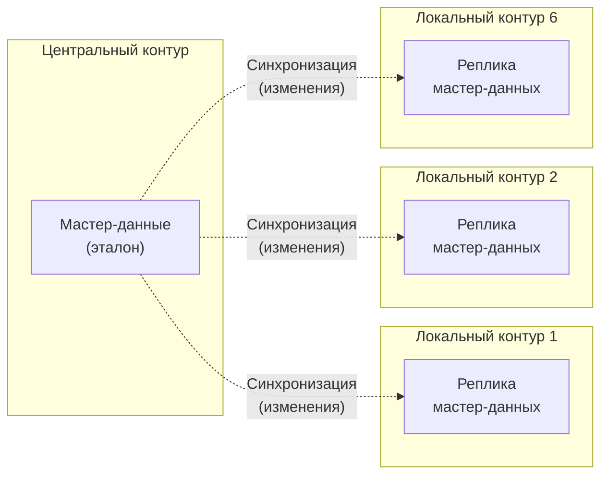

**Правила работы с мастер-данными:**

1. Изменения мастер-данных выполняются только в центральном контуре.
2. Изменения распространяются в локальные контуры асинхронно.
3. Локальный контур не изменяет мастер-данные.
4. Локальный контур может создавать локальные справочники, не конфликтующие с мастер-данными.
5. Конфликты между мастер-данными и локальными данными разрешаются в пользу мастер-данных.

**Правила работы с операционными данными:**

1. Операционные данные создаются и изменяются только в локальном контуре.
2. Центральный контур получает копии и агрегаты операционных данных.
3. Центральный контур не изменяет операционные данные локального контура.
4. Конфликты между копиями не возникают, поскольку источник истины один.

## 20.4. Жизненный цикл данных

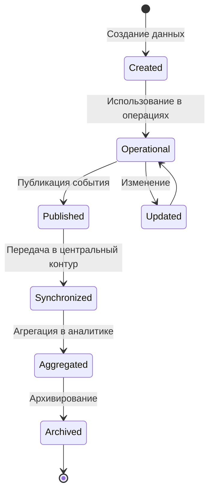

**Этапы жизненного цикла:**

| Этап | Описание | Контур |
|---|---|---|
| Создание | Формирование данных в источнике | Локальный или центральный |
| Операционное использование | Использование в производственных процессах | Локальный |
| Публикация события | Формирование события об изменении | Локальный |
| Синхронизация | Передача в центральный контур | Local → Central |
| Агрегация | Формирование аналитических представлений | ClickHouse |
| Архивирование | Перенос в долговременное хранение | Соответствующий контур |
| Удаление | Удаление по истечении retention | Соответствующий контур |

## 20.5. Разделение операционного и аналитического хранения

В архитектуре принято решение о разделении операционного и аналитического хранения.

| Хранилище | Назначение | Контур | Тип нагрузки |
|---|---|---|---|
| PostgreSQL | Операционные транзакционные данные | Локальный и центральный | OLTP |
| Redis | Кэш, временные состояния | Локальный и центральный | In-memory |
| Kafka | События и потоки данных | Локальный и центральный | Streaming |
| ClickHouse | Аналитические данные и витрины | Локальный и центральный | OLAP |
| DWH | Корпоративное хранилище данных | Центральный | OLAP |
| File Storage | Файлы и документы | Локальный и центральный | Object/File |
| DataLens | Визуализация аналитики | Локальный и центральный | BI |

**Правила разделения:**

1. Тяжёлые аналитические запросы не выполняются к PostgreSQL.
2. Передача данных из операционного слоя в аналитический выполняется через контролируемые потоки.
3. Kafka используется как источник данных для ClickHouse.
4. ClickHouse не участвует в транзакционной обработке.
5. DataLens работает только с аналитическими представлениями.

## 20.6. ER-диаграмма верхнего уровня

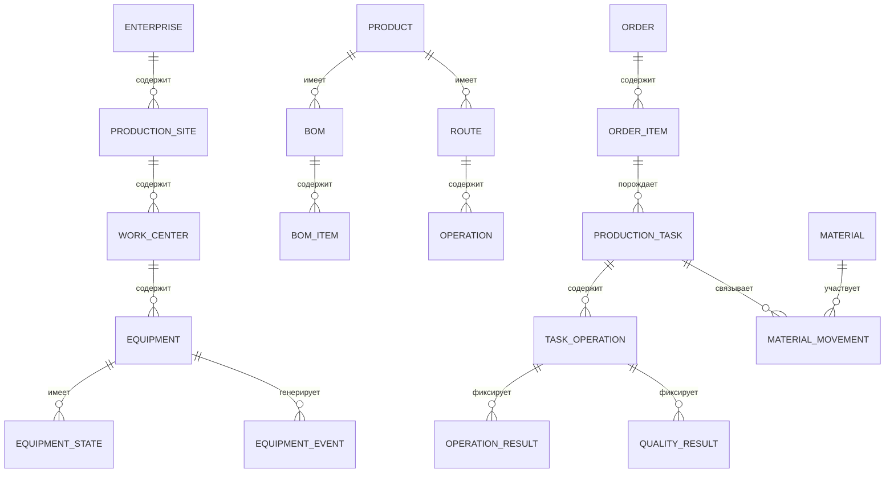

## 20.7. Потоки данных между хранилищами

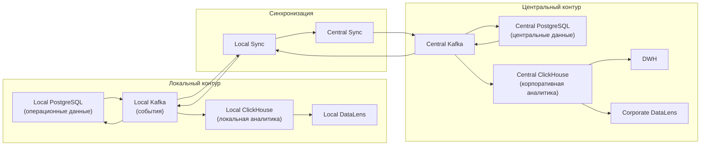

## 20.8. Правила разрешения конфликтов

| Тип конфликта | Правило разрешения |
|---|---|
| Мастер-данные vs локальные данные | Приоритет мастер-данных |
| Одновременное изменение мастер-данных из двух источников | Конфликт не возникает — мастер-данные изменяются только в центральном контуре |
| Повторная доставка события | Идемпотентная обработка по Message ID |
| Разные версии одного объекта | Приоритет по времени последнего изменения с фиксацией истории |
| Конфликт конфигурации | Приоритет централизованной конфигурации |

## 20.9. Соответствие concerns

| Concern | Обеспечивается |
|---|---|
| CN-04 Согласованность данных | Идемпотентность, правила разрешения конфликтов |
| CN-14 Разделение нагрузок | Разделение PostgreSQL и ClickHouse |
| CN-15 Владение данными | Явные владельцы для каждой категории |
| CN-19 Корпоративная аналитика | Центральный ClickHouse, DWH, DataLens |
| CN-20 Локальная аналитика | Локальный ClickHouse, DataLens |
| CN-28 Сохранность данных | Резервное копирование, retention |
| CN-29 Управление справочными данными | Модель «эталон — реплика» |
| CN-30 Поддержка нескольких предприятий | Tenant-контекст |

---

# 21. View «Интеграционные контракты»

**Соответствующий viewpoint:** VP-05 «Интеграция и контракты»
**ID view:** VW-21
**Concerns:** CN-13, CN-16, CN-24
**Stakeholders:** SH-05, SH-07, SH-10

## 21.1. REST API контракты

REST API используются для синхронного взаимодействия между компонентами системы.

| ID | API | Назначение | Протокол | Версионирование |
|---|---|---|---|---|
| API-001 | Frontend API | Взаимодействие UI с backend | REST/HTTPS | v1 |
| API-002 | MES Module API | Межмодульное взаимодействие | REST/HTTPS | v1 |
| API-003 | Platform API | Платформенные сервисы | REST/HTTPS | v1 |
| API-004 | Integration API | Интеграционные сервисы | REST/HTTPS | v1 |
| API-005 | Sync API | Синхронизация контуров | REST/HTTPS | v1 |
| API-006 | Admin API | Административные функции | REST/HTTPS | v1 |
| API-007 | External API | Взаимодействие с внешними системами | REST/HTTPS | v1 |

**Правила REST API:**

1. Все API используют HTTPS.
2. Все API версионируются через URL (`/api/v1/...`).
3. Все API используют единый формат ошибок.
4. Все API поддерживают correlation ID.
5. Все API аутентифицируются через Keycloak (OIDC).
6. Все API документируются через OpenAPI.
7. Изменения контрактов учитывают обратную совместимость.

## 21.2. Схемы Kafka-событий

Kafka используется для асинхронного взаимодействия. События описываются через AsyncAPI.

| Категория событий | Назначение | Схема |
|---|---|---|
| Производственные события | Фиксация фактов производства | EVT-PROD-v1 |
| События заказов | Изменение состояния заказов | EVT-ORDER-v1 |
| События операций | Запуск, завершение операций | EVT-OPER-v1 |
| События качества | Результаты контроля | EVT-QA-v1 |
| События оборудования | Состояния, аварии | EVT-EQUIP-v1 |
| События синхронизации | Управление синхронизацией | EVT-SYNC-v1 |
| События аудита | Аудит действий | EVT-AUDIT-v1 |
| События конфигурации | Изменения конфигурации | EVT-CONF-v1 |

**Структура события:**

```json
{
  "eventId": "uuid",
  "eventType": "OPERATION_COMPLETED",
  "eventVersion": "1.0",
  "source": "local-mes-enterprise-1",
  "enterpriseId": "ENT-001",
  "timestamp": "2026-09-19T10:15:30Z",
  "correlationId": "uuid",
  "businessObjectId": "TASK-12345",
  "schemaVersion": "1.0",
  "payload": { }
}
```

## 21.3. Версионирование контрактов

| Тип изменения | Версия | Совместимость |
|---|---|---|
| Добавление необязательного поля | Minor | Обратная совместимость |
| Добавление обязательного поля | Major | Требует обновления потребителей |
| Удаление поля | Major | Требует обновления потребителей |
| Изменение типа поля | Major | Требует обновления потребителей |
| Изменение семантики | Major | Требует обновления потребителей |
| Изменение документации | Patch | Совместимо |

## 21.4. Правила совместимости

1. Производители событий и потребители обновляются независимо.
2. Новые поля добавляются как необязательные.
3. Удаление полей выполняется только в новой major-версии.
4. Период поддержки предыдущей major-версии — не менее 6 месяцев.
5. Потребители должны игнорировать неизвестные поля.
6. Схемы событий хранятся в Schema Registry.
7. Изменения схем проходят проверку совместимости.

## 21.5. Диаграмма интеграционных потоков

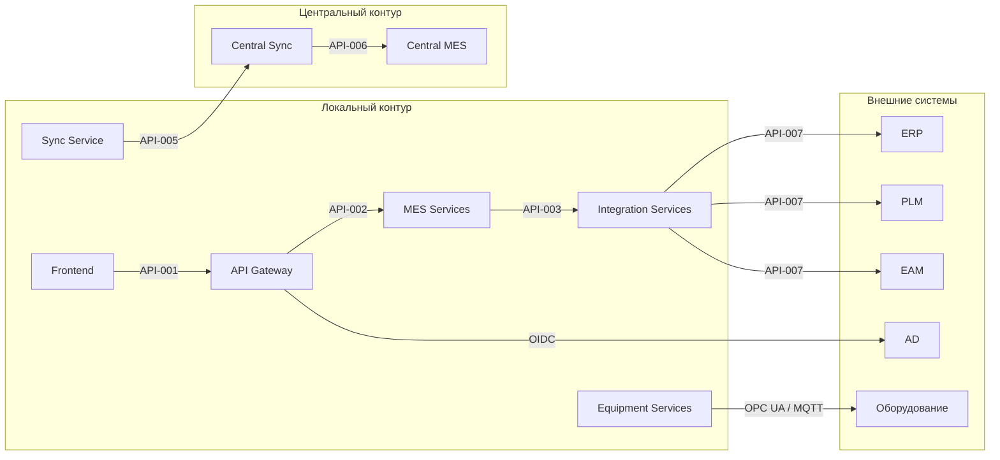

## 21.6. Соответствие concerns

| Concern | Обеспечивается |
|---|---|
| CN-13 Интеграция с оборудованием | Integration Services, Equipment Services |
| CN-16 Контракты и совместимость | Версионирование, Schema Registry, правила совместимости |
| CN-24 Взаимодействие с корпоративными системами | External API, Integration Services |

---

# 22. View «Событийная модель»

**Соответствующий viewpoint:** VP-06 «Событийное взаимодействие»
**ID view:** VW-22
**Concerns:** CN-03, CN-04, CN-08, CN-16
**Stakeholders:** SH-05, SH-10, SH-12

## 22.1. Классификация событий

| Категория | Описание | Источник | Потребители |
|---|---|---|---|
| Производственные | Факты производства | MES-модули | Analytics, Sync, Audit |
| Заказов | Изменения заказов | CMP-005 | Planning, Sync, Analytics |
| Операций | Запуск/завершение операций | CMP-008 | Quality, Analytics, Sync |
| Качества | Результаты контроля | CMP-009 | Analytics, Sync |
| Оборудования | Состояния, аварии | CMP-012 | Operations, Analytics, Sync |
| Синхронизации | Управление синхронизацией | Sync Service | Sync Service, Monitoring |
| Аудита | Действия пользователей и систем | Platform Services | Audit, SIEM |
| Конфигурации | Изменения конфигурации | Platform Services | All modules |

## 22.2. Топики Kafka

| ID | Топик | Назначение | Партиции | Retention |
|---|---|---|---|---|
| TOP-001 | mes.production.events | Производственные события | 12 | 7 дней |
| TOP-002 | mes.order.events | События заказов | 6 | 30 дней |
| TOP-003 | mes.operation.events | События операций | 12 | 30 дней |
| TOP-004 | mes.quality.events | События качества | 6 | 90 дней |
| TOP-005 | mes.equipment.events | События оборудования | 12 | 30 дней |
| TOP-006 | mes.sync.events | События синхронизации | 6 | 30 дней |
| TOP-007 | mes.audit.events | События аудита | 6 | 365 дней |
| TOP-008 | mes.config.events | События конфигурации | 3 | 90 дней |
| TOP-009 | mes.analytics.events | События для аналитики | 12 | 30 дней |
| TOP-010 | mes.integration.events | Интеграционные события | 6 | 30 дней |

## 22.3. Производители и потребители

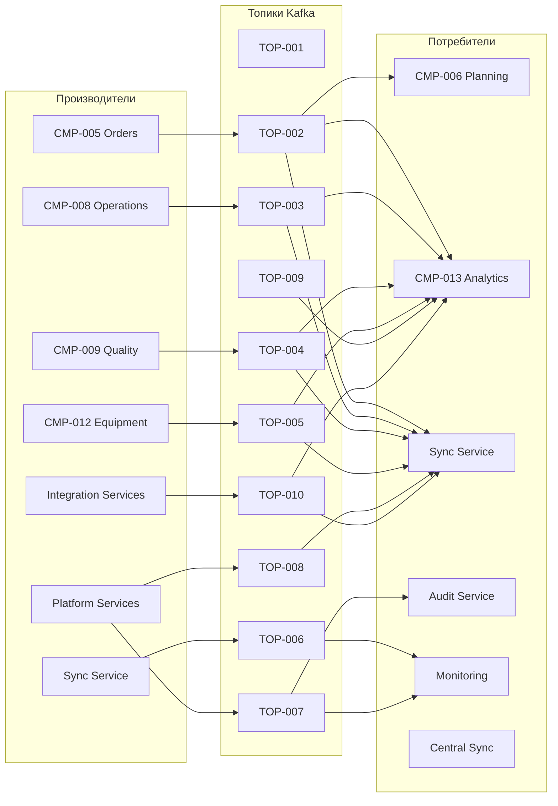

## 22.4. Гарантии доставки и порядок

| Категория событий | Гарантия | Порядок | Ключ партиционирования |
|---|---|---|---|
| Производственные | At-least-once | По businessObjectId | businessObjectId |
| Заказов | At-least-once | По orderId | orderId |
| Операций | At-least-once | По operationId | operationId |
| Качества | At-least-once | По qualityCheckId | qualityCheckId |
| Оборудования | At-least-once | По equipmentId | equipmentId |
| Синхронизации | At-least-once | По messageId | messageId |
| Аудита | At-least-once | По auditId | auditId |
| Конфигурации | At-least-once | По configKey | configKey |

## 22.5. Идемпотентность

Для обеспечения идемпотентности каждый потребитель выполняет следующие действия:

1. Получает событие с уникальным `eventId`.
2. Проверяет наличие `eventId` в хранилище обработанных событий.
3. Если событие уже обработано — игнорирует его.
4. Если событие новое — выполняет бизнес-обработку и фиксирует `eventId`.
5. Фиксирует offset в Kafka только после успешной обработки.

**Хранилище обработанных событий:**

- для локального контура — таблица `processed_events` в PostgreSQL;
- для центрального контура — таблица `processed_events` в центральном PostgreSQL;
- для высоконагруженных сценариев — Redis с TTL.

## 22.6. Жизненный цикл события

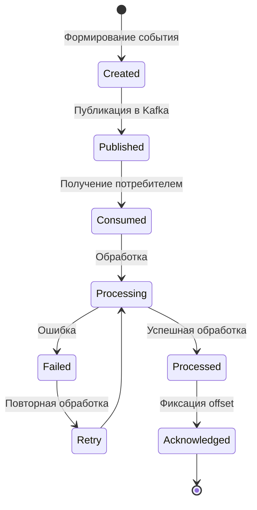

## 22.7. Схемы событий

Все события описываются через AsyncAPI и хранятся в Schema Registry.

| Схема | Назначение | Версия |
|---|---|---|
| EVT-PROD-v1 | Производственные события | 1.0 |
| EVT-ORDER-v1 | События заказов | 1.0 |
| EVT-OPER-v1 | События операций | 1.0 |
| EVT-QA-v1 | События качества | 1.0 |
| EVT-EQUIP-v1 | События оборудования | 1.0 |
| EVT-SYNC-v1 | События синхронизации | 1.0 |
| EVT-AUDIT-v1 | События аудита | 1.0 |
| EVT-CONF-v1 | События конфигурации | 1.0 |

## 22.8. Соответствие concerns

| Concern | Обеспечивается |
|---|---|
| CN-03 Асинхронная синхронизация | Топики синхронизации, Sync Service |
| CN-04 Согласованность данных | Идемпотентность, порядок по ключу |
| CN-08 Наблюдаемость | Метрики Kafka, топики аудита |
| CN-16 Контракты и совместимость | Schema Registry, версионирование схем |

---

# 23. View «Взаимодействие с промышленным оборудованием»

**Соответствующий viewpoint:** VP-05 «Интеграция и контракты» (в части CN-13), VP-06 «Событийное взаимодействие»
**ID view:** VW-23
**Concerns:** CN-13, CN-26
**Stakeholders:** SH-10, SH-11, SH-14, SH-21

## 23.1. Цепочка интеграции

Взаимодействие с промышленным оборудованием строится через промежуточный интеграционный слой, изолирующий прикладные сервисы MES от особенностей промышленных протоколов и конкретных моделей оборудования.

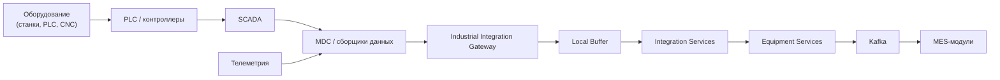

## 23.2. Протоколы OPC UA и MQTT

| Протокол | Применение | Преимущества | Ограничения |
|---|---|---|---|
| OPC UA | Взаимодействие с PLC, SCADA, системами автоматизации | Стандартизация, безопасность, богатая модель данных | Требует поддержки на оборудовании |
| MQTT | Телеметрия, IoT-источники, устройства с ограниченными ресурсами | Лёгкость, publish/subscribe, масштабируемость | Меньше семантики, чем OPC UA |
| Специализированные протоколы | Оборудование без поддержки OPC UA/MQTT | Интеграция существующего парка | Требуют адаптеров |

**Правила выбора:**

1. OPC UA используется везде, где оборудование его поддерживает.
2. MQTT используется для телеметрии и устройств с ограниченными ресурсами.
3. Специализированные протоколы используются через адаптеры в MDC.
4. MES-модули не работают с промышленными протоколами напрямую.

## 23.3. Нормализация и валидация данных

Интеграционный слой выполняет следующие операции:

| Операция | Описание |
|---|---|
| Получение данных | Сбор данных от оборудования через поддерживаемые протоколы |
| Преобразование протоколов | Приведение к внутреннему формату |
| Нормализация | Приведение к единой модели данных |
| Валидация | Проверка обязательных полей, диапазонов, типов |
| Обогащение | Добавление метаданных (предприятие, оборудование, время) |
| Буферизация | Сохранение при временной недоступности потребителей |
| Публикация | Передача в Kafka и MES |

**Модель нормализованного сообщения:**

```json
{
  "messageId": "uuid",
  "source": "equipment",
  "enterpriseId": "ENT-001",
  "equipmentId": "EQ-12345",
  "timestamp": "2026-09-19T10:15:30Z",
  "protocol": "OPC_UA",
  "dataType": "STATE",
  "payload": {
    "state": "RUNNING",
    "metrics": { }
  }
}
```

## 23.4. Буферизация и отказоустойчивость

Интеграционный слой обеспечивает устойчивость к временным отказам.

| Механизм | Назначение |
|---|---|
| Local Buffer | Накопление данных при недоступности Integration Services |
| Kafka | Буферизация событий при недоступности потребителей |
| Retry | Повторная обработка при временных ошибках |
| Circuit Breaker | Защита от каскадных отказов |
| Dead Letter Queue | Сохранение необработанных сообщений |
| Monitoring | Контроль состояния интеграционных каналов |

## 23.5. Сетевые границы

Взаимодействие с оборудованием проходит через контролируемые сетевые границы.

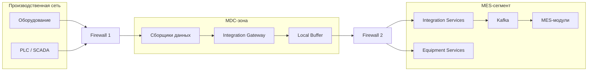

**Правила сетевого взаимодействия:**

1. Оборудование не имеет прямого доступа к MES-сегменту.
2. MDC-зона изолирована от производственной сети и MES-сегмента.
3. Все взаимодействия проходят через firewall.
4. Направления и порты строго регламентированы.
5. MES-модули не являются сетевыми участниками производственной сети.

## 23.6. Соответствие concerns

| Concern | Обеспечивается |
|---|---|
| CN-13 Интеграция с оборудованием | MDC, Integration Gateway, Integration Services, Equipment Services |
| CN-26 Производственная безопасность | Изоляция производственной сети, firewall, MDC-зона |

# Часть III. Views (продолжение)

---

# 24. View «Развёртывание локального контура»

**Соответствующий viewpoint:** VP-07 «Развёртывание и инфраструктура»
**ID view:** VW-24
**Concerns:** CN-01, CN-02, CN-05, CN-06, CN-07, CN-11, CN-18, CN-22, CN-25, CN-26
**Stakeholders:** SH-06, SH-09, SH-11

## 24.1. Сетевые зоны

Локальный контур предприятия разделён на пять логических сетевых зон, изолированных контролируемыми границами.

| ID | Зона | Назначение | Критичность |
|---|---|---|---|
| ZONE-L1 | Производственная сеть | Оборудование, PLC, SCADA, телеметрия | Критическая |
| ZONE-L2 | MDC-зона | Промышленная интеграция, сбор данных | Критическая |
| ZONE-L3 | MES-сегмент | Прикладные и инфраструктурные компоненты MES | Критическая |
| ZONE-L4 | Корпоративная сеть предприятия | Пользовательские АРМ, планшеты, терминалы | Высокая |
| ZONE-L5 | Граница ЦОД | Канал связи с центральным контуром | Высокая |

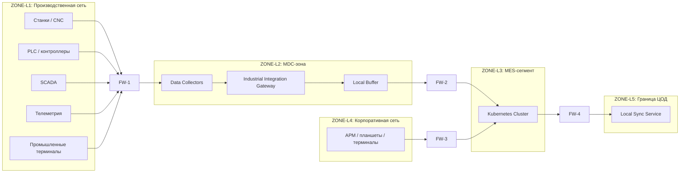

## 24.2. Размещение компонентов

| Компонент | Зона | Тип размещения |
|---|---|---|
| MES Frontend | ZONE-L3 | Kubernetes (stateless) |
| API Gateway | ZONE-L3 | Kubernetes (stateless) |
| MES Application | ZONE-L3 | Kubernetes (stateless) |
| Platform Services | ZONE-L3 | Kubernetes (stateless) |
| Integration Services | ZONE-L3 | Kubernetes (stateless) |
| Equipment Services | ZONE-L3 | Kubernetes (stateless) |
| Local Sync Service | ZONE-L3 / ZONE-L5 | Kubernetes (stateless) |
| Local Keycloak | ZONE-L3 | Kubernetes |
| Local PostgreSQL | ZONE-L3 | Kubernetes / выделенный узел (stateful) |
| Local Kafka | ZONE-L3 | Kubernetes / выделенный узел (stateful) |
| Local Redis | ZONE-L3 | Kubernetes (stateful) |
| Local ClickHouse | ZONE-L3 | Kubernetes / выделенный узел (stateful) |
| Local File Storage | ZONE-L3 | Kubernetes / выделенное хранилище |
| Local Monitoring | ZONE-L3 | Kubernetes |
| Local Logging | ZONE-L3 | Kubernetes |
| Local DataLens | ZONE-L3 | Kubernetes |
| MDC Collectors | ZONE-L2 | Выделенные узлы |
| Industrial Integration Gateway | ZONE-L2 | Выделенные узлы |
| Local Buffer | ZONE-L2 | Выделенное хранилище |

## 24.3. Kubernetes-кластер

Локальный Kubernetes-кластер включает следующие группы компонентов.

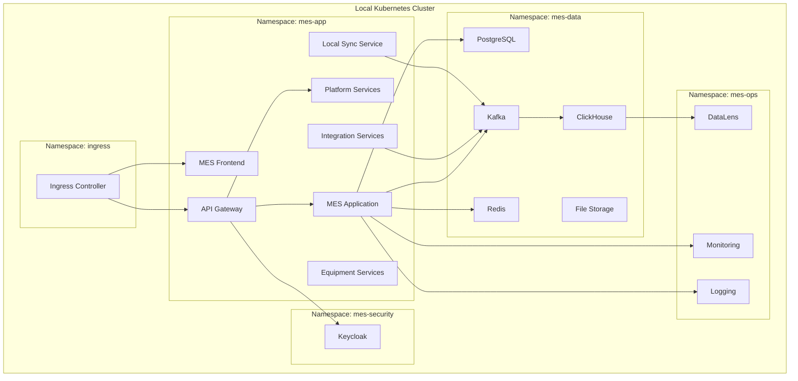

**Правила размещения:**

1. Stateless-компоненты масштабируются горизонтально.
2. Stateful-компоненты используют PersistentVolume.
3. Критические компоненты имеют ресурсные лимиты и requests.
4. Namespace разделяют компоненты по назначению.
5. NetworkPolicy ограничивает взаимодействие между namespace.
6. Ingress Controller обеспечивает доступ из корпоративной сети.
7. Health-checks и readiness/liveness probes обязательны для всех сервисов.

## 24.4. Пользовательский доступ

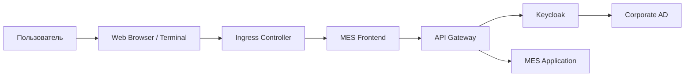

**Правила пользовательского доступа:**

1. Пользовательский доступ осуществляется через браузер.
2. Frontend развёрнут локально.
3. API Gateway обеспечивает маршрутизацию и аутентификацию.
4. Keycloak взаимодействует с корпоративным AD.
5. При недоступности ЦОД пользовательский доступ сохраняется.

## 24.5. Ресурсные требования

| Компонент | CPU | RAM | Storage |
|---|---|---|---|
| MES Frontend | 0.5 ядра × 2 реплики | 512 МБ × 2 | — |
| API Gateway | 1 ядро × 2 реплики | 1 ГБ × 2 | — |
| MES Application | 2 ядра × 3 реплики | 4 ГБ × 3 | — |
| Platform Services | 1 ядро × 2 реплики | 2 ГБ × 2 | — |
| Integration Services | 1 ядро × 2 реплики | 2 ГБ × 2 | — |
| Equipment Services | 1 ядро × 2 реплики | 2 ГБ × 2 | — |
| Local Sync Service | 0.5 ядра × 2 реплики | 1 ГБ × 2 | — |
| PostgreSQL | 4 ядра | 16 ГБ | 500 ГБ SSD |
| Kafka | 4 ядра × 3 брокера | 8 ГБ × 3 | 1 ТБ × 3 |
| Redis | 2 ядра | 8 ГБ | 50 ГБ |
| ClickHouse | 4 ядра | 16 ГБ | 1 ТБ |
| Keycloak | 1 ядро × 2 реплики | 2 ГБ × 2 | — |
| Monitoring | 2 ядра | 4 ГБ | 100 ГБ |
| Logging | 2 ядра | 4 ГБ | 200 ГБ |
| DataLens | 2 ядра | 4 ГБ | — |

Ресурсные требования уточняются по результатам нагрузочного тестирования.

## 24.6. Типовой шаблон развёртывания

```text
Enterprise Deployment Template
│
├── Production Network (ZONE-L1)
│
├── MDC Zone (ZONE-L2)
│   ├── Data Collectors
│   ├── Industrial Integration Gateway
│   └── Local Buffer
│
├── MES Segment (ZONE-L3)
│   ├── Kubernetes Cluster
│   │   ├── mes-app namespace
│   │   ├── mes-data namespace
│   │   ├── mes-security namespace
│   │   ├── mes-ops namespace
│   │   └── ingress namespace
│   └── Persistent Storage
│
├── Corporate Network (ZONE-L4)
│   └── User Workplaces
│
└── Data Center Boundary (ZONE-L5)
    └── Local Sync Service
```

## 24.7. Соответствие concerns

| Concern | Обеспечивается |
|---|---|
| CN-01 Автономность | Локальные компоненты, Local Sync Service |
| CN-02 Непрерывность | Kubernetes, изоляция зон |
| CN-05 Производительность | Ресурсные требования, репликация |
| CN-06 Масштабируемость | Kubernetes, горизонтальное масштабирование |
| CN-07 Отказоустойчивость | Реплики, HA-конфигурации |
| CN-11 Сетевая безопасность | Сетевые зоны, firewall |
| CN-18 Сопровождаемость | Типовой шаблон развёртывания |
| CN-22 Обновление ПО | Kubernetes, rolling updates |
| CN-25 Стоимость владения | Типовой шаблон снижает стоимость |
| CN-26 Производственная безопасность | Изоляция производственной сети |

---

# 25. View «Развёртывание центрального контура»

**Соответствующий viewpoint:** VP-07 «Развёртывание и инфраструктура»
**ID view:** VW-25
**Concerns:** CN-06, CN-07, CN-11, CN-18, CN-19, CN-22, CN-25
**Stakeholders:** SH-06, SH-09, SH-11, SH-19

## 25.1. Сетевые зоны ЦОД

Центральный контур ЦОД разделён на пять логических зон.

| ID | Зона | Назначение |
|---|---|---|
| ZONE-C1 | Зона внешних подключений | Приём подключений от предприятий |
| ZONE-C2 | Зона безопасности | Keycloak, SIEM, сервисы ИБ |
| ZONE-C3 | Зона центральных приложений | Central MES, Platform, Admin |
| ZONE-C4 | Зона хранения и аналитики | PostgreSQL, ClickHouse, DWH, Kafka |
| ZONE-C5 | Корпоративная зона | Пользовательские АРМ, BI |

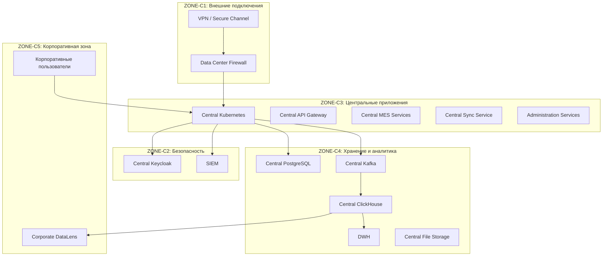

## 25.2. Размещение компонентов

| Компонент | Зона | Тип размещения |
|---|---|---|
| Central Frontend | ZONE-C3 | Kubernetes (stateless) |
| Central API Gateway | ZONE-C3 | Kubernetes (stateless) |
| Central MES Services | ZONE-C3 | Kubernetes (stateless) |
| Administration Services | ZONE-C3 | Kubernetes (stateless) |
| Central Platform Services | ZONE-C3 | Kubernetes (stateless) |
| Central Sync Service | ZONE-C3 | Kubernetes (stateless) |
| Central Integration Services | ZONE-C3 | Kubernetes (stateless) |
| Central Keycloak | ZONE-C2 | Kubernetes |
| Central PostgreSQL | ZONE-C4 | Выделенный кластер (stateful) |
| Central Kafka | ZONE-C4 | Выделенный кластер (stateful) |
| Central ClickHouse | ZONE-C4 | Выделенный кластер (stateful) |
| DWH | ZONE-C4 | Выделенный кластер |
| Central File Storage | ZONE-C4 | Выделенное хранилище |
| Central Monitoring | ZONE-C3 | Kubernetes |
| Central Logging | ZONE-C3 | Kubernetes |
| Corporate DataLens | ZONE-C5 | Kubernetes |

## 25.3. Kubernetes-кластер

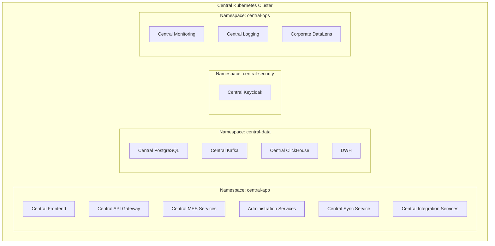

## 25.4. Корпоративный доступ


## 25.5. Масштабирование центрального контура

| Компонент | Стратегия масштабирования |
|---|---|
| Central API Gateway | Горизонтальное, по нагрузке |
| Central MES Services | Горизонтальное, по нагрузке |
| Central Sync Service | Горизонтальное, по количеству предприятий |
| Central Kafka | Увеличение брокеров и партиций |
| Central PostgreSQL | Репликация, шардирование при необходимости |
| Central ClickHouse | Увеличение узлов, шардирование |
| DWH | Увеличение узлов |
| Central Keycloak | Горизонтальное, кластеризация |

## 25.6. Соответствие concerns

| Concern | Обеспечивается |
|---|---|
| CN-06 Масштабируемость | Kubernetes, стратегии масштабирования |
| CN-07 Отказоустойчивость | HA-конфигурации, репликация |
| CN-11 Сетевая безопасность | Сетевые зоны, firewall |
| CN-18 Сопровождаемость | Типовой шаблон, единая модель |
| CN-19 Корпоративная аналитика | ClickHouse, DWH, DataLens |
| CN-22 Обновление ПО | Kubernetes, rolling updates |
| CN-25 Стоимость владения | Централизованное размещение |

---

# 26. View «Синхронизация локального и центрального контуров»

**Соответствующий viewpoint:** VP-08 «Синхронизация контуров»
**ID view:** VW-26
**Concerns:** CN-01, CN-03, CN-04, CN-07, CN-27
**Stakeholders:** SH-03, SH-10, SH-12

## 26.1. Архитектура сервисов синхронизации

Синхронизация реализуется двумя компонентами: Local Sync Service и Central Sync Service. Взаимодействие инициируется локальной стороной.

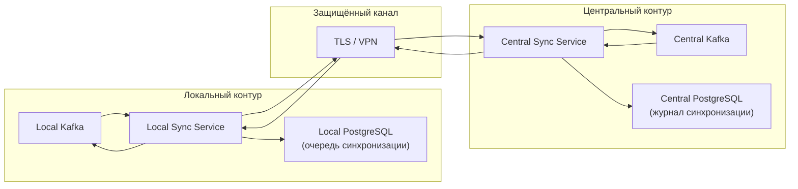

## 26.2. Направления синхронизации

| Категория данных | Направление | Периодичность | Приоритет |
|---|---|---|---|
| Производственные события | Local → Central | Непрерывно | Высокий |
| Результаты операций | Local → Central | Непрерывно | Высокий |
| Телеметрия | Local → Central | Пакетами | Средний |
| Данные качества | Local → Central | Непрерывно | Высокий |
| Агрегированные показатели | Local → Central | По расписанию | Средний |
| Корпоративная НСИ | Central → Local | При изменении | Высокий |
| Централизованная конфигурация | Central → Local | При изменении | Высокий |
| Управляющие сообщения | Central → Local | По необходимости | Высокий |
| Статус доставки | Local ↔ Central | Непрерывно | Средний |

## 26.3. Жизненный цикл сообщения

```mermaid
stateDiagram-v2
    [*] --> Created: Формирование
    Created --> Queued: Постановка в очередь
    Queued --> Sent: Отправка
    Sent --> Received: Получение
    Received --> Processed: Обработка
    Processed --> Acknowledged: Подтверждение
    Acknowledged --> [*]
    Sent --> RetryQueue: Ошибка
    RetryQueue --> Sent: Повтор
    Received --> Failed: Ошибка обработки
    Failed --> RetryQueue: Повтор
```

**Хранилище очереди:**

- локальная очередь — таблица `sync_outbox` в Local PostgreSQL;
- журнал обработанных — таблица `sync_processed` в Central PostgreSQL;
- для быстрого доступа — Redis.

## 26.4. Обработка разрывов связи

```mermaid
flowchart TB
    START["Нормальная работа"]
    CHECK["Проверка связи"]
    AVAILABLE["Связь доступна"]
    UNAVAILABLE["Связь недоступна"]
    ACCUMULATE["Накопление в локальной очереди"]
    RETRY["Периодическая попытка восстановления"]
    RESTORE["Восстановление связи"]
    SEND["Отправка накопленных сообщений"]
    CONFIRM["Подтверждение обработки"]

    START --> CHECK
    CHECK --> AVAILABLE
    CHECK --> UNAVAILABLE
    AVAILABLE --> SEND
    UNAVAILABLE --> ACCUMULATE
    ACCUMULATE --> RETRY
    RETRY --> RESTORE
    RESTORE --> SEND
    SEND --> CONFIRM
    CONFIRM --> START
```

**Правила обработки разрывов:**

1. При недоступности канала сообщения накапливаются в локальной очереди.
2. Local Sync Service периодически пытается восстановить соединение.
3. При восстановлении связи накопленные сообщения отправляются в порядке приоритета.
4. Каждое сообщение имеет уникальный идентификатор для дедупликации.
5. Подтверждение обработки фиксируется в журнале.
6. Ошибки передачи не блокируют локальные производственные процессы.

## 26.5. Идемпотентность

| Механизм | Описание |
|---|---|
| Message ID | Уникальный идентификатор сообщения |
| Event ID | Уникальный идентификатор события |
| Business Object ID | Идентификатор бизнес-объекта |
| Processed Store | Хранилище обработанных сообщений |
| Deduplication Window | Окно дедупликации (например, 7 дней) |

**Правила идемпотентности:**

1. Каждое сообщение имеет уникальный `messageId`.
2. Получатель проверяет `messageId` в хранилище обработанных.
3. Если сообщение уже обработано — подтверждает и игнорирует.
4. Если сообщение новое — обрабатывает и фиксирует.
5. Дедупликация выполняется по `messageId` и `businessObjectId`.

## 26.6. Разрешение конфликтов

| Тип конфликта | Правило |
|---|---|
| Мастер-данные vs локальные изменения | Приоритет мастер-данных |
| Одновременное изменение операционных данных | Конфликт не возникает (один источник истины) |
| Разные версии события | Приоритет по времени с фиксацией истории |
| Повторная доставка | Идемпотентная обработка |
| Конфликт конфигурации | Приоритет централизованной конфигурации |

## 26.7. Метрики синхронизации

| Метрика | Описание | Целевое значение |
|---|---|---|
| sync_pending_messages | Количество сообщений в очереди | ≤ 10 000 |
| sync_oldest_message_age | Возраст самого старого сообщения | ≤ 24 ч |
| sync_success_rate | Доля успешных доставок | ≥ 99.9% |
| sync_error_rate | Доля ошибок | ≤ 0.1% |
| sync_retry_count | Количество повторных попыток | ≤ 3 на сообщение |
| sync_connection_status | Состояние соединения | Up/Down |
| sync_latency | Задержка доставки | ≤ 5 мин (при доступном канале) |
| sync_throughput | Пропускная способность | По нагрузке |

## 26.8. Соответствие concerns

| Concern | Обеспечивается |
|---|---|
| CN-01 Автономность | Локальная очередь, независимость от ЦОД |
| CN-03 Асинхронная синхронизация | Local Sync / Central Sync, Kafka |
| CN-04 Согласованность данных | Идемпотентность, разрешение конфликтов |
| CN-07 Отказоустойчивость | Retry, буферизация, восстановление |
| CN-27 Восстановление после отказа | Журнал синхронизации, метрики |

---

# 27. View «Автономная работа предприятия»

**Соответствующий viewpoint:** VP-13 «Автономная работа»
**ID view:** VW-27
**Concerns:** CN-01, CN-02, CN-07
**Stakeholders:** SH-01, SH-13, SH-22

## 27.1. Режим автономной работы

Автономный режим — состояние локального контура, при котором центральный контур недоступен, но локальные производственные операции продолжаются.

```mermaid
flowchart TB
    NORMAL["Нормальный режим\n(связь с ЦОД есть)"]
    DEGRADED["Автономный режим\n(связь с ЦОД отсутствует)"]
    RESTORE["Режим восстановления\n(связь восстановлена)"]

    NORMAL -->|Потеря связи| DEGRADED
    DEGRADED -->|Восстановление связи| RESTORE
    RESTORE -->|Синхронизация завершена| NORMAL
```

## 27.2. Доступные функции в автономном режиме

| Функция | Доступность |
|---|---|
| Пользовательский интерфейс локального MES | Полная |
| Аутентификация пользователей локальными средствами | Полная |
| Доступ к производственным заданиям | Полная |
| Регистрация производственных операций | Полная |
| Взаимодействие с оборудованием | Полная |
| Сохранение операционных данных | Полная |
| Регистрация событий и результатов контроля качества | Полная |
| Локальный мониторинг | Полная |
| Локальная аналитика на доступных данных | Полная |
| Накопление данных для синхронизации | Полная |
| Использование мастер-данных (последняя реплика) | Полная |

## 27.3. Ограниченные функции в автономном режиме

| Функция | Ограничение |
|---|---|
| Корпоративная аналитика по нескольким предприятиям | Недоступна |
| Централизованное администрирование | Недоступно |
| Централизованное наблюдение за всеми предприятиями | Недоступно |
| Передача данных в корпоративное хранилище | Отложена |
| Получение новых мастер-данных | Отложено |
| Получение централизованной конфигурации | Отложено |
| Межпредприятийные функции | Недоступны |
| Создание межзаводских заказов | Недоступно |
| Обновление ПО из центрального контура | Отложено |

## 27.4. Целевая длительность автономной работы

| Параметр | Значение |
|---|---|
| Целевая длительность автономной работы | ≥ 72 часов |
| Максимальная длительность без потери данных | ≥ 7 суток |
| Объём локальной очереди синхронизации | ≥ 30 суток сообщений |
| Требования к локальному хранению | С запасом на 30 суток накопления |

При превышении целевой длительности автономной работы допускается ограничение отдельных функций локальной аналитики, но операционные производственные функции должны продолжать работать.

## 27.5. Процесс восстановления связи

```mermaid
sequenceDiagram
    participant LS as Local Sync
    participant CS as Central Sync
    participant LK as Local Kafka
    participant CK as Central Kafka

    Note over LS,CS: Связь восстановлена
    LS->>CS: Установка соединения
    CS->>LS: Подтверждение
    LS->>CS: Отправка накопленных сообщений (пакетами)
    CS->>CS: Дедупликация
    CS->>CK: Публикация в Central Kafka
    CK->>CS: Подтверждение
    CS->>LS: Подтверждение обработки
    LS->>LS: Удаление из очереди
    Note over LS,CS: Синхронизация завершена
```

**Правила восстановления:**

1. Local Sync инициирует соединение.
2. Передача выполняется пакетами с контролем подтверждения.
3. Каждое сообщение проверяется на дедупликацию.
4. После подтверждения сообщение удаляется из локальной очереди.
5. Приоритет отдаётся наиболее старым сообщениям.
6. Процесс восстановления не блокирует текущую работу.

## 27.6. Ограничения автономности

| Ограничение | Описание |
|---|---|
| Мастер-данные | Используется последняя доступная реплика |
| Конфигурация | Используется последняя доступная конфигурация |
| Обновления ПО | Не выполняются до восстановления связи |
| Межпредприятийные функции | Недоступны |
| Корпоративная аналитика | Недоступна |
| Централизованное администрирование | Недоступно |

## 27.7. Метрики автономной работы

| Метрика | Описание | Целевое значение |
|---|---|---|
| autonomous_mode_duration | Длительность автономной работы | ≤ 72 ч |
| local_queue_size | Размер локальной очереди | ≤ 30 суток |
| local_storage_usage | Использование локального хранилища | ≤ 80% |
| local_auth_success_rate | Успешность локальной аутентификации | ≥ 99.9% |
| local_api_availability | Доступность локальных API | ≥ 99.9% |
| restore_sync_duration | Длительность восстановления синхронизации | ≤ 24 ч |

## 27.8. Соответствие concerns

| Concern | Обеспечивается |
|---|---|
| CN-01 Автономность | Локальные компоненты, локальная очередь |
| CN-02 Непрерывность | Kubernetes, локальные сервисы |
| CN-07 Отказоустойчивость | Retry, буферизация, восстановление |

# Часть III. Views (продолжение)

---

# 28. View «Безопасность и управление доступом»

**Соответствующий viewpoint:** VP-09 «Безопасность и идентификация»
**ID view:** VW-28
**Concerns:** CN-09, CN-10, CN-11, CN-12, CN-26, CN-30
**Stakeholders:** SH-11, SH-21

## 28.1. Архитектура идентификации

Управление идентификацией строится на Keycloak, развёрнутом в каждом контуре. Локальный Keycloak обеспечивает автономную аутентификацию пользователей предприятия при недоступности центрального контура.

```mermaid
flowchart TB
    subgraph LOCAL["Локальный контур"]
        LKC["Local Keycloak"]
        LAD["Corporate AD\n(предприятие)"]
    end

    subgraph CENTRAL["Центральный контур"]
        CKC["Central Keycloak"]
        CAD["Corporate AD\n(корпоративный)"]
    end

    LU["Пользователь предприятия"] --> LKC
    LKC --> LAD
    CU["Корпоративный пользователь"] --> CKC
    CKC --> CAD
    LKC -. "Федерация\n(при доступности)" .-> CKC
```

**Правила идентификации:**

1. Каждое предприятие имеет локальный Keycloak.
2. Локальный Keycloak взаимодействует с AD предприятия.
3. Центральный Keycloak взаимодействует с корпоративным AD.
4. При доступности ЦОД возможна федерация идентификаций.
5. При недоступности ЦОД локальная аутентификация продолжает работать.
6. Токены доступа выдаются в формате OIDC.

## 28.2. Потоки аутентификации

```mermaid
sequenceDiagram
    participant U as Пользователь
    participant FE as MES Frontend
    participant GW as API Gateway
    participant KC as Keycloak
    participant AD as Corporate AD
    participant MES as MES Service

    U->>FE: Открытие приложения
    FE->>GW: Запрос авторизации
    GW->>KC: Перенаправление на Keycloak
    KC->>U: Форма аутентификации
    U->>KC: Учётные данные
    KC->>AD: Проверка
    AD->>KC: Подтверждение
    KC->>GW: Access Token
    GW->>MES: Запрос с токеном
    MES->>GW: Ответ
    GW->>FE: Ответ
    FE->>U: Отображение
```

**Типы токенов:**

| Токен | Назначение | Время жизни |
|---|---|---|
| Access Token | Доступ к API | 15 минут |
| Refresh Token | Обновление access token | 8 часов |
| ID Token | Идентификация пользователя | 15 минут |
| Service Token | Межсервисное взаимодействие | 5 минут |

## 28.3. Уровни авторизации

Авторизация выполняется на нескольких уровнях.

| Уровень | Что проверяется |
|---|---|
| API Gateway | Валидность токена, базовая авторизация |
| Platform Services | Tenant-контекст, роли, разрешения |
| MES Services | Доступ к объектам и операциям |
| Data Layer | Row-level security (где применимо) |

## 28.4. Модель ролей и прав

| Роль | Область | Основные разрешения |
|---|---|---|
| Оператор | Локальный | Регистрация операций, просмотр заданий |
| Технолог | Локальный | Управление технологиями, составами |
| Диспетчер | Локальный | Управление расписаниями, заданиями |
| Мастер | Локальный | Управление участком, персоналом |
| Специалист по качеству | Локальный | Контроль качества, несоответствия |
| Специалист по планированию | Локальный | Планирование, ресурсы |
| Администратор предприятия | Локальный | Настройки, роли, справочники |
| Корпоративный аналитик | Центральный | Корпоративная аналитика, KPI |
| Корпоративный администратор | Центральный | Централизованное администрирование |
| Администратор безопасности | Центральный | Управление идентификацией, аудит |
| Служба поддержки | Оба | Диагностика, сопровождение |

**Правила разграничения:**

1. Пользователь может иметь несколько ролей.
2. Роли назначаются в Keycloak.
3. Разрешения проверяются на каждом уровне авторизации.
4. Доступ к объектам определяется tenant-контекстом.
5. Административные функции отделены от пользовательских.

## 28.5. Tenant-контекст

Tenant-контекст связывает пользовательский запрос с конкретным предприятием.

```mermaid
flowchart LR
    U["Пользователь"]
    TOKEN["Access Token\n(содержит tenant)"]
    GW["API Gateway"]
    PLAT["Platform Services\n(проверка tenant)"]
    MES["MES Service\n(фильтрация по tenant)"]
    DB["PostgreSQL\n(row-level security)"]

    U --> TOKEN
    TOKEN --> GW
    GW --> PLAT
    PLAT --> MES
    MES --> DB
```

**Правила tenant-контекста:**

1. Tenant определяется при аутентификации.
2. Tenant фиксируется в access token.
3. Platform Services проверяет соответствие tenant и запроса.
4. MES Services фильтруют данные по tenant.
5. В локальном контуре tenant соответствует предприятию.
6. В центральном контуре tenant может быть корпоративным или предприятийным.

## 28.6. Межсервисная безопасность

| Механизм | Описание |
|---|---|
| Service Token | Токен для межсервисного взаимодействия |
| mTLS | Взаимная аутентификация на транспортном уровне |
| Service Accounts | Учётные записи сервисов в Keycloak |
| Scopes | Ограничение доступа сервисов по областям |
| Network Policies | Ограничение сетевого взаимодействия |

**Правила:**

1. Каждый сервис имеет service account.
2. Межсервисные вызовы аутентифицируются.
3. mTLS используется для критичных взаимодействий.
4. Scopes ограничивают доступ сервиса.
5. NetworkPolicy ограничивает сетевые взаимодействия.

## 28.7. Сетевая безопасность

```mermaid
flowchart TB
    subgraph PROD["Производственная сеть"]
        EQ["Оборудование"]
    end

    FW1["FW-1"]

    subgraph MDC["MDC-зона"]
        MDC_C["Сборщики"]
    end

    FW2["FW-2"]

    subgraph MES["MES-сегмент"]
        MES_C["MES-компоненты"]
    end

    FW3["FW-3"]

    subgraph CORP["Корпоративная сеть"]
        USERS["Пользователи"]
    end

    FW4["FW-4"]

    subgraph DC["ЦОД"]
        CENTRAL["Центральный контур"]
    end

    EQ --> FW1
    FW1 --> MDC
    MDC --> FW2
    FW2 --> MES
    USERS --> FW3
    FW3 --> MES
    MES --> FW4
    FW4 --> DC
```

**Правила сетевой безопасности:**

1. Все взаимодействия проходят через firewall.
2. Направления и порты строго регламентированы.
3. Производственная сеть изолирована от MES-сегмента.
4. MDC-зона изолирована от обеих сторон.
5. Канал ЦОД защищён TLS/VPN.
6. Инициатором соединения с ЦОД выступает локальный контур.
7. Входящие соединения из ЦОД в локальный контур ограничены.

## 28.8. Аудит и журналирование безопасности

| Тип события | Что фиксируется |
|---|---|
| Аутентификация | Успешные и неуспешные попытки |
| Авторизация | Отказы в доступе |
| Административные действия | Изменения ролей, прав, настроек |
| Доступ к данным | Чтение и изменение критичных данных |
| Изменения конфигурации | Изменения параметров системы |
| Межсервисные вызовы | Аутентификация сервисов |
| Сетевые события | Блокировки firewall |

**Атрибуты события аудита:**

- `eventId`, `timestamp`, `userId`, `tenantId`, `action`, `object`, `result`, `sourceIp`, `correlationId`.

## 28.9. Соответствие concerns

| Concern | Обеспечивается |
|---|---|
| CN-09 Безопасность идентификации | Keycloak, локальная автономия |
| CN-10 Авторизация и разграничение доступа | Уровни авторизации, роли, tenant |
| CN-11 Сетевая безопасность | Сетевые зоны, firewall, TLS/VPN |
| CN-12 Аудит действий | Logging Stack, события аудита |
| CN-26 Производственная безопасность | Изоляция производственной сети |
| CN-30 Поддержка нескольких предприятий | Tenant-контекст |

---

# 29. View «Эксплуатация и наблюдаемость»

**Соответствующий viewpoint:** VP-10 «Эксплуатация, наблюдаемость и отказоустойчивость»
**ID view:** VW-29
**Concerns:** CN-07, CN-08, CN-12, CN-22, CN-27
**Stakeholders:** SH-06, SH-12, SH-20

## 29.1. Архитектура мониторинга

Мониторинг реализуется на двух уровнях: локальном и центральном.

```mermaid
flowchart TB
    subgraph LOCAL["Локальный контур"]
        LMON["Local Monitoring"]
        LMETRICS["Метрики:\nKubernetes, приложения, БД, Kafka"]
    end

    subgraph CENTRAL["Центральный контур"]
        CMON["Central Monitoring"]
        AGG["Агрегация метрик предприятий"]
    end

    LMETRICS --> LMON
    LMON -. "Передача метрик\n(при доступности)" .-> AGG
    AGG --> CMON
```

**Правила мониторинга:**

1. Локальный мониторинг работает автономно.
2. Центральный мониторинг агрегирует данные предприятий.
3. При недоступности ЦОД локальные метрики буферизуются.
4. После восстановления связи метрики передаются в ЦОД.
5. Центральный мониторинг не является обязательным для локальной работы.

## 29.2. Категории метрик

| Категория | Метрики |
|---|---|
| Инфраструктурные | CPU, RAM, диск, сеть, состояние узлов Kubernetes |
| Приложения | Доступность, latency, ошибки HTTP, throughput |
| Хранилища | PostgreSQL, Kafka, Redis, ClickHouse |
| Интеграционные | Состояние соединений, ошибки, размер очередей |
| Синхронизация | sync_pending_messages, sync_oldest_message_age, sync_success_rate |
| Производственные | Активные заказы, операции, простои, качество |
| Безопасность | Неуспешные аутентификации, отказы доступа |

## 29.3. Архитектура журналирования

```mermaid
flowchart LR
    subgraph SOURCES["Источники логов"]
        APP["Приложения"]
        INT["Интеграционные сервисы"]
        SYNC["Sync Service"]
        K8S["Kubernetes"]
        DB["Базы данных"]
    end

    subgraph LOCAL["Локальный контур"]
        LLOG["Local Logging"]
        LSTORE["Local Log Storage"]
    end

    subgraph CENTRAL["Центральный контур"]
        CLOG["Central Logging"]
        CSTORE["Central Log Storage"]
    end

    APP --> LLOG
    INT --> LLOG
    SYNC --> LLOG
    K8S --> LLOG
    DB --> LLOG
    LLOG --> LSTORE
    LLOG -. "Передача\n(при доступности)" .-> CLOG
    CLOG --> CSTORE
```

**Правила журналирования:**

1. Локальное журналирование работает автономно.
2. Центральное журналирование агрегирует логи предприятий.
3. Логи содержат correlation ID.
4. При недоступности ЦОД логи буферизуются локально.
5. Retention логов определяется политикой.

## 29.4. Correlation и trace ID

| Идентификатор | Назначение |
|---|---|
| Correlation ID | Связывание запросов в одну цепочку |
| Trace ID | Трассировка распределённых вызовов |
| Message ID | Идентификация сообщения |
| Event ID | Идентификация события |
| Tenant ID | Идентификация предприятия |
| User ID | Идентификация пользователя |

**Правила:**

1. Correlation ID генерируется при поступлении запроса.
2. Correlation ID передаётся во все последующие вызовы.
3. Trace ID используется для распределённой трассировки.
4. Message ID и Event ID генерируются при формировании сообщений.
5. Все логи содержат соответствующие идентификаторы.

## 29.5. Health-checks и readiness/liveness

| Тип проверки | Назначение | Периодичность |
|---|---|---|
| Liveness | Проверка жизнеспособности | 10 секунд |
| Readiness | Проверка готовности к трафику | 5 секунд |
| Startup | Проверка запуска | 5 секунд |
| Deep Health | Проверка зависимостей | 30 секунд |

**Правила:**

1. Каждый сервис имеет liveness и readiness probes.
2. Kubernetes использует probes для управления репликами.
3. Deep Health проверяет зависимости (БД, Kafka, Keycloak).
4. Результаты health-checks доступны через стандартные endpoints.

## 29.6. Политика обновлений

| Тип обновления | Политика |
|---|---|
| Patch | Автоматически, при наличии |
| Minor | По расписанию, с тестированием |
| Major | По решению архитектурного совета |
| Critical Security | Немедленно, вне расписания |

**Правила обновлений:**

1. Обновления выполняются через rolling updates.
2. Перед обновлением выполняется резервное копирование.
3. Обновления выполняются в окна обслуживания.
4. При обнаружении проблем выполняется откат.
5. Обновление центрального контура не блокирует локальные.
6. Обновление локального контура не зависит от ЦОД.

## 29.7. Соответствие concerns

| Concern | Обеспечивается |
|---|---|
| CN-07 Отказоустойчивость | Мониторинг, health-checks |
| CN-08 Наблюдаемость | Monitoring, Logging, correlation ID |
| CN-12 Аудит действий | Logging, события аудита |
| CN-22 Обновление ПО | Политика обновлений |
| CN-27 Восстановление после отказа | Метрики, сценарии восстановления |

---

# 30. View «Отказоустойчивость и восстановление»

**Соответствующий viewpoint:** VP-10 «Эксплуатация, наблюдаемость и отказоустойчивость»
**ID view:** VW-30
**Concerns:** CN-07, CN-27
**Stakeholders:** SH-06, SH-12, SH-20, SH-22

## 30.1. Отказоустойчивость приложений

| Компонент | Механизм |
|---|---|
| Stateless-сервисы | Репликация, Kubernetes recovery |
| Stateful-сервисы | Репликация, резервирование |
| API Gateway | Несколько реплик, балансировка |
| MES Application | Несколько реплик, распределение нагрузки |
| Sync Service | Несколько реплик, лидер-выборы |
| Keycloak | Кластеризация, репликация |

## 30.2. Отказоустойчивость хранилищ

| Хранилище | Механизм |
|---|---|
| PostgreSQL | Репликация primary/standby, WAL, backup |
| Kafka | Репликация партиций, min.insync.replicas |
| Redis | Репликация, Sentinel/Cluster |
| ClickHouse | Репликация, шардирование |
| File Storage | Репликация, backup |

## 30.3. Отказоустойчивость событийного обмена

```mermaid
flowchart LR
    P["Producer"]
    K["Kafka\n(replication factor 3)"]
    C1["Consumer 1"]
    C2["Consumer 2"]
    DLQ["Dead Letter Queue"]
    RETRY["Retry Topic"]

    P --> K
    K --> C1
    K --> C2
    C1 -->|Ошибка| RETRY
    RETRY -->|Повторная ошибка| DLQ
    RETRY -->|Успех| K
```

**Правила:**

1. Kafka использует replication factor ≥ 3.
2. min.insync.replicas ≥ 2.
3. Ошибки обработки направляются в retry topic.
4. После N попыток — в dead letter queue.
5. DLQ анализируется эксплуатацией.

## 30.4. Отказоустойчивость синхронизации

| Сценарий | Механизм |
|---|---|
| Недоступность ЦОД | Локальная очередь, retry |
| Недоступность Local Sync | Kubernetes recovery, реплики |
| Недоступность Central Sync | Kubernetes recovery, реплики |
| Потеря сообщения | Retry, дедупликация |
| Дублирование | Идемпотентность |

## 30.5. Резервное копирование и восстановление

| Компонент | Тип backup | Периодичность | Retention |
|---|---|---|---|
| PostgreSQL | Full + WAL | Full — ежедневно, WAL — непрерывно | 30 дней |
| Kafka | Репликация | Непрерывно | 7–365 дней |
| Redis | RDB + AOF | По политике | 7 дней |
| ClickHouse | Full | Ежедневно | 30 дней |
| File Storage | Инкрементальный | Ежедневно | 90 дней |
| Keycloak | Full | Ежедневно | 30 дней |
| Конфигурация | Full | При изменении | 365 дней |

## 30.6. RTO/RPO

| Компонент | RTO | RPO |
|---|---|---|
| Локальный MES (приложение) | ≤ 15 мин | ≤ 5 мин |
| Локальный MES (данные) | ≤ 4 ч | ≤ 15 мин |
| Центральный MES (приложение) | ≤ 30 мин | ≤ 5 мин |
| Центральный MES (данные) | ≤ 8 ч | ≤ 1 ч |
| Синхронизация | ≤ 24 ч | ≤ 24 ч |
| Аналитика | ≤ 24 ч | ≤ 1 ч |
| Идентификация | ≤ 15 мин | ≤ 5 мин |

## 30.7. Сценарии восстановления

```mermaid
flowchart TB
    FAIL["Отказ"]
    FAIL --> APP["Приложение"]
    FAIL --> DB["БД"]
    FAIL --> NET["Сеть"]
    FAIL --> KAFKA["Kafka"]
    FAIL --> DC["ЦОД"]

    APP --> K8S["Kubernetes recovery"]
    DB --> HA["Replication / Backup"]
    NET --> BUFFER["Local Buffer / Retry"]
    KAFKA --> RETRY["Retry Topic / DLQ"]
    DC --> LOCAL["Автономная работа"]

    K8S --> RESUME["Восстановление"]
    HA --> RESUME
    BUFFER --> RESUME
    RETRY --> RESUME
    LOCAL --> RESUME
```

## 30.8. Соответствие concerns

| Concern | Обеспечивается |
|---|---|
| CN-07 Отказоустойчивость | Репликация, recovery, retry, DLQ |
| CN-27 Восстановление после отказа | RTO/RPO, backup, сценарии |

---

# 31. View «Технологический стек»

**Соответствующий viewpoint:** VP-11 «Технологический стек»
**ID view:** VW-31
**Concerns:** CN-17, CN-18, CN-22, CN-25
**Stakeholders:** SH-03, SH-06, SH-07, SH-08

## 31.1. Технологии по областям

| Область | Технология | Роль |
|---|---|---|
| Backend | Java | Язык серверной разработки |
| Backend Framework | Spring Boot | Реализация сервисов |
| Распределённые механизмы | Spring Cloud | Сервисная инфраструктура |
| API | REST | Синхронное взаимодействие |
| Frontend | React | Пользовательский интерфейс |
| Frontend Language | TypeScript | Типизированная разработка |
| Контейнеризация | Kubernetes | Оркестрация |
| Операционная СУБД | PostgreSQL | Транзакционные данные |
| Событийная платформа | Apache Kafka | Событийный обмен |
| Кэширование | Redis | Кэш, временные данные |
| Аналитическая СУБД | ClickHouse | Аналитика |
| IAM | Keycloak | Идентификация, доступ |
| BI | DataLens | Визуализация |
| Промышленная интеграция | OPC UA | Взаимодействие с оборудованием |
| Промышленная интеграция | MQTT | Телеметрия |
| Интеграционная платформа | Apache NiFi | Управление потоками |
| Мониторинг | Monitoring Stack | Наблюдаемость |
| Журналирование | Logging Stack | Логи |

## 31.2. Technology Baseline

| Технология | Версия | LTS | Источник |
|---|---|---|---|
| Java | 25 (LTS) | Да | OpenJDK |
| Spring Boot | 3.5.x | — | Spring |
| Spring Cloud | 2025.x | — | Spring |
| PostgreSQL | 18.x | Да | PostgreSQL Global Development Group |
| Apache Kafka | 4.0.x | — | Apache Software Foundation |
| Redis | 8.x | Да | Redis Ltd. |
| ClickHouse | 26.2.x | — | ClickHouse Inc. |
| Keycloak | 26.7.x | — | Red Hat |
| Kubernetes | 1.33.x | — | CNCF |
| React | 19.x | — | Meta |
| TypeScript | 5.9.x | — | Microsoft |
| Apache NiFi | 2.4.x | — | Apache Software Foundation |
| DataLens | 2.9.x | — | Yandex |
| Monitoring Stack | Prometheus + Grafana | — | CNCF |
| Logging Stack | OpenSearch / Elastic | — | OpenSearch / Elastic |

**Дата фиксации baseline:** 19.09.2026.

## 31.3. Распределение технологий по контурам

| Компонент | Локальный | Центральный |
|---|---|---|
| Java / Spring Boot | Да | Да |
| Spring Cloud | Да | Да |
| React / TypeScript | Да | Да |
| Kubernetes | Да | Да |
| PostgreSQL | Да | Да |
| Kafka | Локальный кластер | Центральный кластер |
| Redis | Да | Да |
| ClickHouse | Локальная аналитика | Корпоративная аналитика |
| Keycloak | Локальный | Центральный |
| DataLens | Локальный | Корпоративный |
| OPC UA | Да | Нет |
| MQTT | Да | При необходимости |
| Apache NiFi | По необходимости | Да |
| Monitoring | Локальный | Центральный |
| Logging | Локальный | Центральный |

## 31.4. Политика обновления версий

| Тип обновления | Периодичность | Процесс |
|---|---|---|
| Patch | Ежемесячно | Автоматически в окно обслуживания |
| Minor | Квартально | С тестированием и планом отката |
| Major | По решению архитектурного совета | С полным циклом тестирования |
| Critical Security | Немедленно | Вне расписания |

## 31.5. Ограничения по использованию технологий

1. Использование технологий вне baseline требует согласования с архитектурным советом.
2. Low-code/no-code не используется как основной подход.
3. Основная бизнес-логика реализуется на Java и TypeScript.
4. Конфигурационный подход допускается для параметров, не требующих сложной логики.
5. Версии фиксируются в технологическом стандарте проекта.
6. Обновления версий выполняются контролируемо.

## 31.6. Соответствие concerns

| Concern | Обеспечивается |
|---|---|
| CN-17 Технологическая стандартизация | Единый стек, baseline |
| CN-18 Сопровождаемость | Единые подходы, документация |
| CN-22 Обновление ПО | Политика обновлений |
| CN-25 Стоимость владения | Единый стек снижает стоимость |

---

# 32. View «Нефункциональные характеристики»

**Соответствующий viewpoint:** VP-12 «Нефункциональные характеристики»
**ID view:** VW-32
**Concerns:** CN-05, CN-06, CN-14, CN-27
**Stakeholders:** SH-01, SH-06, SH-12

## 32.1. Целевые метрики производительности

| Метрика | Целевое значение | Условия измерения |
|---|---|---|
| Отклик API операторских операций (p95) | ≤ 500 мс | При штатной нагрузке |
| Отклик API операторских операций (p99) | ≤ 1 000 мс | При штатной нагрузке |
| Отклик UI (p95) | ≤ 1 500 мс | Полная загрузка экрана |
| Пропускная способность API | ≥ 1 000 RPS | На локальный контур |
| Пропускная способность Kafka | ≥ 100 000 msg/s | На локальный кластер |
| Запись в PostgreSQL | ≥ 5 000 TPS | На локальный кластер |
| Аналитический запрос ClickHouse (p95) | ≤ 5 с | На типовой запрос |
| Задержка синхронизации | ≤ 5 мин | При доступном канале |

## 32.2. Целевые метрики масштабируемости

| Параметр | Значение |
|---|---|
| Количество предприятий | До 6 (текущее), масштабирование до 20 |
| Количество пользователей на предприятие | До 500 |
| Количество одновременных операторов | До 200 |
| Количество оборудования на предприятие | До 1 000 единиц |
| Объём операционных данных | До 1 ТБ на предприятие |
| Объём аналитических данных | До 10 ТБ на предприятие |
| Объём событий | До 10 млн событий/сутки на предприятие |

## 32.3. Целевые метрики доступности

| Компонент | Целевая доступность |
|---|---|
| Локальный MES | ≥ 99.9% |
| Центральный MES | ≥ 99.5% |
| Синхронизация | ≥ 99.5% |
| Идентификация (локальная) | ≥ 99.9% |
| Идентификация (центральная) | ≥ 99.5% |
| Аналитика | ≥ 99.0% |

## 32.4. Целевые метрики автономности

| Параметр | Значение |
|---|---|
| Длительность автономной работы | ≥ 72 ч |
| Максимальная длительность без потери данных | ≥ 7 суток |
| Объём локальной очереди | ≥ 30 суток |
| Сохранение операторского интерфейса | 100% |
| Сохранение доступа к оборудованию | 100% |
| Сохранение регистрации операций | 100% |

## 32.5. RTO/RPO

| Компонент | RTO | RPO |
|---|---|---|
| Локальный MES (приложение) | ≤ 15 мин | ≤ 5 мин |
| Локальный MES (данные) | ≤ 4 ч | ≤ 15 мин |
| Центральный MES (приложение) | ≤ 30 мин | ≤ 5 мин |
| Центральный MES (данные) | ≤ 8 ч | ≤ 1 ч |
| Синхронизация | ≤ 24 ч | ≤ 24 ч |
| Аналитика | ≤ 24 ч | ≤ 1 ч |
| Идентификация | ≤ 15 мин | ≤ 5 мин |

## 32.6. Разделение операционной и аналитической нагрузки

| Параметр | Операционный контур | Аналитический контур |
|---|---|---|
| Хранилище | PostgreSQL | ClickHouse |
| Тип нагрузки | OLTP | OLAP |
| Влияние на операционные сервисы | Прямое | Отсутствует |
| Источник данных | Прямая запись | Kafka, потоки |
| Пользователи | Операторы | Аналитики |

**Правила разделения:**

1. Аналитические запросы не выполняются к PostgreSQL.
2. Передача данных в ClickHouse выполняется через Kafka.
3. DataLens работает только с ClickHouse.
4. Аналитическая нагрузка не влияет на операционные сервисы.

## 32.7. Условия измерения

| Условие | Описание |
|---|---|
| Штатная нагрузка | Средняя нагрузка в рабочие часы |
| Пиковая нагрузка | Максимальная нагрузка в смену |
| Доступный канал | Канал связи с ЦОД работает |
| Недоступный канал | Канал связи с ЦОД отсутствует |
| Количество предприятий | 6 (текущее) |

## 32.8. Соответствие concerns

| Concern | Обеспечивается |
|---|---|
| CN-05 Производительность | Целевые метрики отклика |
| CN-06 Масштабируемость | Целевые метрики масштабирования |
| CN-14 Разделение нагрузок | Разделение PostgreSQL и ClickHouse |
| CN-27 Восстановление после отказа | RTO/RPO |

# Часть IV. Соответствия и обоснования

---

# 33. Соответствия между views

## 33.1. Правила соответствия

Соответствия между views фиксируют связи между элементами различных архитектурных представлений. Правила соответствия обеспечивают целостность архитектуры, трассируемость решений и проверку полноты покрытия concerns.

Каждое правило соответствия имеет идентификатор (CR-NN), определяет связанные viewpoints, тип связи и проверяемое утверждение.

| ID | Правило соответствия | Тип связи | Проверяемое утверждение |
|---|---|---|---|
| CR-01 | Каждый функциональный модуль из VW-17 реализуется одним или несколькими сервисами из VW-18 / VW-19 | Функциональный → Компонентный | Все модули CMP-001…CMP-013 имеют реализацию |
| CR-02 | Каждый сервис из VW-18 / VW-19 развёртывается в конкретном компоненте из VW-24 / VW-25 | Компонентный → Развёртывание | Все сервисы SVC-xxx имеют место развёртывания |
| CR-03 | Каждый сервис из VW-18 / VW-19 является владельцем или потребителем данных из VW-20 | Компонентный ↔ Данные | Все сервисы работают с определёнными категориями данных |
| CR-04 | Каждый публичный контракт сервиса из VW-18 / VW-19 описывается в VW-21 | Компонентный → Контракты | Все публичные API и события документированы |
| CR-05 | Каждое событие из VW-22 публикуется или потребляется сервисом из VW-18 / VW-19 | Событийный ↔ Компонентный | Все события имеют производителей и потребителей |
| CR-06 | Каждый компонент развёртывания из VW-24 / VW-25 защищён механизмами из VW-28 | Развёртывание → Безопасность | Все компоненты охвачены моделью безопасности |
| CR-07 | Каждый компонент развёртывания из VW-24 / VW-25 наблюдаем средствами VW-29 | Развёртывание → Эксплуатация | Все компоненты охвачены мониторингом и логированием |
| CR-08 | Каждый компонент из VW-18 / VW-19 реализуется с использованием технологий из VW-31 | Компонентный → Технологии | Все компоненты используют утверждённый стек |
| CR-09 | Каждый сервис из VW-18 / VW-19 участвует в синхронизации согласно VW-26 (если применимо) | Компонентный ↔ Синхронизация | Все сервисы, участвующие в обмене, охвачены моделью синхронизации |
| CR-10 | Каждая нефункциональная характеристика из VW-32 обеспечивается компонентами из VW-18 / VW-19 и VW-24 / VW-25 | Нефункциональный ↔ Компонентный, Развёртывание | Все метрики обеспечены архитектурными механизмами |
| CR-11 | Автономная работа из VW-27 обеспечивается компонентами из VW-18 / VW-19 и VW-24 / VW-25 | Автономность ↔ Компонентный, Развёртывание | Автономность обеспечена локальными компонентами |
| CR-12 | Каждый concern из раздела 3.3 покрывается минимум одним viewpoint | Concerns → Viewpoints | Полнота покрытия concerns |
| CR-13 | Каждое событие из VW-22 соответствует схеме из VW-21 | Событийный → Контракты | Все события имеют версионируемые схемы |
| CR-14 | Каждый механизм отказоустойчивости из VW-30 соответствует компонентам из VW-24 / VW-25 | Отказоустойчивость → Развёртывание | Все компоненты охвачены механизмами устойчивости |
| CR-15 | Каждое взаимодействие с оборудованием из VW-23 реализуется через сервисы из VW-18 | Интеграция → Компонентный | Все интеграции реализованы через определённые сервисы |

## 33.2. Матрица трассируемости «компонент — развёртывание — данные»

| Компонент | Контур | Размещение | Владеет данными | Потребляет данные |
|---|---|---|---|---|
| SVC-001 MES Frontend | Локальный | ZONE-L3 / Kubernetes | — | Операционные данные |
| SVC-002 API Gateway | Локальный | ZONE-L3 / Kubernetes | — | — |
| SVC-003 MES Application | Локальный | ZONE-L3 / Kubernetes | Операционные данные | Мастер-данные, аналитика |
| SVC-004 Platform Services | Локальный | ZONE-L3 / Kubernetes | Конфигурация | Мастер-данные |
| SVC-005 Integration Services | Локальный | ZONE-L3 / Kubernetes | Интеграционные события | Данные оборудования |
| SVC-006 Equipment Services | Локальный | ZONE-L3 / Kubernetes | Данные оборудования | — |
| SVC-007 Local Sync Service | Локальный | ZONE-L3 / ZONE-L5 | Очередь синхронизации | События, мастер-данные |
| DS-001 Local PostgreSQL | Локальный | ZONE-L3 / Stateful | Операционные данные, НСИ | — |
| DS-002 Local Redis | Локальный | ZONE-L3 / Stateful | Кэш, временные данные | Операционные данные |
| DS-003 Local Kafka | Локальный | ZONE-L3 / Stateful | События | — |
| DS-004 Local ClickHouse | Локальный | ZONE-L3 / Stateful | Локальная аналитика | События, операционные данные |
| DS-005 Local File Storage | Локальный | ZONE-L3 / Stateful | Файлы, документы | — |
| SVC-008 Local Keycloak | Локальный | ZONE-L3 / Kubernetes | Идентификация | — |
| SVC-009 Local Monitoring | Локальный | ZONE-L3 / Kubernetes | Метрики | — |
| SVC-010 Local Logging | Локальный | ZONE-L3 / Kubernetes | Логи | — |
| SVC-011 Local DataLens | Локальный | ZONE-L3 / Kubernetes | — | Локальная аналитика |
| SVC-101 Central Frontend | Центральный | ZONE-C3 / Kubernetes | — | Корпоративные данные |
| SVC-102 Central API Gateway | Центральный | ZONE-C3 / Kubernetes | — | — |
| SVC-103 Central MES Services | Центральный | ZONE-C3 / Kubernetes | Корпоративные данные | Данные предприятий |
| SVC-104 Administration Services | Центральный | ZONE-C3 / Kubernetes | Конфигурация | Мастер-данные |
| SVC-105 Central Platform Services | Центральный | ZONE-C3 / Kubernetes | Корпоративная конфигурация | — |
| SVC-106 Central Sync Service | Центральный | ZONE-C3 / Kubernetes | Журнал синхронизации | События предприятий |
| SVC-107 Central Integration Services | Центральный | ZONE-C3 / Kubernetes | Интеграционные события | Данные внешних систем |
| DS-101 Central PostgreSQL | Центральный | ZONE-C4 / Stateful | Центральные данные | — |
| DS-102 Central Kafka | Центральный | ZONE-C4 / Stateful | События | — |
| DS-103 Central ClickHouse | Центральный | ZONE-C4 / Stateful | Корпоративная аналитика | События предприятий |
| DS-104 DWH | Центральный | ZONE-C4 / Stateful | Корпоративное хранилище | Данные ClickHouse |
| DS-105 Central File Storage | Центральный | ZONE-C4 / Stateful | Корпоративные файлы | — |
| SVC-108 Central Keycloak | Центральный | ZONE-C2 / Kubernetes | Корпоративная идентификация | — |
| SVC-109 Central Monitoring | Центральный | ZONE-C3 / Kubernetes | Агрегированные метрики | — |
| SVC-110 Central Logging | Центральный | ZONE-C3 / Kubernetes | Агрегированные логи | — |
| SVC-111 Corporate DataLens | Центральный | ZONE-C5 / Kubernetes | — | Корпоративная аналитика |

## 33.3. Матрица трассируемости «concern — view — решение»

| Concern | Views | Ключевые решения | ADR |
|---|---|---|---|
| CN-01 Автономность локального контура | VW-24, VW-26, VW-27 | Локальные компоненты, Local Sync, локальная очередь | ADR-002, ADR-003 |
| CN-02 Непрерывность производства | VW-24, VW-27, VW-30 | Kubernetes, локальные сервисы, автономность | ADR-002 |
| CN-03 Асинхронная синхронизация | VW-22, VW-26 | Local Sync / Central Sync, Kafka, очередь | ADR-003, ADR-004 |
| CN-04 Согласованность данных | VW-20, VW-22, VW-26 | Идемпотентность, разрешение конфликтов | ADR-003 |
| CN-05 Производительность | VW-17, VW-24, VW-32 | Ресурсные требования, репликация, целевые метрики | — |
| CN-06 Масштабируемость | VW-18, VW-19, VW-24, VW-25, VW-32 | Kubernetes, горизонтальное масштабирование | ADR-008 |
| CN-07 Отказоустойчивость | VW-24, VW-25, VW-26, VW-30 | Репликация, recovery, retry, DLQ | ADR-003, ADR-004, ADR-006 |
| CN-08 Наблюдаемость | VW-22, VW-29 | Monitoring, Logging, correlation ID | — |
| CN-09 Безопасность идентификации | VW-28 | Keycloak, локальная автономия | ADR-009 |
| CN-10 Авторизация | VW-18, VW-19, VW-28 | Уровни авторизации, роли, tenant | ADR-009 |
| CN-11 Сетевая безопасность | VW-16, VW-24, VW-25, VW-28 | Сетевые зоны, firewall, TLS/VPN | — |
| CN-12 Аудит | VW-28, VW-29 | Logging, события аудита | — |
| CN-13 Интеграция с оборудованием | VW-21, VW-23 | MDC, Integration Gateway, OPC UA, MQTT | ADR-010 |
| CN-14 Разделение нагрузок | VW-20, VW-24, VW-32 | PostgreSQL + ClickHouse + Kafka | ADR-005, ADR-006, ADR-007 |
| CN-15 Владение данными | VW-20 | Явные владельцы данных | ADR-005 |
| CN-16 Контракты и совместимость | VW-21, VW-22 | Версионирование, Schema Registry | — |
| CN-17 Технологическая стандартизация | VW-18, VW-31 | Единый стек, baseline | ADR-013, ADR-014, ADR-015 |
| CN-18 Сопровождаемость | VW-24, VW-25, VW-31 | Типовой шаблон, единые подходы | ADR-015 |
| CN-19 Корпоративная аналитика | VW-17, VW-20, VW-25 | ClickHouse, DWH, DataLens | ADR-007 |
| CN-20 Локальная аналитика | VW-17, VW-20, VW-24 | Локальный ClickHouse, DataLens | ADR-007 |
| CN-21 Управление конфигурацией | VW-18, VW-28 | Platform Services, Keycloak | — |
| CN-22 Обновление ПО | VW-24, VW-29, VW-31 | Политика обновлений, rolling updates | — |
| CN-23 Соответствие стандартам | Все views | ISO/IEC/IEEE 42010, ADR-формат | — |
| CN-24 Взаимодействие с системами | VW-16, VW-21, VW-23 | Integration Services, External API | — |
| CN-25 Стоимость владения | VW-24, VW-25, VW-31 | Единый стек, централизация | ADR-015 |
| CN-26 Производственная безопасность | VW-23, VW-24, VW-28 | Изоляция производственной сети, MDC | ADR-010 |
| CN-27 Восстановление после отказа | VW-26, VW-30, VW-32 | RTO/RPO, backup, retry | ADR-003, ADR-006 |
| CN-28 Сохранность данных | VW-20, VW-30 | Backup, retention, репликация | ADR-006 |
| CN-29 Управление справочными данными | VW-17, VW-20 | Модель «эталон — реплика» | ADR-005 |
| CN-30 Поддержка нескольких предприятий | VW-16, VW-18, VW-19, VW-20, VW-28 | Tenant-контекст | — |

## 33.4. Проверка полноты покрытия concerns

| Проверка | Результат |
|---|---|
| Каждый concern покрыт минимум одним viewpoint | ✅ Выполнено (все CN-01…CN-30) |
| Каждый concern имеет минимум одно архитектурное решение | ✅ Выполнено |
| Каждое ключевое решение обосновано ADR | ✅ Выполнено для решений ADR-001…ADR-015 |
| Каждый компонент имеет место развёртывания | ✅ Выполнено (SVC-001…SVC-111, DS-001…DS-105) |
| Каждый функциональный модуль имеет реализацию | ✅ Выполнено (CMP-001…CMP-013) |
| Каждый публичный контракт документирован | ✅ Выполнено (API-001…API-007, EVT-xxx) |
| Каждое событие имеет производителя и потребителя | ✅ Выполнено (TOP-001…TOP-010) |
| Все viewpoints реализованы через views | ✅ Выполнено (VP-01…VP-13, VW-16…VW-32) |
| Все stakeholders учтены | ✅ Выполнено (SH-01…SH-22) |

---

# 34. Ключевые архитектурные решения (ADR)

## 34.1. Формат и правила ведения ADR

Каждое архитектурное решение оформляется в формате Architecture Decision Record (ADR). Формат включает:

- **ID** — уникальный идентификатор;
- **Статус** — Proposed / Accepted / Superseded / Deprecated;
- **Контекст** — ситуация, требующая решения;
- **Проблема** — формулировка архитектурной проблемы;
- **Рассмотренные альтернативы** — варианты с плюсами и минусами;
- **Решение** — принятое решение в утвердительной модальности;
- **Обоснование** — почему выбрано именно это решение;
- **Последствия** — положительные и отрицательные;
- **Связанные решения** — ссылки на другие ADR;
- **Дата** — дата принятия.

**Правила ведения:**

1. ADR неизменяемы после принятия; изменения оформляются новым ADR.
2. Устаревшие ADR получают статус Superseded с указанием заменяющего.
3. Отклонённые решения фиксируются в реестре (раздел 34.17).
4. ADR связаны с concerns и views через матрицу трассируемости.

## 34.2. ADR-001. Распределённая двухуровневая архитектура MES

| Параметр | Значение |
|---|---|
| ID | ADR-001 |
| Статус | Accepted |
| Дата | 19.09.2026 |
| Concerns | CN-01, CN-02, CN-06, CN-18, CN-30 |

**Контекст:** Требуется MES-система для шести промышленных предприятий с корпоративной консолидацией данных. Предприятия географически распределены, имеют различный состав оборудования и должны работать независимо от центрального ЦОД.

**Проблема:** Как организовать архитектуру MES, чтобы обеспечить оперативное управление производством и корпоративную консолидацию?

**Рассмотренные альтернативы:**

| Альтернатива | Плюсы | Минусы |
|---|---|---|
| Единый центральный MES | Простота администрирования | Зависимость от канала, риск остановки производства |
| Полностью автономные MES без централизации | Максимальная автономность | Отсутствие корпоративной аналитики |
| Двухуровневая модель (локальный + центральный) | Автономность + корпоративная консолидация | Сложность синхронизации |
| Гибридная модель с edge-кешированием | Гибкость | Сложность реализации и эксплуатации |

**Решение:** Принята двухуровневая распределённая архитектура: шесть локальных MES-контуров и один центральный корпоративный контур.

**Обоснование:** Двухуровневая модель обеспечивает автономность локальных производственных операций, сохраняя возможность корпоративной консолидации и аналитики. Локальные контуры не зависят от доступности ЦОД при выполнении критических операций.

**Последствия:**

- (+) Автономность производства, устойчивость к отказам канала.
- (+) Корпоративная консолидация и аналитика.
- (+) Независимое масштабирование предприятий.
- (−) Сложность синхронизации данных.
- (−) Дублирование инфраструктуры на каждом предприятии.
- (−) Необходимость управления несколькими контурами.

**Связанные решения:** ADR-002, ADR-003, ADR-004, ADR-015.

## 34.3. ADR-002. Локальная автономность производственного контура

| Параметр | Значение |
|---|---|
| ID | ADR-002 |
| Статус | Accepted |
| Дата | 19.09.2026 |
| Concerns | CN-01, CN-02, CN-07 |

**Контекст:** Производственные операции на предприятии не должны останавливаться при потере связи с центральным ЦОД.

**Проблема:** Как обеспечить непрерывность производства при временной недоступности центрального контура?

**Рассмотренные альтернативы:**

| Альтернатива | Плюсы | Минусы |
|---|---|---|
| Синхронная зависимость от ЦОД | Единая точка истины | Остановка производства при потере связи |
| Локальный кеш | Простота | Ограниченная функциональность |
| Полноценный локальный контур | Максимальная автономность | Дублирование инфраструктуры |
| Гибридный подход | Гибкость | Сложность |

**Решение:** Каждое предприятие имеет полноценный локальный MES-контур, обеспечивающий выполнение всех критических производственных операций независимо от доступности ЦОД. Локальный контур включает прикладные сервисы, хранилища, Keycloak, Kafka, интеграционный слой.

**Обоснование:** Полноценный локальный контур обеспечивает максимальную автономность и устойчивость к отказам канала. Дублирование инфраструктуры является оправданной ценой за непрерывность производства.

**Последствия:**

- (+) Производство не останавливается при потере связи.
- (+) Локальная аналитика доступна всегда.
- (+) Локальная аутентификация работает автономно.
- (−) Увеличение стоимости владения.
- (−) Необходимость управления распределённой инфраструктурой.
- (−) Сложность синхронизации данных.

**Связанные решения:** ADR-001, ADR-003, ADR-009.

## 34.4. ADR-003. Асинхронная синхронизация через Sync Service

| Параметр | Значение |
|---|---|
| ID | ADR-003 |
| Статус | Accepted |
| Дата | 19.09.2026 |
| Concerns | CN-01, CN-03, CN-04, CN-07, CN-27 |

**Контекст:** Локальные и центральный контуры должны обмениваться данными без постоянной связи.

**Проблема:** Как организовать обмен данными между контурами с гарантией доставки и без потерь?

**Рассмотренные альтернативы:**

| Альтернатива | Плюсы | Минусы |
|---|---|---|
| Синхронный REST | Простота | Зависимость от канала, потери при разрыве |
| Двусторонняя репликация БД | Автоматическая синхронизация | Конфликты, сложность |
| Асинхронная очередь с Sync Service | Надёжность, устойчивость | Сложность реализации |
| Kafka Mirror Maker | Стандартный инструмент | Не подходит для WAN, сложность настройки |

**Решение:** Принята асинхронная модель синхронизации через Local Sync Service и Central Sync Service с использованием локальной очереди (PostgreSQL outbox), Kafka, идемпотентной обработки и подтверждений.

**Обоснование:** Асинхронная модель обеспечивает устойчивость к разрывам связи, повторную доставку, дедупликацию и сохранение порядка там, где это имеет бизнес-значение.

**Последствия:**

- (+) Устойчивость к разрывам связи.
- (+) Гарантия доставки.
- (+) Идемпотентность.
- (+) Независимость от доступности канала.
- (−) Задержка синхронизации.
- (−) Сложность обработки конфликтов.
- (−) Необходимость управления очередями.

**Связанные решения:** ADR-001, ADR-002, ADR-004.

## 34.5. ADR-004. Выбор Apache Kafka как событийного транспорта

| Параметр | Значение |
|---|---|
| ID | ADR-004 |
| Статус | Accepted |
| Дата | 19.09.2026 |
| Concerns | CN-03, CN-04, CN-07, CN-16 |

**Контекст:** Требуется надёжный событийный транспорт для передачи производственных событий между сервисами и контурами.

**Проблема:** Какую платформу использовать для событийного обмена?

**Рассмотренные альтернативы:**

| Альтернатива | Плюсы | Минусы |
|---|---|---|
| RabbitMQ | Простота, зрелость | Меньше подходит для длительного хранения и повторного чтения |
| Apache Pulsar | Многофункциональность, tiered storage | Сложность эксплуатации на локальных площадках |
| Apache Kafka | Высокая пропускная способность, повторное чтение, зрелость | Эксплуатационная сложность |
| NATS | Лёгкость | Ограниченные возможности хранения |

**Решение:** Принята Apache Kafka как основной событийный транспорт. Каждый контур имеет собственный Kafka-кластер.

**Обоснование:** Kafka обеспечивает высокую пропускную способность, длительное хранение, повторное чтение, разделение производителей и потребителей, независимое масштабирование.

**Последствия:**

- (+) Высокая пропускная способность.
- (+) Повторное чтение.
- (+) Разделение производителей и потребителей.
- (+) Масштабирование независимых цепочек.
- (−) Эксплуатационная сложность.
- (−) Необходимость управления retention.
- (−) Необходимость Schema Registry.

**Связанные решения:** ADR-003, ADR-005.

## 34.6. ADR-005. Разделение операционного и аналитического хранения

| Параметр | Значение |
|---|---|
| ID | ADR-005 |
| Статус | Accepted |
| Дата | 19.09.2026 |
| Concerns | CN-14, CN-15, CN-19, CN-20 |

**Контекст:** Операционные и аналитические нагрузки имеют различные характеристики и требования.

**Проблема:** Как организовать хранение, чтобы аналитика не влияла на операционные процессы?

**Рассмотренные альтернативы:**

| Альтернатива | Плюсы | Минусы |
|---|---|---|
| Единая БД для всего | Простота | Аналитика влияет на OLTP |
| OLTP + OLAP в одной СУБД | Меньше компонентов | Ограничения производительности |
| Разделение: PostgreSQL + ClickHouse | Изоляция нагрузок | Сложность интеграции |
| Разделение: PostgreSQL + DWH | Стандартный подход | Дорого, сложно |

**Решение:** Принято разделение: PostgreSQL для операционных данных, ClickHouse для аналитических, Kafka для передачи, DataLens для визуализации.

**Обоснование:** Разделение обеспечивает изоляцию нагрузок, оптимальные характеристики для каждого типа данных и независимое масштабирование.

**Последствия:**

- (+) Изоляция операционных и аналитических нагрузок.
- (+) Оптимальные характеристики для каждого типа.
- (+) Независимое масштабирование.
- (−) Сложность передачи данных.
- (−) Дублирование данных.
- (−) Необходимость управления потоками.

**Связанные решения:** ADR-006, ADR-007.

## 34.7. ADR-006. Выбор PostgreSQL как операционной СУБД

| Параметр | Значение |
|---|---|
| ID | ADR-006 |
| Статус | Accepted |
| Дата | 19.09.2026 |
| Concerns | CN-14, CN-15, CN-27, CN-28 |

**Контекст:** Требуется надёжная операционная СУБД для транзакционных данных MES.

**Проблема:** Какую СУБД использовать для операционного хранения?

**Рассмотренные альтернативы:**

| Альтернатива | Плюсы | Минусы |
|---|---|---|
| Oracle | Зрелость, функциональность | Стоимость лицензий |
| MS SQL Server | Интеграция с Microsoft | Ограничения на Linux |
| PostgreSQL | Открытый код, функциональность, зрелость | — |
| MySQL / MariaDB | Простота | Меньше функциональности |

**Решение:** Принята PostgreSQL как основная операционная СУБД.

**Обоснование:** PostgreSQL обеспечивает открытый код, высокую функциональность, надёжность, репликацию, поддержку JSON, расширяемость, отсутствие лицензионных платежей.

**Последствия:**

- (+) Открытый код, отсутствие лицензий.
- (+) Функциональность, зрелость.
- (+) Репликация, HA.
- (+) Поддержка JSON.
- (−) Необходимость экспертизы.
- (−) Ограничения на очень больших объёмах (решается шардированием).

**Связанные решения:** ADR-005.

## 34.8. ADR-007. Выбор ClickHouse как аналитической СУБД

| Параметр | Значение |
|---|---|
| ID | ADR-007 |
| Статус | Accepted |
| Дата | 19.09.2026 |
| Concerns | CN-14, CN-19, CN-20 |

**Контекст:** Требуется аналитическая СУБД для обработки больших объёмов исторических и агрегированных данных.

**Проблема:** Какую СУБД использовать для аналитического хранения?

**Рассмотренные альтернативы:**

| Альтернатива | Плюсы | Минусы |
|---|---|---|
| Druid | Мощная аналитика | Сложность эксплуатации |
| TimescaleDB | Интеграция с PostgreSQL | Ограничения на очень больших объёмах |
| ClickHouse | Высокая производительность, открытый код | Меньше поддержки транзакций |
| Vertica | Функциональность | Стоимость лицензий |

**Решение:** Принята ClickHouse как основная аналитическая СУБД.

**Обоснование:** ClickHouse обеспечивает высокую производительность аналитических запросов, открытый код, горизонтальное масштабирование, эффективное сжатие.

**Последствия:**

- (+) Высокая производительность.
- (+) Открытый код.
- (+) Горизонтальное масштабирование.
- (+) Эффективное сжатие.
- (−) Ограниченная поддержка транзакций.
- (−) Необходимость отдельного управления.

**Связанные решения:** ADR-005.

## 34.9. ADR-008. Kubernetes как единая среда развёртывания

| Параметр | Значение |
|---|---|
| ID | ADR-008 |
| Статус | Accepted |
| Дата | 19.09.2026 |
| Concerns | CN-06, CN-07, CN-18, CN-22 |

**Контекст:** Требуется единая среда развёртывания для всех компонентов.

**Проблема:** Какую платформу использовать для оркестрации контейнеров?

**Рассмотренные альтернативы:**

| Альтернатива | Плюсы | Минусы |
|---|---|---|
| Docker Swarm | Простота | Ограниченная функциональность |
| Nomad | Гибкость | Меньше экосистема |
| Kubernetes | Стандарт, экосистема | Сложность |
| Виртуальные машины | Простота | Меньше гибкость |

**Решение:** Принят Kubernetes как единая среда развёртывания в локальном и центральном контурах.

**Обоснование:** Kubernetes обеспечивает стандартизацию, единый deployment-подход, масштабирование, recovery, управление конфигурацией, широкую экосистему.

**Последствия:**

- (+) Единый подход.
- (+) Масштабирование и recovery.
- (+) Экосистема.
- (+) Переносимость.
- (−) Сложность эксплуатации.
- (−) Требования к экспертизе.

**Связанные решения:** ADR-015.

## 34.10. ADR-009. Локальный Keycloak для автономной аутентификации

| Параметр | Значение |
|---|---|
| ID | ADR-009 |
| Статус | Accepted |
| Дата | 19.09.2026 |
| Concerns | CN-01, CN-09, CN-10 |

**Контекст:** Пользовательская аутентификация должна работать при недоступности центрального контура.

**Проблема:** Как организовать идентификацию, чтобы сохранить автономность?

**Рассмотренные альтернативы:**

| Альтернатива | Плюсы | Минусы |
|---|---|---|
| Только центральный Keycloak | Единая точка | Зависимость от канала |
| Только локальный Keycloak | Автономность | Сложность корпоративного управления |
| Локальный + центральный | Автономность + корпоративное управление | Сложность федерации |

**Решение:** Принята схема с локальным Keycloak на каждом предприятии и центральным Keycloak для корпоративных пользователей, с возможностью федерации.

**Обоснование:** Локальный Keycloak обеспечивает автономную аутентификацию, центральный — корпоративное управление. Федерация позволяет объединять контуры при доступности.

**Последствия:**

- (+) Автономная аутентификация.
- (+) Корпоративное управление.
- (+) Гибкость.
- (−) Сложность федерации.
- (−) Дублирование конфигурации.

**Связанные решения:** ADR-002.

## 34.11. ADR-010. Промежуточный интеграционный слой MDC

| Параметр | Значение |
|---|---|
| ID | ADR-010 |
| Статус | Accepted |
| Дата | 19.09.2026 |
| Concerns | CN-13, CN-26 |

**Контекст:** Промышленное оборудование имеет различные протоколы и не должно взаимодействовать с MES напрямую.

**Проблема:** Как организовать взаимодействие с оборудованием безопасно и гибко?

**Рассмотренные альтернативы:**

| Альтернатива | Плюсы | Минусы |
|---|---|---|
| Прямое подключение оборудования к MES | Простота | Безопасность, связанность |
| Промежуточный слой MDC | Изоляция, гибкость | Дополнительные компоненты |
| Использование только SCADA | Стандартность | Ограничения функциональности |

**Решение:** Принят промежуточный интеграционный слой MDC, включающий сборщики данных, шлюзы протоколов, локальные буферы.

**Обоснование:** MDC изолирует производственную сеть от MES-сегмента, обеспечивает безопасность, гибкость адаптеров, нормализацию данных, буферизацию.

**Последствия:**

- (+) Изоляция и безопасность.
- (+) Гибкость адаптеров.
- (+) Нормализация данных.
- (+) Буферизация.
- (−) Дополнительные компоненты.
- (−) Сложность эксплуатации.

**Связанные решения:** ADR-001.

## 34.12. ADR-011. Использование Apache NiFi для отдельных потоков

| Параметр | Значение |
|---|---|
| ID | ADR-011 |
| Статус | Accepted |
| Дата | 19.09.2026 |
| Concerns | CN-13, CN-24 |

**Контекст:** Некоторые интеграционные потоки требуют визуального управления и гибкой маршрутизации.

**Проблема:** Как организовать интеграционные потоки, требующие визуального управления?

**Рассмотренные альтернативы:**

| Альтернатива | Плюсы | Минусы |
|---|---|---|
| Только кастомные сервисы | Полный контроль | Сложность разработки |
| Apache NiFi | Визуальное управление, гибкость | Дополнительный компонент |
| Apache Camel | Гибкость | Меньше визуальности |
| Spring Integration | Интеграция с Spring | Меньше визуальности |

**Решение:** Apache NiFi используется для отдельных интеграционных потоков, требующих визуального управления и преобразования данных. Бизнес-логика остаётся в MES-сервисах.

**Обоснование:** NiFi обеспечивает визуальное управление, гибкость маршрутизации, преобразование форматов. Использование ограничено отдельными потоками, чтобы не дублировать бизнес-логику.

**Последствия:**

- (+) Визуальное управление.
- (+) Гибкость маршрутизации.
- (+) Преобразование форматов.
- (−) Дополнительный компонент.
- (−) Риск дублирования логики.

**Связанные решения:** ADR-010.

## 34.13. ADR-012. Отказ от low-code/no-code как основного подхода

| Параметр | Значение |
|---|---|
| ID | ADR-012 |
| Статус | Accepted |
| Дата | 19.09.2026 |
| Concerns | CN-17, CN-18, CN-22 |

**Контекст:** Требуется долгосрочная поддерживаемость и контролируемость разработки.

**Проблема:** Использовать ли low-code/no-code как основной подход к разработке?

**Рассмотренные альтернативы:**

| Альтернатива | Плюсы | Минусы |
|---|---|---|
| Low-code/no-code как основа | Быстрая разработка | Ограничения, вендор-лок, сложность сопровождения |
| Типизированный код (Java, TypeScript) | Контроль, тестируемость, переносимость | Больше времени на разработку |
| Гибридный подход | Гибкость | Сложность управления |

**Решение:** Основная бизнес-логика реализуется в типизированном коде на Java и TypeScript. Конфигурационный подход допускается для параметров, не требующих сложной логики.

**Обоснование:** Типизированный код обеспечивает контроль, тестируемость, переносимость, долгосрочную поддерживаемость. Конфигурация используется для параметров, а не для логики.

**Последствия:**

- (+) Контроль и тестируемость.
- (+) Переносимость.
- (+) Долгосрочная поддержка.
- (−) Больше времени на разработку.
- (−) Требования к квалификации.

**Связанные решения:** ADR-013, ADR-014.

## 34.14. ADR-013. Выбор Java/Spring Boot для backend

| Параметр | Значение |
|---|---|
| ID | ADR-013 |
| Статус | Accepted |
| Дата | 19.09.2026 |
| Concerns | CN-17, CN-18 |

**Контекст:** Требуется язык и framework для серверной разработки крупной распределённой системы.

**Проблема:** Какой язык и framework использовать для backend?

**Рассмотренные альтернативы:**

| Альтернатива | Плюсы | Минусы |
|---|---|---|
| Java + Spring Boot | Зрелость, экосистема, типизация | — |
| Kotlin + Spring Boot | Современность | Меньше специалистов |
| Go | Производительность | Меньше экосистема для enterprise |
| Node.js + NestJS | Единый язык с frontend | Меньше подходит для тяжёлых нагрузок |

**Решение:** Принят Java + Spring Boot как основной стек backend.

**Обоснование:** Java обеспечивает зрелость, типизацию, многопоточность, экосистему, длительную поддержку LTS. Spring Boot — стандарт для enterprise-разработки.

**Последствия:**

- (+) Зрелость и экосистема.
- (+) Типизация.
- (+) LTS-поддержка.
- (+) Большое сообщество.
- (−) Требования к памяти.
- (−) Многословность.

**Связанные решения:** ADR-012, ADR-014.

## 34.15. ADR-014. Выбор React/TypeScript для frontend

| Параметр | Значение |
|---|---|
| ID | ADR-014 |
| Статус | Accepted |
| Дата | 19.09.2026 |
| Concerns | CN-17, CN-18 |

**Контекст:** Требуется framework для пользовательского интерфейса MES.

**Проблема:** Какой framework и язык использовать для frontend?

**Рассмотренные альтернативы:**

| Альтернатива | Плюсы | Минусы |
|---|---|---|
| React + TypeScript | Экосистема, типизация | — |
| Angular | Полнота | Тяжеловесность |
| Vue | Простота | Меньше enterprise-экосистема |
| Svelte | Производительность | Меньше экосистема |

**Решение:** Принят React + TypeScript как основной стек frontend.

**Обоснование:** React обеспечивает гибкость, экосистему, широкое сообщество. TypeScript обеспечивает типизацию, снижение ошибок, улучшение поддерживаемости.

**Последствия:**

- (+) Гибкость и экосистема.
- (+) Типизация.
- (+) Большое сообщество.
- (−) Необходимость выбора библиотек.
- (−) Частые обновления.

**Связанные решения:** ADR-012, ADR-013.

## 34.16. ADR-015. Единый типовой шаблон развёртывания предприятий

| Параметр | Значение |
|---|---|
| ID | ADR-015 |
| Статус | Accepted |
| Дата | 19.09.2026 |
| Concerns | CN-06, CN-18, CN-22, CN-25 |

**Контекст:** Шесть предприятий должны иметь одинаковую архитектуру с возможностью адаптации.

**Проблема:** Как организовать развёртывание предприятий, чтобы обеспечить единообразие и адаптивность?

**Рассмотренные альтернативы:**

| Альтернатива | Плюсы | Минусы |
|---|---|---|
| Индивидуальные решения для каждого предприятия | Максимальная адаптация | Сложность сопровождения |
| Единый шаблон без адаптации | Простота | Не учитывает особенности |
| Единый шаблон с конфигурацией | Единообразие + адаптивность | Требует проработки |

**Решение:** Принят единый типовой шаблон развёртывания предприятий с адаптацией через конфигурацию.

**Обоснование:** Единый шаблон обеспечивает единообразие, упрощает сопровождение, снижает стоимость владения. Конфигурация позволяет учитывать особенности конкретного предприятия.

**Последствия:**

- (+) Единообразие.
- (+) Упрощение сопровождения.
- (+) Снижение стоимости.
- (+) Быстрое развёртывание новых предприятий.
- (−) Требуется проработка конфигурационных механизмов.
- (−) Возможны ограничения для уникальных случаев.

**Связанные решения:** ADR-008, ADR-013, ADR-014.

## 34.17. Реестр отклонённых решений

| ID | Решение | Причина отклонения | Альтернатива |
|---|---|---|---|
| REJ-001 | Единый центральный MES без локальных контуров | Зависимость от канала, риск остановки производства | ADR-001 |
| REJ-002 | Двусторонняя репликация БД между контурами | Конфликты, сложность разрешения | ADR-003 |
| REJ-003 | RabbitMQ как событийный транспорт | Ограничения для длительного хранения | ADR-004 |
| REJ-004 | Oracle как операционная СУБД | Стоимость лицензий | ADR-006 |
| REJ-005 | Единая БД для операционных и аналитических данных | Влияние аналитики на OLTP | ADR-005 |
| REJ-006 | Low-code/no-code как основной подход | Ограничения, вендор-лок | ADR-012 |
| REJ-007 | Индивидуальные решения для каждого предприятия | Сложность сопровождения | ADR-015 |
| REJ-008 | Единый глобальный Kafka-кластер | Сложность WAN, риск отказа | ADR-004 |
| REJ-009 | Централизованная аутентификация без локального Keycloak | Зависимость от канала | ADR-009 |
| REJ-010 | Прямое подключение оборудования к MES | Безопасность, связанность | ADR-010 |

---

# 35. Риски и ограничения архитектуры

## 35.1. Архитектурные риски

| ID | Риск | Вероятность | Влияние | Меры снижения |
|---|---|---|---|---|
| R-01 | Сложность синхронизации между контурами | Высокая | Высокое | Идемпотентность, тестирование, мониторинг |
| R-02 | Конфликты данных при синхронизации | Средняя | Высокое | Правила разрешения конфликтов, версионирование |
| R-03 | Рост стоимости владения из-за дублирования инфраструктуры | Высокая | Среднее | Типовой шаблон, централизация управления |
| R-04 | Сложность эксплуатации распределённой системы | Высокая | Высокое | Автоматизация, мониторинг, документация |
| R-05 | Зависимость от квалификации специалистов | Средняя | Среднее | Обучение, документация, стандартизация |
| R-06 | Ограничения производительности при росте данных | Средняя | Среднее | Масштабирование, шардирование |
| R-07 | Риски безопасности при интеграции с оборудованием | Средняя | Высокое | Изоляция, MDC, firewall |
| R-08 | Недоступность ЦОД в течение длительного времени | Низкая | Высокое | Автономная работа ≥ 72 ч |
| R-09 | Ошибки при обновлении версий | Средняя | Среднее | Политика обновлений, тестирование, откат |
| R-10 | Утечка данных при синхронизации | Низкая | Высокое | Шифрование, TLS, аудит |
| R-11 | Несоответствие производительности целевым метрикам | Средняя | Среднее | Нагрузочное тестирование, оптимизация |
| R-12 | Ограничения Keycloak при федерации | Средняя | Среднее | Тестирование, резервные сценарии |
| R-13 | Сложность отладки распределённых сценариев | Высокая | Среднее | Correlation ID, trace ID, централизованное логирование |
| R-14 | Зависимость от вендоров технологий | Средняя | Среднее | Открытый код, стандарты |
| R-15 | Рост объёма событий и очередей | Средняя | Среднее | Retention, архивирование, масштабирование |

## 35.2. Технические долги

| ID | Технический долг | Влияние | План устранения |
|---|---|---|---|
| TD-01 | Отсутствие детальных схем событий в текущем AD | Среднее | Разработка AsyncAPI-спецификаций |
| TD-02 | Отсутствие детальных схем REST API | Среднее | Разработка OpenAPI-спецификаций |
| TD-03 | Отсутствие полного физического дизайна БД | Среднее | Проектирование моделей данных |
| TD-04 | Отсутствие детальных настроек Kubernetes | Низкое | Инфраструктурные проекты |
| TD-05 | Отсутствие детальных правил firewall | Среднее | Проекты сетевой безопасности |
| TD-06 | Отсутствие нагрузочного тестирования | Среднее | Проведение нагрузочных тестов |
| TD-07 | Отсутствие детальных процедур восстановления | Среднее | Разработка эксплуатационных регламентов |
| TD-08 | Отсутствие детальных политик retention | Низкое | Разработка политик хранения |
| TD-09 | Отсутствие детальных процедур обновления | Среднее | Разработка процедур обновления |
| TD-10 | Отсутствие детальных сценариев разрешения конфликтов | Среднее | Разработка сценариев |

## 35.3. Ограничения текущего релиза

| Ограничение | Описание |
|---|---|
| AD-1.0 | Первый архитектурный релиз, не содержит детальных спецификаций |
| Детализация API | Определяется в отдельных OpenAPI-документах |
| Детализация событий | Определяется в отдельных AsyncAPI-документах |
| Детализация данных | Определяется в моделях данных |
| Детализация инфраструктуры | Определяется в инфраструктурных проектах |
| Детализация безопасности | Определяется в документах ИБ |
| Детализация эксплуатации | Определяется в эксплуатационных регламентах |
| Детализация оборудования | Определяется в проектах интеграции |

## 35.4. Направления развития

| Направление | Описание | Приоритет |
|---|---|---|
| Расширение количества предприятий | Масштабирование до 20 предприятий | Высокий |
| Расширение аналитики | ML/AI для предиктивной аналитики | Средний |
| Расширение интеграции | Поддержка дополнительных протоколов | Средний |
| Расширение автономности | Увеличение длительности автономной работы | Средний |
| Расширение безопасности | Zero Trust, расширенный аудит | Высокий |
| Расширение облачности | Гибридное облако для аналитики | Низкий |
| Расширение мобильности | Мобильные приложения для операторов | Средний |
| Расширение стандартов | Соответствие дополнительным стандартам | Средний |

# Часть V. Приложения

---

# 36. Глоссарий

## 36.1. Термины и определения

| Термин | Определение |
|---|---|
| AD (Architecture Description) | Архитектурное описание — рабочий продукт, выражающий архитектуру системы в соответствии с ISO/IEC/IEEE 42010 |
| ADR (Architecture Decision Record) | Запись архитектурного решения, фиксирующая контекст, альтернативы, решение и последствия |
| API Gateway | Единая точка входа для клиентских запросов к прикладным сервисам |
| Central Sync Service | Сервис центрального контура, принимающий данные от локальных контуров |
| ClickHouse | Колоночная аналитическая СУБД для обработки больших объёмов данных |
| Concern | Архитектурно значимый интерес заинтересованной стороны |
| Correspondence | Правило соответствия между элементами различных views |
| DataLens | Инструмент визуализации и анализа данных |
| DWH (Data Warehouse) | Корпоративное хранилище данных |
| Equipment Services | Сервисы взаимодействия с промышленным оборудованием |
| Integration Services | Сервисы интеграции с внешними системами |
| Kafka | Распределённая платформа потоковой передачи событий и сообщений |
| Keycloak | Платформа управления идентификацией, аутентификацией и авторизацией |
| Kubernetes | Платформа оркестрации контейнеризированных приложений |
| Local Sync Service | Сервис локального контура, инициирующий передачу данных в центральный контур |
| MDC (Manufacturing Data Collection) | Слой сбора производственных данных от оборудования |
| MES (Manufacturing Execution System) | Система оперативного управления и диспетчеризации производства |
| MQTT | Лёгкий протокол обмена сообщениями для промышленного IoT |
| OPC UA | Промышленный протокол обмена данными между оборудованием и системами |
| Platform Services | Общие платформенные сервисы (конфигурация, аудит, tenant) |
| PostgreSQL | Реляционная СУБД для операционных данных |
| Redis | Высокопроизводительное хранилище данных в памяти |
| REST | Архитектурный стиль взаимодействия через HTTP API |
| Schema Registry | Хранилище схем событий для контроля совместимости |
| SCADA | Система диспетчерского управления и сбора данных |
| Stakeholder | Заинтересованная сторона |
| Sync Service | Общее наименование сервисов синхронизации (Local и Central) |
| System-of-interest | Система интереса — система, архитектура которой описывается |
| Tenant | Логическая область данных, соответствующая предприятию |
| View | Архитектурное представление, соответствующее viewpoint |
| Viewpoint | Соглашение о представлении архитектуры для определённых concerns и stakeholders |
| Асинхронная синхронизация | Передача данных без необходимости постоянного соединения |
| Контур | Логически и инфраструктурно выделенная часть системы |
| Локальная автономность | Способность локального контура работать при недоступности ЦОД |
| Локальная очередь | Механизм временного хранения данных до передачи в ЦОД |
| Мастер-данные | Эталонные данные, изменения которых выполняются в центральном контуре |
| Операционные данные | Данные, необходимые для текущего выполнения производственных процессов |
| Аналитические данные | Данные, подготовленные для анализа, отчётности, расчёта показателей |
| НСИ | Нормативно-справочная информация |
| Производственное событие | Факт, зафиксированный в ходе производственного процесса |
| Реплика | Копия мастер-данных в локальном контуре |
| Событийно-ориентированное взаимодействие | Модель взаимодействия через события |
| Сервисно-ориентированная архитектура | Архитектура, построенная на логически самостоятельных сервисах |

## 36.2. Сокращения

| Сокращение | Расшифровка |
|---|---|
| AD | Architecture Description |
| ADR | Architecture Decision Record |
| API | Application Programming Interface |
| BOM | Bill of Materials |
| CI/CD | Continuous Integration / Continuous Delivery |
| CNC | Computer Numerical Control |
| CPU | Central Processing Unit |
| CR | Correspondence Rule |
| DLQ | Dead Letter Queue |
| DTO | Data Transfer Object |
| DWH | Data Warehouse |
| EAM | Enterprise Asset Management |
| ERP | Enterprise Resource Planning |
| FW | Firewall |
| HA | High Availability |
| IAM | Identity and Access Management |
| ID | Identifier |
| IoT | Internet of Things |
| KPI | Key Performance Indicator |
| LTS | Long-Term Support |
| MDC | Manufacturing Data Collection |
| MES | Manufacturing Execution System |
| MQTT | Message Queuing Telemetry Transport |
| mTLS | Mutual Transport Layer Security |
| NFR | Non-Functional Requirements |
| OIDC | OpenID Connect |
| OLAP | Online Analytical Processing |
| OLTP | Online Transaction Processing |
| OPC UA | Open Platform Communications Unified Architecture |
| PLC | Programmable Logic Controller |
| PLM | Product Lifecycle Management |
| RAM | Random Access Memory |
| RDB | Redis Database |
| REST | Representational State Transfer |
| RPO | Recovery Point Objective |
| RPS | Requests Per Second |
| RTO | Recovery Time Objective |
| SCADA | Supervisory Control and Data Acquisition |
| SIEM | Security Information and Event Management |
| SLO | Service Level Objective |
| SLA | Service Level Agreement |
| SSD | Solid State Drive |
| TPS | Transactions Per Second |
| TLS | Transport Layer Security |
| TTL | Time To Live |
| UI | User Interface |
| VPN | Virtual Private Network |
| WAL | Write-Ahead Logging |
| WAN | Wide Area Network |
| ЦОД | Центр обработки данных |
| АРМ | Автоматизированное рабочее место |
| АСУТП | Автоматизированная система управления технологическим процессом |
| НСИ | Нормативно-справочная информация |

---

# 37. Ссылки и нормативные документы

## 37.1. Внешние стандарты

| Стандарт | Наименование | Применение |
|---|---|---|
| ISO/IEC/IEEE 42010:2022 | Systems and software engineering — Architecture description | Основной стандарт архитектурного описания |
| ISO/IEC 25010:2011 | Systems and software Quality Requirements and Evaluation (SQuaRE) | Модель качества |
| ISO/IEC 27001:2022 | Information security management systems | Управление информационной безопасностью |
| ISO 9001:2015 | Quality management systems | Управление качеством |
| IEC 62443 | Industrial communication networks — IT security for networks and systems | Безопасность промышленных систем |
| OPC UA (IEC 62541) | OPC Unified Architecture | Промышленная интеграция |
| MQTT (ISO/IEC 20922) | Message Queuing Telemetry Transport | Передача телеметрии |
| OpenAPI 3.1 | OpenAPI Specification | Спецификации REST API |
| AsyncAPI 2.x | AsyncAPI Specification | Спецификации событий |

## 37.2. Внутренние документы

| Документ | Назначение |
|---|---|
| Технологический стандарт проекта | Фиксация версий и правил использования технологий |
| Политика информационной безопасности | Требования к безопасности |
| Регламент управления изменениями | Процесс изменения архитектуры |
| Регламент управления конфигурацией | Процесс управления конфигурацией |
| Эксплуатационные регламенты предприятий | Процедуры эксплуатации |
| Спецификации API | OpenAPI-документы |
| Спецификации событий | AsyncAPI-документы |
| Модели данных | Проектирование данных |
| Инфраструктурные проекты площадок | Развёртывание инфраструктуры |
| Проекты интеграции с оборудованием | Интеграция с промышленным оборудованием |

## 37.3. Технологические источники

| Источник | Назначение |
|---|---|
| OpenJDK | Java LTS |
| Spring | Spring Boot, Spring Cloud |
| PostgreSQL Global Development Group | PostgreSQL |
| Apache Software Foundation | Kafka, NiFi |
| Redis Ltd. | Redis |
| ClickHouse Inc. | ClickHouse |
| Red Hat | Keycloak |
| CNCF | Kubernetes, Prometheus |
| Meta | React |
| Microsoft | TypeScript |
| Yandex | DataLens |
| OpenSearch / Elastic | Logging Stack |

---

# 38. Приложения

## 38.1. Приложение A. Реестр stakeholders

| ID | Stakeholder | Роль | Влияние |
|---|---|---|---|
| SH-01 | Заказчик | Владелец системы | Высокое |
| SH-02 | Руководитель проекта | Управление проектом | Высокое |
| SH-03 | Главный архитектор решения | Архитектура | Высокое |
| SH-04 | Системный архитектор | Архитектура | Высокое |
| SH-05 | Программный архитектор | Разработка | Высокое |
| SH-06 | Технический руководитель | Техническое руководство | Высокое |
| SH-07 | Разработчик backend | Разработка | Среднее |
| SH-08 | Разработчик frontend | Разработка | Среднее |
| SH-09 | Специалист по инфраструктуре | Инфраструктура | Высокое |
| SH-10 | Специалист по интеграции | Интеграция | Высокое |
| SH-11 | Специалист по ИБ | Информационная безопасность | Высокое |
| SH-12 | Специалист по эксплуатации | Эксплуатация | Высокое |
| SH-13 | Оператор производственного участка | Пользователь | Среднее |
| SH-14 | Технолог | Пользователь | Среднее |
| SH-15 | Диспетчер производства | Пользователь | Среднее |
| SH-16 | Специалист по качеству | Пользователь | Среднее |
| SH-17 | Специалист по планированию | Пользователь | Среднее |
| SH-18 | Администратор предприятия | Администрирование | Среднее |
| SH-19 | Корпоративный аналитик | Аналитика | Среднее |
| SH-20 | Специалист по сопровождению | Эксплуатация | Среднее |
| SH-21 | Служба безопасности предприятия | ИБ | Высокое |
| SH-22 | Владелец производственного процесса | Бизнес | Высокое |

## 38.2. Приложение B. Реестр concerns

| ID | Concern | Приоритет |
|---|---|---|
| CN-01 | Автономность локального контура | Критический |
| CN-02 | Непрерывность производства | Критический |
| CN-03 | Асинхронная синхронизация | Критический |
| CN-04 | Согласованность данных между контурами | Высокий |
| CN-05 | Производительность операционного контура | Высокий |
| CN-06 | Масштабируемость | Высокий |
| CN-07 | Отказоустойчивость | Критический |
| CN-08 | Наблюдаемость | Высокий |
| CN-09 | Безопасность идентификации | Критический |
| CN-10 | Авторизация и разграничение доступа | Высокий |
| CN-11 | Сетевая безопасность | Критический |
| CN-12 | Аудит действий | Высокий |
| CN-13 | Интеграция с оборудованием | Высокий |
| CN-14 | Разделение операционной и аналитической нагрузки | Высокий |
| CN-15 | Владение данными | Высокий |
| CN-16 | Контракты и совместимость | Высокий |
| CN-17 | Технологическая стандартизация | Средний |
| CN-18 | Сопровождаемость | Высокий |
| CN-19 | Корпоративная аналитика | Высокий |
| CN-20 | Локальная аналитика | Средний |
| CN-21 | Управление конфигурацией | Средний |
| CN-22 | Обновление и версионирование ПО | Высокий |
| CN-23 | Соответствие стандартам | Высокий |
| CN-24 | Взаимодействие с корпоративными системами | Высокий |
| CN-25 | Стоимость владения | Средний |
| CN-26 | Производственная безопасность | Критический |
| CN-27 | Восстановление после отказа | Высокий |
| CN-28 | Сохранность данных | Высокий |
| CN-29 | Управление справочными данными | Средний |
| CN-30 | Поддержка нескольких предприятий | Высокий |

## 38.3. Приложение C. Реестр viewpoints

| ID | Viewpoint | Concerns | Views |
|---|---|---|---|
| VP-01 | Контекст | CN-11, CN-23, CN-24, CN-30 | VW-16 |
| VP-02 | Функциональная структура | CN-05, CN-19, CN-20, CN-29 | VW-17 |
| VP-03 | Логическая структура компонентов | CN-06, CN-10, CN-14, CN-15, CN-17, CN-21, CN-30 | VW-18, VW-19 |
| VP-04 | Данные и владение данными | CN-04, CN-14, CN-15, CN-19, CN-20, CN-28, CN-29, CN-30 | VW-20 |
| VP-05 | Интеграция и контракты | CN-13, CN-16, CN-24 | VW-21 |
| VP-06 | Событийное взаимодействие | CN-03, CN-04, CN-08, CN-16 | VW-22 |
| VP-07 | Развёртывание и инфраструктура | CN-01, CN-02, CN-05, CN-06, CN-07, CN-11, CN-18, CN-22, CN-25, CN-26 | VW-24, VW-25 |
| VP-08 | Синхронизация контуров | CN-01, CN-03, CN-04, CN-07, CN-27 | VW-26 |
| VP-09 | Безопасность и идентификация | CN-09, CN-10, CN-11, CN-12, CN-26, CN-30 | VW-28 |
| VP-10 | Эксплуатация, наблюдаемость и отказоустойчивость | CN-07, CN-08, CN-12, CN-22, CN-27 | VW-29, VW-30 |
| VP-11 | Технологический стек | CN-17, CN-18, CN-22, CN-25 | VW-31 |
| VP-12 | Нефункциональные характеристики | CN-05, CN-06, CN-14, CN-27 | VW-32 |
| VP-13 | Автономная работа | CN-01, CN-02, CN-07 | VW-27 |

## 38.4. Приложение D. Technology Baseline

| Технология | Версия | LTS | Дата фиксации |
|---|---|---|---|
| Java | 25 | Да | 19.09.2026 |
| Spring Boot | 3.5.x | — | 19.09.2026 |
| Spring Cloud | 2025.x | — | 19.09.2026 |
| PostgreSQL | 18.x | Да | 19.09.2026 |
| Apache Kafka | 4.0.x | — | 19.09.2026 |
| Redis | 8.x | Да | 19.09.2026 |
| ClickHouse | 26.2.x | — | 19.09.2026 |
| Keycloak | 26.7.x | — | 19.09.2026 |
| Kubernetes | 1.33.x | — | 19.09.2026 |
| React | 19.x | — | 19.09.2026 |
| TypeScript | 5.9.x | — | 19.09.2026 |
| Apache NiFi | 2.4.x | — | 19.09.2026 |
| DataLens | 2.9.x | — | 19.09.2026 |
| Prometheus | Актуальная стабильная | — | 19.09.2026 |
| Grafana | Актуальная стабильная | — | 19.09.2026 |
| OpenSearch | Актуальная стабильная | — | 19.09.2026 |

## 38.5. Приложение E. Реестр ADR

| ID | Наименование | Статус | Дата |
|---|---|---|---|
| ADR-001 | Распределённая двухуровневая архитектура MES | Accepted | 19.09.2026 |
| ADR-002 | Локальная автономность производственного контура | Accepted | 19.09.2026 |
| ADR-003 | Асинхронная синхронизация через Sync Service | Accepted | 19.09.2026 |
| ADR-004 | Выбор Apache Kafka как событийного транспорта | Accepted | 19.09.2026 |
| ADR-005 | Разделение операционного и аналитического хранения | Accepted | 19.09.2026 |
| ADR-006 | Выбор PostgreSQL как операционной СУБД | Accepted | 19.09.2026 |
| ADR-007 | Выбор ClickHouse как аналитической СУБД | Accepted | 19.09.2026 |
| ADR-008 | Kubernetes как единая среда развёртывания | Accepted | 19.09.2026 |
| ADR-009 | Локальный Keycloak для автономной аутентификации | Accepted | 19.09.2026 |
| ADR-010 | Промежуточный интеграционный слой MDC | Accepted | 19.09.2026 |
| ADR-011 | Использование Apache NiFi для отдельных потоков | Accepted | 19.09.2026 |
| ADR-012 | Отказ от low-code/no-code как основного подхода | Accepted | 19.09.2026 |
| ADR-013 | Выбор Java/Spring Boot для backend | Accepted | 19.09.2026 |
| ADR-014 | Выбор React/TypeScript для frontend | Accepted | 19.09.2026 |
| ADR-015 | Единый типовой шаблон развёртывания предприятий | Accepted | 19.09.2026 |

## 38.6. Приложение F. Матрица трассируемости

### F.1. Матрица «stakeholder — concern»

| Stakeholder | Concerns |
|---|---|
| SH-01 | CN-01, CN-02, CN-06, CN-19, CN-23, CN-25, CN-28, CN-32 |
| SH-02 | CN-23, CN-25 |
| SH-03 | CN-01, CN-03, CN-04, CN-06, CN-15, CN-17, CN-23, CN-30 |
| SH-04 | CN-06, CN-10, CN-14, CN-15, CN-17, CN-21, CN-30 |
| SH-05 | CN-04, CN-14, CN-15, CN-16, CN-17 |
| SH-06 | CN-02, CN-06, CN-07, CN-18, CN-22, CN-25, CN-27 |
| SH-07 | CN-16, CN-17 |
| SH-08 | CN-17 |
| SH-09 | CN-06, CN-18, CN-25 |
| SH-10 | CN-03, CN-04, CN-13, CN-16, CN-24 |
| SH-11 | CN-09, CN-10, CN-11, CN-12, CN-24, CN-26 |
| SH-12 | CN-03, CN-07, CN-08, CN-12, CN-14, CN-20, CN-22, CN-27, CN-28 |
| SH-13 | CN-01, CN-05 |
| SH-14 | CN-05, CN-13 |
| SH-15 | CN-05 |
| SH-16 | CN-05 |
| SH-17 | CN-05 |
| SH-18 | CN-10, CN-21, CN-29 |
| SH-19 | CN-14, CN-19, CN-20 |
| SH-20 | CN-08, CN-18, CN-22, CN-27 |
| SH-21 | CN-09, CN-10, CN-11, CN-26 |
| SH-22 | CN-01, CN-02, CN-05, CN-07, CN-26, CN-27 |

### F.2. Матрица «concern — viewpoint»

| Concern | Viewpoints |
|---|---|
| CN-01 | VP-07, VP-08, VP-13 |
| CN-02 | VP-07, VP-13 |
| CN-03 | VP-06, VP-08 |
| CN-04 | VP-04, VP-06, VP-08 |
| CN-05 | VP-02, VP-07, VP-12 |
| CN-06 | VP-03, VP-07, VP-12 |
| CN-07 | VP-07, VP-08, VP-10, VP-13 |
| CN-08 | VP-06, VP-10 |
| CN-09 | VP-09 |
| CN-10 | VP-03, VP-09 |
| CN-11 | VP-01, VP-07, VP-09 |
| CN-12 | VP-09, VP-10 |
| CN-13 | VP-05, VP-07 |
| CN-14 | VP-03, VP-04, VP-12 |
| CN-15 | VP-03, VP-04 |
| CN-16 | VP-05, VP-06 |
| CN-17 | VP-03, VP-11 |
| CN-18 | VP-07, VP-10, VP-11 |
| CN-19 | VP-02, VP-04, VP-07 |
| CN-20 | VP-02, VP-04 |
| CN-21 | VP-03, VP-09 |
| CN-22 | VP-07, VP-10, VP-11 |
| CN-23 | Все viewpoints |
| CN-24 | VP-01, VP-05 |
| CN-25 | VP-07, VP-11 |
| CN-26 | VP-07, VP-09 |
| CN-27 | VP-08, VP-10, VP-12 |
| CN-28 | VP-04, VP-10 |
| CN-29 | VP-02, VP-04 |
| CN-30 | VP-01, VP-03, VP-04, VP-09 |

### F.3. Матрица «компонент — сервис — развёртывание»

| Компонент | Сервис | Размещение |
|---|---|---|
| CMP-001…CMP-013 | SVC-003 | ZONE-L3 / Kubernetes |
| CMP-013 (аналитика) | SVC-011, SVC-111 | ZONE-L3, ZONE-C5 |
| — | SVC-002 | ZONE-L3 / Kubernetes |
| — | SVC-101, SVC-102 | ZONE-C3 / Kubernetes |
| — | SVC-106 | ZONE-C3 / Kubernetes |
| — | SVC-007 | ZONE-L3 / ZONE-L5 |

## 38.7. Приложение G. Перечень используемых нотаций

| Нотация | Применение | Разделы |
|---|---|---|
| Mermaid flowchart | Логические структуры, потоки данных | 16, 17, 18, 19, 20, 21, 22, 23, 24, 25, 26, 28, 29, 30 |
| Mermaid sequenceDiagram | Сценарии взаимодействия | 26, 27, 28 |
| Mermaid stateDiagram | Жизненные циклы, состояния | 20, 22, 26, 27 |
| Mermaid erDiagram | Модели данных | 20 |
| Табличные представления | Реестры, матрицы, характеристики | Все разделы |
| Текстовые описания | Контекст, обоснования, ограничения | Все разделы |
| JSON-примеры | Схемы сообщений, события | 21, 22, 23 |
| ASCII-схемы | Дополнительные иллюстрации | 24, 38 |

## 38.8. Приложение H. Соглашения о терминологии моделей

| Элемент | Соглашение | Пример |
|---|---|---|
| Идентификатор stakeholder | SH-NN | SH-01 |
| Идентификатор concern | CN-NN | CN-01 |
| Идентификатор viewpoint | VP-NN | VP-01 |
| Идентификатор view | VW-NN | VW-16 |
| Идентификатор correspondence | CR-NN | CR-01 |
| Идентификатор ADR | ADR-NNN | ADR-001 |
| Идентификатор компонента | CMP-NNN | CMP-001 |
| Идентификатор сервиса | SVC-NNN | SVC-001 |
| Идентификатор хранилища | DS-NNN | DS-001 |
| Идентификатор события | EVT-XXX-vN | EVT-PROD-v1 |
| Идентификатор топика | TOP-NNN | TOP-001 |
| Идентификатор API | API-NNN | API-001 |
| Идентификатор риска | R-NN | R-01 |
| Идентификатор технического долга | TD-NN | TD-01 |
| Идентификатор отклонённого решения | REJ-NNN | REJ-001 |
| Идентификатор сетевой зоны локального контура | ZONE-LN | ZONE-L1 |
| Идентификатор сетевой зоны центрального контура | ZONE-CN | ZONE-C1 |

### Соглашения об именовании в Mermaid

| Элемент | Соглашение | Пример |
|---|---|---|
| Идентификатор узла | Лаконичное имя на латинице | `MES`, `KAFKA`, `SYNC` |
| Отображаемое имя | Полное название на русском | `"MES Application"` |
| Идентификатор группы (subgraph) | Лаконичное имя на латинице | `LOCAL`, `CENTRAL` |
| Направление связи | Стрелка | `-->`, `-.->`, `==>` |
| Асинхронная связь | Пунктирная стрелка | `-.->` |

### Соглашения об именовании событий

| Соглашение | Пример |
|---|---|
| Префикс `EVT-` | `EVT-PROD-v1` |
| Категория в верхнем регистре | `PROD`, `ORDER`, `OPER`, `QA`, `EQUIP`, `SYNC`, `AUDIT`, `CONF` |
| Версия через `-vN` | `-v1`, `-v2` |
| Полное имя схемы | `EVT-OPER-v1` |

### Соглашения об именовании топиков Kafka

| Соглашение | Пример |
|---|---|
| Префикс `mes.` | `mes.production.events` |
| Категория в нижнем регистре | `production`, `order`, `operation`, `quality`, `equipment`, `sync`, `audit`, `config`, `analytics`, `integration` |
| Суффикс `.events` | `.events` |
| Полное имя топика | `mes.operation.events` |

---

**Конец Части V.**

---

# Итоговая сводка документа

Архитектурное описание цифровой промышленной платформы управления производством (AD-MES-1.0) сформировано в соответствии с ISO/IEC/IEEE 42010:2022 и включает:

| Часть | Разделы | Содержание |
|---|---|---|
| Часть I | 1–3 | Введение, идентификация AD, система интереса, stakeholders и concerns |
| Часть II | 4–17 | Каталог viewpoints и их спецификации |
| Часть III | 16–32 | Views, соответствующие viewpoints |
| Часть IV | 33–35 | Соответствия, ADR, риски и ограничения |
| Часть V | 36–38 | Глоссарий, ссылки, приложения, реестры, матрицы |

**Ключевые характеристики документа:**

- 22 stakeholders (SH-01…SH-22);
- 30 concerns (CN-01…CN-30);
- 13 viewpoints (VP-01…VP-13);
- 17 views (VW-16…VW-32);
- 15 correspondence rules (CR-01…CR-15);
- 15 ADR (ADR-001…ADR-015);
- 10 отклонённых решений (REJ-001…REJ-010);
- 15 рисков (R-01…R-15);
- 10 технических долгов (TD-01…TD-10);
- 13 функциональных модулей (CMP-001…CMP-013);
- 30 сервисов и хранилищ (SVC-001…SVC-111, DS-001…DS-105);
- 10 топиков Kafka (TOP-001…TOP-010);
- 7 REST API (API-001…API-007);
- 8 схем событий (EVT-xxx-v1).

**Статус документа:** Для ознакомления и согласования.

**Дата выпуска:** 19.09.2026.

**Соответствие:** ISO/IEC/IEEE 42010:2022.
