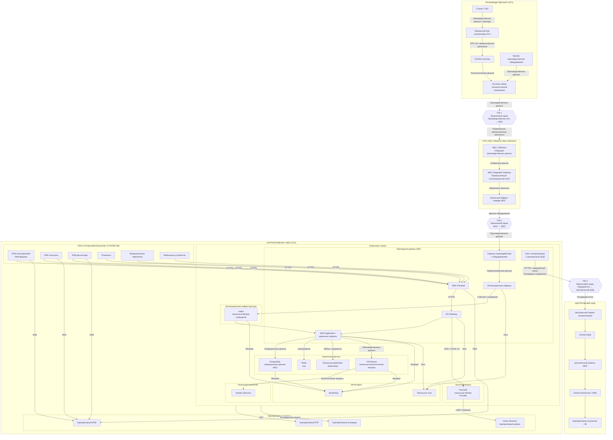

# Логическая Network Deployment Diagram типового предприятия

* физическое/промышленное оборудование;
* MDC;
* MES Kubernetes;
* базы и инфраструктурное ПО;
* рабочие места;
* AD/Keycloak;
* границы сетей;
* Firewall;
* направления потоков;
* отдельно — поток синхронизации с ЦОД.

Ниже схема в Mermaid. Специально разделены **производственная сеть, MDC-сеть и корпоративная/MES-сеть**, поскольку MDC является промежуточным уровнем между производственным оборудованием и MES.

### Схема сетевой архитектуры типового предприятия



---

# 1. Производственная сеть

### Назначение

Производственная сеть предназначена для объединения технологического оборудования и систем управления производственным процессом.

Это наиболее близкая к физическому производству сеть.

### Размещаемое оборудование

В ней находятся:

* станки;
* CNC-оборудование;
* PLC и другие промышленные контроллеры;
* SCADA;
* системы сбора технологической телеметрии;
* другое промышленное оборудование.

### Размещаемое ПО

Здесь **не должны размещаться прикладные сервисы MES**.

SCADA и промышленное программное обеспечение относятся к производственной инфраструктуре предприятия и рассматриваются как внешние по отношению к MES системы.

### Потоки данных

Основной поток:

**Оборудование → PLC → SCADA / системы телеметрии → MDC.**

В зависимости от конкретной технологии могут использоваться:

* OPC UA;
* MQTT;
* Modbus;
* специализированные промышленные протоколы;
* другие протоколы взаимодействия с оборудованием.

При этом конкретный набор протоколов должен определяться для каждого типа оборудования.

---

# 2. Firewall между производственной сетью и MDC

Между производственной сетью и MDC располагается **FW-1**.

Его задача — не просто маршрутизация, а ограничение разрешённых соединений между производственным оборудованием и системой сбора данных.

Основной принцип:

> Производственная сеть не должна иметь произвольного доступа к MES.

Разрешается только необходимый набор соединений к MDC.

Например:

```text
Производственное оборудование
          │
          │ разрешённые
          │ промышленные протоколы
          ▼
        FW-1
          │
          ▼
         MDC
```

---

# 3. Сеть MDC

MDC — это промежуточная зона между производственным оборудованием и MES.

### Назначение

Сеть предназначена для размещения компонентов **Machine Data Collection**.

MDC обеспечивает:

* получение данных от оборудования;
* работу с промышленными протоколами;
* первичную обработку данных;
* нормализацию данных;
* буферизацию;
* передачу данных в MES.

### ПО

В этой сети размещаются:

* MDC Collectors;
* MDC Integration Gateway;
* локальный буфер/очередь MDC.

Важный архитектурный принцип:

> **MES не взаимодействует напрямую со всем многообразием промышленного оборудования.**

Вместо этого MES получает данные через стандартизированный MDC / интеграционный слой.

---

# 4. Firewall между MDC и MES

Между MDC и корпоративной/MES-сетью располагается **FW-2**.

Он ограничивает взаимодействие между промышленным интеграционным уровнем и прикладной системой MES.

Основной поток:

**MDC → FW-2 → MES Integration Services / Equipment Services.**

При этом доступ из MES в MDC также может потребоваться для отдельных сценариев управления оборудованием, но он должен быть **явно определён и разрешён только для необходимых протоколов и направлений**.

---

# 5. Корпоративная / MES-сеть

Это основная вычислительная сеть локального экземпляра MES.

В ней находится Kubernetes-кластер предприятия.

### В Kubernetes размещаются

**Прикладной уровень:**

* MES Frontend;
* API Gateway;
* MES Application / доменные сервисы;
* интеграционные сервисы;
* сервисы взаимодействия с оборудованием;
* агент синхронизации.

**Интеграционная инфраструктура:**

* Kafka.

**Хранилища:**

* PostgreSQL;
* Redis;
* ClickHouse;
* файловое хранилище.

**Аутентификация:**

* локальный Keycloak.

**Мониторинг:**

* системы мониторинга;
* локальное хранилище логов.

**Аналитика:**

* DataLens.

---

# 6. Пользовательская зона

В корпоративной/MES-сети находятся рабочие места пользователей MES:

* АРМ пользователей;
* АРМ технологов;
* АРМ диспетчеров;
* планшеты;
* промышленные терминалы;
* другие клиентские устройства.

Пользователь взаимодействует с локальным Frontend MES.

Основной поток:

**АРМ → HTTPS → MES Frontend → API Gateway → MES Application.**

Ключевой момент:

> Пользовательский интерфейс не зависит от доступности центрального ЦОД.

Это обеспечивает выполнение производственных операций при потере связи с ЦОД.

---

# 7. Keycloak и Active Directory

Локальный Keycloak является Identity Provider локального экземпляра MES.

Он взаимодействует с корпоративным Active Directory.

Логически:

```text
Пользователь
     │
     ▼
MES Frontend
     │
     ▼
API Gateway
     │
     ▼
Keycloak
     │
     ▼
Active Directory
```

При этом необходимо отдельно спроектировать механизм работы Keycloak при временной недоступности внешних корпоративных сервисов, чтобы требование автономности MES не оказалось нарушено зависимостью от центральной инфраструктуры аутентификации.

---

# 8. Данные MES

В локальном Kubernetes-кластере находятся основные хранилища.

### PostgreSQL

Основное операционное хранилище MES.

Содержит:

* производственные операции;
* производственные задания;
* состояние производственных процессов;
* локальную НСИ;
* конфигурацию MES;
* другие транзакционные данные.

### Kafka

Локальный брокер сообщений.

Используется для:

* обмена событиями между сервисами;
* асинхронной интеграции;
* обработки производственных событий;
* формирования очередей;
* доставки данных между компонентами.

### Redis

Используется для:

* кэширования;
* хранения временных данных;
* ускорения доступа к часто используемой информации.

### ClickHouse

Локальная аналитическая витрина.

Используется для:

* аналитических запросов;
* агрегирования производственных данных;
* формирования локальной аналитики.

### DataLens

Используется для визуализации локальных производственных данных.

---

# 9. Поток производственных данных

Основной поток данных от оборудования выглядит следующим образом:

```text
Оборудование
     │
     ▼
PLC / SCADA / Telemetry
     │
     ▼
MDC
     │
     ▼
FW-2
     │
     ▼
MES Integration Services
     │
     ▼
Kafka
     │
     ▼
MES Application
     │
     ├──────────► PostgreSQL
     │
     ├──────────► ClickHouse
     │
     └──────────► Redis
```

Таким образом, производственные данные сначала попадают в локальный контур предприятия и **не требуют обращения к ЦОД**.

---

# 10. Синхронизация с центральным ЦОД

Отдельный поток обеспечивает передачу данных на центральный уровень.

Он инициируется **только локальным предприятием**.

```text
Local MES
    │
    ▼
Local Queue / Kafka
    │
    ▼
Synchronization Agent
    │
    │ исходящее соединение
    ▼
FW-3
    │
    ▼
Центральный ЦОД
```

В ЦОД передаются преимущественно:

* агрегированные производственные показатели;
* основные производственные данные;
* данные для централизованного наблюдения;
* данные для корпоративной аналитики.

При недоступности ЦОД данные остаются в локальной очереди.

После восстановления связи:

```text
Local Queue
     │
     ▼
Sync Agent
     │
     ▼
FW-3
     │
     ▼
Central Sync Service
```

---

# 11. Firewall между предприятием и ЦОД

**FW-3** является границей локального предприятия и центрального ЦОД.

Здесь я бы зафиксировал очень важное правило:

> **Соединение с центральным ЦОД инициируется только из локального контура предприятия.**

То есть нежелательная модель:

```text
ЦОД ───────────► Предприятие
```

не используется.

Предпочтительная:

```text
Предприятие ───────────► ЦОД
```

Это существенно упрощает обеспечение сетевой безопасности.

Firewall должен разрешать только необходимые исходящие соединения от локального агента синхронизации к определённым сервисам центрального уровня.

---

# 12. Работа при отказе ЦОД

Сетевую архитектуру следует рассматривать с учётом сценария отказа канала:

```text
                         X
Local MES ────────────────┼──────────── ЦОД
                          │
                     связь потеряна
```

При этом **никакой критически важный производственный поток не должен проходить через FW-3**.

То есть:

```text
Оборудование
     ↓
MDC
     ↓
Local MES
     ↓
Local PostgreSQL / Kafka / ClickHouse
```

продолжает работать независимо от состояния связи:

```text
Local MES ──X──► ЦОД
```

Это, на мой взгляд, один из наиболее важных архитектурных принципов всей схемы.

---

## Важное замечание по текущей схеме

Я намеренно **не показал конкретные номера портов**. На этом уровне deployment/network diagram правильнее сначала зафиксировать **зоны и направления потоков**, а уже затем сделать отдельную таблицу:

**Источник → назначение → протокол → порт → направление → назначение соединения → обязательность → поведение при недоступности.**

Для нашей MES я бы сделал такую таблицу отдельным артефактом. Она позволит затем практически напрямую перенести архитектуру в требования к Firewall.

И ещё я бы немного скорректировал саму терминологию: **MDC Network лучше рассматривать как отдельную интеграционную/промышленную зону, а не просто «сеть сбора данных»**. Это подчёркивает её роль как DMZ-подобного буфера между OT и MES и хорошо ложится на дальнейшее проектирование информационной безопасности.
